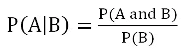
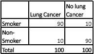
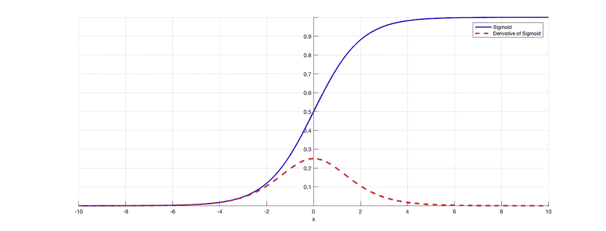
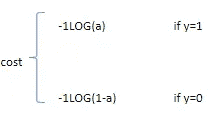
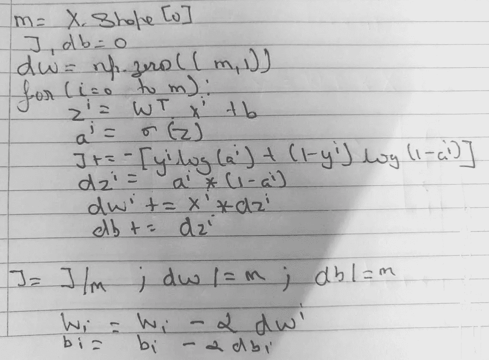

# 逻辑回归——理论方法

> 原文：<https://medium.com/analytics-vidhya/logistic-regression-the-theoretical-way-1f22f273b840?source=collection_archive---------22----------------------->

在继续之前，我相信你必须了解**线性回归**。如果你不知道，请浏览我以前的文章:[线性回归一](/analytics-vidhya/data-science-linear-regression-part-i-1800681ac5de) & [线性回归二](/analytics-vidhya/linear-regression-part-ii-ca9e57767347)。

所以，让我给你们简单介绍一下，这是逻辑回归的第一部分，它涵盖了我们实际应用之前需要知道的所有理论。文章的第二部分将在下周到来，将有实用的方法。这种实用的方法不仅仅是应用逻辑回归，它还会告诉你解决特定商业问题或项目的方法。我希望您阅读这篇文章，这样您将能够理解逻辑回归实现背后的直觉。

在本文中，在讨论逻辑回归之前，我想先讨论一些概念，它们是理解模型的基础，如概率和比值比。到本文结束时，你对它的回答将是二元的，即你理解了(1)或你不理解(0)。如果您有任何疑问，请随时发表评论，或者您可以通过 startmljourney@gmail.com 联系我

因此，我们从这里开始我们的逻辑回归之旅。

# 可能性

概率是特定事件发生的可能性。一个**机会**是在**不确定**条件下可能发生的事情。不确定的条件是不稳定的，并涉及风险。风险与不确定性和波动性相关。例如，股票市场的风险与股票市场的不确定性和股票价格的波动有关。随着市场波动，风险也在增加。

在数学等式中，我们可以将概率定义为:

**P(A)=m/n**

其中: **m** 为**事件 A** 的有利发生次数； **n** 是**结果的总数。**

如果发生的概率是 **P** ，那么不发生的概率是 **(1-P)** 。

**事件**是一组实验结果。有两种类型的事件:

*   **互斥:**两个事件的发生相互排斥，即两个事件不能在同一时间点发生。如果**事件 A** 发生，**事件 B** 不会发生，反之亦然。
*   **独立事件:**其发生不受其他事件影响的事件

我将在这里只谈论**条件概率，**虽然还有其他规则。然而，对于这篇文章，我想简单地告诉你。

我们有两个事件 **A** 因此，如果你阅读上述语句，你可以很容易地识别条件语句，即假设事件 B 已经发生。请记住这句话，我在介绍逻辑回归时会说得更清楚。它在数学上可以表示为:

条件概率

# 让步比

特定事件的优势比可以定义为有利结果的数量与不利结果的数量之间的比率。它基本上告诉您事件 A 的存在与否如何影响事件 B 的存在与否。比值比可以用数学方法表示为:

**赔率= P/(1-P)**

**例一**:

让步比

我们想找出如果你有肺癌暴露于吸烟的几率和如果你没有肺癌暴露于吸烟的几率。

因此比值比= (90 x 90) / (10 x 10) =81。

这意味着如果你有肺癌，那么你吸烟的可能性是没有肺癌的 81 倍。

**例二**:

比方说我在和 AI 下棋。10 场比赛，我赢了 4 场，输了 6 场。因此，我赢这场比赛的可能性是 4/6，即 66。如果我们把比赛次数从 10 场增加到 100 场，我仍然只能赢 4 场比赛。因此我输了 96 场比赛。获胜的几率变成 4/96，即 0.41。因此，这意味着我打得越差，我赢的几率将接近于 0。在这种情况下，我输了，赔率可以被认为是赢的**赔率。在这里，赢的几率在 0 到 4 之间。现在，如果我开始赢得更多的比赛，我获胜的几率就会增加。比方说，我和 AI 打了 100 场比赛，赢了 94 场，因此我输了 6 场。所以，**赢**的几率是 94/6，即 15.667，当我赢的时候，几率可以被认为是**赢**的几率，随着我对 AI 的表现越来越好而增加。如果我一直保持这样的进步，获胜的几率将会越来越接近无穷大。所以在这个例子中，我赢的几率在 4 到无穷大之间。**

**如何把赔率和概率联系起来？**

重点关注下面写的两个陈述:

*   如果事件发生的概率是 **P，**那么事件发生的几率是 **P/(1-P)。**
*   如果一个事件发生的几率是 **O** ，那么一个事件发生的概率是 **O/(1+O)** 。

通过以上陈述，需要注意的要点是:

*   概率值的范围从 **0 到 1** 。赔率有无限的范围
*   一个事件发生的概率总是小于它发生的几率

我将在下一节逻辑回归中谈到它的重要性。

# 逻辑回归

逻辑回归是一个**概率**模型，它返回一个事件发生的概率。用于分类任务，如搅动&未搅动、通过&失败等。因此，这意味着目标变量是分类的，即二项式 1 & 0 或真&假。逻辑回归也可用于多项目标变量，但为了便于理解，我们将使用二元目标变量。在这种情况下，我们有一个因变量和一组自变量，模型检查条件概率，即给定一组自变量，目标变量为 1 或真的概率是多少。

逻辑回归使用比值比对数的概念。这只是简单地取我之前解释过的比值比的对数，我们可以计算 log(比值比)。为什么我们取比值比的对数是一个有趣的问题。比值比的范围是无穷大，因此比值的大小是不可比的。在我们前面的部分，在第二个例子中，赢的赔率范围在 0 到 4 之间，而赢的赔率范围在 4 到无穷大之间，这是一个非常大的范围。因此，对那些支持获胜的人来说，获胜的几率看起来要小得多。因此，请看下面的例子:

> 获胜的几率:4/96 = .0417
> 
> log(获胜几率):log(.0417) = -1.38
> 
> 获胜的可能性:96/4 =24
> 
> log(赢的几率):log(24) =1.38

现在，看看比例后采取对数的赔率，它看起来是对称的，有一个公平的比较规模。所以用 log，我们让它和原点等距，表示反对获胜和赞成获胜。几率日志有助于我们理解 **Logit 功能。**

因此，对于逻辑回归，我们计算 P(Y=1|X)的概率的对数，其等于 Z，其中 Z 是转置(W)和 X 的点积。这里，W 是权重矩阵，X 是独立变量的矩阵。如果你注意到了，这个 Z 和我们在线性回归中学到的等式是一样的。这就是为什么算法的名字叫做回归。数学表示:

logo DDS(P(Y = 1 | X))= Z = W . Transpose * X

因此，为了从回归方程中找到概率，即 Z，我们对 Z 应用逻辑函数。它可以数学表示为:

**f(Z)=1/(1+e^-z)**

**f(Z)** 简称 sigmoid 函数，是一个**逻辑函数。**因此，逻辑函数是几率对数的**倒数。**

因此，逻辑回归曲线是一条 sigmoid 曲线，看起来像这样:

s 形曲线

因此，当你看到这条曲线时，它是一条介于 0 和 1 之间的 S 形曲线。当曲线接近或接近 0 或 1 时，曲线变得平坦，因此在这些区域梯度变为 0。因此，这意味着该算法存在**消失梯度**的问题。 **Sigmoid 函数**，将一个大的输入空间压缩成一个介于 0 和 1 之间的小输入空间。因此，sigmoid 函数输入的大变化会导致输出的小变化。因此，导数变小。**当 **sigmoid 函数经过. 5** 时 **sigmoid 函数**的导数**为**最大值**。参考下图，sigmoid 函数为蓝色，其导数为红色虚线。

Sigmoid 函数及其导数

这个**消失梯度**的问题只有当我们与**梯度下降优化器**一起使用时才能在逻辑回归中看到，梯度下降优化器**反向传播**以更新**权重**，从而使**损失函数**最小化**。尽管在逻辑回归中你并不经常遇到梯度消失的问题。**

**正如我上面提到的损失函数，让我简单描述一下。我们在逻辑回归中使用的损失函数是**对数损失函数**。我们的目标是最小化对数损失函数。它在数学上可以表示为:**

**L(a，y)= -(y*log(a )+ (1-y)*log(1-a))**

**L(a，y)，即损失函数是单个例子的成本。下面给出的图片对此进行了进一步解释:**

****

**损失函数**

**成本函数是所有训练示例的损失函数之和，如下所示:**

**J(W，b)=(1/m) * Sum(L(ai，yi))**

**其中 I 是从 0 到样本总数**

**既然学了这个，那我来分享一下梯度下降的 logistic 回归的算法。**

## **带梯度下降算法的逻辑回归**

****

**梯度下降逻辑回归**

**再见，朋友们！我希望这篇文章对你有所帮助，我会很快看到它的下一部分。继续学，继续赚！**