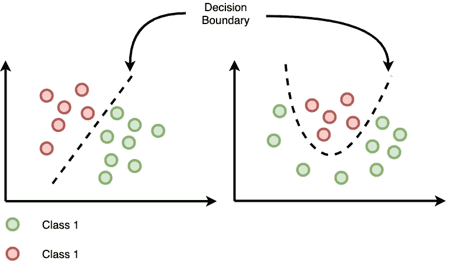
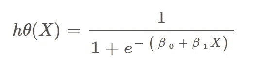
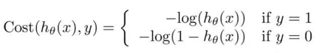
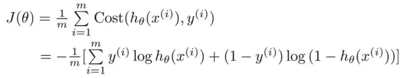

# 逻辑回归理论概述

> 原文：<https://medium.com/analytics-vidhya/logistic-regression-theory-e62bde5d2b2c?source=collection_archive---------24----------------------->

逻辑回归是一种分类算法，它会绘制一个边界来区分两个或多个类别，该边界可以是线性的，也可以是非线性的。

分类的界限

开始的逻辑与线性回归中的相同，线性回归中我们有一个成本函数，它是实际因变量值和决策边界值之间的差。

但是由于这是一个分类(为了更清楚的解释，我们考虑一个二元分类)，那么假设函数应该输出 0 和 1 之间的值，并且由下面的 Sigmoid 函数表示:

这个函数的缺点是，一旦它被插入到我们的成本函数中，成本函数将不会是凸的(局部最小值=全局最小值)，而是会有许多局部最小值，因此很难捕捉到全局最小值。

为了克服这一点，我们以如下方式使用该函数的**对数**:

或者更简洁地说，应用于我们得到的所有数据点:

至于找到将最小化该成本函数的最优θ，我们使用与用于线性回归相同的方式使用**梯度下降**，唯一的区别是成本和假设函数不同。

需要注意的是，梯度下降法远不是找到最优θ的唯一算法，还有很多其他算法。

**多级分类:**

当我们的数据被 2 个以上的类(K 个类)标记时，最简单的方法是使用 **one vs. all** 方法，我们训练 K 个分类器，每个分类器将分类新数据是否属于该类。

我们最终会有 K 个分类器，一旦我们有了要分类的输入，我们就选择最有信心的分类器(输出最高概率的分类器)

参考资料:

*   coursera 上的 Andrew NG 机器学习课程