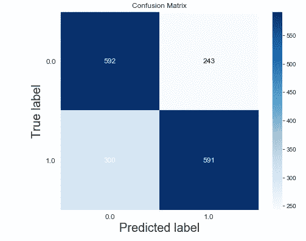

# 预测婚外情逻辑回归

> 原文：<https://medium.com/analytics-vidhya/logistic-regression-to-predict-extra-marital-affair-68ae98bc0e4f?source=collection_archive---------5----------------------->


[来源](https://www.google.com/search?q=extra+marital+affair&hl=en&sxsrf=ALeKk01c9LFH35VAt7icPOrk6T8DXeDrJg:1608623419045&source=lnms&tbm=isch&sa=X&ved=2ahUKEwj6luCbjeHtAhVRaCsKHY6uAzIQ_AUoAXoECBEQAw&biw=1366&bih=625#imgrc=AH0efLNFi7wn-M)

## 概述:

我选择的数据集是统计模型附带的事务数据集。它来源于红皮书杂志 1974 年对女性的一项调查，调查中已婚女性被问及她们参与婚外情的情况。我决定通过创建一个新的二元变量外遇(这个女人至少有过一次外遇吗？)并试图预测每个女性的分类。存在于数据集中用于预测的变量是:- **比率 _ 婚姻**(妇女对其婚姻的评级)**年龄**(妇女年龄)**年龄 _ 结婚**(结婚年数)**子女**(她拥有的子女数量)**宗教**(在 1 -5 的范围内，她是否信仰宗教)**教育**(教育水平)**职业**、

## **步骤 1:导入所有必要的库并获取数据集**

```
import numpy as np
import pandas as pd
import statsmodels.api as sm
import matplotlib.pyplot as plt
import seaborn as sns
from patsy import dmatrices
from sklearn.linear_model import LogisticRegression 
from sklearn.model_selection import train_test_split
from sklearn import metrics
```

事件数据集存在于统计模型中，因此我们将提取该库。

```
df=sm.datasets.fair.load_pandas().data
df.head()
```


前五行的输出

## 步骤 2:数据预处理

*   我们想把它变成分类问题，因为我们需要把目标变量**(事务)**转换成二元类，其中如果值为 **0** ，那么女性没有任何事务，而 **1** 意味着女性有过几次婚外情。

```
(df.affairs>0).astype(int)#converting into binary features
df.affairs.unique()[out]>> array([1, 0], dtype=int64)
```

*   这里我们将使用 pasty . d matrics，它的主要任务是分析自变量和因变量，并根据目标变量的需要添加一些数据。

```
y,X=dmatrices(affairs~rate_marriage + age + yrs_married + children +  religious + educ + C(occupation)+C(occupation_husb)',df
                                  return_type="dataframe")
x.head()
```


前五行的输出

*   重命名 **X** 中的特性，以便所有人都能理解。

```
X = X.rename(columns ={'C(occupation)[1.0]':'occ_1','C(occupation)[2.0]':'occ_2','C(occupation)[3.0]' : 'occ_3' ,'C(occupation[4.0]' : 'occ_4','C(occupation[5.0]':'occ_5','C(occupation)[6.0]':'occ_6',
'C(occupation_husb)[T.2.0]':'occ_husb_2', 'C(occupation_husb[T.3.0]' :'occ_husb_3','C(occupation_husb)[T.4.0]':'occ_husb_4' , 'C(occupation_husb)[T.5.0]':'occ_husb_5', 'C(occupation_husb)[T.6.0]':'occ_husb_6'})
X.head()
```


重命名的 X 的输出

*   检查数据集中是否存在空值。

```
df=pd.concat([X,y],axis=1)
df.isnull().values.any()[out]>> False  #no null value present in dataset
```

*   现在下一步是检查数据集是否平衡。

```
print(df[df["affairs"]==0].shape)
print(df[df["affairs"]==1].shape)[out]>> (4313, 18)
        (2053, 18)
--------------------------------------------------------------------
plt.figure(figsize=(8,6))
sns.set_style("darkgrid")
sns.countplot(np.ravel(y))
plt.yticks(range(0,5000,250))
plt.show()
```


图 1

*   正如我们所见，数据集是不平衡的，因为**类 0** 几乎是**类 1 的两倍。**我们将进行向上采样以平衡数据集。

```
from imblearn.random_sampling  import RandomOverSampler
rdm=RandomOverSampler()
X,y=rdm.fit_sample(X,y)
df=pd.concat([X,y],axis=1)  #updating the balanced form of dataset
print(df[df["affairs"]==0].shape)
print(df[df["affairs"]==1].shape)[out]>> (4313, 18)
        (4313, 18)--------------------------------------------------------------------
plt.figure(figsize=(8,6))
sns.set_style("darkgrid")
sns.countplot(np.ravel(y))# converting y into array form to plot
plt.yticks(range(0,5000,250)) 
plt.show()
```


图 2

*   数据的统计描述

```
df.describe()
```


统计说明

## 步骤 3:数据可视化

*   孩子如何影响夫妻关系。

```
plt.figure(figsize=(8,6))
sns.set_style("darkgrid")
sns.countplot("children",data=df,hue="affairs")
plt.title("How children affects marriage")
plt.show()
```


图 3

*   婚姻年限如何影响额外的婚姻生活？


图 5

随着已婚夫妇在一起的时间越来越长，他的妻子很有可能会有婚外关系。新婚夫妇信任的最好结果和可以忽略的婚外情。

*   女性如何在 1 到 5 的范围内评价她们的婚姻生活。

```
plt.figure(figsize=(8,6))
plt.hist(df["rate_marriage"])
plt.xlabel("Marriage rating",fontsize=20)
plt.ylabel("count",fontsize=20)
plt.show()
```


图 6

从上图我们可以看出，不管她们的婚外情如何，大部分女性对她们的婚姻生活感到满意。

*   让我们看看教育是如何影响婚姻生活的

```
plt.figure(figsize=(8,6))
sns.set_style("darkgrid")
sns.countplot("educ",hue="affairs",data=df,order=df["educ"].value_counts().index)
plt.xlabel("education",fontsize=20)
plt.ylabel("count",fontsize=20)
plt.show()
```


图 7

从事白领工作的女性出轨的机会较少，毕业和受教育程度较高的女性出轨的机会也较少，但对于那些上大学和文化程度较低的女性来说，她们对婚外情更感兴趣。

*   宗教对女性婚姻的影响

```
plt.figure(figsize=(8,6))
sns.set_style("darkgrid")
sns.countplot("religious",hue="affairs",data=df)
plt.xlabel("religious",fontsize=20)
plt.ylabel("count",fontsize=20)
plt.show()
```


图 7

越多的女性信教，女性婚外情的可能性就越小。

## 第四步:建模

将数据分为训练集和测试集

```
x_train,x_test,y_train,y_test=train_test_split(X,y,test_size=0.2,random_state=1)
print(x_train.shape)
print(y_train.shape)
print(x_test.shape)
print(y_test.shape)[out]>> (6900, 17)
        (6900, 1)
        (1726, 17)
        (1726, 1)
```

制作模型并进行预测

```
clf=LogisticRegression()
clf.fit(x_train,y_train)
y_predicted=clf.predict(x_test)
y_train_predicted=clf.predict(x_train)
```

## 第五步:评估

```
from sklearn.metrics import accuracy_score, confusion_matrix,roc_curve,classification_report
print("train set accuracy score: ",accuracy_score(y_train,y_train_predicted))
print("test set accuracy score :",  accuracy_score(y_test,y_predicted))[out] >> train set accuracy score:  0.6918840579710145
         test set accuracy score : 0.6853997682502897
```

正如我们看到的，数据集之间没有大的偏差，因此模型处于正常状态。

检查 TP、TN、FP、FN 值的精度矩阵。

```
ax=splt.metrics.plot_confusion_matrix(y_test,y_predicted,text_fontsize="large",figsize=(8,6))
plt.xlabel("Predicted label",fontsize=20)
plt.ylabel("True label",fontsize=20)
bottom, top = ax.get_ylim()
ax.set_ylim(bottom + 0.5, top - 0.5)
plt.show()
```



图 8

这里我们应该小心 **FP** 因为我们的模型会预测女人有外遇，但实际上她不会因为她没有犯的错误而有任何可能导致离婚的外遇，所以当我们处理这种敏感的预测时，我们应该对 **FP** 值表现出一些小心。

**寻找精度，回忆 F1-分数**

```
from sklearn.metrics import classification_report
print(classification_report(y_test,y_predicted))
```


图 9

**ROC 曲线**

```
pred_probab=clf.predict_proba(x_test)
splt.metrics.plot_roc_curve(y_test,pred_probab,text_fontsize="large",figsize=(8,6))
```


图 10

## 模型的最终测试:

```
print("Prediction chance of your model :")
print(clf.predict_proba(np.array([[0,0,0,0,0,1,1,0,0,0,0,4,32,5,2,3,17]]))*100)
```

给定测试集上限的预测机会为 27.7%，预测结果为；

```
print("your prediction is  :",clf.predict(np.array([[0,0,0,0,0,1,1,0,0,0,0,4,32,5,2,3,17]])))[out] >> your prediction is  : [0.]
```

给定数据的预测结果是女人没有外遇。

**结论:**

希望这篇博客能让你对逻辑回归在分类问题上的工作有更好的了解。不断学习不断探索……