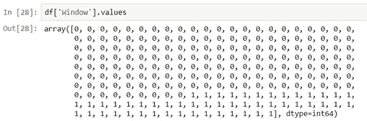
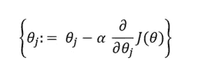
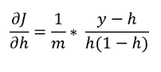
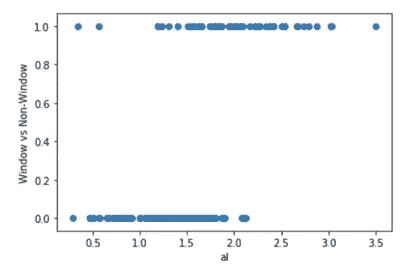

# 基于单层感知器神经网络的逻辑回归

> 原文：<https://medium.com/analytics-vidhya/logistic-regression-using-single-layer-perceptron-neural-network-slpnn-31757c792d5d?source=collection_archive---------1----------------------->


[https://blogs . NVIDIA . com/WP-content/uploads/2018/12/xx-ai-networks-1280 x680 . jpg](https://blogs.nvidia.com/wp-content/uploads/2018/12/xx-ai-networks-1280x680.jpg)

# 10 周的机器学习乐趣–第 4–10 周回顾

# 介绍

欢迎来到 ML 挑战赛的最后回顾，这将涵盖第 4 到 10 周。作为一个快速的介绍，对于那些想要完成 10 周旅程的人来说，这里是所有以前帖子的链接:

关于挑战的原始帖子:[# 10 weeksofmachinengfun](https://www.linkedin.com/feed/hashtag/?keywords=%2310WeeksOfMachineLearningFun)

往期回顾链接:[#第一周](https://www.linkedin.com/post/edit/10-weeks-machine-learning-fun-week-1-retrospective-tzimopoulos)[#第二周](https://www.linkedin.com/pulse/10-weeks-machine-learning-fun-week-2-retrospective-tzimopoulos/)[#第三周](https://www.linkedin.com/pulse/10-weeks-machine-learning-fun-week-3-retrospective-part-evangelos/)

第 4–10 周现已结束，挑战也已结束！

我很高兴能走到这一步，也很兴奋能告诉你我学到的所有东西，但首先要做的是:快速解释一下为什么我要总结剩下的几周，而且是在完成后这么晚:

*   我在 [#Week3](https://www.linkedin.com/pulse/10-weeks-machine-learning-fun-week-3-retrospective-part-evangelos/) 中为逻辑回归选择的方法(使用单层感知器神经网络的近似逻辑回归函数— SLPNN)花费了更长的时间来解释，无论是从数学还是从编码的角度来看，每周提供更新几乎是不可能的
*   此外，在那段时间里，我可能会偏离主题去理解一些数学知识，总体来说这是很好的学习方法，例如成本函数及其导数，最重要的是何时使用一个而不是另一个，以及为什么:)(更多信息请见下文)
*   成本函数的导数:考虑到我在 [#Week3](https://www.linkedin.com/pulse/10-weeks-machine-learning-fun-week-3-retrospective-part-evangelos/) 中的方法，我必须确保反向传播链规则数学用于计算成本函数相对于权重的偏导数，与相同偏导数的分析计算数学完美结合。为了做到这一点，我不得不一遍又一遍地把笔写在纸上，直到它最终有了意义。一旦你用两种不同的方法验证了数学，你就可以完全相信它们了！
*   事实上，我已经创建了一个手写的单页备忘单，显示了所有这些，我正计划单独发布，所以敬请关注。
*   最后，最初计划在第 4-10 周花在挑战上的相当一部分时间，被用于职业和个人生活中的现实生活优先事项。这正是在工作、项目、生活中发生的事情…你只需要处理好优先事项，回到你正在做的事情上，完成工作！所以我来了！

# 数据集

在我们回到逻辑回归算法和我在 [#Week3](https://www.linkedin.com/pulse/10-weeks-machine-learning-fun-week-3-retrospective-part-evangelos/) 中离开的地方之前，我想谈谈所选的数据集:

## 玻璃数据集

使用该数据集有三个主要原因:

1.  这个数据集已经被用于分类玻璃样品是否是一个“窗口”类型的玻璃，这是完美的，因为我的意图是解决一个二元分类问题
2.  如数据集本身所述，尽管是一个精选数据集，但它确实来自真实生活用例:*“对玻璃类型分类的研究是由犯罪学调查推动的。在犯罪现场，留下的玻璃可以作为证据…如果鉴定正确的话！*
3.  最后，作为由 Randy Lao 和 Harpreet Sahota 以及令人惊叹的 DataScienceDreamJob 团队举办的技术技能研讨会的一部分，这意味着我可以使用参考资料来验证我的结果，并且不会迷路(尽管我还是迷路了…哈哈！).

**数据汇总和特点**

玻璃数据集由 10 列 214 行组成，9 个输入要素和 1 个输出要素为玻璃类型:


关于数据集的更多详细信息可以在补充记事本文件中的[这里](https://archive.ics.uci.edu/ml/datasets/glass+identification)找到。简而言之，玻璃数据集包括折光率(第 2 列)、每个玻璃样品的成分(每行)及其金属元素(第 3-10 列)和玻璃类型(第 11 列)。


基于后者，玻璃类型属性 11，可以使用该数据集尝试 2 种分类预测:

*   **窗**(类型 1-4)vs**非窗**(类型 5-7)或
*   **浮动**(类型 1 & 3) vs **非浮动**(类型 2 & 4) vs **不适用**(类型 5–7)

第一个是经典的*二元分类问题*。第二个可以被视为具有三个类别的*多类别分类*问题，或者如果想要预测“浮动对静止”类型的眼镜，可以将剩余类型(非浮动、不适用)合并为单个特征。

例如，通过屏蔽原始输出特性的第一种方法的代码片段:

```
# glass_type 1, 2, 3 are window glass captured as "0"
# glass_type 5, 6, 7 are non-window glass captured as "1"df['Window'] = df.glass_type.map({1:0, 2:0, 3:0, 4:0, 5:1, 6:1, 7:1})
```

新设计的“窗口”输出:



包含所有输入和新输出的数据帧现在如下所示(包括浮点特性):


展望未来，出于本文**的目的，重点将是预测“窗口”输出**。即哪些输入变量可用于预测玻璃类型是否为窗户。

## 虹膜数据集

最初，我不打算使用另一个数据集，但最终我转向 home-sweet-home Iris 来解决一些实现挑战，并通过使用更简单的数据集进行编码来测试我的假设。这一点，加上我对 glass 数据集所做的一些特性选择，证明对我所面临的所有问题都非常有用，最终能够正确地调整我的模型。

**数据汇总及特点**

对于虹膜数据集，我在这里借用了[马丁·佩拉罗洛](https://medium.com/u/2d1b498ccdb5?source=post_page-----31757c792d5d--------------------------------) [提出的一个非常方便的方法](/@martinpella/logistic-regression-from-scratch-in-python-124c5636b8ac)将 3 种原始虹膜类型转化为 2 种，从而将此转化为*二元分类问题*:

```
from sklearn import datasets
iris = datasets.load_iris()
X = iris.data[:, :2]
y = (iris.target != 0) * 1
```

其给出了输入和输出变量的以下散点图:


# 单层感知器神经网络

单层感知器是只有一个神经元的最简单的神经网络，也称为 McCullock-Pitts (MP)神经元，它转换触发激活函数的输入的加权和，以生成单个输出。下面是这种神经网络的示例图，其中 X 为输入，θI 为权重，z 为加权输入，g 为输出


## 逻辑回归假设

为了我们实验的目的，我们将使用这个单神经元 NN 来预测我们创建的窗口类型特征，基于输入是它所包含的金属元素，使用逻辑回归。因此，我们使用分类算法来预测值为 0 或 1 的二进制输出，表示我们假设的函数是 Sigmoid 函数，也称为逻辑函数。

**神经网络输入**

神经网络的输入是输入 Xi 的加权和:


**激活功能**

使用激活函数对输入进行变换，激活函数生成从 0 到 1 的概率值:


描述它的数学方程式是:


实现它的代码片段:

```
def sigmoid(self, x):
        return 1 / (1 + np.exp(-x))
```

**假设**

如果我们结合以上所有内容，我们可以为我们的分类问题制定假设函数:


**前馈回路**

因此，我们可以通过使用以下函数运行神经网络的前向循环来计算输出 *h* :

```
def feedforward(self,X):
        #X = self.add_bias(X)
        z = np.dot(X, self.w)
        h = self.sigmoid(z)
        return(h)
```

## 成本函数

选择正确的成本函数至关重要，并且需要对正在解决的优化问题有更深入的理解。

最初，我假设最常见的优化函数之一， ***最小二乘*** 足以解决我的问题，因为我以前在更复杂的神经网络结构中使用过它，老实说，取预测输出与实际输出的平方差最有意义:


不幸的是，这使我陷入困境和困惑，因为我无法将误差降至可接受的水平，并且查看数学和编码，它们似乎与我当时为获得一些帮助而研究的类似方法不匹配。

拯救我的是[吴恩达](https://medium.com/u/592ce2a67248?source=post_page-----31757c792d5d--------------------------------)关于逻辑回归成本函数的在线课程的讲义([第 6 章](http://www.holehouse.org/mlclass/06_Logistic_Regression.html))。底线是对于特定的分类问题，我使用了一个非线性函数作为假设，sigmoid 函数。出于优化目的，sigmoid 被认为是一个**非凸函数**，具有多个*局部最小值*，这意味着它不会总是收敛。

这个问题的答案是使用凸逻辑回归成本函数，即 ***交叉熵损失*** ，它可能看起来很长很吓人，但给出了一个非常简洁的梯度公式，如下所示:


```
# Defining the Cost function J(θ) (or else the Error)
# using the Cross Entropy function
    def error(self,h, y):
        error = (-y * np.log(h) - (1 - y) * np.log(1 - h)).mean()
        self.E = np.append(self.E, error)
```

## 梯度下降—分析计算

使用分析方法，这里的下一步将是计算梯度，这是每次迭代的步骤，通过它算法收敛到全局最小值，因此得名**梯度下降**。

在数学术语中，这只是成本函数相对于权重的偏导数。即，在每次迭代中，计算权重的调整量(或增量):


并在每次迭代中重复



## 使用反向传播链规则的梯度下降

在这里，我将使用反向传播链规则来得出梯度下降的相同公式。


如上图所示，为了计算成本函数相对于权重的偏导数，使用链式法则，可将其分解为 3 个偏导数项，如下式所示:


**期限(1)**

如果我们对 J(θ)相对于 h 进行微分，我们实际上是把 *log(h)* 和 *log(1-h)* 的导数作为 J(θ)的两个主要部分。稍微整理一下数学，我们得出了下面这个术语:



**期限(2)**

第二项是 sigmoid 函数的导数:


**期限(3)**

第三项就是输入向量 X:


如果我们在计算中用 3 项代替 J’，我们最终会得到上面看到的使用分析方法的梯度的 swift 方程:


这作为神经网络类中的一个函数的实现如下:

```
def backprop(self,X,y,h):
        self.delta_E_w = np.dot(X.T,h-y) / self.outputLayer

        # Store All weights throughout learning
        self.w_list.append(self.w)

        # Adjust weights
        self.w = self.w - eta * self.delta_E_w
```

## 摘要-方程式

作为总结，在我们的例子中计算梯度下降所涉及的全套数学如下:


## 预测和分类

为了根据任何新的输入预测输出，利用前馈回路实现了以下功能:

```
def predict(self, X):
        # Forward pass
        pred = self.feedforward(X)
        return pred
```

如上所述，结果是预测的*概率*，即输出是任一窗口类型。为了将它转化为一个分类，我们只需要设置一个阈值(这里是 0.5)并将结果向上或向下舍入，取最接近的值。

```
def classify(self, y):
        return self.predict(y).round()
```

# 神经网络训练和参数

为了训练神经网络，对于每次迭代，我们需要:

*   通过正向循环传递输入 X 来计算输出
*   运行反向传播来计算权重调整
*   应用权重调整并在下一次迭代中继续

要实现的功能如下所示:

```
def train(self,X,y):
    for epoch in range(epochs):
      # Forward pass
      h = self.feedforward(X)

      # Backpropagation - Calculate Weight adjustments and update weights
      self.backprop(X,y,h)

      # Calculate error based on the Cross Entropy Loss function
      self.error(h, y)
```

此外，下面是用于 NN 的参数，其中 eta 是学习率，代表迭代次数。

```
# Learning Rate
eta = 0.001# Number of epochs for learning
epochs = 10000# Input layer
inputLayer = X.shape[1]# Output Layer
outputLayer = 1
```

## 培训和选择功能

正如在数据集部分所讨论的，原始数据有 9 个原始特征，在为训练选择正确的特征时，正确的方法是使用变量和输出之间的散点图，并且通常将数据可视化，以更深入地理解和直观地了解起点。

## 只有“Al”的输入向量

由于这是一个基于 Randy Lao 对使用该 glass 数据集的逻辑回归的介绍的引导式实现，我最初使用了以下输入向量:

```
# Selecting Independent Variables
**iv = ['al']**
# Define Input vector for training
X = df[iv].values
```

这给出了输入和输出之间的以下散点图，表明可能存在可用于相应分类的估计的 sigmoid 函数:



在测试过程中，尽管证明仅使用一个特性很难将误差降低到非常小的值，如下所示:


## 具有 5 个特征的输入

为了减少误差，进一步的实验导致选择输入向量的 5 个特征配置:

```
# Selecting Independent Variables
**iv = ['ri','mg','al','k','ca']**
# Define Input vector for training
X = df[iv].values
```

最后，运行 NN 训练的代码的主要部分如下:

```
# Initiate Single Perceptron NN
SPNN = LogisticRegressionSinglePerceptronModel(eta, inputLayer, outputLayer)# Train SPNN for Linear Regression Model
%time SPNN.train(X, y)# Plot Error
SPNN.plot()# Predict output based on test set
pred = SPNN.predict(X)# Generate classified output
pred2 = SPNN.classify(X)# Assess Model accuracy
print("Minimum Error achieved:", min(SPNN.E))# SPNN weights
SPNN.w
```

# 结果

## 结果和估价

代码在大约 313 毫秒内运行，并产生一条快速收敛误差曲线，最终值为 0.15:


末尾的数组是可用于预测新输入的最终权重。

## 预测产量

训练后的实际输出向量与预测输出向量的比较表明预测已经(大部分)成功:


## 使用虹膜数据集分类的验证

鉴于神经网络类的通用实现，我能够为第二个数据集重新部署代码，即众所周知的 Iris 数据集。如前所述，这样做既是为了验证，也是为了解决我当时面临的一些数学和编码问题。

正如这篇文章的*虹膜数据集*部分所描述的，通过一个小的操作，我们已经将虹膜分类变成了二进制分类。

## SLPNN 配置

对于虹膜数据集的新配置，我显著降低了学习速率和时期:

```
# Learning Rate
eta = 0.0005# Number of epochs for learning
epochs = 3000# Input layer
inputLayer = X.shape[1]# Output Layer
outputLayer = 1
```

## 误差曲线

正如所预期的，训练时间比 Glass 数据集小得多，并且该算法非常快地实现了小得多的误差。


## 预测产量

根据数据集示例，我们还可以检查生成的输出与预期的输出，以验证结果:


## 回归线

基于预测值，绘制的回归线如下所示:


# 结论和总结

作为总结，在这个实验中，我涉及了以下内容:

*   讨论了使用*逻辑回归*实现用于*二元分类*的**单层感知器神经网络**
*   详述了神经网络输入和激活函数背后的数学原理
*   分析了逻辑回归算法的假设和成本函数
*   使用两种方法计算梯度:反向传播链规则和分析方法
*   使用两个数据集来测试该算法，主要的数据集是 Glass 数据集，虹膜数据集用于验证
*   展示结果，包括误差图、曲线图和比较输出，以验证调查结果

# 积压

根据以前的帖子，我一直在维护和管理一周内的积压活动，所以我可以在挑战完成后再去处理它们。这是完整的列表:

1.#week1 —手动实现其他类型的编码和至少一种类型，不使用库

2.# week1 重构神经网络类，以便输出层大小可配置

3.# week2 使用梯度下降求解线性回归示例

4.#week2 —将线性回归模型预测和计算应用于真实数据集(“广告”数据集或来自 Kaggle 的 [this](https://www.kaggle.com/sohier/calcofi) 数据集)

5.#第 3 周——阅读最大似然估计(MLE)的分析计算，并使用它重新实现逻辑回归示例(无库)

6.#week4_10 —添加更多关于逻辑算法实施的验证措施

7.#week4_10 —使用 sklearn 库实现玻璃组分类，以比较性能和准确性

# #生产力#效率#弹性

完成这个为期 10 周的挑战后，我对自己解决数据科学问题的方法、我的数学和统计知识以及我的编码标准有了更多的信心。

话虽如此，我仍需要改进的 3 个方面是:

a)我解决数据科学问题的方法

b)我的数学和统计知识以及

c)我的编码标准

哈哈…它永远不会结束，享受旅程，学习，学习，学习！

## 关于我的旅程

*   正如介绍中提到的，我不久前开始了为期 10 周的挑战，但只能在前 3 周每周发表一次。这是每周都要做的事情:破解数学(我的方法是在可能的情况下不使用库来实现主要的 ML 算法)，实现和测试，每周日写下来
*   那毕竟是在两个阵营都有疯狂项目的时期，家庭和职业责任😊
*   尽管如此，我还是后退了一步，专注于理解概念和数学，取得真正的进步，即使这意味着进展会更慢，并且已经违反了我的规则。于是，我停止了出版，继续工作。
*   然后，我有一个计划好的家庭假期，我也很期待，所以在重新投入工作之前，我又休息了很长时间。
*   这是你可能再也回不来了的临界点！
*   但我做到了，并陷入了同样的问题，并继续，因为我真的很想得到这一行。
*   每周有 4 到 5 天早上 4:30 起床，这对于每周工作 6 到 8 小时至关重要
*   早上那么早意味着注意力 100%集中。也就是说，6-8 小时的净工作时间实际上意味着我每周要多工作 1-2 天！

最后，我想说的最后一点是，我建议任何开始从事数据科学的人尝试类似的东西，看看他们能走多远，并推动自己。

我很想听听已经做了类似的事情或打算做的人的意见。

此外，任何想要尝试我的代码的极客，给我一个欢呼，并乐意分享这一点，我仍然在整理我的 GitHub 帐户。

给我留下你的评论和反馈，感谢你阅读了这么多。

安吉洛（男子名）

[# machine learning](https://www.linkedin.com/feed/hashtag/?keywords=%23machinelearning)[# data science](https://www.linkedin.com/feed/hashtag/?keywords=%23datascience)[# python](https://www.linkedin.com/feed/hashtag/?keywords=%23python)[# logistic regression](https://www.linkedin.com/feed/hashtag/?keywords=%23LogisticRegression)