# 具有几何公式的逻辑回归

> 原文：<https://medium.com/analytics-vidhya/logistic-regression-with-geometric-formulation-5b2cccb7a973?source=collection_archive---------20----------------------->

L 逻辑回归是一种用于分类的机器学习技术，名称为回归，但实际上是一种分类技术，用于发现因变量和自变量之间的关系，也有许多名称，如 logit log 函数等。它主要用于二元分类，其中一个或多个因变量是自变量

这是可以扩展的，像数据集这样的几个类包含像猫狗大象等图像。它在 0 和 1 之间分配概率并将它们相加，这是关于逻辑回归的一个简单解释，因此让我们深入研究逻辑回归的精确公式，并执行一些数学运算来选择逻辑回归

# ***用几何方法进行逻辑回归***

逻辑回归可以通过三种方法进行，如几何概率和损失函数。在本文中，我们将尝试执行逻辑回归的几何公式。

让我们在给出的图中简单解释逻辑回归。

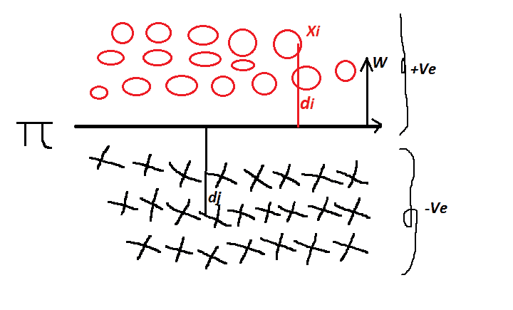

给定的图显示了由 ***超平面“𝝅”分隔的正和负两个数据帧，并且在该图中正常具有“w”***，其中 ***0*** 被表示为正点， ***X*** 被表示为负点

***其中𝝅=w^t*x+b 是一个超平面的条件***

***物流回归的假设***

1.在逻辑回归中，类几乎是线性可分的，如上图所示

逻辑回归的任务是找到最佳的可分离𝝅，它完美地分离正负点

让我们举一个给定数据集的例子。

其中 ***𝝅=w^t*x+b ……一个平面的方程***

***Dn = {+Ve，-Ve} ………………………………..正负数据集*和**

***di =正点到超平面的距离***

***dj =负点到超平面的距离***

逻辑回归的任务是找到 ***w & b*** 其中 ***w*** 是超平面的法线， ***b*** 是截距

让我们给定的数据集是包含正负点的用**表示*易*表示**

**yi =+1*为正点*为正点**

Yi = -1 为负点

伊·，+1)

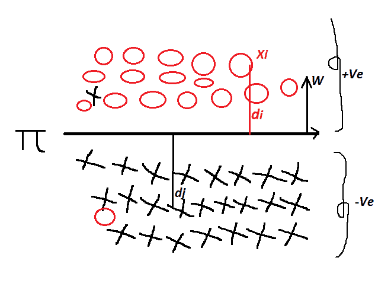

在此图中，我们可以定义 di 的值，即

***迪= w^t | Xi/| w |*|**

其中 ***W*** 是平面的法线，假设 ***W*** 是单位矢量||W||=1

在上图中，xi 属于平面和法线的正侧，因此 di 在另一侧是正的，dj 属于平面和法线的相对侧，因此它们是负的，但是在给定的数据集中，有一些点也被错误分类，如图所示

因此给定数据集和分类器

***迪= W^t Xi > 0***

**t17】DJ = w^t XJ<0t19】**

所以如果***0>***那么易= +1

和***XJ<0***然后 Yi = -1

逻辑回归中的决策面是直线或平面

让我们讨论一些案例进行分类

***案例编号. 1:***

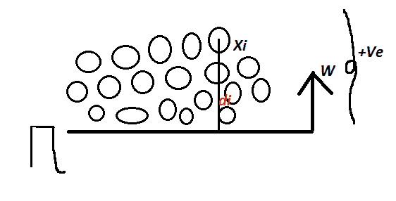

假设所有的数据点都属于超平面的正侧，并且也垂直于该平面，那么在这种情况下

伊=+1

那么分类器被分类为正点(+Ve)，并且实际数据点也是正的，那么 w 被正确分类。

***情况一的结论:如果平面是正的(Yi=+1)并且分类器也被预测为正的，则我们的平面被正确分类***

***案例编号 2 :***

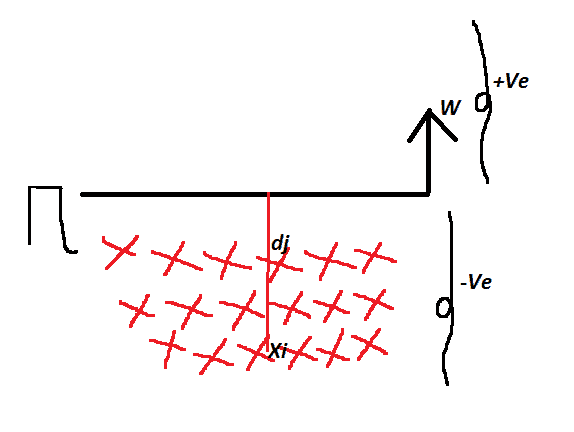

假设所有的点都属于负边，与超平面相对，那么 ***Yi = -1*** 然后***【w^t*xi = 0***但是在这种情况下，实际点是负的，预测点也是负的，所以当我们将负和负相乘时，我们得到正

***Yi*W^t*Xi > 0……..那么易=+Ve***

***案例二的结论:***

***所以如果我们在一个数据集中取了一个负的点(Yi)并且分类器也被预测为负，那么 Yi*W^t*Xi > 0 那么我们可以说逻辑回归模型正确地分类了数据集中的这个点。***

***案例编号 3:***

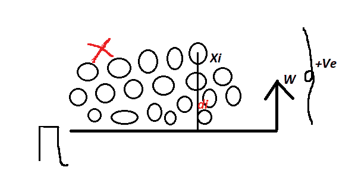

如果实际点是负的，在数据集中显示为红色，但是分类器被预测为正的，那么***<0***因此分类器的等式是***<0***…………………………………………***yi =-1(实际点)***

但是模型被预测为 ***【正(+Ve)】***它们对于错误分类是会发生的

***案例编号 4 :***

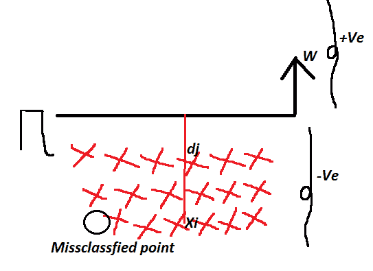

在这种情况下，数据集中的实际点是正的，但被错误分类，而模型被预测为负的，因此 ***Yi=+1*** (实际点)但预测点是 ***负的(-Ve)*** 即模型被错误分类，***<0***

***总结所有这些案例***

**让我们讨论数学公式，方程是**

**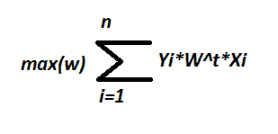**

**其中:**

*****n*** =是数据点**

****易&**=训练数据集**

***=变量***

***问题是如何优化这个方程，以作出正确的分类和减少误分类***

***让我们用科学的方式写出给定的等式:***

******

***其中 ***w**** 是最优的，最佳的 ***w*** 任务是找到最佳的 ***【超平面】***w(超平面)，最大化 ***正分类(+Ve)*** ，最小化 ***负点(-Ve)******

> ******乙状结肠功能:******

***上述函数中的问题是如何选择最佳的和最好的分类器，以减少误分类***

***因此，让我们首先了解异常值是如何导致错误分类的，然后了解如何通过使用 sigmoid 函数来最小化错误分类***

******案例 1*** :假设一些随机的数据点分类***

***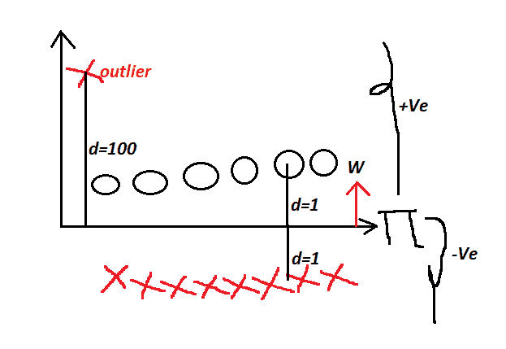***

***由平面 Pi 和法线 W 分开，一些**点是正的，由圆圈中的黑色表示，一些负的点由红色的十字表示**和一些远离平面的异常值***

***让我们应用这个公式，计算一个点的所有距离的总和***

***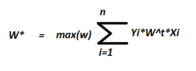***

***w * =(1+1+1+1+1+1)+(1+1+1+1+1)-100 =-90***

***由于一个错误分类和异常值，我们得到了非常大的值，所以让我们考虑另一种情况***

******情况 2*** :在这种情况下我们使用不同的超平面来分离点***

***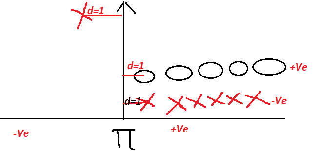***

***在这种情况下，当我们使用给定公式计算所有点的和时***

******

***w * = 1+2+3+4+5–1–2–3–4–5+1 = 1***

***目标是找出距离的最大和，在这两种情况下我们找出 1>-90，所以我们第二个是我的分类器***

***但是当我们 W * = 1+2+3+4+5–1–2–3–4–5+1 = 1 计算第一种情况和第二种情况超平面的准确性时，我们得到第一种超平面最佳分类器，因为在这种情况下只发生了一次误分类，但是在第二种情况下，由于单个异常点而发生了五次误分类***

***为了最小化这个误差，我们使用了 ***sigmoid 函数******

***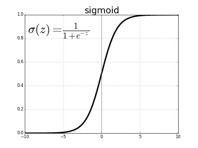***

***让我们 f(sigmoid 函数)***

***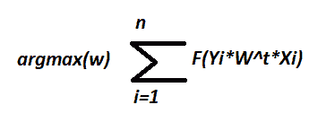***

## ***说明:当数据点增加到某一水平时，sigmoid 图被捕获基本上是 sigmoid，我们将固定在某一极限，在该极限之后，数据点被视为异常值，它们不计入原始数据中这就是 sigmoid 函数的优点 sigmoid 函数的一些好的属性是***

******= 𝛔(x)******

***最大值:1***

***最小值:0***

***𝛔(0)=0.5***

***适马函数也有概率解释***

***因此，让我们用 sigmoid 函数评估我们的最佳公式，并尝试在公式中拟合 sigmoid 函数***

***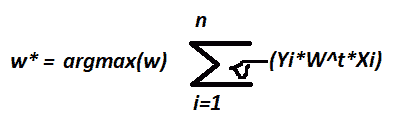***

***利用***【𝛔(x)= 1/(1+e-x)***我们得到这个等式:***

***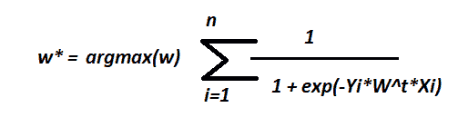***

***因此，如果我们使用这个等式，那么我们就不会受到异常值的影响***

> ******优化逻辑回归:******

***在这些方法中，我们将通过使用单调函数来优化下面的方程，单调函数是这样的函数，当一个函数增加时，另一个函数随该函数减少，或者两个函数同时增加或减少，称为单调函数***

******F(x) = g(x)*** 当 x 在增加时，那么 g(x)也是增加然后函数单调增加的函数***

***让我们在那个等式中应用给定的函数***

******

******g(x) = log(x):单调函数******

***应用这个函数后，我们得到这个方程***

***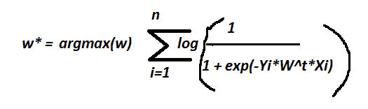***

***所以我们知道***log(1/x)=-log(x)***应用这个函数我们得到***

***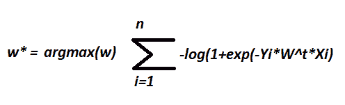***

***因此，当我们试图解决这个对数函数时，我们假设***

******arg maxf(x)= arg min-f(x)……..1.******

******或******

******arg max-f(x)= arg minf(x)……2。******

***应用这两个函数 ***最终优化方程是******

***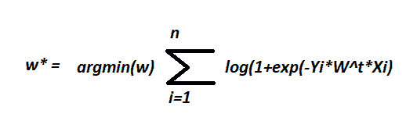***

******其中 Yi =+1 或-1******

***这是逻辑回归几何驱动优化问题***

> ******正规化 L1 & L2:******

******L2 正规化******

***正则化是一种技术，其中我们在机器学习算法中引入了一个新术语，用于减少模型的过拟合和欠拟合***

***换句话说:通过防止算法过度拟合训练数据集，正则化可以用于训练模型，这些模型可以更好地概括看不见的数据。***

***让我们在优化方程中引入 L2 正则化***

***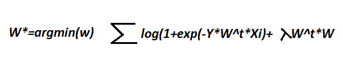***

***这被称为 L2 正则化术语***λ*w^t*w***……………………………………1。***

***在物流再生中称为正规化术语***

***设 ***λW^t*W = λ||W|| 2 …………。这叫做 L2 归一化的平方******

***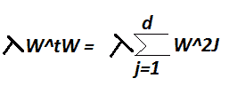***

> ******其中λ是逻辑回归*** 中的超参数***

***如果 lambda 等于零，则模型过拟合训练数据，并且方差*高，但是如果 lambda 非常大，则损失函数减小，模型欠拟合，并且出现高 ***偏差*** 以找到正确的 lambda，在机器学习模型中使用交叉验证****

*******L1*正规化******

****L1 正则化是 L2 正则化的另一种选择，概念是相同的，但是这里我们取的是*W 的绝对值，等式看起来像 ***||W|| = ∑|Wi| range 是 I = 1 到 d********

****因此，逻辑回归方程可以改为****

****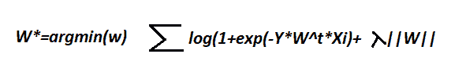****

****L1 正则化通过选择正确的λ值来避免欠拟合和过拟合，L1 正则化还创建了稀疏性，稀疏性意味着不太重要的特征被置零并从数据集中移除****

******我希望给出的信息能让你对混淆矩阵有基本的了解。如果你喜欢这篇文章，请鼓掌。我希望这对你有帮助******

****你可以在上关注我****

****领英:[https://www.linkedin.com/in/khan-akbar-b07b7218b/](https://www.linkedin.com/in/khan-akbar-b07b7218b/)****

****github:[https://github.com/khanakbar145](https://github.com/khanakbar145)****

****谢谢你的阅读！****