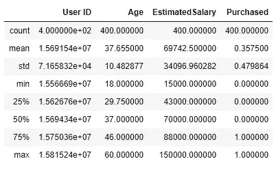
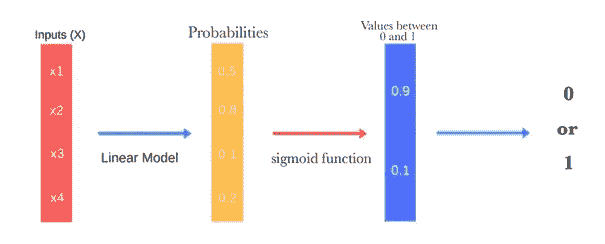
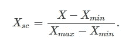
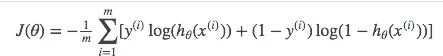
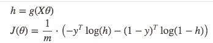
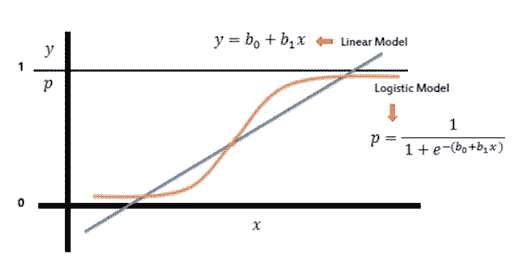

# 有划痕的逻辑回归

> 原文：<https://medium.com/analytics-vidhya/logistic-regression-with-scracth-c23b9afb04b2?source=collection_archive---------28----------------------->

你好，欢迎来到我们的 Scratch 逻辑回归文章，这是我们的 Scratch 机器学习系列的第二篇文章。如果您需要检查我们将使用的数据，您可以从链接 [**这里的**](https://github.com/capogluuu/ml_scratch/tree/main/Logistic%20Regression) 访问数据。

数据集的样本零件

df.describe()

# 逻辑回归

我们在逻辑回归算法中的主要目标是计算具有某些属性的元素属于哪个分类变量的比率。为了进行这种计算，我们将使用类似于线性模型的链接“b0 + w1 * x1 + w2 * x2”。我们的目标是找到最佳的 b0、w1 和 w2 变量。为了找到这些值，我们执行以下操作:

1.  加载数据集
2.  特征缩放
3.  模型拟合
4.  梯度下降
5.  测定测试和控制数据
6.  预言；预测；预告
7.  衡量预测结果

## 最小-最大缩放

根据最小-最大缩放方法，数据在 0 和 1 之间缩放。这样，我们可以在进行精确计算(如梯度下降)的部分提高效率。

## 失去的功能

损失函数是衡量模型预测值与真实值的接近程度或距离的测量单位。在这段代码中，我们使用了下面的对数函数来最小化。

失去的功能

h (X)是我们估计的值，而 y 是训练数据中的值。

**矢量化丢失功能**

## 梯度下降

梯度下降是一种优化算法，它将最小化我们的损失函数。梯度下降的主要目的是找到对我们最好的系数。因为我们不能像人一样手动确定，所以我们让计算机来完成这个过程。计算机也在你梯度的相反方向上不断地小步前进，最终达到一个局部最小值。这样，我们就可以得到系数。

梯度下降算法要做的事情

1.  确定起始重量
2.  对每个参数的成本函数求导
3.  更新重量和偏差值

我们建议您观看吴恩达的视频，以便更好地理解梯度下降。

[**渐变下降(C1W2L04) — YouTube**](https://www.youtube.com/watch?v=uJryes5Vk1o)

## 预言；预测；预告

对于我们的函数，我们使用通过梯度下降确定的最佳 b0 和 b1 值。下一步，用我们上面看到的 1/1 + e ^ -z 函数，我们决定哪个分类变量更接近我们正在处理的样本。作为这个过程的结果，我们根据概率(在 0-1 之间)决定它将属于哪个类别。我将在代码中介绍这些细节。继续阅读😊

## 让我们编码

1.  首先，让我们导入必要的库

2.我们上传我们的数据，并在预处理后将它们提供给模型😊

在这段代码中，我们看到了选择将要处理的列的阶段，将它们保留在预处理阶段，并将它们呈现给模型。最后，我们通过比较模型的结果来衡量我们的成功率。

3.让我们编码我们的类结构

我们通过在 __init__ 函数中进行预定义来开始我们的类结构。您可能不熟悉这里的 control_level 变量。Control_level 告诉我们，在计算了测试数据集中的样本属于哪个类别的概率之后，应该使用哪个波段来进行估计。为了用一个例子来解释这一点，如果我们的 control_level 值是 0.65，并且作为运算的结果，我们有一个概率值 0.60，我们可以说这个变量属于类别 0 和 1 中的 0，因为它是 0.65> 0.60。

在定义它们之后，我们试图用梯度下降步骤找到最佳参数，然后用我们找到的参数预测我们的结果。

## 这就是这篇文章的内容😊

## 请访问我的 Github 页面查看完整版代码:[https://github.com/capogluuu/ml_scratch](https://github.com/capogluuu/ml_scratch)

# 谢谢你

有用的资源

1.  [https://ml-cheat sheet . readthedocs . io/en/latest/logistic _ regression . html](https://ml-cheatsheet.readthedocs.io/en/latest/logistic_regression.html)
2.  [https://math . stack exchange . com/questions/3287412/updating-weights-in-logistic-regression-using-gradient-descent](https://math.stackexchange.com/questions/3287412/updating-weights-in-logistic-regression-using-gradient-descent)
3.  [https://www.youtube.com/playlist?list = plnekwbmsazbor 8 vvhnlanxcnr 2 V7 ituxy](https://www.youtube.com/playlist?list=PLNeKWBMsAzboR8vvhnlanxCNr2V7ITuxy)(吴恩达逻辑回归)