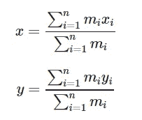
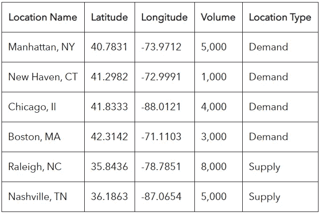
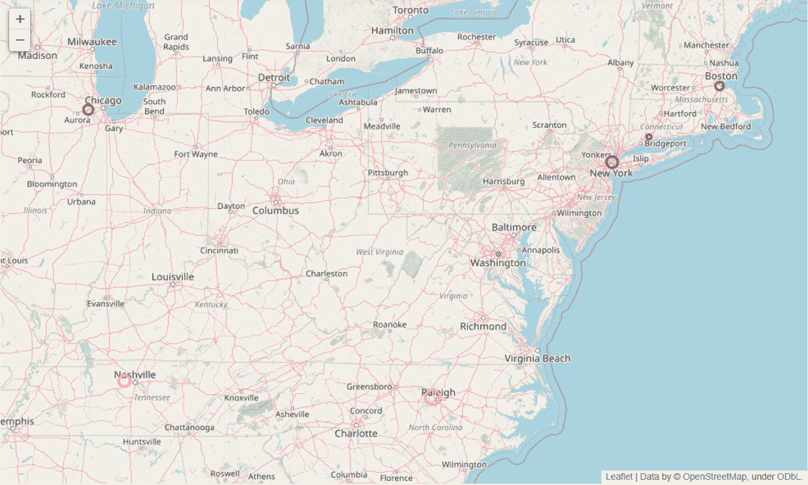
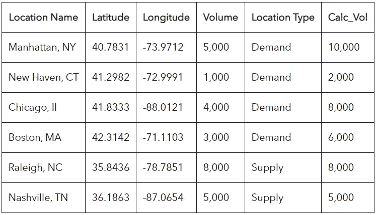
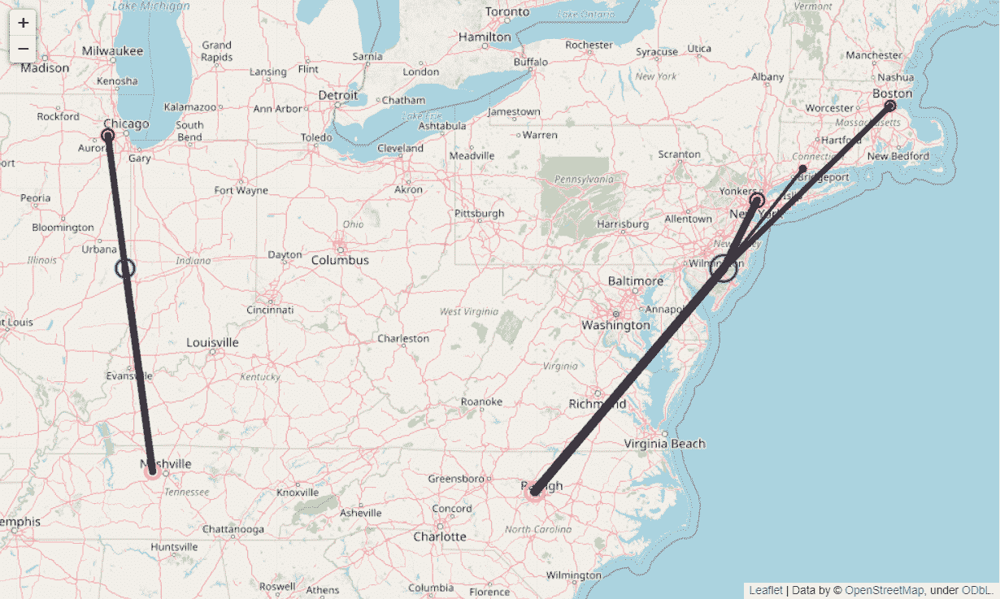
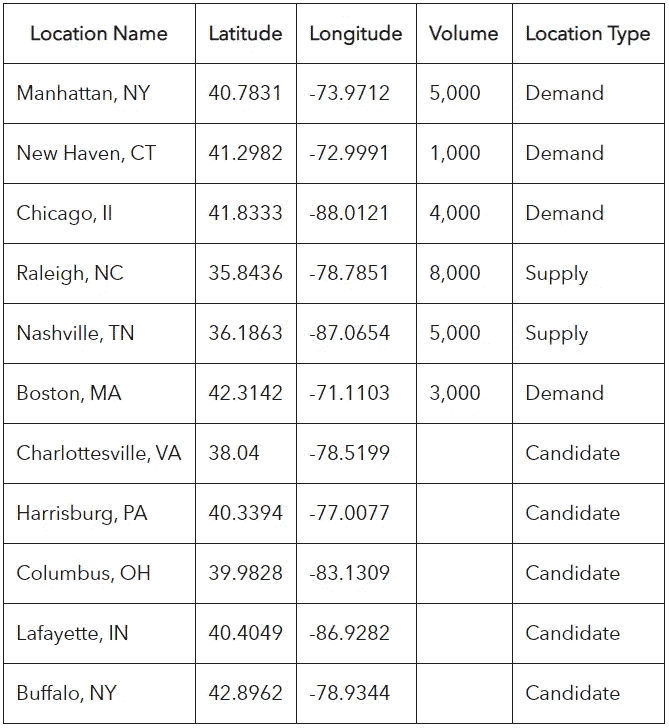
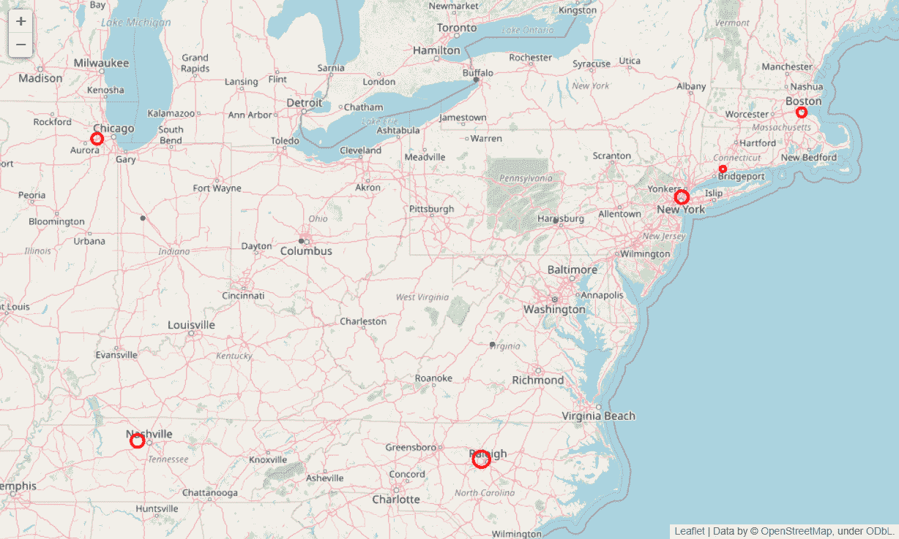
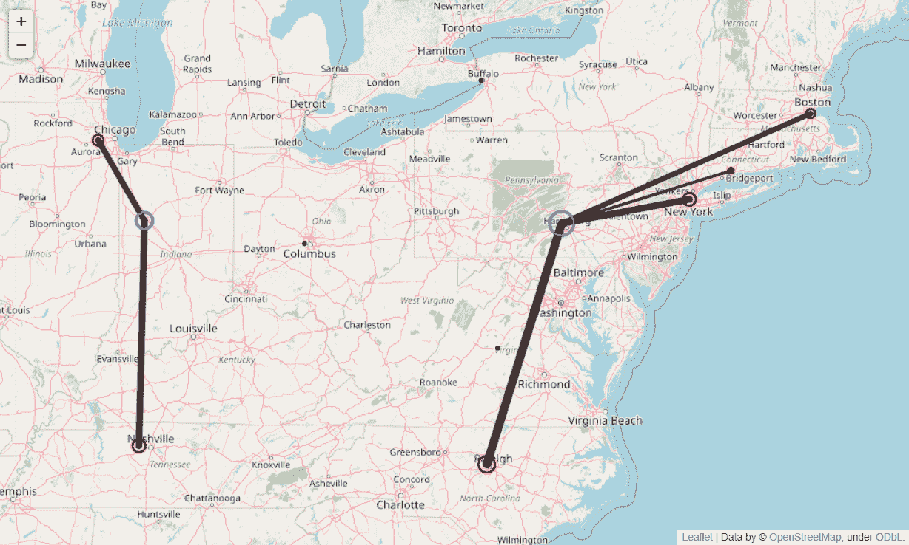

# Python 中的物流重心分析

> 原文：<https://medium.com/analytics-vidhya/logistics-center-of-gravity-analysis-in-python-a21ad034f849?source=collection_archive---------0----------------------->

## 在物流中，重心分析用于得出仓库的最佳位置。下面是如何用 Python 实现的。


*本文原载于*[*victorangeloblancada . github . io*](http://victorangeloblancada.github.io)*。*

在物流中，重心分析用于通过计算到设施所服务的每个供应或需求位置的运输成本来得出仓储设施的理想位置。因此，重心是总运输成本最低的位置。

从其名称可以推断，重心分析类似于质心，其物理和工程对应物，其中质心是分布质量的加权相对位置总和为零的单点。该公式类似于物流重心的计算，使用进出仓储设施的运输量，而不是物理质心中的分布质量。物理质量中心或物流重心的坐标公式如下:



其中 x 和 y 是指所服务的 n 个位置的坐标(物理质心的 n 个分布质点的坐标)，m 是指输送体积(物理质心的质量)。

然而，将这种理论分析应用于实际问题会很快变得复杂，因为要考虑现实假设和业务约束，例如:

1.  如果需要一个以上的仓储设施位置，该怎么办？
2.  如果进出运费不同怎么办？这是一个现实的假设，因为入站交付成本往往较低，因为项目是批量运输到仓库，因此受益于规模经济，而项目是以较小的数量运出给客户或分销商。
3.  如果企业只有几个可以建立设施的候选地点，该怎么办？
4.  我们如何确保选定的坐标落在仓库位置的可行地点，例如，位置不在居民区、山上或水上？

对于问题 1 和 2，我们将看看如何使用 K-Means 来获得重心。下一节包括用 Python 实现这一点的代码。

对于问题 3 和 4，我们将看看如何使用 Python 中的 [Itertools](https://docs.python.org/2/library/itertools.html) 从一组候选站点中选择重心。最后一节包括实现这一点的代码。

# 对多个设施使用 K 均值

让我们使用以下虚拟数据来获得重心:



假设我们想使用重心法确定两个仓库位置。上一节中的质心公式将仅提供一个重心，但是，根据其定义，即运输成本最小化的点，我们可以使用 K-means 聚类算法来确定将运输成本最小化的多个位置，因为 K-means 聚类是一种无监督的学习技术，它可以识别质心，从而根据最接近质心的质心为每个单独的数据点分配一个聚类。要确定两个仓库位置，我们可以运行 K=2 的 K-means 聚类算法，以获得两个最小化运输距离的质心，从而最小化运输成本。

下面的代码块导入分析所需的库，并加载上面的表:

```
%matplotlib inline
# Import libraries
import numpy as np
import pandas as pd
import matplotlib.pyplot as pltfrom itertools import combinations from sklearn.cluster import KMeansimport folium# Load data
data = pd.read_excel('Data.xlsx',
                     dtypes={'Location Name': str,
                             'Location Type': str})
```

下面的代码块使用叶在活页地图上绘制站点(红色代表需求站点，黄色代表供应站点):

```
# Color options
color_options = {'demand': 'red',
                 'supply': 'yellow',
                 'flow': 'black',
                 'cog': 'blue',
                 'candidate': 'black',
                 'other': 'gray'}# Instantiate map
m = folium.Map(location=data[['Latitude', 'Longitude']].mean(),
               fit_bounds=[[data['Latitude'].min(),
                            data['Longitude'].min()], 
                           [data['Latitude'].max(),
                            data['Longitude'].max()]])

# Add volume points
for _, row in data.iterrows():
    folium.CircleMarker(location=[row['Latitude'], 
                                  row['Longitude']],
                        radius=(row['Volume']**0.5),
                        color=color_options.get(str(row['Location Type']).lower(), 'gray'),
                        tooltip=str(row['Location Name'])+' '+str(row['Volume'])).add_to(m)
                                #row['Longitude']]).add_to(m)

# Zoom based on volume points
m.fit_bounds(data[['Latitude', 'Longitude']].values.tolist())# Show the map
m
```



还假设向外和向内的运输成本不同，向仓库的向内交货通常比从仓库的可比距离的交货花费更少，由于规模经济，它们往往会这样。假设向外运送的费用正好是向内运送的两倍。在这种情况下，我们需要相应地调整卷的权重。到需求地点的外向交货乘以 2，而来自供应地点的内向交货保持不变:



下面的代码块根据我们的原始数据调整数量，以说明可比较的入境和出境运输之间的成本差异:

```
# The outbound shipments cost twice as much as inbound shipments
IB_OB_ratio = 2def loc_type_mult(x):
    """A function to get the volume multiplier based on the location type and the IB-OB ratio.
    x: The location type
    """
    if x.lower() == 'supply':
        # No need to divide since we are already multiplying the demand
        return 1
    elif x.lower() == 'demand':
        # Only apply multiplier to demand
        return IB_OB_ratio
    else:
        # If neither supply nor demand, remove entirely
        return 0# Adjust volumes used in the computation based on IB-OB ratio
data['Calc_Vol'] = data['Location Type'].apply(str).apply(loc_type_mult)*data['Volume']
```

下面的代码块使用 Scikit-learn 的 K-means 聚类算法的实现来获得两个质心作为建议的仓库位置:

```
# Fit K-means for 2 centroids
kmeans = KMeans(n_clusters=2, 
                random_state=0).fit(data.loc[data['Calc_Vol']>0, ['Latitude', 
                                                                  'Longitude']], 
                                    sample_weight=data.loc[data['Calc_Vol']>0, 
                                                           'Calc_Vol'])
# Get centers of gravity from K-means
cogs = kmeans.cluster_centers_
cogs = pd.DataFrame(cogs, columns=['Latitude',
                                   'Longitude'])# Get volume assigned to each cluster
data['Cluster'] = kmeans.predict(data[['Latitude', 'Longitude']])
cogs = cogs.join(data.groupby('Cluster')['Volume'].sum())# Include assigned COG coordinates in data by point 
data = data.join(cogs, on='Cluster', rsuffix='_COG')
```

下面的代码块使用活页地图上的叶子绘制了最终的重心，同时用线条表示从建议的仓库位置到供应和需求地点的交货路线:

```
# Add flow lines to centers of gravity to map
for _, row in data.iterrows():
    # Flow lines
    if str(row['Location Type']).lower() in (['demand', 'supply']):
        folium.PolyLine([(row['Latitude'],
                          row['Longitude']),
                         (row['Latitude_COG'],
                          row['Longitude_COG'])],
                        color=color_options['flow'],
                        weight=(row['Volume']**0.5),
                        opacity=0.8).add_to(m)

# Add centers of gravity to map
for _, row in cogs.iterrows():
    # New centers of gravity
    folium.CircleMarker(location=[row['Latitude'],
                                  row['Longitude']],
                        radius=(row['Volume']**0.5),
                        color=color_options['cog'],
                        tooltip=row['Volume']).add_to(m)

# Show map
m
```



对于样本数据，算法似乎已经选择在伊利诺伊州厄巴纳和特拉华州威尔明顿附近建立两个仓库。

# 使用 Itertools 遍历站点组合

如果可以放置仓库的位置数量有限怎么办？这可能是由于多种因素:公司可能已经拥有现有的地块，或者他们可能希望避免在住宅区获得推荐。

我们可以通过为算法引入候选站点来选择仓库位置，从而改变我们的方法。在下表中，上一节的原始数据已更新为五个候选地点，从中选择两个仓库位置:



数据准备基本相同，由下面的代码块覆盖，以显示传单地图中的供应地点(黄色)和需求地点(红色)以及候选地点(黑色):

```
%matplotlib inline
# Import libraries
import numpy as np
import pandas as pd
import matplotlib.pyplot as pltfrom itertools import combinations from tqdm import tqdmfrom sklearn.cluster import KMeansimport folium# Load data
data = pd.read_excel('Data.xlsx',
                     dtypes={'Location Name': str,
                             'Location Type': str})

# Color options
color_options = {'demand': 'red',
                 'supply': 'yellow',
                 'flow': 'black',
                 'cog': 'blue',
                 'candidate': 'black',
                 'other': 'gray'}# Instantiate map
m = folium.Map(location=data[['Latitude', 'Longitude']].mean(),
               fit_bounds=[[data['Latitude'].min(),
                            data['Longitude'].min()], 
                           [data['Latitude'].max(),
                            data['Longitude'].max()]])

# Add volume points
for _, row in data.iterrows():
    folium.CircleMarker(location=[row['Latitude'], 
                                  row['Longitude']],
                        radius=(row['Volume']**0.5),
                        color=color_options.get(str(row['Location Type']).lower(), 'gray'),
                        tooltip=str(row['Location Name'])+' '+str(row['Volume'])).add_to(m)
                                #row['Longitude']]).add_to(m)

# Zoom based on volume points
m.fit_bounds(data[['Latitude', 'Longitude']].values.tolist())# Show the map
m
```



与上一节相同，下面的代码块根据我们的原始数据调整数量，以说明可比较的入境和出境运输之间的成本差异:

```
# The outbound shipments cost twice as much as inbound shipments
IB_OB_ratio = 2def loc_type_mult(x):
    """A function to get the volume multiplier based on the location type and the IB-OB ratio.
    x: The location type
    """
    if x.lower() == 'supply':
        # No need to divide since we are already multiplying the demand
        return 1
    elif x.lower() == 'demand':
        # Only apply multiplier to demand
        return IB_OB_ratio
    else:
        # If neither supply nor demand, remove entirely
        return 0# Adjust volumes used in the computation based on IB-OB ratio
data['Calc_Vol'] = data['Location Type'].apply(str).apply(loc_type_mult)*data['Volume']
```

下面的代码块显示了求解重心的不同方法。Itertools 用于遍历所有可能的仓库位置组合，以获得运输成本最小的组合。以下代码根据距离计算总的估计运输成本，并根据每个潜在位置组合的相对运输成本进行加权，然后保存使估计成本最小的位置组合:

```
cands = data.loc[data['Location Type'].str.lower()=='candidate']
locs = data.loc[data['Calc_Vol']>0]total_dist = np.inf
best_cogs = []# Loop to find best combination of candidate sites
for i in tqdm(list(combinations(cands.index, n))):
    temp_cands = cands.loc[list(i)]
    locs['Cluster'] = 0
    locs['Distance_COG'] = np.inf
    for i_l, r_l in locs.iterrows():
        for i_c, r_c in temp_cands.iterrows():
            # Get distance
            dist = (r_l['Latitude']-r_c['Latitude'])**2
            dist += (r_l['Longitude']-r_c['Longitude'])**2
            dist **= 0.5
            # Save values if distance is shorter
            if dist < locs.loc[i_l, 'Distance_COG']:
                # Save distance
                locs.loc[i_l, 'Distance_COG'] = dist
                # Save index of nearest point
                locs.loc[i_l, 'Cluster'] = i_c
    # Weight distance by volume
    locs['Weighted_Distance_COG'] = locs['Distance_COG'] * locs['Calc_Vol']
    # Save scenario if total weighted distance is smaller
    if locs['Weighted_Distance_COG'].sum() < total_dist:
        total_dist = locs['Weighted_Distance_COG'].sum()
        best_cogs = list(list(i))# Get centers of gravity
cogs = cands.loc[best_cogs, ['Latitude',
                             'Longitude']]
# Reloop to get site assignment
locs['Cluster'] = 0
locs['Distance_COG'] = np.inf
for i_l, r_l in locs.iterrows():
    for i_c, r_c in cogs.iterrows():
        # Get distance
        dist = (r_l['Latitude']-r_c['Latitude'])**2
        dist += (r_l['Longitude']-r_c['Longitude'])**2
        dist **= 0.5
        # Save values if distance is shorter
        if dist < locs.loc[i_l, 'Distance_COG']:
            # Save distance
            locs.loc[i_l, 'Distance_COG'] = dist
            # Save index of nearest point
            locs.loc[i_l, 'Cluster'] = i_c# Get volume assigned to each cog
cogs = cogs.join(locs.groupby('Cluster')['Volume'].sum())# Include assigned COG coordinates in data by point 
data = data.join(locs['Cluster'])
data = data.join(cogs, on='Cluster', rsuffix='_COG')
```

与上一节类似，下面的代码块在传单地图上使用叶子绘制了最终的重心，同时用线条表示从建议的仓库位置到供应和需求地点的交货路线:

```
# Add flow lines to centers of gravity to map
for _, row in data.iterrows():
    # Flow lines
    if str(row['Location Type']).lower() in (['demand', 'supply']):
        folium.PolyLine([(row['Latitude'],
                          row['Longitude']),
                         (row['Latitude_COG'],
                          row['Longitude_COG'])],
                        color=color_options['flow'],
                        weight=(row['Volume']**0.5),
                        opacity=0.8).add_to(m)

# Add centers of gravity to map
for _, row in cogs.iterrows():
    # New centers of gravity
    folium.CircleMarker(location=[row['Latitude'],
                                  row['Longitude']],
                        radius=(row['Volume']**0.5),
                        color=color_options['cog'],
                        tooltip=row['Volume']).add_to(m)

# Show map
m
```



对于示例数据，该算法选择在宾夕法尼亚州的哈里斯堡和宾夕法尼亚州的拉斐特建立两个仓库。

*Victor Blancada 是一名数据科学家。访问他的领英页面* [*这里*](https://www.linkedin.com/in/geloblancada/) *。*