# Logit 和神经网络分析

> 原文：<https://medium.com/analytics-vidhya/logit-and-neural-network-analysis-1b6baf2c9e6e?source=collection_archive---------18----------------------->

商业案例:预测个人贷款概率

详细信息:根据历史客户趋势，预测银行客户获得个人贷款的概率。

目的:检测模式以获得可行的见解

方法:Logit 分析、敏感性分析和神经网络分析

艾伦·德·拉·克鲁兹在 [Unsplash](https://unsplash.com/s/photos/brain?utm_source=unsplash&utm_medium=referral&utm_content=creditCopyText) 上的照片

当预测一个“是”或“否”选择的概率时，例如购买一辆汽车，预测的一个常用方法是 logit 模型分析。或者，神经网络分析也正在迅速成为一种流行的模型，因为它可以检测数据中的微妙模式，这是 logit 所不能做到的。当查看预测贷款概率的业务案例时，我们应用了这两种方法。以下是我们的测试结果:

步骤 1 —个人贷款的 Logit 分析:

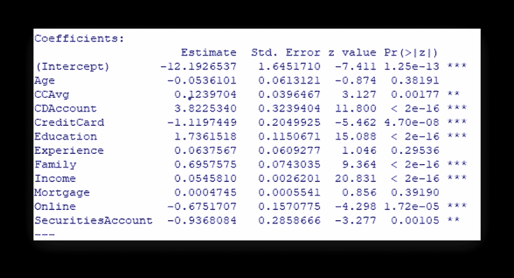

图 1: Logit 分析，y =个人贷款和 x 变量系数

哪些变量是重要的？重要变量如何影响贷款的可能性？

CC Avg:显著，获得个人贷款的可能性上升。
大额存单账户:意义重大，获得个人贷款的可能性上升。信用卡:重要的是，获得个人贷款的可能性下降了。教育:重要的是，获得个人贷款的可能性增加了。家庭:重要的是，获得个人贷款的可能性增加了。
收入:显著，获得个人贷款的可能性上升。
在线:重要的是，获得个人贷款的可能性下降。
证券账户:显著，办理个人贷款的可能性下降。

步骤 2——用调节效应改进模型:增加调节效应(变量的相互作用)

哪些交互在概念上有意义？

假设和结果:
1。教育*家庭——统计显著***
假设:家庭有潜力增加通过个人贷款获得高等学位的可能性。

2.家庭*收入——统计意义上的***
假设:收入(年薪)有可能增加你扩大家庭规模和申请个人贷款(为家人提供住房)的可能性。

3.教育*收入—统计显著***
假设:收入(年薪)有可能增加获得高等学位的可能性，并获得个人贷款(很可能获得批准)。

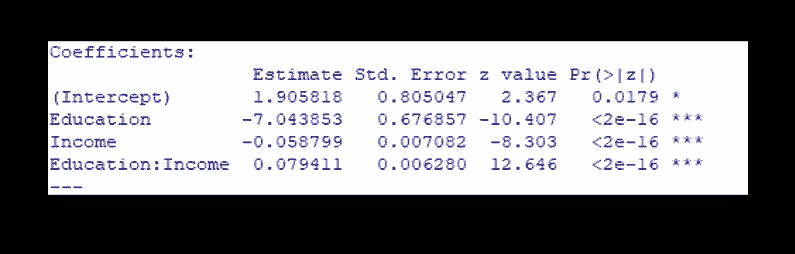

图 2:调节效应，Logit 分析

这些变量的系数解释:
教育:显著，获得个人贷款的可能性下降。
收入:显著，获得个人贷款的可能性下降。
教育*收入:意义重大，获得个人贷款的可能性上升。

敏感性分析显示了收入和教育如何影响获得个人贷款的机会百分比。

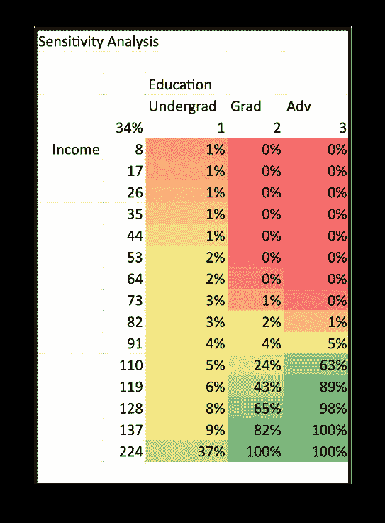

图 3:教育的敏感性分析，
收入和教育*收入调节效应(以千计的收入)

具有重要变量(主效应和交互项)的最终回归模型和模型的电子表格预测:

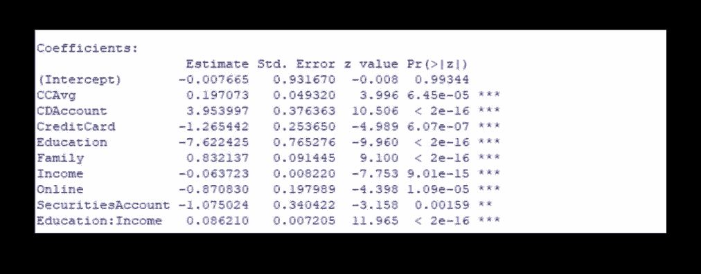

图 4:具有主要效应和交互项的最终回归模型

Logit 主效应+调节:

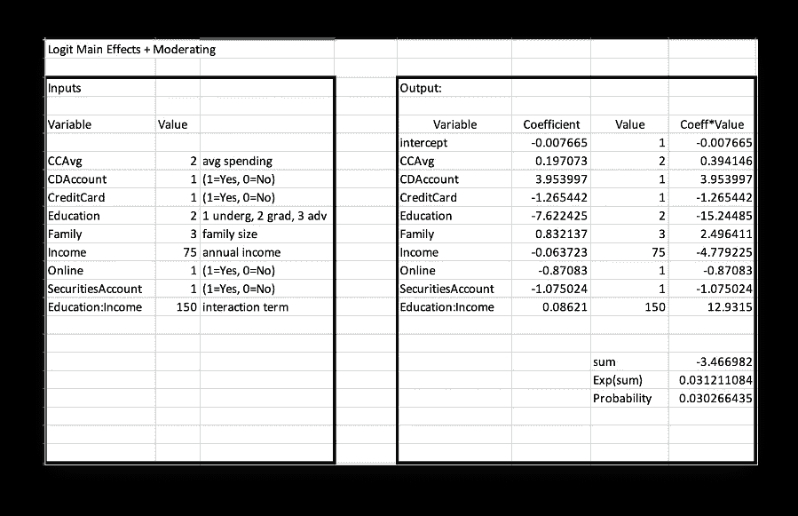

图 5:最终 Logit 模型的电子表格预测，包括主要影响和交互项

对客户贷款行为影响最大的变量(主效应和交互效应相结合):
:教育(-15.24)和教育*收入(12.93)——由于变量对系数*值的输出，这两个变量对客户贷款概率的影响最大。

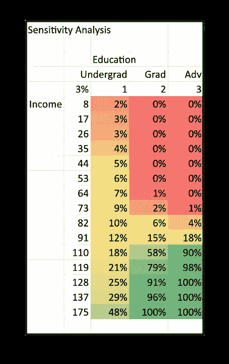

图 6:收入和教育的敏感性分析(以千计的收入)

这种模式在上面有直观的表现——随着客户收入和教育水平的提高，获得个人贷款的可能性也在增加。

**个人贷款概率的神经网络分析**

神经网络可以探测到 logit 不能探测到的模式。神经网络包含隐藏节点来实现这一点。

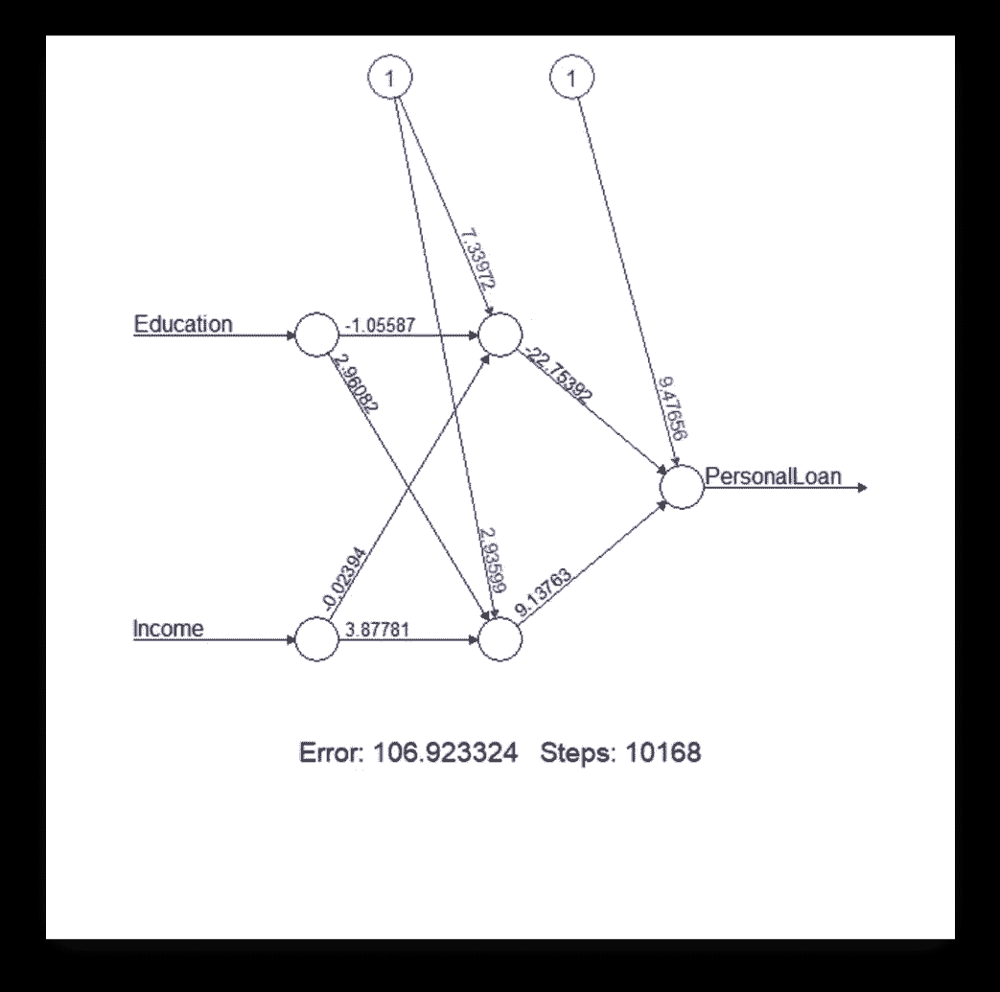

图 7:教育和收入
对个人贷款概率影响的神经网络分析

神经网络的预测模型；

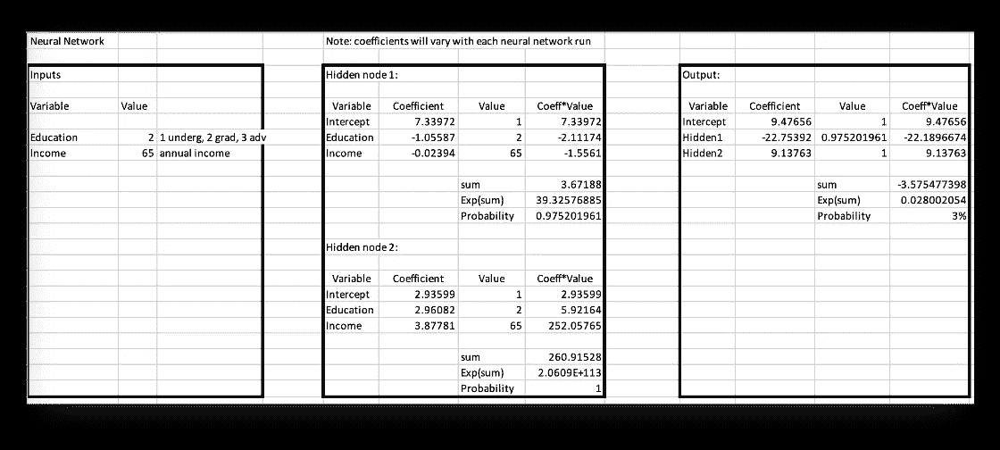

图 8:神经网络预测模型——教育和收入变量

神经网络分析的灵敏度分析:

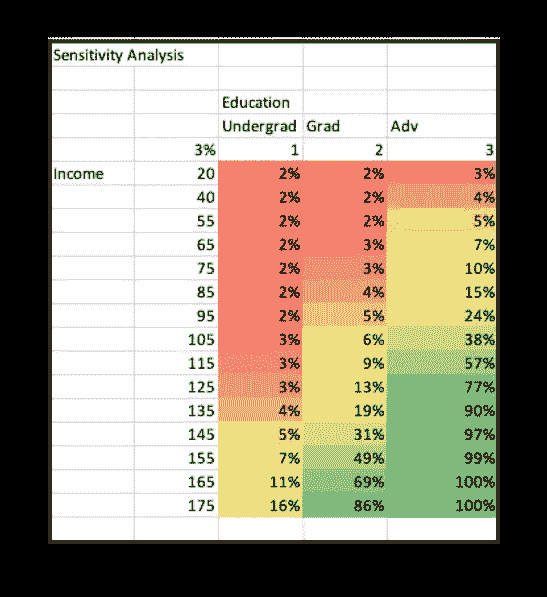

图 9:神经网络的敏感性分析——教育和收入变量(以千计的收入)

请注意 logit 和神经网络敏感度分析之间的差异。神经网络检测数据集中的细微模式。

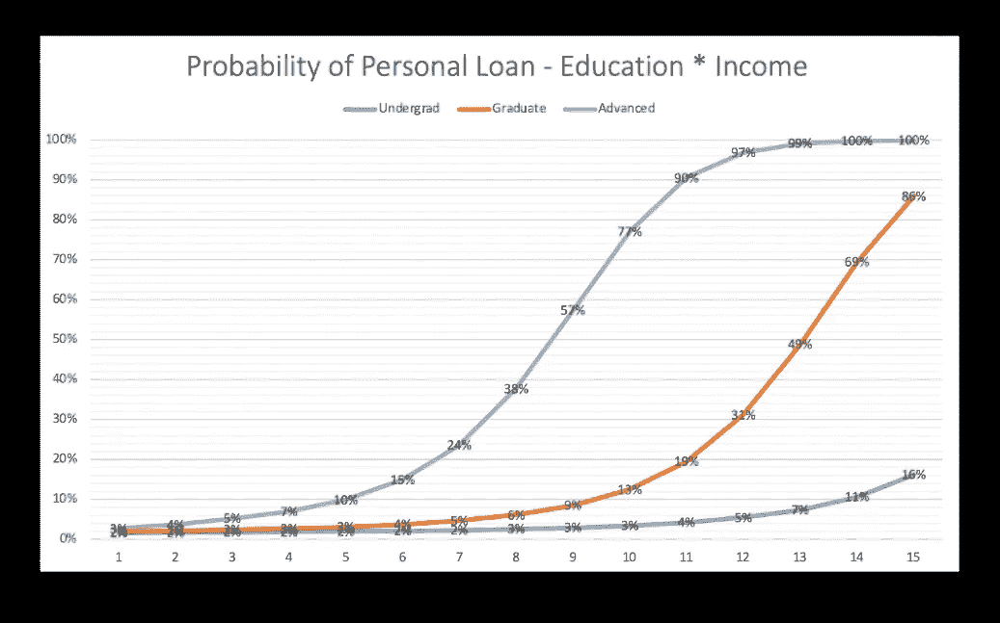

图 10:神经网络的概率图敏感性分析——教育和收入变量对个人贷款概率的预测效果

上图显示了不同教育程度和收入的客户申请个人贷款的概率。这条线表明，拥有高学历(同等收入水平)的客户比拥有本科或研究生学历的客户获得个人贷款的机会更大。

数据字典:

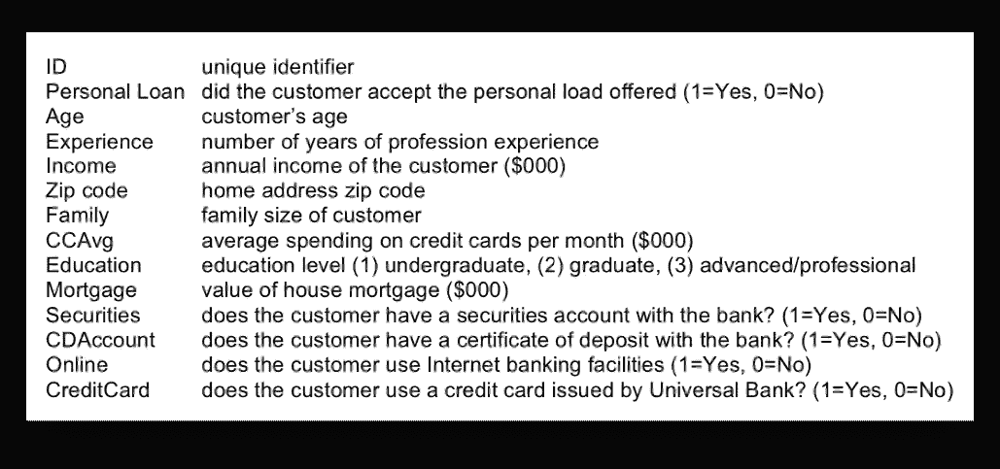

图 11:银行数据分析中的变量

结论:
该分析在客户银行业务的数据集中发现了一个模式。这让我们根据特定的人口统计数据，更深入地了解客户是否会申请个人贷款。

具有类似敏感性结果的其他变量和调节效应包括:
收入和家庭——收入越高，家庭成员越多，获得个人贷款的可能性就越大。

教育和家庭——高等教育和更多的家庭成员导致获得个人贷款的可能性略有增加。

(资料来源:基于锡拉丘兹大学惠特曼管理学院商业分析硕士项目主任 Don Harter 的原始作业。)