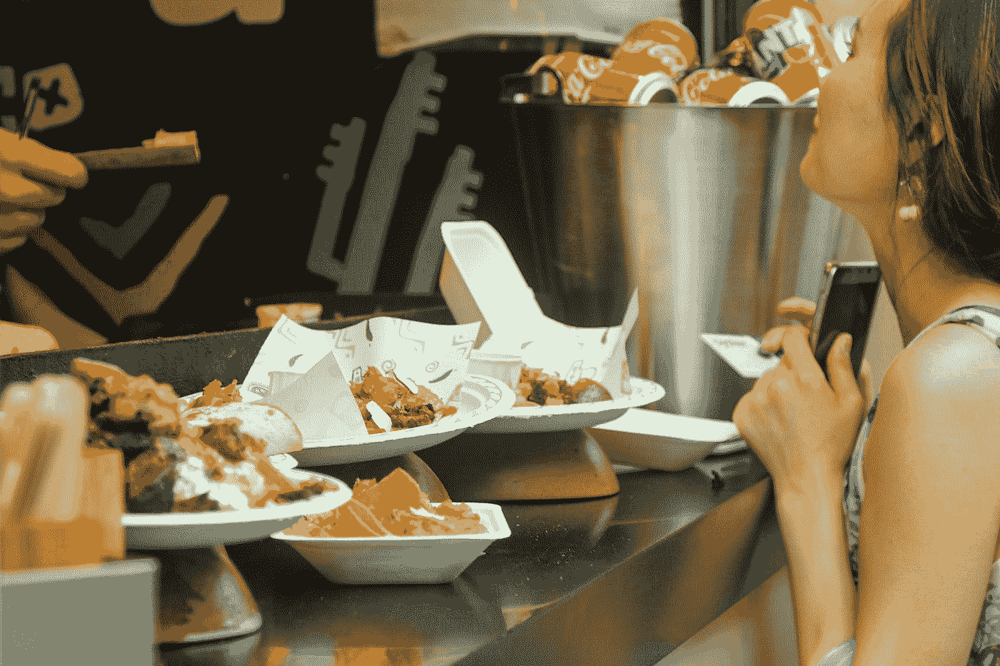
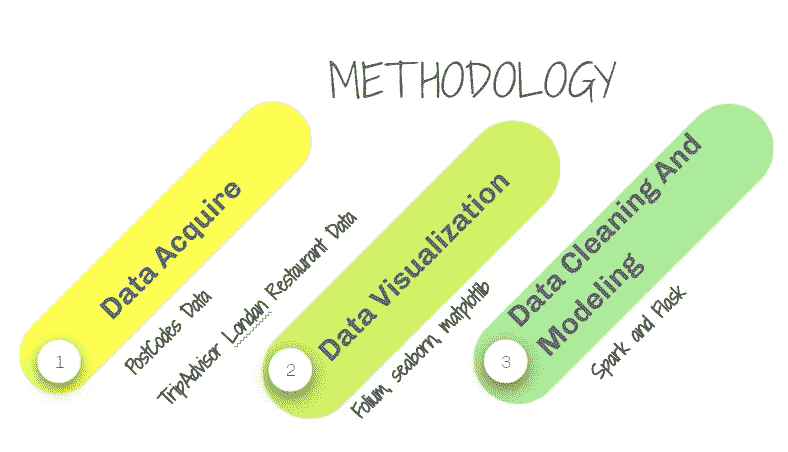
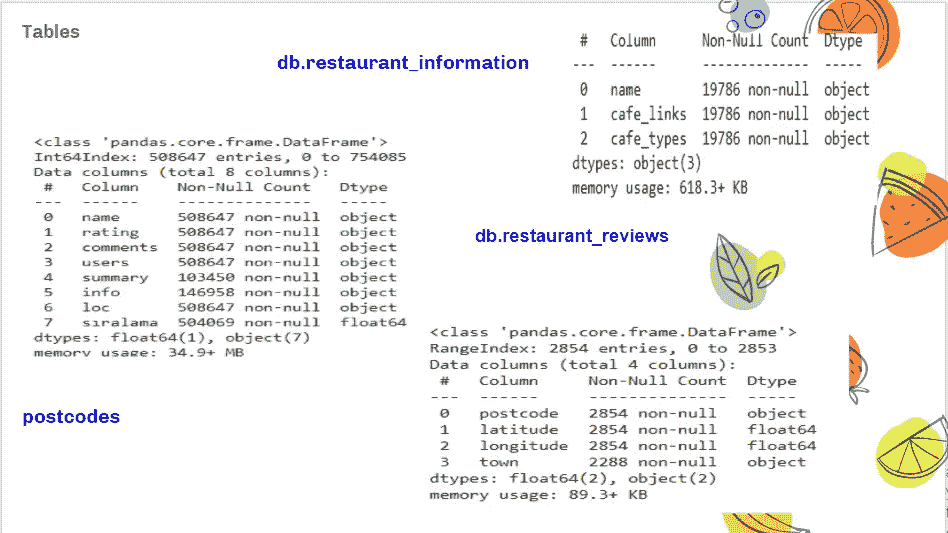
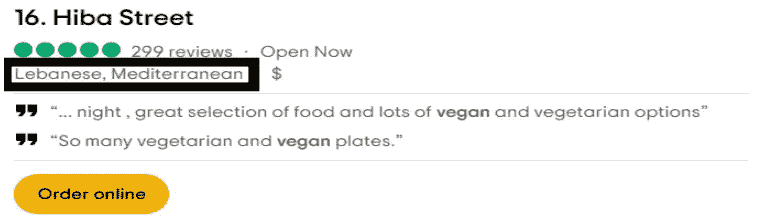
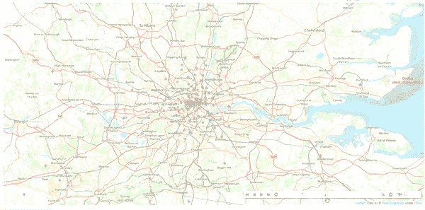
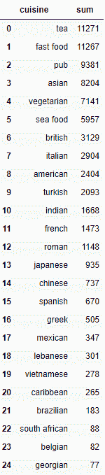
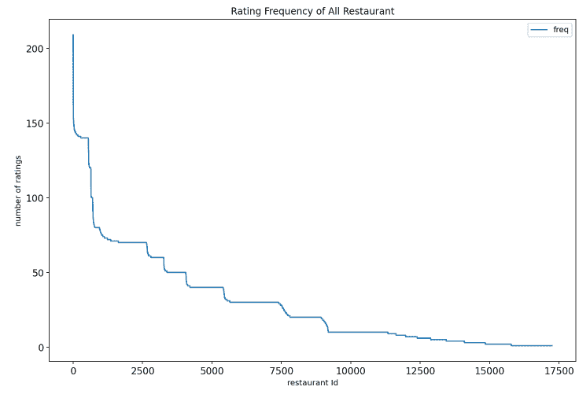
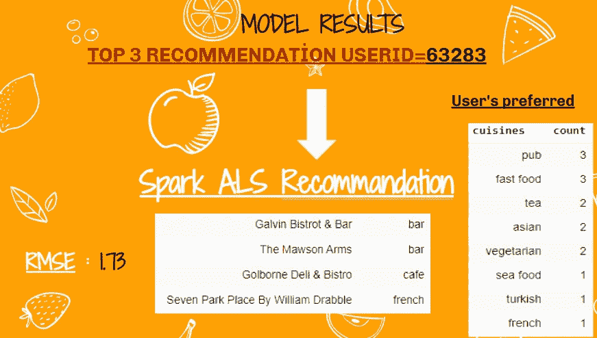
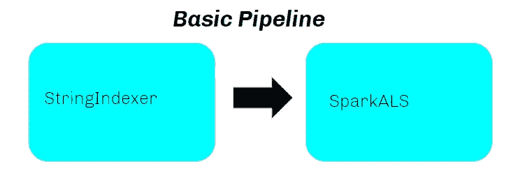
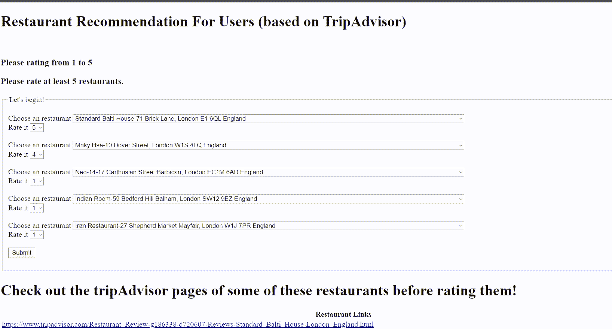

# 带火花的伦敦餐厅推荐

> 原文：<https://medium.com/analytics-vidhya/london-restaurant-reccomender-with-sparkals-f53b93d95dd7?source=collection_archive---------18----------------------->

[冰茶](https://unsplash.com/@magicetea?utm_source=medium&utm_medium=referral)在 [Unsplash](https://unsplash.com?utm_source=medium&utm_medium=referral) 上拍摄的照片

*我推荐你在看这篇文章之前先看一下我之前的文章***。我的数据集几乎是一样的，你只会看到一些新的栏目和新的餐馆。**

# ***我们来定义一下这个问题:***

*也许你正在考虑在伦敦吃一顿丰盛的晚餐？还是在找一个可以喝咖啡、享受咖啡的地方？也许你在找一个可以喝酒的地方？嗯，通过对你以前去过或去过的 5 家餐馆进行评级，提出 3 个新的建议怎么样？那么这篇文章是在召唤你。:)(当然，我强烈建议你电晕期间呆在家里，为了健康点。)*

# ***解决方案**:*

*用 ALS 构建基于协作的推荐系统。*

*我手上的数据是 tripAdvisor 上的伦敦餐厅数据。这一次，我既增加了我在以前的项目中使用的数据集，又添加了新的功能。*

**

# ***数据采集**:*

*我添加的新列是餐馆链接、餐馆类型和伦敦邮政编码数据。总之，对数据的一般看法如下。*

*我在推荐系统中搜集了我必须使用的餐馆的链接和类型。事实上，我也想看看我在误差指标之外做出的预测有多少适合用户的口味。*

*由于我也有餐馆的邮政编码，我认为这是一个浏览餐馆位置的好机会，所以我将它们包含在伦敦邮政编码数据中。*

**

*db 表示 MongoDB 中的表*

**

*餐厅类型*

*我提取了我所拥有的位置数据中的邮政编码，并将它们与这个数据集结合起来，以查看它们的位置。我看了一下这些地区的评级分布。*

**

*按地点划分的评级分布*

*5 级餐厅一般出现在离中心更远的地方，但一般只有一个地方是你看到的餐厅集中的地方。在进入推荐系统之前，我想再多检查一下数据。*

**

*我拥有的餐厅数量是 17249 家，评论数量是 508612 条，我收集的用户数量是 257735 条。在我的数据中，并不是所有的餐馆类型都会出现，也有超过 100 种餐馆类型。我将其减少到 25 种类型，并根据用户评论填充了空的餐馆类型。*

*一个餐馆至少可以有一种类型，而有些餐馆可能不止有一种类型。*

**

*我过滤餐馆以获得至少 10 个投票，过滤用户投票以获得至少 10 个餐馆以获得更好的模型结果。(我的数据稀疏度是%99，然后我设法将其降低到 99.74，这很好。)*

# ***推荐***

*基于协作的推荐系统有 3 个重要特征。用户、评级和餐馆名称。起初，我试图用 ML 调优找到最佳参数。*

*我将用于我的最佳模型的参数:*

*排名:200*

*马克西特:10*

*RegParam: 0.01*

*富豪榜:0.01*

*我在推荐系统中的 RMSE 分数是 1.73。嗯，还不错。然后我想给一个随机的用户提建议。*

**

*我觉得我们的思路是对的，因为我们在前两个选择中向一个喜欢泡吧的人推荐了一家酒吧。*

# ***造烧瓶 App***

*我在 flask 应用程序中使用管道来自动化工作流。*

**

*最后是我的项目！*

**

*我的烧瓶应用程序*

*这是[我在伊斯坦堡数据科学院的最后一个项目](https://github.com/aybukemeydan/Collaborative-Based-Recommender-for-London-Restaurants)。我要感谢 Zekeriya be irolu 的这次有益的培训。*

*祝大家新年快乐！*

*你可以在 [linkedin](https://www.linkedin.com/in/ayb%C3%BCke-meydan-330363162/) 和 [github](https://github.com/aybukemeydan) 上找到我。*