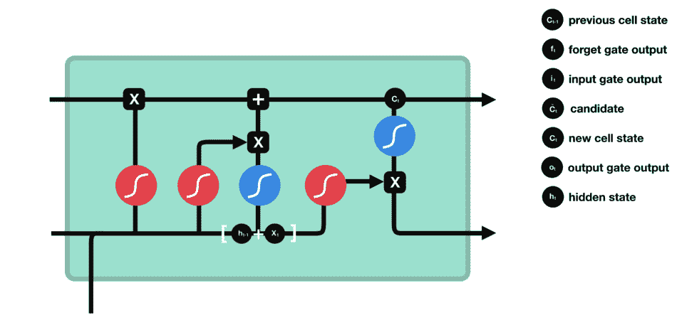

# 长短期记忆解码

> 原文：<https://medium.com/analytics-vidhya/long-short-term-memory-decoded-9041fe06235f?source=collection_archive---------14----------------------->

除非你一直生活在岩石下，否则你可能听说过人工智能以及它将如何在不久的将来接管世界。但是它到底能给我们的日常生活带来什么好处呢？

> 如果你对人工智能和机器学习不熟悉，可以看看我以前的文章，了解一些基本的背景知识:

 [## 机器学习初学者指南

### 塔里克·伊尔沙德

medium.co](/analytics-vidhya/a-beginners-guide-to-machine-learning-6f6ac495d8eb) 

【https://www.javatpoint.com/subsets-of-ai 

看上面 AI 分支的示意图，有一条路径是通过**机器学习**通向**深度学习**。在人工智能的一个子类中的这个子类中(是的，这两个子类是有意的)，有一个更具体的领域**长短期记忆(LSTM)** 。

LSTM 在 AI 中只占很小一部分。在我们到达那里之前，让我们看一看导致它的更广泛的人工智能子领域！

[https://blog . knol dus . com/data-processing-and-using-ml-supervised-class ification-algorithm-and-find-accuracy/](https://blog.knoldus.com/data-processing-and-using-ml-supervised-classification-algorithm-and-find-accuracy/)

1.  **机器学习**是人工智能的一个分支，它基于机器可以自己从输入的数据中学习的想法。然后，他们可以在最少的人工干预下，根据给定的数据识别模式并做出决策。简单地说，机器学习的目标是让机器在没有明确编程的情况下行动。
2.  **深度学习**是机器学习的一个分支，自学系统通过算法发现的模式，使用现有数据对新数据进行预测。这个过程是由模拟人脑神经元的人工神经网络完成的。看起来像是:

[https://towards data science . com/applied-deep-learning-part-1-artificial-neural-networks-d 7834 f 67 a4f 6](https://towardsdatascience.com/applied-deep-learning-part-1-artificial-neural-networks-d7834f67a4f6)

神经网络有三层:输入层、隐藏层和输出层。

1.  **输入层**将初始数据带入系统，供后续层处理。
2.  **隐藏层**是所有“深度学习”实际发生的地方，它隐藏在输入层和输出层之间。隐藏层通过对加权输入执行计算来产生净输入，然后应用非线性激活函数来产生最终输出。需要注意的是，为了让它成为深度学习，必须有一个以上的隐藏层。
3.  **输出层**简单地产生给定输入的结果。

然而，当试图使用传统的神经网络时，你可能会遇到一个关键问题:它们不能使用从以前的试验中获得的信息来帮助通知他们未来的决策。因此，传统的神经网络不能处理**序列数据**。

这就是为什么我们有**循环神经网络**！

# 递归神经网络

rnn 是一种深度学习，包含**循环**，允许之前的信息持续存在——就像在人脑中一样。

[https://colah.github.io/posts/2015-08-Understanding-LSTMs/](https://colah.github.io/posts/2015-08-Understanding-LSTMs/)

左图显示了一个 RNN，其中**隐藏状态(A)** 接受**输入(xt)** 并产生一个**输出值(ht)** 。RNN 和传统神经网络之间的区别在于附加到隐藏状态的回路。

仅从这个图中可能很难理解循环的概念，所以让我们**展开**循环:

添加回路简单地将一个**前馈神经网络**转变为一系列神经网络，这些神经网络都能够从先前的神经网络中获取信息。本质上，从一个神经网络的隐藏状态收集的信息被向前传递到下一个神经网络，使其能够在确定其应该产生的**输出值**时使用该信息。

[https://towards data science . com/illustrated-guide-to-recurrent-neural-networks-79 E5 EB 8049 c 9](https://towardsdatascience.com/illustrated-guide-to-recurrent-neural-networks-79e5eb8049c9)

看待 RNN 的另一种方式是把这个回路想象成一条路，允许信息从一个隐藏状态流向下一个隐藏状态。这显示在左图中，其中移动的蓝色圆圈是先验信息。

如前所述，rnn 由于其循环性，在处理顺序数据时非常有用。正因为如此，有各种各样有用的 RNN 应用，从语言建模到 T2 图像字幕。如果你想了解更多关于使用 RNNs 的知识，请访问 Andrej Kaparthy 的博客文章:

 [## 递归神经网络的不合理有效性

### 递归神经网络(rnn)有一些神奇的东西。我仍然记得当我训练我的第一个循环…

karpathy.github.io](http://karpathy.github.io/2015/05/21/rnn-effectiveness/) 

然而，rnn 也不是完美的。他们也面临一个重大问题:**短期记忆**。这意味着来自早期神经网络的信息不会持久，也不能被更晚的神经网络使用。这是由于**消失梯度问题**。

## 反向传播和消失梯度问题

为了理解消失梯度问题，你必须首先理解**反向传播**，用于训练 RNNs 的算法。反向传播是**监督学习**的一个例子，其中 RNN 将预测已经**标记的数据点**的输出。损失函数然后将预测与正确的输出进行比较，并输出误差值。最后，RNN 使用误差值进行反向传播——计算 RNN 中每个节点的**梯度**。

梯度是允许 RNNs 通过调整其**内部权重**来学习的值。渐变**在反向传播时收缩**，因为渐变相对于前一个节点的渐变计算其值。如果之前的梯度很小，那么现在的梯度会更小。这使得对内部权重的调整更小，这意味着随着反向传播的发生，节点将学习得越来越少，并且最早的节点将由于梯度消失而几乎不学习。

消失的梯度导致 RNNs 无法处理**长期依赖**。下面的例子证明了为什么这是一个问题:

> *比方说，我们想预测文本中的最后一个单词:“我在法国长大……我说一口流利的法语**。”由于最近的先验信息，RNN 人会意识到这个单词是一种语言，但是是什么语言呢？RNN 需要更多的上下文来把法国和这个词联系起来。*

谢天谢地，**长短期记忆**没有这个问题！

# 长短期记忆(LSTM)

LSTM 网络(lstm)是一种特殊类型的 RNNs，通过操纵其记忆状态来减轻消失梯度问题。他们这样做的能力在于他们的**架构**。

重新检查 RNNs，单个**单元**的架构如下所示:

**前一隐藏状态(ht-1)** 与**输入(xt)** 结合形成**向量[(ht-1)+(xt)]** 。向量包含关于先前输入和当前输入的信息。然后向量被一个**双曲正切函数**激活(产生一个从-1 到 1 的值)以形成**新的隐藏状态(ht)** 。新的隐藏状态然后移动到下一个单元格以完成相同的过程。

相比之下，LSTMs 的架构要复杂得多:

## 核心概念

什么使得 LSTMs 绕过短期记忆被称为**细胞状态**。这是图顶部穿过整个单元格的**水平线**。它可以被认为是沿着整个链条直接传输相关信息的高速公路。这意味着来自第一个单元的信息可以一直到达链的末端。

LSTMs 能够添加或删除单元状态。这种操作通过**门**进行并受其调节:神经网络决定哪些信息应该关于细胞状态。门由一个 **sigmoid 函数层**和一个**逐点乘法层**组成。

sigmoid 函数层产生一个从 0 到 1 的数字，该数字描述每种成分应该通过的量。值 0 对应于不允许任何东西通过，而值 1 对应于允许任何东西通过。

LSTM 中的单个单元包含三种类型的门:**遗忘门**、**输入门**和**输出门**。

## 忘记大门

回到 LSTM 的架构，遗忘门是第一步，因为它决定了来自**先前单元状态(Ct-1)** 的什么信息将被丢弃或保留。**先前隐藏状态(ht-1)** 与**输入(xt)** 结合形成**向量[(ht-1)+(xt)]** 。然后，它通过 sigmoid 函数层，再次为前一个单元状态中的每个数字生成一个介于 0 和 1 之间的值，0 表示要丢弃，1 表示要保留。下面，该过程总结为一个等式:

> ft = sigmoid(Wf * [ht-1，xt] + bf)

## 输入门

然后向量进入下一步:输入门。输入门决定哪些新信息将存储在单元状态中。这个过程有两个步骤。首先，向量通过 sigmoid 函数层来确定哪些值将使用上述过程进行更新。接下来，向量通过一个双曲正切函数，使值的范围从-1 到 1，创建一个**候选向量(C̃t)** 。最后，sigmoid 函数输出与双曲正切函数输出相乘，其中 sigmoid 函数输出决定双曲正切函数输出保留哪些值。下面，该过程总结为两个等式:

> it = sigmoid(Wi * [ht-1，xt] + bi)
> 
> C̃t = tanh(Wc * [ht-1，xt] +bC)

## 细胞状态

现在有足够的信息将旧的单元状态更新为**新的单元状态(Ct)** 。我们首先将旧的单元状态乘以**遗忘门输出(ft)** ，它会遗忘我们之前认为不重要的信息。然后，我们将**输入门输出(it)** 乘以候选值，根据我们之前决定更新的程度来缩放这些值。最后，我们将缩放后的候选值与更新后的单元状态相加，得到新的单元状态。下面，该过程总结为一个等式:

> Ct = ft * Ct-1 + it * C̃t

## 输出门

最后，我们需要决定下一个隐藏层。首先，向量通过 sigmoid 函数层，以确定应该输出哪个更新的单元状态值。结果是**输出门输出【ot】**。然后，我们通过压缩-1 和 1 之间的值的 tanh 函数传递单元格状态。最后，我们将这两个输出相乘来确定**最终输出**和下一个隐藏层。下面，该过程总结为两个等式:

> ot = sigmoid(Wo * [ht-1，xt] +bo)
> 
> ht = ot * tanh(Ct)

总之，LSTM 使用门从单元状态的存储器中过滤出不重要的信息，这样相关的信息就可以通过 LSTM 的单元链传递。

现在我们知道了什么是 LSTMs 以及它们是如何工作的，让我们来看看它们的一些应用！

# 应用程序

LSTM 在现实世界中有无数的应用，从手写识别到机器人控制。其两个主要应用是**语音识别**和**时间序列预测**。

## 1.语音识别

你有没有想过，你的电脑怎么有能力把你的话翻译成文本，或者 Siri 怎么能听懂你在说什么？嗯，这部分要归功于 LSTMs。

为了识别和处理人类的声音，机器使用了一种叫做自动语音识别(ASR)的过程。ARS 的图表如下所示:

[https://towards data science . com/hello-world-in-speech-recognition-B2 f 43 b 6 c 5871](https://towardsdatascience.com/hello-world-in-speech-recognition-b2f43b6c5871)

在**卷积神经网络(CNN)** 层从频谱图向量输入中提取特征并创建特征向量之后，LSTM 层需要处理这些特征向量并向**全连接层**提供输出。

由于 LSTM 的能力，它能够**分析**语音识别机器的输出，并确定所识别的单词在其上下文中是否有意义。这有助于语音识别机器创建正确的句子。

## 2.时间序列预测

一个**时间序列**就是一系列按时间顺序排列的数据点。在时间序列中，时间是**自变量**。时间序列的一个突出例子是**股价图**，如下所示:

[https://www . investopedia . com/ask/answers/081314/whats-most-friendly-stock-all-time . ASP](https://www.investopedia.com/ask/answers/081314/whats-most-expensive-stock-all-time.asp)

由于图表显示了 *BRK/A* 的股票价格在一段设定的时间内是如何变化的，所以它是一个时间序列。

LSTMs 能够**预测**因变量，在这种情况下，股票价格，随着时间的推移将如何变化。

由于我们之前讨论过的 LSTM 体系结构，lstm 能够在已经给出的一系列数据点中寻找**模式**。它能够使用从时间序列最开始发现的模式来预测股票价格的变化。这就是它如此有效的原因。如果您有兴趣深入了解构建时间序列预测器背后的理论和编码，请查看 Marco Peixeiro 的文章:

 [## 时间序列分析和预测完全指南

### 理解移动平均线，指数平滑，平稳性，自相关，SARIMA，并应用这些技术在…

towardsdatascience.com](https://towardsdatascience.com/the-complete-guide-to-time-series-analysis-and-forecasting-70d476bfe775) 

## 奖金:预测棒球标志

对于像我一样的棒球迷来说，你可能知道当跑垒员在垒道上时，三垒教练会给他们是否偷球的信号。随着最近关于太空人通过摄像机偷取标志的新闻，我们现在可以看到偷取标志能给对方球队带来多大的优势。

但是仅仅记录和回顾这些迹象是不够的。为了理解这些符号，你必须**破译**哪些信号对应什么，同时忽略虚张声势。

幸运的是，对于任何有抱负的偷牌者来说，马克·罗伯(Mark Rober)和贾布里勒(Jabrils)一起，两个 YouTubers 和工程师，创建了一个**机器学习应用**，当给定教练信号的输入时，它使用 **LSTMs** 来确定偷牌的迹象，以及球员是否在多次比赛中偷牌。

如果你想深入了解他们的项目，他们制作的视频链接如下:

感谢您花时间阅读我关于 LSTMs 的文章。我希望你喜欢它，并学到了新的东西！如果你想做一些自己的研究，我建议你去看看这些网站(我也把它们作为资料来源):

 [## 用于大词汇量连续语音识别的深度 LSTM

### 递归神经网络，特别是长短期记忆(LSTM)神经网络，是序列学习的有效网络

arxiv.org](https://arxiv.org/abs/1703.07090)  [## 了解 LSTM 网络

### 2015 年 8 月 27 日发布人类不是每秒钟都从零开始思考。当你读这篇文章时，你…

colah.github.io](https://colah.github.io/posts/2015-08-Understanding-LSTMs/)  [## 用于语音识别的深度神经网络的性能评估:RNN、LSTM 和 GRU

### 摘要深层神经网络(DNN)只不过是具有许多隐藏层的神经网络。dnn 正在变得流行…

content.sciendo.com](https://content.sciendo.com/view/journals/jaiscr/9/4/article-p235.xml)  [## LSTMs 初学者指南。

### 在这个博客中，你将了解什么是 LSTM，为什么我们需要它，以及 LSTM 的内部建筑概况。

medium.com](/analytics-vidhya/guide-to-lstms-for-beginners-ac9d1fc86176)  [## LSTM 和 GRU 的图解指南:一步一步的解释

### 嗨，欢迎来到长短期记忆(LSTM)和门控循环单位(GRU)的图解指南。我是迈克尔…

towardsdatascience.com](https://towardsdatascience.com/illustrated-guide-to-lstms-and-gru-s-a-step-by-step-explanation-44e9eb85bf21)  [## 递归神经网络图解指南

### 理解直觉

towardsdatascience.com](https://towardsdatascience.com/illustrated-guide-to-recurrent-neural-networks-79e5eb8049c9)  [## 这是深度学习时代:数据的新前沿

### 图像、音乐、情感等等

towardsdatascience.com](https://towardsdatascience.com/its-deep-learning-times-a-new-frontier-of-data-a1e9ef9fe9a8)  [## 利用 LSTMs 预测时间序列

### 有几种时间序列预测技术，如自回归(AR)模型、移动平均(MA)模型…

towardsdatascience.com](https://towardsdatascience.com/using-lstms-to-forecast-time-series-4ab688386b1f)  [## 什么是深度学习 AI？包含 8 个实例的简单指南

### 人工智能、机器学习和深度学习是当今最热门的词汇。本指南…

www.forbes.com](https://www.forbes.com/sites/bernardmarr/2018/10/01/what-is-deep-learning-ai-a-simple-guide-with-8-practical-examples/#43ab7c578d4b)  [## 人工智能

### AI 是什么？这是对建造能够推理、学习和智能行动的机器的追求，而这才刚刚开始。我们…

www.technologyreview.com](https://www.technologyreview.com/artificial-intelligence/)