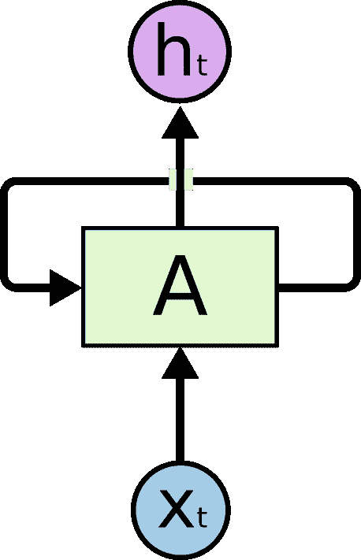
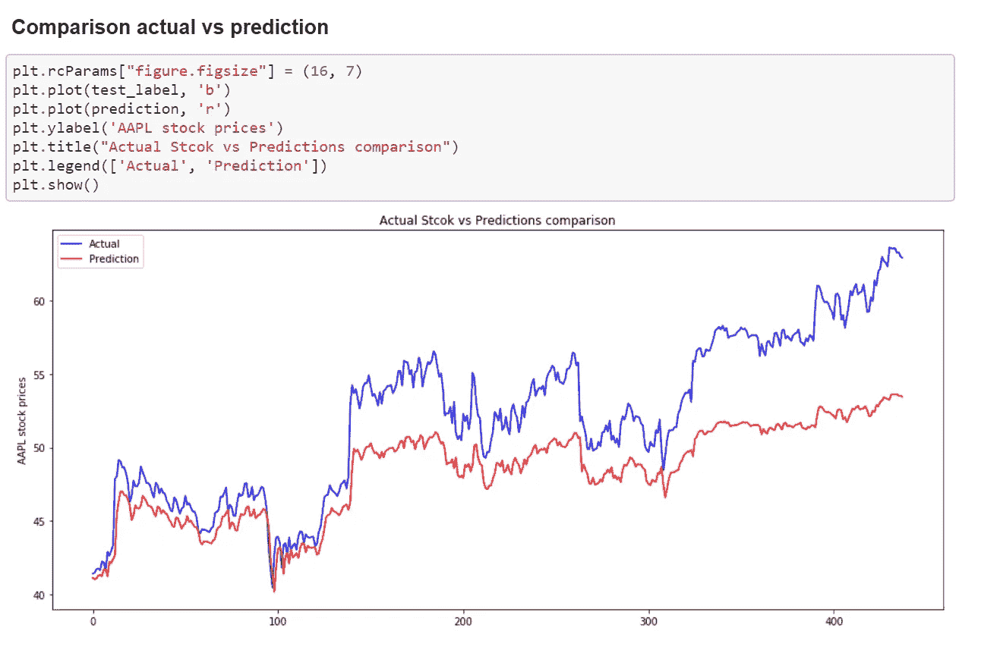

# 张量流中的长短期记忆网络(LSTM)

> 原文：<https://medium.com/analytics-vidhya/long-short-term-memory-networks-lstm-in-tensorflow-e986dac5cf27?source=collection_archive---------7----------------------->

这篇文章试图为理解 RNN 和 LSTM 提供一些直觉。本文还尝试使用 TensorFlow 框架将长短期记忆网络应用于 python 中的股票价格预测。

由[蒂姆·高](https://unsplash.com/@punttim?utm_source=medium&utm_medium=referral)在 [Unsplash](https://unsplash.com?utm_source=medium&utm_medium=referral) 上拍摄的照片

当前神经网络是一类神经网络，特别适用于输出数据严重依赖于过去的输入序列的情况，或者简单地说，RNN 被设计用于处理顺序/有序数据。因此，它们在时间序列预测，文本生成，序列学习和语音到文本理解中的应用，其中你的输出/决策不仅取决于时间' t '的当前输入，还取决于时间' t-n '的先前输入。

*在前馈神经网络中，数据通过一系列层向前传递，其中每一层都是特征的表示。当我们前进到下一层时，每一层都变成了特征的组合。当我们移动时，这些表示被丢弃。然而，对于 RNN，它不仅考虑来自当前时间步的输入，而且考虑来自先前层的输出被一起传递，这负责 RNN 的记忆状态。*

***下面是 RNN 单元格*** 的表示

来源:[https://colah.github.io/posts/2015-08-Understanding-LSTMs/](https://colah.github.io/posts/2015-08-Understanding-LSTMs/)

*尽管与前馈网络相比，RNN 可以更好地处理序列数据，但它们会遇到消失梯度或爆炸梯度问题。然而，为了克服这些问题，引入了 LSTM，它是 RNN 的变体。为了更深入地了解，我建议阅读 T21 的这篇博客。*

***什么是长短期记忆网络？***

长短期记忆(LSTM)网络是递归神经网络的一种变体，旨在记忆非常长的数据序列。在高层次上，LSTM 网络有三个门，一个用于处理当前输入的“输入”门，一个用于在每个时间步产生预测的“输出”门，还有一个用于丢弃信息的“忘记”门。我推荐阅读 [Colah 的博客](https://colah.github.io/posts/2015-08-Understanding-LSTMs/)来了解完整的机制和变化。

https://colah.github.io/posts/2015-08-Understanding-LSTMs/

**数据集**

数据可以在 [Kaggle](https://www.kaggle.com/dgawlik/nyse) 上找到。该数据集包含各种股票报价机大约 5 年的历史股价。然而，我选择[微软](https://finance.yahoo.com/quote/MSFT/) ticker 进行这个模型构建活动。

**导入依赖关系**

**读取数据集**

现在读取数据集并执行数据探索和预处理。

**标准化和分割数据**

规范化数据有助于算法收敛。我用过 sklearn 的 MinMaxScaler 方法。将数据分成训练集和测试集，以 3:1 的比例构建模型。此外，我们正在创建新的功能，即一个时间滞后(t-1)变量，作为我们的功能工程的一部分。因为股票价格取决于最后一天的收盘价。

**模型构建**

我们使用 tensorflow 的 Keras 建立我们的 LSTM 模型，然后像下面这样训练它。然而，在转换到 LSTM 模型之前，我们需要对输入数据集进行整形。我们使用 Adam 作为优化器，使用均方差作为模型验证指标。为了超参数化学习率，我们可以使用 keras 回调 API 的 ReduceLROnPlateau 和 ModelCheckpoint 在迭代期间保存最佳模型。

**模型训练 vs 验证损失比较**

在对这些参数进行 70 个时期的训练后，训练损失为 2.68，验证数据集损失为 19.74。

**结论**

从下面的**实际与预测股价对比**中我们可以看到，我们的模型与实际股价趋势预测非常接近。然而，LSTMs 强大的是用于分析时间序列和序列数据，还有其他传统的算法，如 ARIMA，移动平均，facebook 的 fbprophet 等来处理时间序列数据。源代码是我的 [githubrepo](https://github.com/nayaksu7/StockPrediction_Tensorflow) 供进一步参考和评论。

