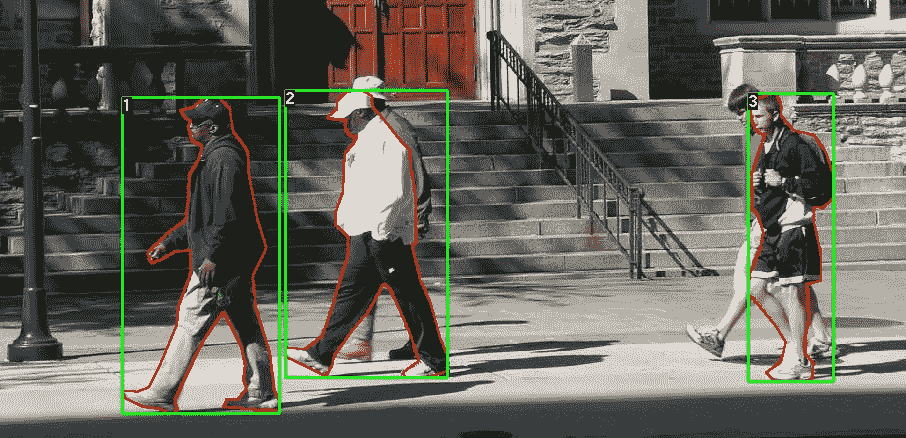
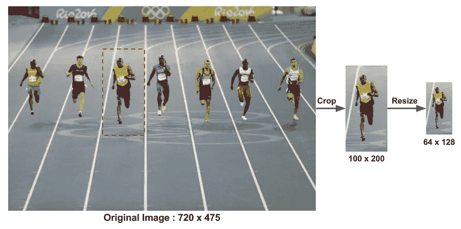

# 通过检测行人进行长时间跟踪

> 原文：<https://medium.com/analytics-vidhya/long-time-tracking-by-detecting-pedestrians-e8a0123941c8?source=collection_archive---------22----------------------->

使用哈尔级联的全身检测是一种基于机器学习的方法，其中用一组输入数据训练级联函数。OpenCV 已经包含了许多预先训练好的人脸、眼睛、微笑等分类器..今天我们将使用全身分类器。

OpenCV 附带了一个预训练的 HOG 描述符+线性 SVM 模型，可用于在图像和视频流中执行行人检测。OpenCV 实现了一种非常快速的人体检测方法，称为 HOG(梯度方向直方图)。这种方法被训练来检测行人，行人是大部分站着的人，并且完全可见。

# 阶段-

1.  **从 HOG 描述符检测**
2.  **长时间跟踪**



行人检测

# 1)什么是特征描述符？

特征描述符是图像或图像补片的表示，它通过提取有用信息和丢弃无关信息来简化图像。通常，特征描述符将大小为宽 x 高 x 3(通道)的图像转换为长度为 n 的特征向量/数组。在 HOG 特征描述符的情况下，输入图像的大小为 64 x 128 x 3，输出特征向量的长度为 3780。



**预处理**

**猪人检测器**

目前最流行和最成功的“人探测器”之一是 SVM 方法。HOG 代表方向梯度直方图。HOG 是一种“特征描述符”。特征描述符的目的是以这样一种方式概括对象，当在不同条件下观察时，相同的对象(在这种情况下是人)产生尽可能接近相同的特征描述符。这使得分类任务更加容易。

这种方法的创造者训练了一种支持向量机(一种用于分类的机器学习算法)，或“SVM”，以识别人的 HOG 描述符。

其中一个主要原因是，它使用“全局”特征来描述一个人，而不是“局部”特征的集合。这意味着整个人由单个特征向量来表示，而不是由许多特征向量来表示人的较小部分。

猪人检测器使用滑动检测窗口，该窗口在图像周围移动。在检测器窗口的每个位置，为检测窗口计算 HOG 描述符。这个描述符然后被馈送给经过训练的 SVM，后者将其分类为“人”或“不是人”。

为了识别不同尺度的人，图像被二次抽样成多种尺寸。搜索这些二次抽样图像中的每一个。

# 2)长时间跟踪

一旦检测到人，模型就能够在整个身体周围制作边界框，并开始跟踪时间。如果此人退出画面，用于跟踪实时时间的时钟将停止，该时间将保存在数据库中。

类似地，在检测到行人中的每个人之后，与每个人相关联的时间与他们的 id 一起被保存。

当时钟达到已经设定的阈值后，管理员的屏幕上会出现一个“警报”信号。

***在 Python 中实现-***

## S tep-1:导入必要的库(NumPy 和 OpenCV)。

```
import numpy as np
import cv2
import imutils
import datetime
```

## 第二步:相机打开。

```
body_classifier = cv2.CascadeClassifier(‘haarcascade_fullbody.xml’)
cap = cv2.VideoCapture(0)ds_factor=0.6# Loop once video is successfully loaded
while cap.isOpened():# Reading the each frame of the video 
 ret, frame = cap.read()# here we are resizing the frame, to half of its size, we are doing to speed up the classification
 # as larger images have lot more windows to slide over, so in overall we reducing the resolution
#of video by half that’s what 0.5 indicate, and we are also using quicker interpolation method that is #interlinear
```

## 步骤 3:一旦在视频流中检测到身体，时钟定时器启动，并在检测到的身体退出帧时停止。如果时间计数器达到已经设定的阈值,“报警”信号表示。

```
 frame=cv2.resize(frame,None,fx=ds_factor,fy=ds_factor,interpolation=cv2.INTER_AREA)
 gray=cv2.cvtColor(frame,cv2.COLOR_BGR2GRAY)
 # Pass frame to our body classifier
 bodies = body_classifier.detectMultiScale(gray, 1.2, 3)

 b=np.array(bodies)
 print(b)# Extract bounding boxes for any bodies identified
 for (x,y,w,h) in bodies:
 cv2.rectangle(frame, (x, y), (x+w, y+h), (0, 255, 255), 2)
 cv2.imshow(‘Pedestrians’, frame)

 if len(bodies)>0:
 body_exist=True

 key = cv2.waitKey(1) & 0xFF

if body_exist:
 cv2.putText(frame, datetime.datetime.now().strftime(“%A %d %B %Y %I:%M:%S%p”),
 (10, frame.shape[0] — 10), cv2.FONT_HERSHEY_SIMPLEX, 0.35, (0, 0, 255), 1)

else:
 print(NO_BODY_DETECTION)

cap.release()
cv2.destroyAllWindows()
```

**现实生活中的应用:**

长时间跟踪可用于安全和监视领域(ATM 室、超市等内部)。

下节课再见！

谢谢你，

阿努什卡