# 三思而后行——了解探索数据的方式和原因对于建模的成功至关重要

> 原文：<https://medium.com/analytics-vidhya/look-before-you-leap-know-how-and-why-exploring-data-might-be-crucial-for-your-sucess-in-modeling-1749be3a2fe1?source=collection_archive---------16----------------------->

> “让你陷入麻烦的不是你不知道的事情。
> 
> *你肯定知道的事情并不是这样的”*
> 
> *—马克·吐温*

倾向于相信我们认为是事实的东西，并据此采取行动，可能会大错特错，尤其是当我们的信念不仅是观点，而且是错误的时候。

解决复杂的业务问题需要彻底理解数据，这种深入的分析需要的不仅仅是基本的技术。

建模过程可以大致分为 5 个主要阶段。尽管特征工程、超参数调整、算法选择是一些需要处理的固有概念，但探索性数据分析阶段需要分析师投入大量时间和精力。

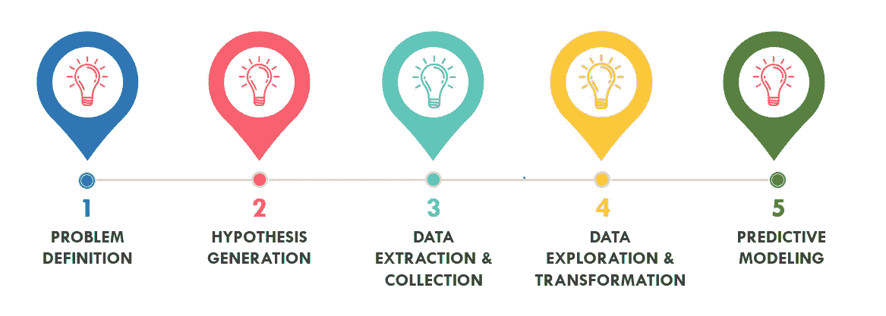

> 您知道收集数据集、清理和组织数据几乎占数据科学家工作的 80%吗？*来源-[https://www . Forbes . com/sites/Gil press/2016/03/23/data-preparation-most-time-consumption-least-enjoy-data-science-task-survey-says/# 46ac 962 f 6 f 63](https://www.forbes.com/sites/gilpress/2016/03/23/data-preparation-most-time-consuming-least-enjoyable-data-science-task-survey-says/#46ac962f6f63)

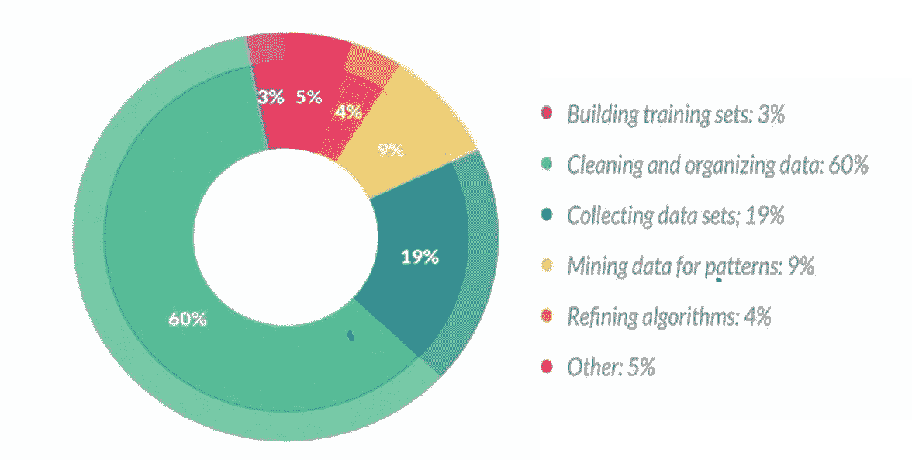

从数据中推断潜在模式是任何建模活动或任何分析的基础。当务之急是从数据信号中识别并分离出噪声。

在本文中，我们将通过 EDA(探索性数据分析)来了解应用的策略。

探索性数据分析是一组操作或分析，执行这些操作或分析是为了熟悉数据，并确保数据处于预期的形状和形式，以便进一步处理以供使用。

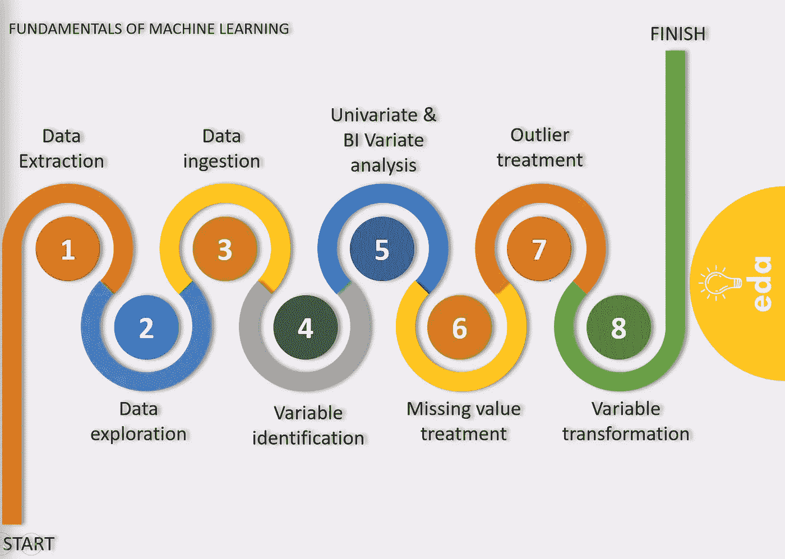

**数据提取:**

一旦我们分析了商业案例并起草了所有可能的假设，是时候收集数据来批准或拒绝假设了。

数据的来源可能是多种多样的，因此在数据提取阶段，我们将利用相关系统来收集必要的信息。在这个过程中，我们可能会提出一些新的假设，这些假设需要被添加到我们正在考虑的假设列表中。

**数据探索:**

深入了解要分析的数据有助于高效、准确地建模。数据的清晰性使分析师能够决定采用何种技术来调整数据以适应业务需求。

以下是数据探索过程中的步骤-

*在我们深入研究流程之前，让我们快速浏览一下评估的指标-*

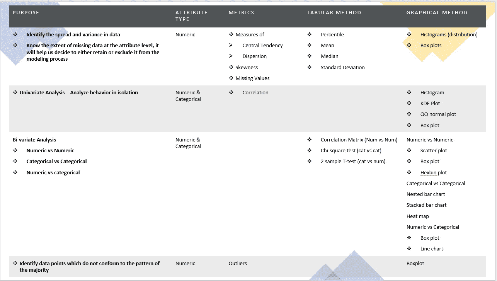

为了便于解释，我们将使用来自[Mobility Analytics](https://datahack.analyticsvidhya.com/contest/janatahack-mobility-analytics/)—Analytics vid hya Hackathon 的数据集。

首先，让我们熟悉这些数据。

业务环境——一个出租车聚集服务在多个城市运营。他们的运营模式是与当地的汽车服务供应商合作，提供最合适的选择，考虑客户的人口统计数据。他们已经参与了大约一年，并从供应商那里收集了足够多的关于 surge_pricing_type 的数据。

> 问题陈述-预测 surge_pricing_type 以便帮助出租车服务提供商及时有效地安排合适的出租车(考虑人口统计)。

快速查看属性及其上下文

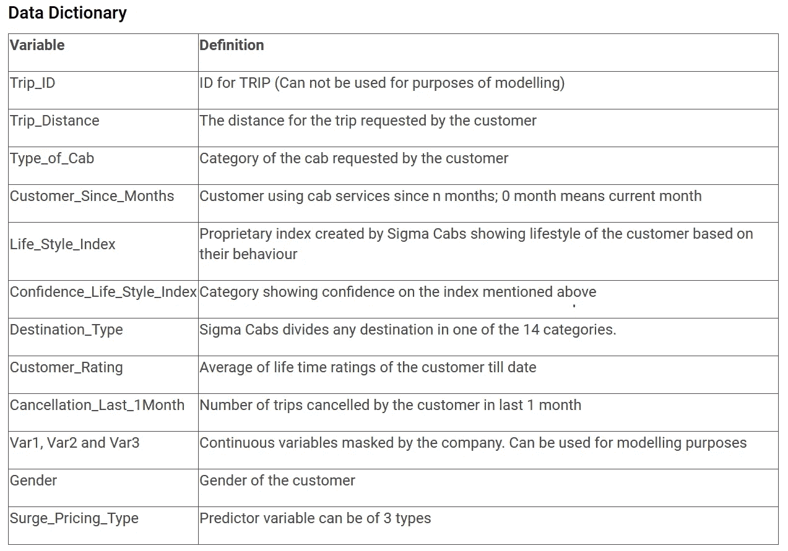

> 注意:我将使用 dataprep 包来更好地表示我们想要分析的变量。Dataprep 允许您使用一个只有几行代码的库来准备数据。详见 https://pypi.org/project/dataprep/的[。](https://pypi.org/project/dataprep/)

**步骤 1-变量类型识别**-原始数据可以由数字/字符串组成，也可以是两者的混合。然而，模型的输入应该总是数字，因此我们需要预处理数据，使其适合模型学习。

以下视频将帮助您——

a)了解每个属性中缺失值的百分比

b)识别属性类型

c)可视化属性中数据点的分布

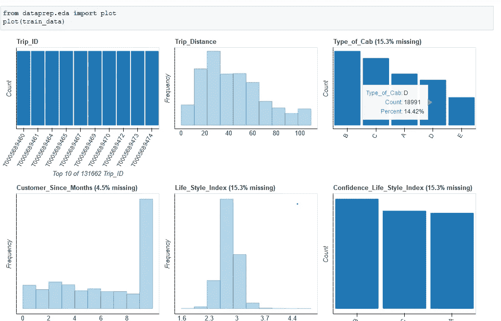

*以较暗阴影突出显示的图表为分类图表，其余为数字图表*

此外，所描述方法可以用于填充集中趋势和分散度量的测量

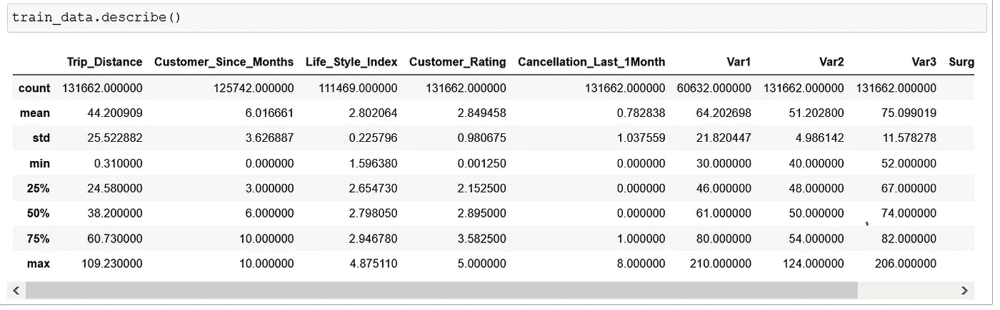

**步骤 2** - **单变量分析**-单独评估属性的重要性

让我们发现旅行距离。下图显示了数据点的分布

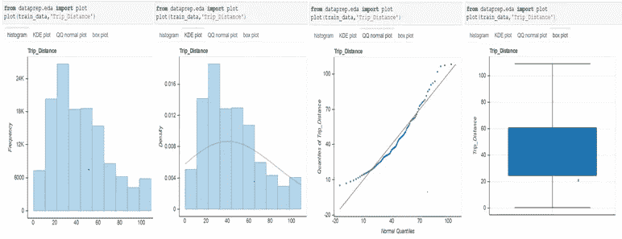

**步骤 3——双变量分析**——属性的排列组合，以探索潜在的模式或行为。这可以在三个层面上实现——

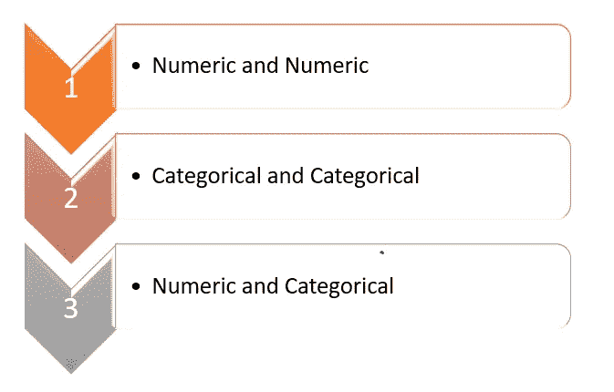

例如，让我们将 Trip_Distance 和 Customer_Rating 作为一个组合来研究。

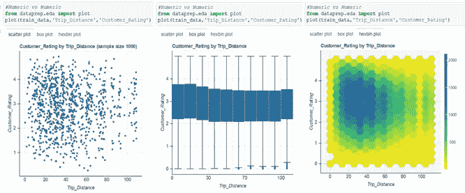

**分类&分类**

如果你从性别的角度分析目的地类型，会不会有一些有趣的模式？

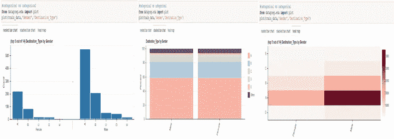

**数字&分类**—cancel _ Last _ 1 month 与 Destination_type 有关系吗？让我们找出答案。

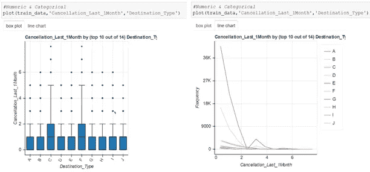

**步骤 4 -缺失值处理**

没有缺失记录的属性是不可能的。每个属性中有足够的数据确实会影响模型的有效性，因此我们必须知道数据缺失的程度，并决定是保留还是估算。

出现这种情况的原因取决于数据的性质。例如:在某些情况下，收集关于性别、工资、宗教的数据可能是一个挑战。否则，受试者可能会以隐私问题为由拒绝透露某些细节(在调查期间)

您知道吗——即使是缺失的数据也能揭示数据中的某种模式。

**缺失数据的类型—**

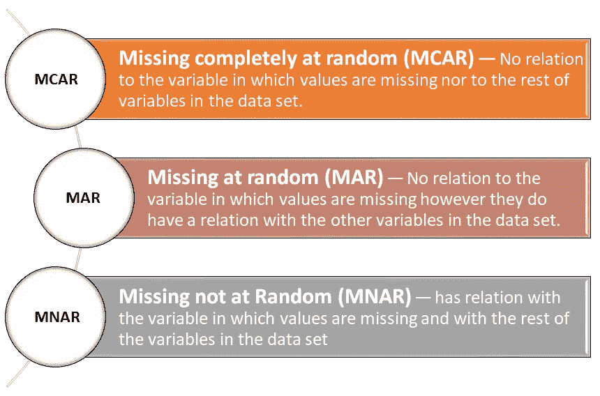

**确定每个属性中缺失的值—**

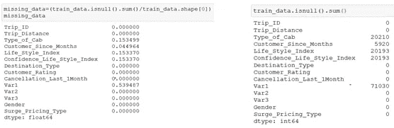

**处理缺失数据的策略—**

a)从数据集中删除空值—识别并删除具有空值的行或列。dropna()函数可以用来删除所有行和列中的空值。此外，您可以利用 dropna()函数中可用的“any”或“all”参数来修剪数据，以满足您的需要。

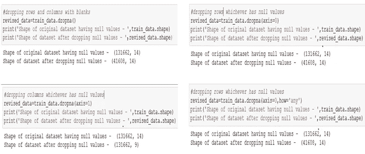

> 注:删除记录(按行或按列)会导致信息丢失，这些信息可能很重要，因此建议在删除前尝试插补技术

**插补技术—**

**A)** **均值或中值插补** —以下示例使用“Var1”属性中其余值的平均值来插补缺失值。也可以使用中间值进行类似的插补。

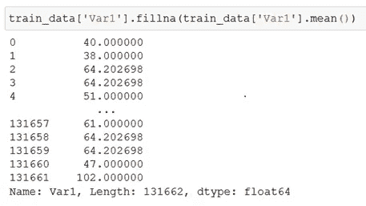

**B)简单插补器**—sk learn 的另一种最常用的插补技术。均值或中值可用于连续变量，而“最频繁”或“常数”可用于分类变量。详情请参考 sklearn 文档。

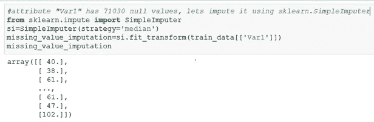

您可能还想探索以下两种基于回归模型的插补技术

**C) KNN 估算器**

**D)迭代估算器**

**第 5 步-异常值处理-** 任何明显或不符合多数模式的数据点都被视为异常值。

**什么原因导致离群值？**

a)数据输入错误——例如:在薪酬数字上增加一个额外的“0”确实会导致相当大的

b)测量误差——例如:以米为单位填充的高度属性(理想的测量尺度——英尺)中的一些数据点

c)处理错误-未从源文件中准确读取文件的实例。例如:字母数字或文本消息

**离群值的类型？**

a)单变量异常值

b)双变量异常值

**如何识别离群值？**

a)单变量异常值—箱线图

b)双变量异常值—散点图

**公式—**

*<Q1–1.5 * IQR 或> Q3 + 1.5* IQR*

*其中 IQR = Q3 — Q1*

*Q3 =第三个四分位数的值*

*Q1 =第二个四分位数的值*

处理异常值的不同方法？

a)排除-从数据集中删除观察值

b)转换和宁滨异常值-采用诸如对数、平方根、立方根转换的技术来转换数据

c)估算异常值——将它们视为缺失值，并使用上一节中讨论的估算技术进行估算

d)孤立地对待它们——将它们视为一组独立的数据。与另一组数据相比，尝试对其应用不同的算法和技术。稍后，您可以将其加入数据集的主要部分。

**变量转换-**

**使用转换的主要原因-**

a)改变变量的标度确保测量属性标度的一致性。例如:以千克、克和磅记录的重量。

b)将非线性关系转换成线性关系——与非线性关系相比，更容易理解线性关系

d)只要有偏斜分布就创建对称分布——更容易解释和生成推论。也便于正态分布。

**可用技术-**

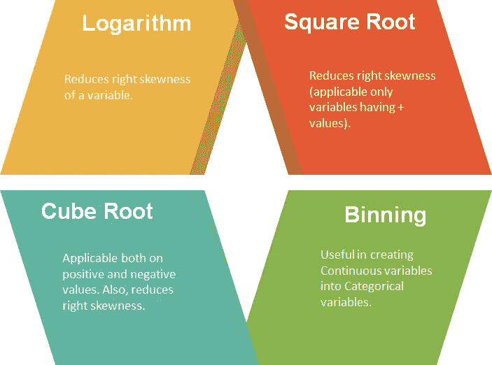

除了上面提到的技术，你可能想尝试“熊猫轮廓”。分析报告的输出包含大多数关键信息，如相关矩阵、缺失值信息、交互等。在单帧中。其调查结果详尽而恰当。

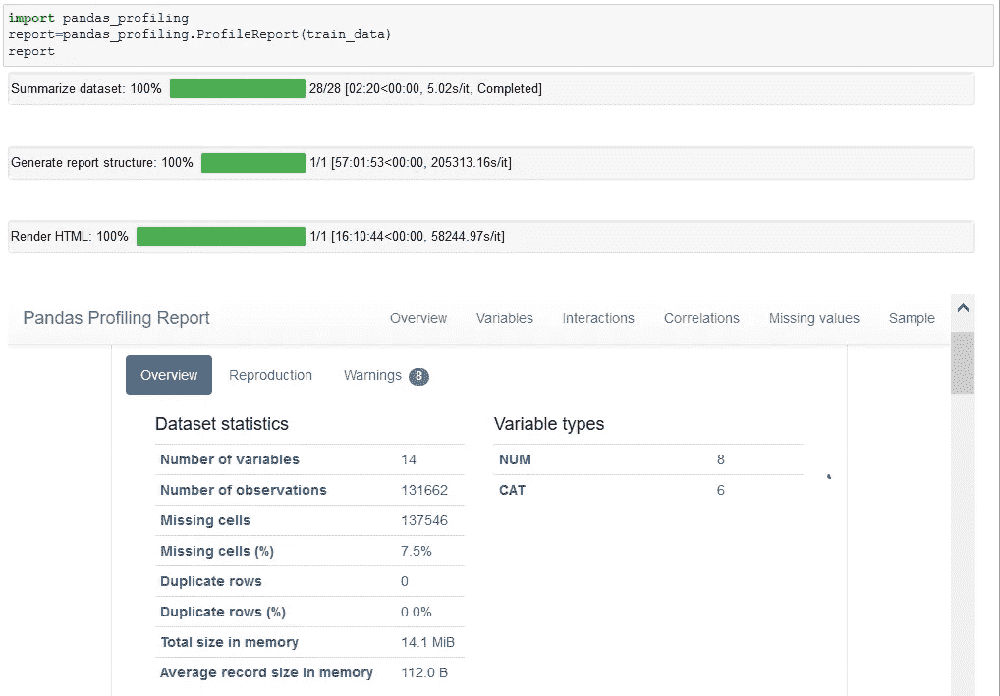

本文中提到的概念和技术肯定会让您开始发现数据。然而，有可能深入研究，例如:识别异常值是一个复杂的过程和箱线图或 IQR 公式。