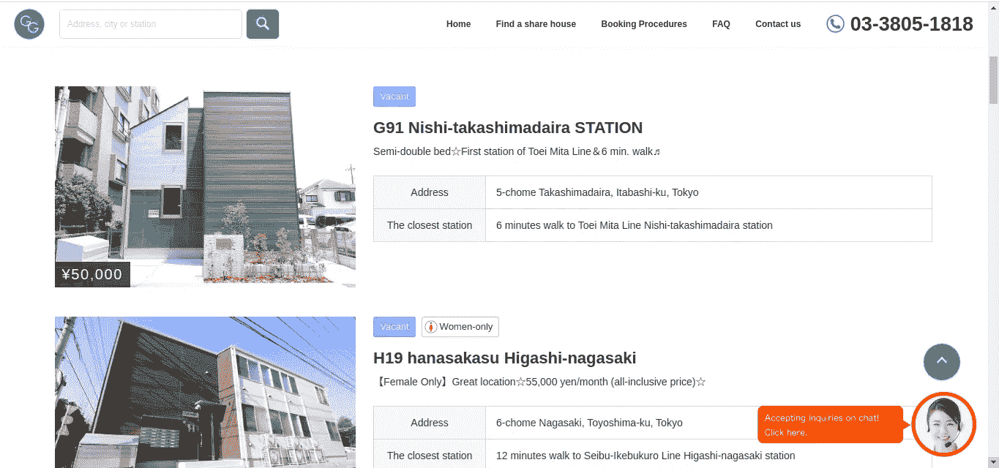
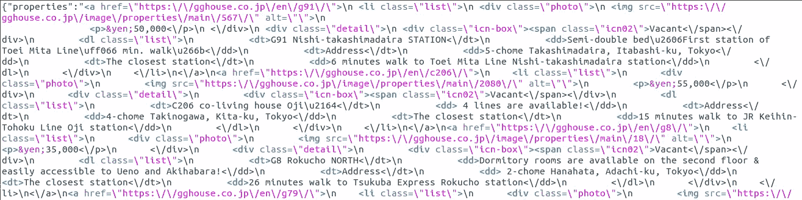
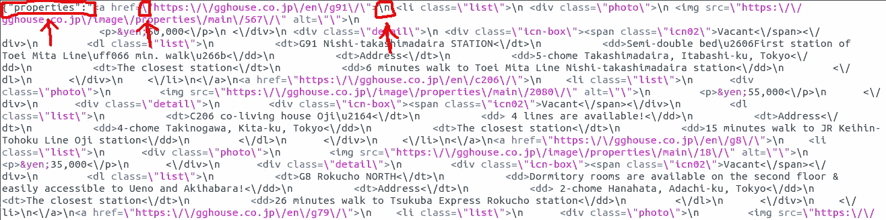
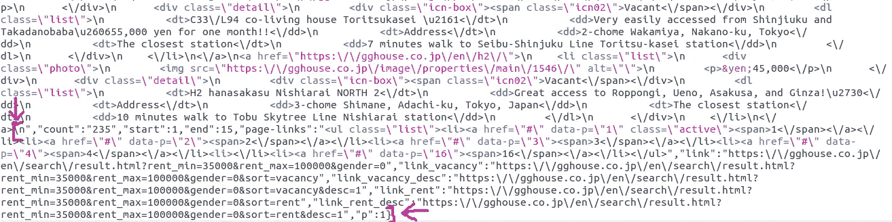
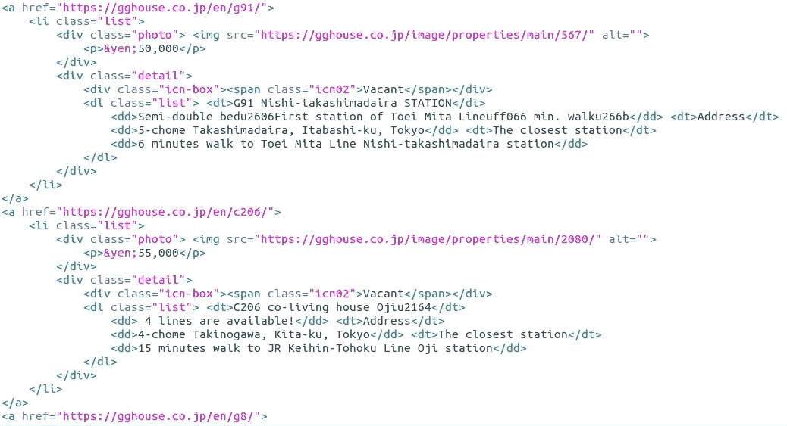
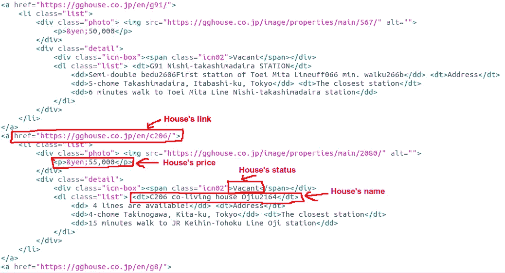
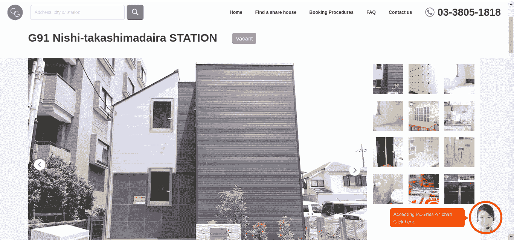
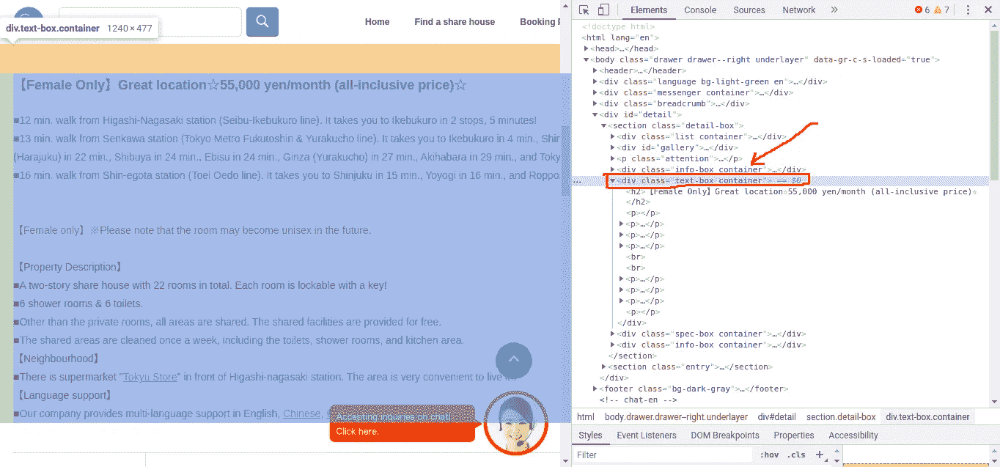
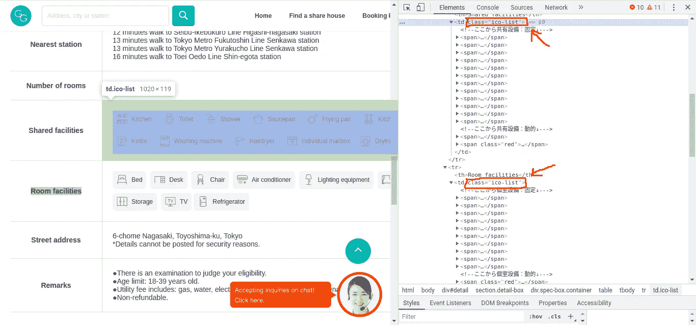
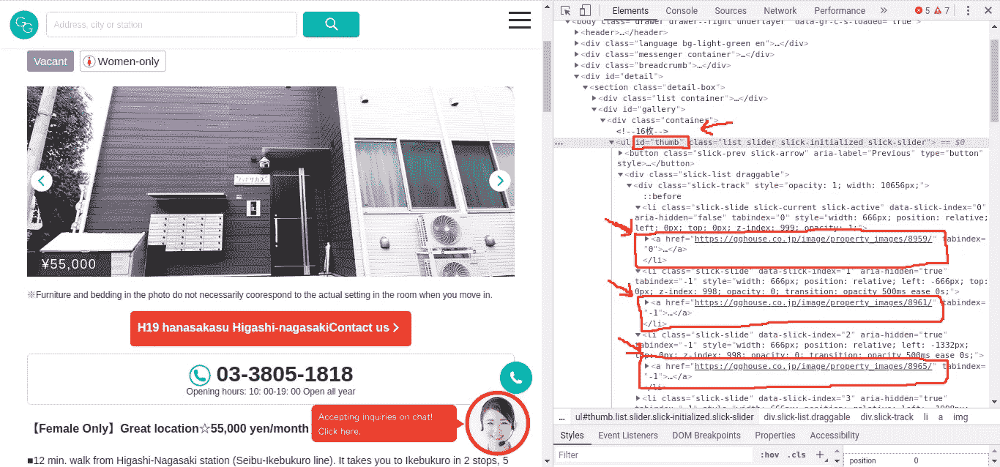

# 在东京找房子很难，所以我在 Spring Boot 建了一个网页抓取器！

> 原文：<https://medium.com/analytics-vidhya/looking-for-a-house-in-tokyo-is-tough-so-i-built-a-web-scraper-in-spring-boot-1beaf0f008f2?source=collection_archive---------22----------------------->


大约一个月前，我决定离开公司的房子，寻找一个新的可以让我自己呼吸新鲜空气的地方。我告诉自己，在网站上手动搜索是势不可挡的，因为在大城市东京有太多的选择。最后，我想我必须利用这个机会做两件事:

*。建立一个网站抓取器，从东京的一个主要租房网站获取所有数据，节省我的时间。*

*。通过建立这个网站刮刀来提高我的 Java 技能。(我知道使用 Python 来抓取网站要容易得多，没有多少人使用 Java 来做这个)*

我刮到的网站是 [**GGhouse**](https://gghouse.co.jp/en/) ，东京最著名的租房网站之一。他们有大量的房子要我们去清理。

在您接触代码片段之前，让我总结一下我将要做的事情。在这篇文章中，我将一步一步地带你通过 Java 从[**gg house**](https://gghouse.co.jp/en/)**网站抓取数据。我就不说怎么建我的项目了。所以如果你想看看我的项目，GitLab 的链接在本文末尾。**

## **让我们开始吧！**

**在 spring boot 中，像每个项目一样，在做任何事情之前，我们需要添加一些必要的依赖项。抓取也不例外，我们将使用 **jsoup** 依赖来处理 HTML 代码。**

***在 Maven 项目中，我们将把下面的代码片段添加到 pom.xml 文件中***

```
<dependency>
  <groupId>org.jsoup</groupId>
  <artifactId>jsoup</artifactId>
  <version>1.13.1</version>
</dependency>
```

***在 Gradle 项目中，我们将向 build.gradle 文件添加以下代码片段***

```
compile group: 'org.jsoup', name: 'jsoup', version: '1.13.1'
```

**传统上，抓取通过从静态 HTML 代码中提取数据来工作。但是几年前，Javascript 框架(如 Angular、React 和 Meteor……)使用的增加使得传统方式不像以前那么简单了。这些框架将使用 Javascript 来呈现 HTML 代码的内容。想象一下！HTML 代码是一个没有肉和骨头的身体，Javascript 用来为它提供肉和骨头(产品图片、描述、技术规格、视频……)。因此，对于由这些框架之一构建的网站来说，如果只获取 HTML 代码就没什么了。**

**可惜， [**GGhouse**](https://gghouse.co.jp/en/) 就是那种网站。所以我们需要不同的处理方式。**

****

**不能直接从网站的 HTML 代码中获取数据，所以我们将调用它的 API。返回的数据是我们想要的，但是是 JSON 格式的。所以我们要先清理并转换成 HTML 格式，然后使用 **jsoup** 提取数据。**

**请记住，有些网站会自动阻止任何形式的抓取，所以我们将在页面之间放置睡眠命令。这可以假装更多的人类行为，不要让网站因每秒大量的请求而过载。**

**好的，我们先测试一下，看看是否可以访问网站。**

```
String api = "https://gghouse.co.jp/en/search/result/"
// body of the Request
String path = "en/search/result.html";  //The path of API
int rent_min = 35000;                   //The minimum renting price
int rent_max = 100000;                  //The maximum renting price
int p = 1;                              //Page one
String gender = "";                     //Not specify gender
```

**运行上面的代码，看看结果。**

****

**哇，太乱了！**

**似乎一切顺利！**

## **时间**到**清理数据！**

**如果我们仔细观察返回的数据，我们会发现键**属性**的值就是我们想要的。那是一串 **<一个>** 的标签，每个标签都保存着每个房子的基本信息。不仅是这个列表的前面和后面的部分，我们还看到一些不必要的字符。在下图中高亮显示。**

****

**返回数据的头部分**

****

**返回数据的底部**

**要清理数据，请使用下面的代码片段。**

```
result = result.replace("\\n", "").replace("\\", "").replace("{\"properties\":\"", "");
int pos = html.indexOf(">\"");
result = result.replace(pos.substring(index+1, pos.length()), "");
```

**让我们看看我们有什么！**

****

**很漂亮，对吧？:D**

## **煮点汤！**

**如果你熟悉 HTML，这很有用，但是如果你不熟悉，不要担心，这不是必需的。我会尽可能的简单。**

**我们在一个 Java 字符串中有 HTML，我们想解析这个 HTML 来获取它的内容。**

```
Document doc = Jsoup.parse(html);      // parse HTML
Elements listHouse = doc.select("a");  // get list of **<a>** tags
```

**我们现在的数据是一个对象，它保存了一个数据元素列表，是 **<一个>** 标签。正如我之前说过的，每个 **<一个>** 标签保存着每个房子的基本信息。所以首先，确定我们需要为每栋房子获取的数据。之后，遍历整个列表，我们会得到所有的数据。**

****

**我们会得到什么**

**让我们测试一下如何从一个数据元素( **<一个>** 标签)中获取数据。**

```
Element item = listHouse.get(1);  // get 2nd data element from list
```

****房子的链接**由属性 **href** 指定。**

```
String href = item.attr("href");
```

****房屋价格**位于 **< p >** 标签。在数据元素中，只有一个 **< p >** 标签。**

```
String price = item.select("p").text(); 
```

****房屋名称**位于第一个 **< dt >** 标签中。所以首先，我们会得到数据元素的 **< dt >** 标签的列表，那个列表的第一个元素就是我们想要的。**

```
String name = item.select(“dt”).first().text();
```

****房屋的状态**位于第一个 **<跨度>** 标记处。所以和上面走的一样。**

```
String status = item.select("span").first().text();
```

**实际上，我们也会得到**房子的类型**。意思是房子是不是只给女人住。你在上面的图像中看不到，因为它没有数据。如果有，**房屋的类型**位于第二个 **<跨度>** 标签中。**

```
String type = (item.select(“span”).size() > 1) ? “Women-only” : “”;
```

## **好了，让我们看看抓取了一些页面的完整代码。**

**到目前为止，我们几乎完成刮。我不知道你是否注意到，在上面我提到了**房屋**的基本信息。那么细节呢？我们有豪斯的联系，对吧？让我们访问它，刮。**

## **从静态 HTML 获取数据**

**访问 house 的链接，我们可以直接从静态 HTML 代码中获取数据，不需要调用 API。**

****

**我们还将首先测试它，看看是否可以访问网站。**

```
Responce Code : 200<!doctype html><html lang="en"><head><meta charset="UTF-8"><meta http-equiv="X-UA-Compatible" content="IE=edge"><meta name="viewport" content="width=device-width, initial-scale=1"><title>H19 hanasakasu Higashi-nagasaki | Share house GG House Management</title><link rel="icon" href="https://gghouse.co.jp/favicon.ico"><link rel="stylesheet" href="https://gghouse.co.jp/css/style.css"><link rel="stylesheet" href="https://gghouse.co.jp/search/css/pc.css"><link rel="stylesheet" href="https://gghouse.co.jp/search/css/sp.css"><link rel="stylesheet" href="https://gghouse.co.jp/en/search/css/pc.css"><link rel="stylesheet" href="https://gghouse.co.jp/assets/css/front.css" /><link rel="canonical" href="https://gghouse.co.jp/h19/" /><link rel="alternate" hreflang="ja" href="https://gghouse.co.jp/h19/" /><link rel="alternate" hreflang="en" href="https://gghouse.co.jp/en/h19/" /><link rel="alternate" hreflang="zh-hans" href="https://gghouse.co.jp/zh-hans/h19/" /><link rel="alternate" hreflang="ko" hr
```

**似乎一切都做得很好。**

**作为租户，我认为房屋的详细信息必须包括 ***描述******共用设施******房间设施******图片*** 。一步一步来，首先我们将在 HTML 代码中找到描述。右键单击网页并选择检查。**

****

**我们将通过上图中突出显示的类属性得到 ***描述*** 。在那之后我们还必须清理它，因为它有一些不必要的字符，正如你所看到的。**

```
String descriptions = doc.getElementsByClass("text-box container").text();String characterFilter = "[^\\p{L}\\p{M}\\p{N}\\p{P}\\p{Z}\\p{Cf}\\p{Cs}\\s]";descriptions = descriptions.replaceAll(characterFilter,"");
```

****

**我们将根据上图中突出显示的类别属性得到 ***共享设施*** 和 ***房间设施*** 。在本例中，返回的数据是一个集合，第一个数据元素是*，第二个是 ***房间设施。*** 为了可读性， ***，*** 我们用一个 ***逗号将每个设施中的项目组合起来。******

```
*Elements facilities = doc.getElementsByClass("ico-list");
StringBuilder share_facility = getFacility(facilities.get(0));
StringBuilder room_facility = getFacility(facilities.get(1));public StringBuilder getFacility(Element facilities) {
    StringBuilder facility = new StringBuilder();
    String prefix = "";
    for (Element temp : facilities.select("span")) {
        facility.append(prefix);
        prefix = ",";
        facility.append(temp.text());
    }
    return facility;
}*
```

******

***正如你在上面的图片中看到的高光，房子的每个图片都保存在**<>**标签中，这个**<>**标签位于 **< ul id="thumb" >** 标签中。所以首先，我们将通过 **id 得到 **< ul >** 标签，然后得到所有 **<的 href 和一个>** 标签。我们用一个 **|** 符号 ***组合所有的 href。********

```
*Elements imgs = doc.getElementById("thumb").select("a");
StringBuilder links = new StringBuilder();
String prefix = "";
for (Element item : imgs) {
    links.append(prefix);
    prefix = "|";
    links.append(item.attr("href"));
}*
```

> ***我总是在想，我是应该下载图片还是只获取它们的链接。我有一些想法，如果下载所有的图片，我需要巨大的存储空间。如果让一台服务器处理这么多任务(抓取数据，下载图像……)，这是一个非常糟糕的主意。所以我想首先我只是得到图片的链接，也许在未来，我会建立另一个服务器来处理下载图片。这是个更好的主意。***

## ***好了，让我们看看抓取静态 HTML 代码的全部代码***

***嘣！我们有数据了！***

***如果我们有一项服务可以支持我们处理数据，那就太好了。我认为 IBM Watson Discovery Service 就是一个例子。我还写了一篇关于这项服务的文章。如果你想看一看，我邀请你查看我的文章[*https://medium . com/voice-tech-podcast/learn-IBM-Watson-discovery-during-the-新冠肺炎-疫情-727e40fe14e1*](/voice-tech-podcast/learn-ibm-watson-discovery-during-the-covid-19-pandemic-727e40fe14e1)***

****感谢*所有人的阅读！***

****看看我的项目*[https://gitlab.com/buingoctruong1508/houseforrent](https://gitlab.com/buingoctruong1508/houseforrent)***