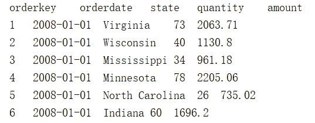

# 寻找合适的工具来计算大文件

> 原文：<https://medium.com/analytics-vidhya/looking-for-suitable-tools-for-calculating-large-files-f63477f22d59?source=collection_archive---------12----------------------->


图片由 unsplash.com 拍摄

什么是大文件？大文件是指由于计算机内存不足而无法一次读入的文件。在这种情况下，直接使用桌面数据工具(如 Excel)是无能为力的，往往需要编写程序来处理它。即使编写了程序，也必须批量读取大文件进行计算和处理。最后，批处理结果需要根据不同的计算类型进行适当的汇总，这比小文件的处理复杂得多。大文件有很多种类型，比如文本文件、Excel 文件、XML 文件、JSON 文件、HTTP 文件。其中，文本(txt 或 CSV)是最常见的。

可以用来处理大文件的程序语言有:
1。常规的高级编程语言，如 Java、C/C++、C#、Basic 等。
2。文件数据被导入数据库，并由 SQL
3 处理。Python
4。埃斯普罗克 SPL

本文以文本文件为例，依次介绍上述大文件计算方法的特点。对于其他类型的文件，除了读取数据的方式不同，读取后的处理思路和文本文件类似。

在本文 orders.txt 中使用的文件有五列:orderkey、orderdate、state、quantity 和 amount。该列由制表符分隔。文件中的第一行是列名，共有 1000 万行数据。如下所示:



# 一、高级语言(以 Java 为例)

使用高级语言编程进行计算，如何编写计算过程与具体的计算类型有关。不同类型的计算需要不同的计算过程。我们来看看最简单的聚合计算，比如在 orders.txt 中计算 amount 之和，用 Java 写成如下:

```
BufferedReader br = new BufferedReader(new InputStreamReader( new FileInputStream("orders.txt") ) ); 
    String[] fieldNames = br.readLine().split("\t"); 
    double sumAmount = 0; 
    String line = null; 
    while(( line = br.readLine() )!= null) { 
        String[] values = line.split("\t"); 
        float amount = Float.parseFloat(values[4] );  // Assume that column 5 is known as amount
        sumAmount += amount; 
    }
```

这个程序是一次读取一行数据，文件访问时间太长，运行很慢。如果想运行得更快，需要一次读入一大块数据(比如 10000 行)，然后用代码把数据拆分成行进行处理，会很麻烦。

这是最简单的计算，没有数据过滤、分组、排序等要求。平均值、最大值和最小值的其他计算与此类似。

如果要做组聚合，代码会麻烦很多。例如，按州分组后，计算每个州的总订单量。计算思路如下:保存每组，然后逐行读取每一行的状态值。与保存的组进行比较，如果找到，则将该行订单金额添加到该组中；如果没有，添加一个新组；直到处理完所有行。如果需要对多个字段进行分组来计算多个统计值，比如按日期和状态分组的总订单金额和最大订单金额，程序的复杂度会增加很多。

排序更麻烦，需要中间缓存文件。比如你想把订单金额从大到小排序，由于内存不足，你无法读取所有数据进行排序。计算思路如下:读取 5000 行数据(要读取的行数取决于内存)，排序保存到一个临时文件，然后读取 5000 行排序保存到另一个临时文件，直到所有数据处理完毕。最后这些临时文件有序合并——读出每个临时文件的第一行，找出哪一行应该在最上面，写入结果文件，然后从临时文件中读出另一行，继续比较，找到第一行写入结果文件。这样做，直到所有的数据行都写入结果文件。

用高级语言处理大文件是非常繁琐的，这对于非专业程序员来说几乎是不可能的。

# 二。使用数据库

数据库内置了很多计算算法，对数据的查询和计算比较完善，性能也比较好。所以可以考虑把大文件导入数据库，生成数据库表，然后用 SQL 查询计算数据。

这种方法的问题是将文件导入数据库。在导入数据之前，您需要创建表结构并指定每列的数据类型。例如，用于创建订单表的 SQL 如下:

```
CREATE TABLE orders ( orderkey INTEGER NOT NULL, 
        orderdate DATE NOT NULL, 
        state  CHAR(20) NOT NULL,  
        quantity  INTEGER NOT NULL,  
        amount  DECIMAL(15,2) NOT NULL, 
        PRIMARY KEY(orderkey) 
    );
```

如果您更改到另一个具有其他结构的数据文件，您需要编写另一个 SQL 来创建该表。特别是需要指定数据类型，否则数据库将无法接受数据，这对于很多非专业程序员来说是非常陌生的。

对于导入过程，数据库一般会提供直接导入文本文件的工具，而其他文件无法直接导入，需要先转换成文本文件。Excel 文件可以直接保存为文本，但是对于 XML 文件，JSON 文件，HTTP 文件等。，就要写程序把它们转换成文本文件，或者写程序读入文件，生成 SQL 语句，把数据写到数据库表。不管怎么样，都是一件很繁琐的事情。

数据存储在数据库表中后，查询和计算真的很简单，分组和排序也很容易。例子如下:

1.计算订单总额

```
select sum(amount) from orders;
```

2.按州分组并按州计算订单总额

```
select state, sum(amount) from orders group by state;
```

3.按订单金额排序

```
select * from orders order by amount;
```

利用数据库查询和计算大数据量非常方便，但是将大文件导入数据库非常复杂，有一定的专业技能要求。与高级语言相比，可行性大大提高，但还是不够好。

# 三。计算机编程语言

Python 不提供直接处理大文件的语法。其实现思路类似于高级语言。例如，上一节中计算的订单金额总和如下所示:

```
sumAmount=0 
    with open("orders.txt",'r') as f: 
        while True: 
            line = f.readline() 
            if not line: 
                break 
            sumAmount += float(line.split("\t")[4]) 
    print(sumAmount)
```

对于分组、排序等复杂操作，如果实现上面说的思路，Python 也很麻烦，并不比 Java 简单多少。但是 Python 有一个 pandas 包，封装了许多结构化数据处理函数。如果是可以读入内存的小文件，就可以轻松处理。可惜熊猫没有提供大文件的直接批量处理方法，只能自己写程序。使用熊猫的复杂度比直接硬写要少很多，但是上面讨论的思路还是要落实的。

写分组操作太麻烦了。下面写基于熊猫的求和运算来感受一下。

```
import pandas as pd 
    chunk_data = pd.read_csv("orders.txt",sep="\t",header=None,chunksize=100000) 
    sumAmount=0 
    for chunk in chunk_data: 
        sumAmount+=chunk[4].sum() 
    print(sumAmount)
```

用了熊猫之后，文字就可以看作是一行一行的结构化数据，再也不用自己拆分了。

Python 对小文件没有大问题，但对大文件不提供有效支持。相比高级语言，减少的工作量非常有限，可用性不高，还不如数据库。

此外，Python 是一种解释执行语言，其执行速度远低于高级语言，在处理大型文件时更为明显。

# 四。埃斯普罗克 SPL

esProc 是一个专业的数据处理工具。和数据库一样，它有内置的查询和计算算法。可以直接使用文本、Excel、XML、JSON 等文件进行计算，不需要导入数据的过程。

esProc 提供了一个游标，可以批量读取数据，然后进行计算，所以处理大文件很方便。和前面的例子一样，您只需要一行代码:

1.计算订单总额

```
=file("orders.txt").cursor@t().total(sum(amount))
```

如果你想增加一个过滤功能也很容易。例如，您只能计算自 2009 年以来的订单总额:

```
=file("orders.txt").cursor@t().select(orderdate>=date("2009-01-01")).total(sum(amount))
```

分组和排序也很简单:

2.按州分组并按州计算订单总额

```
=file("orders.txt").cursor@t().groups(state;sum(amount))
```

3.按订单金额排序

```
=file("orders.txt").cursor@t().sortx(amount)
```

esProc 甚至允许您使用 SQL 直接查询文件。例如，前面的三个示例编写如下:

```
$select sum(amount) from "orders.txt"$select state, sum(amount) from "orders.txt" group by state$select * from "orders.txt" order by amount
```

esProc 还内置了并行计算，可以充分利用多核 CPU 提高性能，对于大文件特别有用。例如，组聚合计算编写如下:

```
=file("orders.txt").cursor@tm(;4).groups(state;sum(amount))
```

它将以 4 路并行模式计算，速度可在普通多核笔记本电脑上提升 2–3 倍。相对来说，高级语言可以实现并行，但是不仅麻烦，而且只有专业程序员才能做到。Python 基本上不能实现并行。SQL 依赖于数据库。对于 Oracle 等专业数据库实现并行是可以的，对于 MySQL 等简单数据库就不行了。

esProc SPL 既有 SQL 的优点，又避免了数据导入的麻烦。对于桌面数据分析师来说，它是处理大文件最合适的工具。