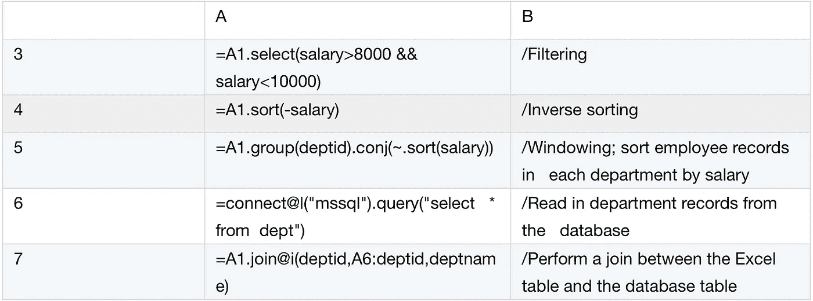
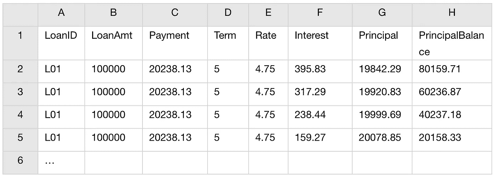

# 寻找最好的 Excel 加载项

> 原文：<https://medium.com/analytics-vidhya/looking-for-the-best-excel-add-ins-d49d90a149b4?source=collection_archive---------29----------------------->


Excel 为执行简单计算提供了方便的方法，包括易于使用的函数和直观的按钮和菜单。但是它很难独自完成复杂的计算和某些特殊的计算。因此，它提供了插件接口，通过该接口可以连接外部应用程序，以使用它们的语言或脚本来帮助 Excel 处理这些计算。

现在，我将研究一些常见的 Excel 插件，并评估它们的计算能力。

# Excel DNA

作为最早的 Excel 加载项之一，Excel DNA 允许您使用 C#、F#、VB.net 等语言为 Excel 创建动态库函数。

首先，您需要编写一个用户定义的函数。下面是一个用 C#写的例子，列在 Excel DNA 的官网上。MyFunction 是用户定义函数的名称。

```
using System;
using  System.Collections.Generic;
using   System.Linq;
using   System.Text;
using  System.Threading.Tasks;
using  ExcelDna.Integration;namespace   MyLibrary
{
    public class Class1
    {
        ExcelFunction(Description="few  people use this way!")]
        public static string  MyFunction(string name)
        {
        return "Bonjour" + name;
       }
    }
}
```

代码需要编译成动态库才能在 Excel 中使用。

然后配置用户定义函数和外接程序之间的关系。以下 DnaSample.dna 文件配置加载项的名称(“我的名称”)和相应的动态库 Mylibrary.dll，其中包括多个用户定义的函数。

```
<DnaLibrary   Name="My  name"   RuntimeVersion="v4.0">
<ExternalLibrary  Path="Mylibrary.dll" />
</DnaLibary>
```

最后，在 Excel 中配置新的插件，使其能够从单元格中调用 MyFunction，如下所示:


由于一个编译好的程序已经准备好执行，并且紧密地集成到 Excel 中，所以执行起来流畅而快速。所以 Excel DNA 最大的优势就是流动性高。

顾名思义，该插件可以充分利用 Windows DNA Architecture 提供的功能，如开发语言和工具、与 Excel 的集成、交互式调试等。

理论上，像 C#、F#和 VB.net 这样的语言是通用的、全能的。但是我注意到他们网站上的示例程序都是关于字符串输出的。这当然不是展示实力的好选择。为什么会这样呢？

因为他们的能力只存在于纸面上。

那些语言缺乏用于结构化数据计算的类库。即使是最基本的计算也需要硬编码。极其迂回的代码不适合处理复杂的计算。

此外，C#、F#和 VB.net 是编译语言，而不是解释语言。这种类型的编程语言需要用户维护一个编译环境来编译算法，以防它被改变。但是配置 Windows 编译环境很复杂，也很难学。实际上这些语言有很高的技术门槛。这意味着 Excel DNA 更适合作为接口使用的专业程序员，而不是直接用于桌面分析的大部分数据分析师。

其他插件，如基于 Java 的 JINX，也缺乏用于结构化数据计算的类库。所以 JINX 也不适合数据计算。即使是电子表格工具的内置插件 Excel VBA，在表达能力方面也没有更好(这意味着它不适合计算数据)。但是由于它不需要集成和编译，所以比 Excel DNA 和/JINX 更有竞争力。

# Excel JavaScript

一个插件需要比 VBA 更方便，更容易使用才能得到普及。因此，微软在 2013 年发布了 Excel JavaScript，这是一种旨在供插件使用的语言，比 VBA 更方便。

Excel JavaScript 与其他加载项语言有类似的用途。关键是它是一种解释型语言，因此支持随时修改程序，然后无需编译就立即执行。这是和 Excel DNA 很大的区别。一般来说，解释性语言的流动性很低。但是作为 Excel 内置的，Excel JavaScript 可以和电子表格工具在同一个进程中执行。在实际操作中，执行是流畅而快速的，只比 Excel DNA 慢一点。

n Excel 内置的外接程序带来了很多好处。你不需要下载插件，不需要配置就可以开发程序。Excel JavaScript 继承了 Excel 的跨平台能力。一个程序可以在单机版、网页版和 Mac 版之间无缝迁移。该外接程序还可以访问 Excel 对象，包括工作簿、工作表和单元格。这大大加快了开发进度。

然而这些优点正是 VBA 所拥有的。那么 Excel JavaScript 有什么独特之处呢？

它具有强大的界面管理能力。它可以使用更简单的语法访问 Excel 菜单栏、按钮和弹出对话框，并在 JS 文件中定义一个插件接口。那比 VBA 方便多了。

不幸的是，界面管理不是数据计算插件的关键方面。不值得关注。

我们的重点应该是计算能力。遗憾的是 JavaScript 仍然没有配备任何结构化的计算功能。它在处理复杂计算时没有任何优势。这只是另一种基于 Excel 的脚本语言。

# PyXLL

一个标准的数据计算插件应该有用于结构化计算的类库，比如 PyXLL。PyXLL 是一个基于 Pyhon 的插件。Python Pandas 拥有结构化计算类库。

PyXLL 在实现简单算法时不需要硬编码，比如在指定区域进行分组和聚合。这里有一个例子。从 Excel 工作表中选择一批员工记录，传递给用户自定义函数 groupEmp，在 PyXLL 中执行分组聚合算法，返回结果。实现该过程的代码如下:

```
import pandas  as pd
import numpy  as np
from pyxll   import xl_func[@xl_func](http://twitter.com/xl_func)("dataframe<index=False,   columns=True>")
def   groupEmp(df):
df=df.groupby("deptid")['salary'].agg([len,   np.sum,  np.mean])  # The core code: grouping & aggregation
return df
```

核心代码只占一行。其他的基本都是套路。这个程序很简洁。

当然，执行复杂和特殊的计算需要多个功能的合作，而不是单一的基本功能。问题是在 PyXLL 中这样做不方便。

这里有一个标准化然后分组和聚合数据的例子。基于记录单元样式(列 A-E)的 Excel 表，用户定义的函数将按样式和卧室对记录进行分组，并计算平方英尺列、浴室列和价格列的平均值。您需要从 string 样式 PRICE 列的每个值中删除$并将其转换为数值样式以便进行计算。

源数据:


已处理的数据存储在新的工作表中:


用于实现算法的用户定义函数如下(仅显示核心代码):

```
for i in range(1,   len(b)):
    b[i][4] = b[i][4].replace(“$”,‘ ‘)
    b[i][4] = b[i][4].replace(“,”,‘ ‘)for i in range(1,   len(b)):
    for j in [1, 2, 3, 4]:
        b[i][j] = eval(b[i][j])data =   pandas.DataFrame(b[1:],columns=b[0])
out =   data.groupby([‘STYLE’,‘BEDROOMS’]).mean()
return out
```

只有一行用于分组，但有六行用于预处理。这有点复杂。

另一个例子是将一行拆分成多行。列 A 存储 id，列 B 存储相应的列表值。有些列表值有多个由空格分隔的成员。用户定义的函数需要用空格将它们分开，并将它们分别对应到 ID。

源代码:


将处理后的数据存储在新的工作表中:


用于实现该算法的用户定义函数如下:

```
split_dict = df.set_index('ID').T.to_dict('list')split_list = []
for key,value in split_dict.items():
    anomalies = value[0].split(' ')
    key_array = np.tile(key,len(anomalies))
    split_df =   pd.DataFrame(np.array([key_array,anomalies]).T,columns=['ID','ANOMALIES'])
    split_list.append(split_df)df = pd.concat(split_list,ignore_index=True)
return df
```

核心代码很复杂。PyXLL 不擅长处理复杂或特殊的计算。

PyXLL 还有一个问题。Excel 必须调用外部解释器来解析 Python 脚本。这导致了非常低的流动性和非常糟糕的用户体验。然而低流动性并不是 PyXLL 独有的问题。这在所有需要外部解释器的脚本插件中都很常见，比如 XLwings、Bert 和 RExcel。XLwings 是另一个基于 Python 的插件，因此与 PyXLL 有相同的优缺点。Bert 和 RExcel 都是基于 R 的。R 语言是为实现科学建模算法而设计的。它的结构化计算类库并不专业。所以两个插件的计算能力都比 PyXLL 弱，流畅性也比 PyXLL 低。

解释语言最大的优点是支持无需编译就能立即执行，并且易于维护和修改。

# 埃斯普罗克

esProc 是专业的数据计算引擎，它提供了一个 Excel 加载项来使用其 SPL 语言编写脚本。与 PyXLL 类似，它拥有丰富的结构化计算功能，可以毫不费力地实现简单的算法。例如，要对指定区域中的记录进行分组和聚合，您只需要以下脚本( *groupEmp.dfx* ):


核心代码是 A2。很简洁。然后我们可以在 Excel 单元格中调用用户自定义函数。语法是=dfx("groupEmp "，A1:D20)。

esProc 以简单易行的方式处理其他基本算法(这里只显示核心代码):



现在我们可以看到，评估插件计算能力的标准是它在处理复杂或特殊计算方面的表现。

与 PyXLL 相比，esProc 在这方面更有优势。

与 PyXLL 相比，在 esProc 中将数据转换为标准格式并对其进行分组要容易和简单得多:


在 esProc 中将一行拆分成多行非常简单:


更复杂的例子是计算分期付款。Excel 工作表记录贷款信息，包括贷款 ID、金额、期限数(按月)和年利率:


用户自定义函数需要获取每期的详细数据，包括应付金额、利息、本金和本金余额。新工作表的预期结果如下:



在 esProc 中完成这项工作相当方便:


尽管 esProc 具有强大的计算能力，但它也是一个插件，其执行依赖于外部解释器 JVM。所以不流动性问题依然存在。

# esProc 通过剪贴板

有没有一种方法既能保留计算能力，又能流畅地运行应用程序？

esProc 通过用剪贴板替换用户定义的函数成功地实现了这一点！

例如，查找每门学科分数排名前三的学生。A 列包含学生姓名，B-D 列分别包含数学、英语和物理的分数。现在，我们希望找到符合条件的学生，将他们添加到大学的分数中。

源数据:


选取有效的储存格，透过 ctrl+C 将它们复制到剪贴簿，然后执行下列 esProc 指令码:


执行上述脚本后，只需选择单元格 B11 并按 ctrl+V，剪贴板中的数据就会复制到 B11-D13 中。这与用户定义的函数得到的结果相同，如下所示:


有了 esProc，您就可以永远使用剪贴簿，而不需要撰写使用者定义的函数，除非是某些情况，例如计算中涉及多个区域。

通过剪贴板，您可以拥有流畅的计算过程和强大的计算能力，而无需复杂的插件部署。对于数据分析师来说，这真的很方便。

理论上，所有插件包括 PyXLL 都可以通过剪贴板解决不流畅的问题，只要它们在未来的版本中能够提供相应的功能(从剪贴板获取数据并将其转换为 Excel 中的结构化数据)。

一言以蔽之，一个流体插件计算能力弱，一个计算能力强的就没那么流体了。然而，由于剪贴板方法可以弥补流动性的限制，esProc 是数据分析师的合适插件。