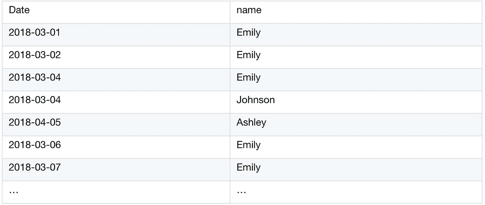
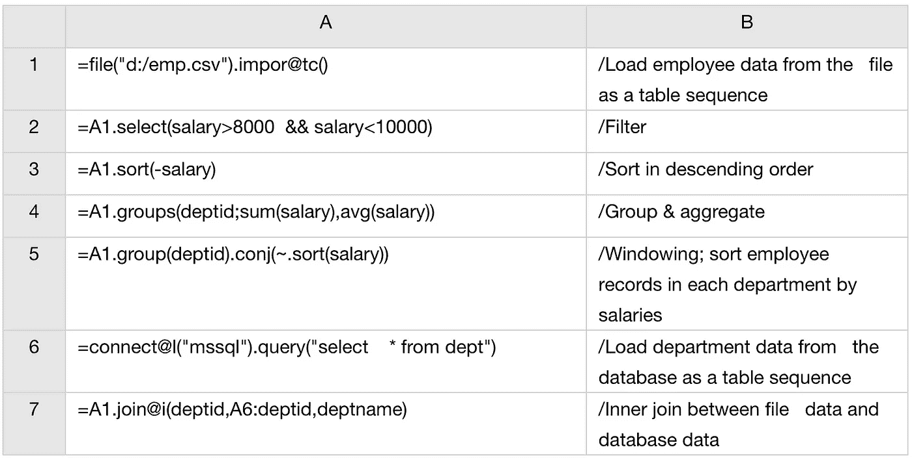

# 寻找最好的轻量级数据分析脚本工具

> 原文：<https://medium.com/analytics-vidhya/looking-for-the-best-lightweight-data-analysis-script-tools-ccde17a63fc6?source=collection_archive---------21----------------------->

## 哪些编程语言适合做桌面分析工作？


作者图片

几乎所有的编程语言都可以操作数据。有些过于笼统，缺少执行结构化计算的功能，比如 C++和 JAVA，产生冗长的代码来处理日常的数据分析场景，更适合打理重大的特殊项目。有些面向技术，对于日常分析工作来说过于专业，比如数学编程语言 MATLAB 和 R，尽管它们提供了结构化数据处理的功能。我在本文中的主题是适合做桌面分析工作的轻量级编程语言。分别是以 MySQL、Excel VBA、Python 熊猫、esProc 为代表的轻量级数据库。

现在，我将仔细分析每种方法的优缺点，看看它们的能力。

# 关系型数据库

在桌面上运行小型数据库很容易，比如 HSQLDB、DerbyDB、SQLite 或 MySQL。这里我就以 MySQL 为例。

MySQL 的便携版便于安装和配置。虽然环境配置问题，如文件夹权限问题，只能通过安装程序版本来解决，但用户友好的向导将弥补这一麻烦。

MySQL 支持使用其内置的命令行工具执行 SQL，但交互式用户界面很粗糙。许多人求助于第三方工具 Navicat 或 Toad 来做同样的事情。所以 UI 设计不是 MySQL 的强项。

编程语言的本质优势当然是数据处理能力。为此，MySQL 本质上依赖于 SQL 来获得它的能力。

SQL 经过近 50 年的发展，已经接近其模型框架的极限。几乎每个基本算法都有它们的 SQL 表达式。这大大降低了想要进行数据处理的分析师的门槛。近年来，MySQL 开始提供对窗口函数、WITH 子句和存储过程的支持。这使得它的能力不亚于任何大型数据库。以在 MySQL 中实现以下算法为例:

```
/*Filtering. emp table stores information of employees in every department*/select eid, name, deptid, salary from emp where salary between 8000 and 10000 and hireday>=’2010–01–01'/*Sorting*/select * from emp order by salary/*Distinct*/select distinct deptid from emp/*Grouping & aggregation. share table stores the daily closing prices for a certain share*/select year(sDate),month(sDate),max(price) from share group by year(sDate),month(sDate)/*Join; dept table stores department information*/select e.name, e.salary, d.deptname from emp e inner join dept d on e.deptid=d.deptid/*Windowing; rank employees in each department by their salaries*/select eid, name, deptid, salary, rank()over( partition by deptid order by salary desc) rk from emp
```

MySQL 处理基本操作真的很好。但是对于复杂的操作就不是这样了，因为 SQL 不擅长处理它们。

SQL 不擅长实现多步进程模式算法。这里的一个例子是根据 *emp* 表找到雇员最多的部门和雇员最少的部门。直觉上，完成任务有两个步骤。首先，将表格按部门分组，统计每个部门的员工数；第二，按雇员数量降序排列各组。现在第一个部门和最后一个部门是我们需要的。然而，SQL 通过使其成为 4 步过程来实现该算法。第一步不变。接下来，它使用 max 函数计算雇员的最大数量，并使用嵌套查询或连接查询找到相应的部门。然后用同样的方法找到员工最少的部门。最后，使用 union 合并第二步和第三步的结果。代码如下:

```
with tmp as (
select dept, count(*) total from employee group by dept),
deptmax as(
select dept from tmp where total=(
select max(total) from tmp)
),deptmin as(
select dept from tmp where total=(
select min(total) from tmp)
)select dept from deptmax
union
select dept from deptmin
```

这是不必要的冗长。

考虑到 SQL 发明的时间，它有一定的缺陷是可以理解的。基于订单的计算是 SQL 不擅长的另一个场景。例如，根据*股票*表，找出某一股票连续上涨了多少天。SQL 没有一种直接的方式来表达“连续上升”的概念，所以我们需要采取一种非常迂回的方式。首先，您计算每个交易日期的累计非上升天数。非上涨天数相同的交易日为连续上涨天数。然后，根据日期是否连续上升对记录进行分组，以获得最大连续间隔。即使是 SQL 专家也觉得处理这样的算法很头疼。而且他们的代码解决方案对于普通用户来说很难读懂。

```
select max(consecutive_days)
from (select count(*) consecutive_days
 from (select sum(updown_flag) over(order by sdate) no_up_days
 from (select sDate,
 case when
 price>LAG(price) over(order by sDate)
 then 0 else 1 end updown_flag
 from share) )
group by no_up_days)
```

实际上，由于使用了窗口函数，这更简单。如果您使用早期版本的 SQL，代码将更难编写和阅读。

另一个例子是按照指定的集合对齐记录。*订单*表存储订单记录。我们需要计算从周日到周六的订单中当天的大订单金额(金额> 15000)。给没有订单的一天一个空值。SQL 使用伪表技术将工作日列表转换为一组记录，然后将伪表左连接到 *orders* 表。实现是复杂的:

```
with std as(
select 1 No,’Sun.’ name from dual union
select 2 ,’Mon.’ from dual union
select 3 ,’Tues.’ from dual union
select 4 ,’Wed.’ from dual union
select 5 ,’Thur’ from dual union
select 6 ,’Fri.’ from dual union
select 7 ,’Sat.’ from dual
)select std.No,std.name,data.total from std left join (
 select DAYOFWEEK(orders.orderdate) No,sum(amount) total
 from orders
 where amount>15000
 group by DAYOFWEEK(orders.birthday)
) data
on std.No=data.No order by std.No
```

我可以举出很多 SQL 头疼的例子。这种语言太老了，无法适应我们复杂的业务需求。虽然它试图通过一系列修补和升级来跟上时代，包括 with 子句、存储过程和窗口函数，但它所基于的框架限制了它的表达。

此外，SQL 被实现为面向内部的，尽管本质上不是这样。基于 SQL 的数据库可以计算数据库内部的数据表，但很难读写外部数据源中的数据。

然而，数据操作的第一步是数据源检索，最后一步是以目标格式输出结果集。评估脚本工具的一个重要方面是它支持外部数据源读/写的能力。不幸的是，MySQL 只能读取(不包括写入)一个外部数据源，即 CSV 文件。而且阅读过程一点也不简单。例如，要将标准格式的 *emp.csv* 文件导入数据库，需要 4 个步骤:

```
mysql>use testdb;
mysql>create table emp (
-> empid int(10) not null,
-> name varchar(50),
-> deptid int(10),
-> salary float,
-> sex varchar(1),
-> birthday date,
-> hireday date)CHARSET = utf8;
mysql>LOAD DATA INFILE 'd:\data\emp.csv' INTO TABLE emp
->CHARACTER SET utf8
->FIELDS TERMINATED BY ','
->LINES TERMINATED BY '\r\n'
->IGNORE 1 LINES;
mysql>ALTER TABLE emp ADD PRIMARY KEY (empid);
```

SQL 的闭包设计在开始时没有考虑文件检索，这导致了极其复杂的实现，尽管后来它被打上了文件检索特性的补丁。

Navicat 等第三方工具使 MySQL 能够支持更多类型的数据源。但本质上，它们只是将外部数据源转换成文本文件，然后将其加载到 MySQL 数据库中。非本地的修补方法有很多缺点。古老格式的数据源，如 Dbase 和 Paradox，得到了最好的支持，但很少使用。Excel 文件加载有非常严格的要求，因此很少成功。JSON 的支持只适用于特殊的二维格式。实际上，Navicat 并不支持我们现在使用的几乎所有常见数据源。

SQL 很难调试。这大大降低了开发速度。

标准的教科书算法不需要调试，因为它们只用几行代码就实现了。真实世界的数据操作代码很复杂，通常有大约一百行嵌套的 SQL 查询。无法调试使得理解和维护代码变得困难，从而导致低性能。

简而言之，SQL 擅长用基本操作处理数据库数据，但在处理外部数据源中的数据和实现复杂算法方面有所欠缺。SQL 所没有的东西为新的脚本工具提供了机会，这些工具是轻量级的，是为 PC 时代设计的桌面工具。

# 超越 VBA

PC 的兴起，让用户群体从科学家变成了普通人。于是，一种非编程的桌面数据处理工具 Excel 应运而生，并赢得了世界范围的流行。它在最近几年添加了一系列插件，包括 PowerQuery，以扩展其对数据源类型的支持，并加强数据处理能力。

这使得它成为非程序员使用的最强大的数据操作工具。我没有夸张。

然而，非编程优势很快变成了一个巨大的劣势。VBA 出生了。VBA 的目标是通过支持编程为 Excel 创造无限的数据处理能力。

问题是这个目标实现得有多好。作为一个支持编程能力的脚本工具，VBA 在理论上当然是极其灵活和全能的，尤其是它的进程模式实现算法和调试能力。这比 SQL 好得多。另一方面，由于缺乏用于结构化计算的特殊函数，该语言仍然是通用的，尽管它有用于访问单元格的特殊函数。所以在 VBA 操纵数据是非常复杂的。在很多场合我宁愿使用 SQL。

以文件读取为例，因为那是数据处理最基础的东西。例如，要将第一行是列标题的 *order.csv* 读入当前的 Excel 工作表，您需要编写一段很长的代码:

```
Const Title As String =   "IMPORT CSV TEST"Sub fMain()
Dim fTextDir As String
Dim pintLen As Integer
Dim pstrValue As String
Dim rowIndex As Integer
Dim i As Integer
rowIndex = 1
pstrValue = ""
pintLen = Len(Title)
fTextDir =   "D:/orders.csv" 
Open fTextDir For Input As #1 
Do While Not EOF(1) ' loop every   line
Line Input #1, currLine 
  If Right(currLine, pintLen) =  Title Then
  Range(Cells(rowIndex, 1),  Cells(rowIndex, 4)).Select
   With Selection
       .HorizontalAlignment =   xlCenter
       .VerticalAlignment = xlTop
     .WrapText  = False
       .Orientation = 0
     .AddIndent  = False
       .ShrinkToFit = False
      .ReadingOrder = xlContext
      .MergeCells  = True
      .RowHeight  = 27.75
      .Font.Name  = "Arial".Font.Size  = 18
      .Font.Bold  = True
      .FormulaR1C1 = Title
        .Interior.ColorIndex = 6
      .Interior.Pattern = xlSolid
    End With
    Else
    rowDataArr = Split(currLine,  ",")
    For i = 0 To UBound(rowDataArr)
      Cells(rowIndex, i + 1).Select
    With  Selection
       .HorizontalAlignment =   xlCenter
       .VerticalAlignment = xlTop
       .WrapText = False
       .Orientation = 0
       .AddIndent = False
       .ShrinkToFit = False
       .ReadingOrder = xlContext
       .MergeCells = True
       .RowHeight = 20
       .Font.Name = "Arial"
       .Font.Size = 12
       .Font.Bold = False
       .FormulaR1C1 = rowDataArr(i)
     End With
  Next i
    End If
    rowIndex = rowIndex + 1
 Loop
   Close #1
End Sub
```

这是标准数据格式的文件。你可以想象如果数据是脏的，比如空行、特殊分隔符或者由一条记录组成的多行，代码的复杂程度。

我们来看看 PowerQuery。它支持许多类型的数据源，但只有在根据向导加载静态数据时才是方便的。然而，动态加载将是一场噩梦。PowerQuery 仅支持数据加载。要将结果集输出到目标数据源，您必须求助于 VBA 方法(但是您可以直接输出 CSV)。

用 PowerQuery 甚至很难实现基本的结构化算法。例如，要对 sheet1 中的列 A 进行分组并对列 B 进行求和，您需要一大段代码。下面是省略了数据检索部分的代码片段:

```
Public Sub test()
 Dim Arr
 Dim MyRng As Range
 Dim i As Long
 Dim Dic As Object

 Set MyRng = Range("A1").CurrentRegion
 Set MyRng = MyRng.Offset(1).Resize(MyRng.Rows.Count   - 1, 2)
 Set Dic = CreateObject("Scripting.dictionary")
 Arr = MyRng
 For i = 1 To UBound(Arr)
    If Not Dic.exists(Arr(i, 1)) Then
    Dic.Add Arr(i, 1), Arr(i, 2)
 Else
       Dic.Item(Arr(i, 1)) = Dic.Item(Arr(i, 1)) + Arr(i, 2)
       End If
 Next i
 Sheet2.Range("A1") =   "subject"
 Sheet2.Range("A2").Resize(Dic.Count)   =  Application.WorksheetFunction.Transpose(Dic.keys)
 Sheet2.Range("B1") =   "subtotal"
 Sheet2.Range("B2").Resize(Dic.Count)   =  Application.WorksheetFunction.Transpose(Dic.items)
 Set Dic = Nothing
End Sub
```

一句话，VBA 没有真正实现它的目标。事实上，它对程序员没有什么价值，尤其是桌面分析师。那真是太遗憾了。通过关注过程模式描述，VBA 绕过了结构化算法的实现。

哪里有失败，哪里就有替代。

# 蟒蛇熊猫

实际上，Python 比 VBA 还要古老。但是在互联网普及之前，它是看不见的，它跳上了使用开源社区来扩展各种第三方函数库的潮流。其中一个明星函数库是用于数据操作的 Pandas。

Python 旨在易于读写。它在功能层面上不辜负最初的期望。每个功能简单，功能强大，界面清晰，易于使用。以下是其用于基本结构化计算的功能:

```
df.query(‘salary>8000 and salary<10000’) #Fileringdf.sort_values(by=”salary”,ascending = True) #Sortingdf.groupby(“deptid”)[‘salary’].agg([len, np.sum, np.mean]) #Grouping & Aggregation
```

依靠开源社区的廉价和高效的资源，Pandas 已经能够产生大量丰富的功能，几乎涵盖了所有常见的结构化算法。因为它继承了 Pythons 的语法，所以调用 Pandas 函数也很容易。由于这两个优点，熊猫处理基本的数据操作任务又快又好。

在结构化计算的函数存储中，它与 SQL 打了个平手。但是它比 SQL 支持更多的外部数据源。下面是用于检索 CSV/TXT 文件的 read_csv 函数:

```
import pandas as pddf=pd.read_csv(‘D:/emp.csv’) #return as a DataFrame
```

这是为了检索一个标准格式的 CSV 文件。通过设置参数，它可以轻松处理非标准数据格式，如第一行不是列标题和跳过 N 行。

Pandas 支持简单地通过函数从几乎所有类型的外部数据源加载数据，包括数据库、JSON 文件、Excel 文件和 web 数据。它也很容易写，因为它的函数有清晰的接口，很容易调用。这些是典型的 Pythons 风格。

Pandas(实际上是 Python)，一种标准的过程语言，有一个 SQL 没有的优点。它支持常见的调试技术，包括断点、单步执行和跳进/跳出，以快速消除代码错误并轻松维护复杂的算法。它远比 SQL 高效。

对于初学者来说，Pandas 丰富且易于使用的库函数很有吸引力，这些库函数是为执行结构化计算和访问外部数据源而设计的。然而，当他们潜得更深时，他们会看到一幅不同的画面。当一起工作来执行日常算法时，作为个体高效而轻松地工作的函数变得笨拙而困难。结果是困难和复杂的代码。

例如， *split_field.csv* 是一个制表符分隔的文本文件，它有两个字段 ID 和 ANOMOALIES。我们需要用空格将每个 ANOMOALIES 字段值分成多个字符串，并将每个字符串组合到相应的 ID 字段值中，以生成一个新记录。

源数据( *split_field.csv* ):


已处理的数据:


实现上述算法的代码:

```
import pandas as pd
import numpy as npsplit_field = pd.read_csv('C:\\split_field.csv',sep='\t')
split_dict = split_field.set_index('ID').T.to_dict('list')
split_list = []for key,value in split_dict.items():
    anomalies = value[0].split(' ')
    key_array = np.tile(key,len(anomalies))
    split_df =   pd.DataFrame(np.array([key_array,anomalies]).T,columns=['ID','ANOMALIES'])
    split_list.append(split_df)split_field = pd.concat(split_list,ignore_index=True)
print(split_field)
```

这段代码并不那么简单，尽管字符串分割是熊猫的强项之一。进行基于顺序的计算的代码会更加困难。这里有一个例子。 *duty.csv* 记录每天的工作安排。一个人将在另一个人轮班之前连续工作几天。任务是得到每个工人所有连续的轮班时间。

源数据( *duty.csv* ):



已处理的数据:


熊猫代码实现上述算法:

```
import pandas as pd
import numpy as npduty = pd.read_csv('C:\\duty.csv',sep='\t')
name_rec = ''
start = 0
duty_list = []for i in range(len(duty)):
    if name_rec == '':
        name_rec = duty['name'][i]
    if name_rec != duty['name'][i]:
        begin =   duty['date'].loc[start:i-1].values[0]
        end =   duty['date'].loc[start:i-1].values[-1]
        duty_list.append([name_rec,begin,end])
        start = i
        name_rec = duty['name'][i]begin = duty['date'].loc[start:i].values[0]
end = duty['date'].loc[start:i].values[-1]
duty_list.append([name_rec,begin,end])
duty_b_e = pd.DataFrame(duty_list,columns=['name','begin','end'])
print(duty_b_e)
```

这两个例子表明，只有个别熊猫函数易于读写，但在处理日常业务算法时却变得难以使用。然而，现实世界中的源数据格式并不总是标准的，也不可能只使用基本算法。随时随地都有未知。基本功能必须善于团队合作，足够灵活，根据需要做好数据清理、转换和计算。

熊猫问题是由于 Python 和它的众多开源社区(熊猫是其中的一员)之间的松散关系。Pandas 有权更新自己的函数，但无权更改函数调用语法。Python 开发团队也缺乏足够的资源来照顾好每一个开源社区，来改进语法，使功能方便流畅地协作。

熊猫在处理无法放入内存的数据(不是大数据)方面也有困难。

一般来说，语言以递归的方式处理这种数据。一次读取和计算一小部分数据，存储每个中间结果集，并组合这些结果集(如过滤)或进一步处理它们(如分组和聚合)以获得最终结果集。即使是一个基本的结构化算法，当数据量很大的时候，也不简单，更不用说 join、merge、set 运算等复杂的算法，或者做现实业务的基本算法的动态组合了。

为了简化用于处理大量数据的算法的实现，如果脚本工具在底层提供一种机制来实现自顶向下的内存数据和外部数据的自动交换，并自底向上隐藏计算细节，从而允许分析师使用与用于处理少量数据的语法类似的语法来操作数据，那将会更好。然而 Python 并没有给熊猫配备这种能力。桌面分析师必须自己编写底层逻辑。这解释了难以置信的复杂的熊猫代码处理大量数据。

例如， *orders.csv* 存储订单数据，我们希望找到每个销售人员的 3 个最大订单。这是熊猫的代码:

```
import pandas as pd
import numpy as npchunksize=1000000
order_data = pd.read_csv(d:\\orders.csv',iterator=True,chunksize=chunksize)
group_list = []
for chunk in order_data:
    for_inter_list = []
    top_n =   chunk.groupby(by='sellerid',as_index=False)
    for index,group in top_n:
        group = group.sort_values(by='amount',ascending=False).iloc[:3]
          for_inter_list.append(group)
    for_inter_df =   pd.concat(for_inter_list,ignore_index=True)   
    group_list.append(for_inter_df)top_n_gr = pd.concat(group_list,ignore_index=True).groupby(by='sellerid',as_index=False)
top_n_list=[]
for index,group in top_n_gr:
    group =   group.sort_values(by='amount',ascending=False).iloc[:3]
    top_n_list.append(group)
top_3 = pd.concat(top_n_list)
print(top_3)
```

一个优秀的数据脚本工具不仅会尝试简化算法表达式，还会使用压缩分段和多线程处理等方式来加速执行。Python 应该向其开源社区提供这些底层优化技术，以确保第三方库函数的稳定和统一能力。它没有。开源社区自己做的。例如，joblib 社区实现了对多线程处理的支持。

所以熊猫现在跑得更快了，不是吗？

不要！正如我所说的，Python 和开源社区之间的关系是松散的。而且开源社区之间的关系更松散。熊猫很难使用第三方多线程库函数。理论上，上面的示例代码可以重写以使用多线程；实际上，更快是不可能的！

另一个后果是，这限制了熊猫对各种数据源的访问。

Pandas 支持几乎所有类型的数据源，因为每种类型的数据源背后都有开源社区和第三方函数库。MySQL 数据库有三个最常用的函数库——sqlalchemy、MySQLdb 和 PyMySQL。每个数据库都由多个开源社区支持，并且有多个函数库，每个函数库都有自己的用途。

专业程序员可能认为有更多选择是件好事。但是没有桌面分析师愿意使用复杂的 pip 命令来搜索和部署不同的函数库并测试它们的差异。我们只想要一个轻量级的桌面脚本工具，它可以使用简单和统一的语法来访问数据源，以进行进一步的数据操作。

总之，熊猫有同样明显的优点和缺点。优点是丰富多样的库函数。缺点是日常算法的复杂实现，处理大量数据的算法的复杂实现，以及对桌面分析师不友好。

有没有一个轻量级的桌面数据脚本工具，配备了专业和丰富的结构化计算功能，但没有熊猫的弱点？这就是我接下来想谈的。

# 埃斯普罗克

它提供了丰富的操作结构化数据的函数。例如:



A1 使用的 import()函数是加载标准格式 CSV 文件的方法。它可以加载一个非标准格式的，比如第一行不是列标题，通过设置不同的参数跳过 N 行。而且很简单。

esProc 很容易从几乎所有外部数据源读取数据和向其写入数据，包括数据库(如 A6 所示)、JSON 文件、Excel 文件和 web 数据。

esProc 是标准的程序语言。它支持常见的调试方式，如断点、单步和跳转，以提高开发效率。

esProc 还有熊猫没有的东西。最大的一个就是 esProc 是由独立团队维护的闭源软件。它既不依赖于某些开源社区中的第三方库功能，也不由所谓的上级组织管理。esProc 能够从灵活和全面的角度来设计语法。它的功能尽可能灵活地协作，以便能够更快、更方便地解决现实世界中的业务问题。

这里有一个安排非标准数据格式的例子。我们需要将 *split_field.csv* 的 ANOMOALIES 字段按空格拆分成字符串，将原来的一行转换成多行。esProc 程式码很简单:


基于 *duty.csv* 很容易得到每个工人的所有连续轮班时间:


比 Python 简单多了。这真的很容易读和写。有了统一的语法，esProc 可以在底层提供游标机制，使桌面分析人员能够以类似于处理小数据的语法直观地处理大量数据。根据 *orders.csv* 为每个销售人员获取最大的三个订单:


统一的语法让 esProc 很容易在低层级支援多执行绪处理。修改代码以提高性能是很方便的。您可以在上面的代码中使用多线程，如下所示:


统一的语法使 esProc 能够通过一种类型的接口访问所有数据库——Pandas 使用不同的第三方函数库来实现这一点——并将结果集作为一种数据类型(表序列)返回，供任何类型的数据源直接计算它们。Pandas 返回某些数据源的 dataframe。对于其他数据源，它将结果集作为 CSV 文件写入，然后作为 dataframe 读取。它易于使用，开发速度快，因为你不再需要下载第三方库函数。