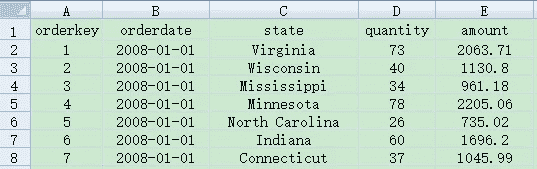
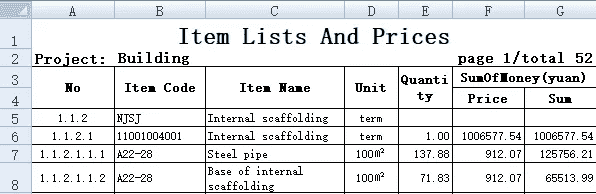
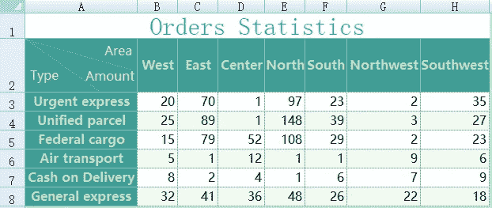
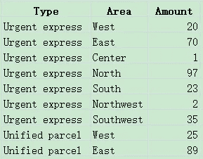

# 寻找处理 Excel 文件的最佳编程语言

> 原文：<https://medium.com/analytics-vidhya/looking-for-the-best-programming-language-for-processing-excel-files-3e83e73e93b5?source=collection_archive---------9----------------------->


Excel 文件常用于数据分析。有时需要一个程序来做分析。这要求编程语言能够方便地解析 Excel 文件。

可以解析和处理 Excel 文件的编程语言:
1。通用的高级编程语言，比如 Java
2。excel VBA；
3。Python
4。埃斯普罗克·SPL。

现在让我们看看这些语言是如何使用它们自己的方式来进行解析和处理的。在这里，我的重点是它们如何读入一个 Excel 文件作为结构化数据。仅简要说明如何根据具体要求进行后续处理、向数据库写入数据或数据操作。

# 一、高级语言(以 Java 为例)

几乎所有的高级语言都可以读取 Excel 文件。重点是，如果没有第三方专业数据检索 API，您需要编写自己的程序来根据目标 Excel 文件的结构读取数据。那需要大量的工作和努力。幸运的是，Java 有 Apache POI 来读写 Excel 文件。API 可以读取每个单元格的值和属性。现在让我们看看它是如何将 Excel 电子表格读入结构化数据的。

这里有一个简单的 Excel 文件。第一行是列标题。所有其余的行都包含详细的数据行。该文件如下:



要使用 Java 调用 POI 读取数据，我们有以下程序:

```
DataSet ds = null;   //A user-defined class that stores data read from the Excel file; 
HSSFWorkbook wb = new HSSFWorkbook( new FileInputStream( "simple.xls" ) );
HSSFSheet sheet = wb.getSheetAt( 0 );  //Assume the to-be-read data is stored in the first sheet
int rows = sheet.getLastRowNum();
int cols = sheet.getRow(0).getLastCellNum();
ds = new DataSet( rows, cols );
for( int row = 0; row <= rows; row++ ) {
        HSSFRow r = sheet.getRow( row );
        for( int col = 0; col <= cols; col++ ) {
        HSSFCell cell = r.getCell( col );
        int type = cell.getCellType();
        Object cellValue;   //Cell value object
        switch( type ) {   //Switch cell value to corresponding Java object according to its type
                case HSSFCell.CELL_TYPE_STRING:
                        ......
                case HSSFCell.CELL_TYPE_NUMERIC:
                        ......
                ......
                // The cell value handling code is omitted
        }
        if( row == 0 ) ds.setColTitle( col, (String)cellValue );
        else ds.setCellValue( row, col, cellValue );
        //Set cell values of as column headers if they are in the 1st row, otherwise set them as a data set 
        }
}
```

该程序只能读入最简单格式的 Excel 文件。即使省略了单元格值处理部分，它也相当长。如果 Excel 文件具有复杂的格式，如合并单元格、复杂的多行表头、表尾、多行记录、交叉表等，将会更长、更复杂。

即使有 POI 这样强大的开源包，用 Java 解析 Excel 文件仍然相当复杂。

此外，高级语言只提供低级功能，缺乏结构化数据计算的特殊功能，如数据集的过滤、排序、分组和聚合以及连接。程序员需要专门写他们的。因此，即使在读取和解析数据之后，仍有大量工作要做。

# 二。超越 VBA

VBA (Visual Basic for Applications)是一种基于 Visual Basic 的编程语言，可用于创建宏和扩展 Windows Office 应用程序，包括 Word、Excel、Access 等。它被嵌入到 Excel 中，以增加后者的灵活性和数据处理能力。它可以直接获取 Excel 单元格中的数据。自然的解析能力使它比 Java 这样的高级语言更方便。但是，它也缺乏结构化的计算功能。这意味着在检索数据后，您仍然需要为计算编写大量代码。

下面是进行分组和聚合的代码片段(在 sheet1 中分组列 A 和聚合列 B):

```
Public Sub test()
    Dim Arr
    Dim MyRng As Range
    Dim i As Long
    Dim Dic As Object
    Set MyRng = Range("A1").CurrentRegion
    Set MyRng = MyRng.Offset(1).Resize(MyRng.Rows.Count - 1, 2)
    Set Dic = CreateObject("Scripting.dictionary")
    Arr = MyRng
    For i = 1 To UBound(Arr)
        If Not Dic.exists(Arr(i, 1)) Then
            Dic.Add Arr(i, 1), Arr(i, 2)
        Else
            Dic.Item(Arr(i, 1)) = Dic.Item(Arr(i, 1)) + Arr(i, 2)
        End If
    Next i
    Sheet2.Range("A1") = "subject"
    Sheet2.Range("A2").Resize(Dic.Count) =   Application.WorksheetFunction.Transpose(Dic.keys)
    Sheet2.Range("B1") = "subtotal"
    Sheet2.Range("B2").Resize(Dic.Count) =   Application.WorksheetFunction.Transpose(Dic.items)
    Set Dic = Nothing
End Sub
```

解析 Excel 文件不是我们的目标。它只是为后续的计算和操作服务。虽然 VBA 有解析 Excel 数据的内在能力，但不如处理它好。

# 三。计算机编程语言

Python pandas 提供了读取 Excel 文件的接口。我们可以用 Python 读取前面的简单格式 Excel 文件，代码如下:

```
import pandas as pdfile = 'simple.xls'
data = pd.read_excel(file,sheet_name='Sheet1',header=0)
```

将参数 header 设置为 0 (header=0)意味着读取第一行作为列标题。“数据”是检索到的结构化数据集。

要读取具有复杂表格标题的 Excel 电子表格(如下所示):



Python 程序如下:

```
import pandas as pdfile = 'complex.xls'
data = pd.read_excel(file,sheet_name='Sheet1',header=None,skiprows=[0,1,2,3])
data.columns=['No', 'ItemCode', 'ItemName', 'Unit', 'Quantity', 'Price', 'Sum']
```

程序指定不读取表头，并从 5 个 throw through 参数开始跳过前 4 行(如果表尾存在，可以指定跳过表尾)。它在最后一行代码中为数据集“data”设置了别名。

要读取交叉表(如下所示):



您可以使用以下 Python 程序:

```
import pandas as pd
file = 'cross.xls'
data = pd.read_excel(file,sheet_name='Sheet1',header=1)
data = data.melt(id_vars=['Unnamed: 0'], 
        value_vars=['West', 'East','Center', 'North','South', 'Northwest','Southwest'],
        var_name='Area',
        value_name='Amount')
data.rename(columns={'Unnamed: 0': 'Type'})
```

检索到的数据如下:



用 Python 读取 Excel 文件比用 Java 简单。由于 Pandas 封装了结构化计算功能，Python 对后续计算的支持比 Java 和 VBA 更强。这些使得 Python 可以很容易地处理小的 Excel 文件，这些文件可以全部加载到内存中。

Python 的问题在于，它没有对无法一次性加载到内存中的大 Excel 文件的批处理方法。所以你必须为阅读和后续计算编写复杂的程序。阅读[Python 如何处理大文件](http://c.raqsoft.com/article/1594003670080)了解更多。

# 四。埃斯普罗克 SPL

作为专业的数据处理工具，esProc 提供了多种读取 Excel 文件的方法。esProc 所基于的脚本语言 SPL 封装了一个丰富的结构化计算函数库，该函数库可以出色地处理所有后续计算以及结果集的导出并将其写入数据库。

用于读取 Excel 数据的 esProc 程序非常简单。它只有一行代码:

1.读取简单格式的 Excel 文件

```
=file(“simple.xls”).xlsimport@t()
```

@t 选项意味着将 1 行作为列标题读取

2.阅读带有复杂表格标题的 Excel 表格

```
=file(“complex.xls”).xlsimport(;1,5).rename(#1:No,#2:ItemCode,#3:ItemName,#4:Unit,#5:Quantity,#6:Price,#7:Sum)
```

参数 1，5 指定从 5 throw 开始读取 sheet1(也可以指定结束行)；rename 函数修改列名。

```
=file(“cross.xls”).xlsimport@t(;1,2).rename(#1:Type).pivot@r(Type;Area,Amount)
```

pivot 函数按类型对记录进行分组，并执行转置。@r 选项启用列到行的转置。换位后的新列名为“面积”和“金额”。

显然，在解析 Excel 文件时，esProc SPL 生成的代码比 Python pandas 更简洁。实际上，SPL 在处理后续计算方面更有竞争力。阅读[寻找最好的轻量级数据分析脚本工具](/analytics-vidhya/looking-for-the-best-lightweight-data-analysis-script-tools-ccde17a63fc6)了解更多信息。

最重要的是，esProc SPL 拥有光标机制，可以方便地处理大型 Excel 文件的读取和计算。这使得数据分析师能够使用类似于处理少量数据的语法，以直观、简单的方式处理相对大量的数据。以读取一个格式简单的大 Excel 文件为例，使用光标的程序如下:

```
=file(“big.xlsx”).xlsimport@tc()
```

结论是:在 Python pandas 和 esProc SPL 中解析 Excel 文件都很简洁。两种语言都配备了丰富的结构化计算功能，可以很好地处理日常分析工作。