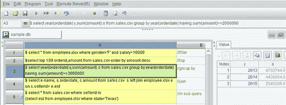

# 寻找最好的文件 SQL 工具

> 原文：<https://medium.com/analytics-vidhya/looking-for-the-best-sql-on-file-tool-7744ff3d015b?source=collection_archive---------13----------------------->

SQL 是基于数据库的。这意味着在我们可以用流行的查询语言处理文件之前，需要先将文件加载到数据库中。数据加载并不总是方便的。所以可以直接在文件上执行 SQL 的工具被设计来避免麻烦。这些工具在工作环境、可用性、SQL 执行能力和格式要求方面有很大不同。我尝试了很多，发现 esProc 对于数据分析师来说是最容易和最有效的。让我解释一下我的发现。

经过近 50 年的演变，SQL 已经成为一种流行的、成熟的、使用方便的查询语言。它的用户包括程序员、数据分析师和科学研究人员。该语言受多种平台支持，如单机上的 Access language、局域网上的 MySQL 和云上的 Hadoop。

但是要使用这种熟悉的语言来处理存储在 CSV/TSV/XLS 等格式的文件中的数据，我们需要首先将数据加载到数据库中。这既费时又费力，因为您需要创建表结构、命名字段、设置数据类型、分配权限，然后等待文件加载。当因为数据量变大，甚至巨大，需要加载几个甚至更多的文件，需要处理表空间不足或者定期更新导致的重复加载，这就很可怕了。

这还不是最糟糕的。某些文件无法加载到数据库中；有些是无法处理的，即使我们设法让他们进来。通常它们在开头或结尾包含无用数据和非法分隔符(如不可见字符和双字符)，或者具有非标准化的文本格式，如一行对应多条记录。在这种情况下，合理的方法是用 Python 或 JAVA 这样的编程语言来计算它们。这里有一个例子:

> 姓名、州名、行程
> 
> 科罗拉多州史密斯市，2020 年 1 月 2 日
> 
> 康涅狄格州杰夫，2020 年 1 月 9 日
> 
> 印第安纳州史密斯，2020 年 1 月 21 日

另外，大部分数据库都不支持导入 XLSX 文件。您需要安装 Excel 或第三方工具才能将它们放入。两者都是麻烦和头痛。使用 Excel 时，XLSX 文件需要转换为 CSV 格式才能加载。借助第三方工具，您可以直接加载它们，但必须先完成复杂的配置。有时该工具只支持 XLS 文件，而其他时候它们只支持 XLSX 的较低版本。

总而言之，将文件加载到数据库一点也不方便。

如果有一个工具可以直接对文件执行 SQL，那么数据加载就没有必要了。无装载麻烦，效率更高。此外，将不再需要数据库。性价比很高。

这种工具前景广阔，它们已经一个接一个地问世。

但是缺陷是存在的。有些是致命的。让我带你穿过它们，找到它们真正的力量。轻量级命令行工具是我的第一个目标。

**csvsql**

csvsql 本质上是紧凑和快速的。要将一个 *sales.csv* 文件分组，该文件包含按客户分类的列标题和每组的总金额，您只需要一行代码:

> d:\ CSV kit \ CSV QL \ bin > CSV SQL—查询“按客户从‘销售’组中选择客户，总和(金额)”salse.csv

不幸的是，csvsql 有更多的缺点。最大的问题是复杂的安装和配置。由于它不是一个独立的应用程序，而只是一个 Python 脚本，因此用户需要配置一个 Python 环境并下载合适的函数库才能使用第三方应用程序。这对程序员来说很容易，但对数据分析师来说就不容易了。

csvsql 没有自己的计算引擎。这是第二大问题。它有一个内置的 SQLite 数据库。在您完成 SQL 查询、创建一个表、将文件加载到 SQLite、将 SQL-on-file 转换为 SQL-on-database-table，然后执行数据库转换之后，它将在内存模式下启动它。

缺乏独立的计算引擎导致 SQL 功能有限。csvsql 必须根据 sqlite 实现设计一组 SQL 语法，并将 SQL-on-file 查询转换为 SQL-on-database-table 查询。没有坚实的技术基础，工具别无选择，只能跟风。它不能照顾到翻译的每个方面，因此放弃了许多基本功能，如 SQLites 支持的模糊查询和日期功能。

其他后果是低性能和文件大小限制。csvsql 并不真正对文件执行 sql，而是将文件导入内存进行处理。加上类型转换，这既耗时又影响性能。文件从磁盘导入内存后会扩展很多。如果文件大小大于内存空间，数据加载将会非常慢，并且很可能会出现内存溢出。因此，您必须确保文件大小合适。

这样的劣势是由于 csvsql 的技术地位较弱。这解释了它的其他缺点。

该工具仅支持文本文件。甚至常用的日常使用的 Excel 文件也不包括在内。这是第三个缺点。

第四个是它对文本格式施加了太多的限制。它只能读取最基本的 CSV 格式。为了在第一行实现分隔符定义、行跳转和列标题识别等功能，您需要使用文本编辑器进行预处理。如果在开头或结尾有无用的数据、非法的分隔符(不可见的字符和双字符)或者如果文件有非标准化的格式，您需要使用 Python 和 JAVA 这样的编程语言进行预处理。

类似的命令行工具还有很多，比如 textql、queryscv.py 和 q，本质上都是一样的，都有相同的弱点。

尽管命令行工具没有自己的计算引擎，但数据库系统有。HSQLDB 就是这样一个流行的文件上 SQL 数据库。

**HSQLDB**

一个数据库系统反映了其制造商的技术实力。HSQLDB 不仅有自己的计算引擎，还提供了强大的 SQL 语法，从连接查询和子查询到模糊查询和数据函数。这是命令行工具无法比拟的。

但是安装、管理和维护一个数据库系统并不容易。维护特别复杂。它涉及权限、磁盘空间、内存空间和缓冲空间的分配以及各种复杂参数的配置。对于数据分析师来说，它们相当困难。实际上，我们希望直接在文件上执行 SQL 的一个重要原因是为了避免数据库维护。

除了复杂的日常维护和管理，执行 SQL 的步骤也不简单。

启动 HSQLDB 服务器和客户机的命令的格式很复杂(当然，您可以选择第三方客户机工具，如 SQuirreL SQL 来完成这项工作)。

> d:\ JRE 1.8 \ bin > Java–xms 128m–xmx 2403m-CP d:\ hsql \ hsqldb . jar org . hsqldb . server . server-database . 0 file \ hsql \ database \ demo-dbname . 0 demo
> 
> d:\ JRE 1.8 \ bin > Java-xms 128m-xmx 2403m-CP d:\ hsql \ hsqldb . jar org . hsqldb . util . database manager

对于一个非 Java 专家来说，这是令人生畏的。

从客户端连接到服务器的参数配置也不简单。

在执行 SQL 查询之前，需要执行一些预处理语句来删除可能已经存在的表名，创建新的表结构并将文件映射到表上。映射需要大量的参数配置，如下所示:

> 设置表格销售来源" sales.csvfs=，；编码= UTF-8；引用=假；ignore _ first = truecache _ scale = 100 "；

除了复杂的过程之外，HSQLDB 的设计对用户不友好，而且会影响性能。它不支持自动解析数据类型，所以用户必须创建自己的表结构。许多文件，尤其是 CSV，在第一行记录字段名称。那用起来方便。但是 HSQLDB 要求用户专门指定字段名称。这使得现成的字段名完全无用。即使数据库的启动模式是服务器模式而不是内存模式，数据库也会预先将文件缓冲到内存中。这会影响整体性能，尤其是当文件相对较大时。

尽管打包在一个独立的计算引擎中，但 HSQLDB 是在数据库表上运行的，而不是真正的文件计算引擎。这解释了其不合理的设计，包括缺乏对 Excel 文件的支持以及常见和非常规的文本格式。

本质上类似的数据库产品还包括 H2 数据库和 PostgreSQL。它们有相同的优点和缺点。

总之，数据库中没有真正的文件计算引擎。我们只发现复杂的安装、管理、分配和执行程序。有没有一个桌面工具，有真正的文件计算引擎，用户友好的界面，并且简单易用？是的，有。

**OpenOffice Base**

OpenOffice Base 非常容易使用。它的一键式安装使其无需配置即可使用，并且它具有平滑和快速响应的用户友好界面。

它还有一个真正的文件计算引擎，可以直接处理文件，而不需要额外的数据加载和数据库引擎。它有三个显著的改进—自动数据类型识别、大数据处理能力和高性能。

它仍然有问题。

首先，OpenOffice Base 不支持常用的 Excel 文件，只支持文本文件。这限制了它的应用场景。

其次，它的 SQL 功能非常有限。许多基本功能都没有，比如连接查询:

> select employee.name，sales.orderdate，sales . amount from sales left join employee on sales . sellerid = employee . Eid

第三，它对文本格式的限制太多。

除了默认格式，它不支持任何其他格式的数据类型，例如下面的特殊格式的日期:

> 订单 id，客户，卖方 id，金额，订单日期
> 
> 2012 年 1 月 1 日至 2012 年 1 月 1 日
> 
> SJCH，2012 年 1 月 31 日

它不支持特殊分隔符，例如:

> 订单 id | |客户| |卖方 id | |金额| |订单日期
> 
> 1 | | UJRNP | | 17 | | 392.0 | | 2012–01–01
> 
> 2||SJCH||6||4802.0||2012 年 1 月 31 日

它不能处理复杂格式的文件，例如:

> 制片人:艾伦
> 
> 日期:2013–11–01//前两行没用
> 
> 26 //由多行组成的记录
> 
> TAS 1 2142.4
> 
> 2009–08–05
> 
> 33
> 
> DSGC 1 613.2
> 
> 2009–08–14

如果对标准格式的文本文件进行基本查询，OpenOffice Base 是首选。但现实世界的企业并不是标准化的教科书场景。经常会遇到 Excel 文件，有各种文本格式和 SQL 算法。有没有一种灵活的方法来处理动态的现实？编程语言的集成组件提供了一个相对完美的解决方案。

**微软 text/xls 驱动**

微软 text/xls 驱动程序是一个由值得信赖的供应商开发的强大工具。它很好地支持 SQL 语法。从模糊查询、日期函数到子查询和连接查询，几乎涵盖了所有可能的算法。例如，要连接两个 CSV 文件:

> select client.clientname，sales.orderdate，sales . amount from[sales . CSV]as sales left join[client . CSV]as client on sales . clientid = client . clientid

集成组件支持各种文件类型，包括 TXT/CVS/TVS 和所有版本的 XLS/XLSX。那确实是体贴的。

它为常见的文本格式提供了出色的支持，例如分隔符定义、首行上的列名标识、固定宽度的列配置和自动数据类型标识。对于复杂的文本格式，它允许通过编码来处理它们。它旨在使程序员能够阅读任何格式的文本，并在业务中实现任何算法。

微软的 text/xls 驱动器拥有一个强大的文件计算引擎。这台发动机的功能几乎齐全。唯一的一点是，它是为程序员设计的，而不是数据分析师。

使用的技术门槛高。你必须熟悉一种编程语言，C#或 VB。而且你需要掌握三个编程接口中的一个——ODBC、OLEDB、ADO。

你需要写很多难以理解的代码来执行，比如上面的 SQL 查询。以下是简化版:

> connstring = "Provider=Microsoft。ACE . OLEDB.12.0 数据源= "+path+"；扩展属性= ' textHDR =是；FMT =分隔'；"；
> 
> 数据集 ds = null
> 
> OleDbConnection conn = null
> 
> 尝试
> 
> {
> 
> conn = new oledb connection(connstring)；
> 
> conn . Open()；
> 
> oledb dataadapter my command = null；
> 
> my command = new oledb dataadapter(strSql，connstring)；//开始执行 SQL
> 
> ds =新数据集()；
> 
> 我的命令。Fill(ds，“表 1”)；
> 
> }
> 
> 捕捉(例外 e)

也很难规模化。上述代码仅适用于标准格式的文本文件。要定义字符串格式或数据类型，您需要配置文件中的 schema.in。要解析复杂格式的文本，需要编写大量额外的代码。

另一个问题是，尽管文本驱动程序和 xls 驱动程序的用途相似，但它们是相互独立的。换句话说，你不能直接连接一个文本文件和一个 Excel 文件，而是需要编写大量额外的代码。

CSVJDBC/ExcelJDBC 和 SpatiaLite 是具有不同语言环境的相似类型的集成组件。两者都要求很高。但都不如微软 text/xls 驱动。

Microsoft text/xls 驱动程序有一个完整但难以使用的文件计算引擎。OpenOffice Base 易于使用，但没有强大的文件计算引擎。所以，一个理想的工具应该是兼具两者优点并且适合数据分析师的工具。我只找到一个合格的产品。

**esProc**

与 OpenOffice Base 相同，esProc 是一个易于使用的桌面工具，无需进一步配置即可一键安装。它更容易使用，因为它允许用户直接在单元格中编写多个 SQL 语句，并在同一界面上显示计算结果。您可以通过单击保存 SQL 语句的单元格来查看结果。

esProc 有一个完整而强大的计算引擎，支持现实业务中的所有 SQL 语法(参见上面的图片)。这使它成为最好的微软文本/xls 驱动程序。

esProc 还支持 TXT/CVS/TVS 和不同版本的 XLS/XLSX。它更强大，因为它可以直接加入一个文本文件和一个 Excel 文件(见上图)。

除了标准化的档案格式之外，esProc 还可以透过其扩充功能来处理更复杂的使用者需求。例如，要解析包含分隔符“||”的文件，OpenOffice Base 是无能为力的。微软 text/xls 驱动需要写大量代码。esProc 仅使用 SQL 查询中的扩展函数来完成这项工作:

> $select * from {file("sep.txt ")。import @ t(；,"||")}

esProc 可以自动识别资料类型。要解析非默认格式的数据，例如上面提到的日期，OpenOffice 是不可用的，Microsoft text/xls 驱动程序需要 schema.ini 和额外的代码，而 esProc 通过使用一个简单的扩展函数使它看起来像是小菜一碟:

> $select * from{file("style.csv ")。import@ct(orderid，client，sellerid，amount，orderdate:date:"dd-MM-yyyy")}

要处理复杂格式的文本文件，比如一行对应多条记录，OpenOffice 无能为力，Microsoft text/xls 驱动程序需要编写大量复杂代码的资深程序员，而 esProc 只使用一个扩展函数来管理它:

> $select * from
> 
> {file("trip.csv ")。导入@tc()。新闻(trips . array(" ")；名称、状态、~:trip)}

这些是我的发现，这是我的结论。大多数文件上的 SQL 工具看起来不错，但缺乏实质性的能力。只有两个因其值得信赖的功能而脱颖而出。它们是 Microsoft text/xls 驱动程序和 esProc。前者是面向程序员的，后者是数据分析师的真正朋友。