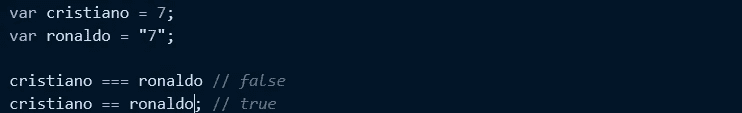
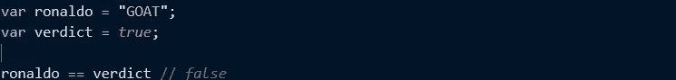

# 宽松等于(==) ||严格等于(===)

> 原文：<https://medium.com/analytics-vidhya/loose-equals-strict-equals-29969c61ef8c?source=collection_archive---------28----------------------->

菲利贝托·桑蒂兰在 [Unsplash](https://unsplash.com?utm_source=medium&utm_medium=referral) 上拍摄的照片

我问一位同事“两倍等于”和“三倍等于”(我们这么称呼它)之间的区别，他看着我的眼睛说:“两倍等于”检查值是否相等，而“三倍等于”检查类型和值是否相等，如果回答正确的话，就等着被授予奖杯。

这是一个错误的答案。

我也是这么回答的，直到我读了凯尔·辛普森的《YDKJS》。一本了不起的书。我认为所有的 JS 程序员都会从阅读中受益匪浅。

好吧，回到课堂。

正确答案是，松散等号(==)允许在相等比较中进行强制，而严格等号(===)不允许。

花点时间消化一下。

在前一种情况下(回答不准确)，似乎**" = = "**比 **"=="** 做得更多，因为它还必须检查类型。在正确答案中， **"=="** 做了更多的工作，因为如果值是不同的类型，它必须处理强制。

不过这与性能无关， **"=="** 不会比 **"==="** 慢。如果比较两个相同类型的值， **"=="** 和 **"==="** 使用相同的算法。如果你比较两个不同类型的值，性能不是重要的因素。最大的问题应该是:在这次行动中，我到底要不要强迫？

如果你想要强制，用 **"=="** ，但是如果你不想强制，用**" = = "**。

在 Es5 规范的第 [11.9.3 节中， **"=="** 操作符的行为被定义为“抽象等式比较算法”。](https://www.ecma-international.org/ecma-262/5.1/#sec-11.9.1)

第一个子句(11.9.3.1)说，如果被比较的两个值属于同一类型，那么它们只是基于它们的同一性进行比较。即 42 只等于 42，“foo”只等于“foo”。

11.9.3 中算法的其余部分规定，如果使用==来比较不同类型的值，则需要隐式强制一个或两个值。这种强制会发生，因此这两个值最终会成为相同的类型，从而可以基于值的同一性来评估它们是否相等。

## **比较:字符串与数字**

对于克里斯蒂亚诺===罗纳尔多返回 false，我们并不感到惊讶，因为不允许强迫。

然而，**cristiano = = Ronaldo**comparison 使用松散等式，这意味着如果其中一个值恰好是不同的类型，比较算法将对其中一个或两个值执行隐式强制。

您可能想知道值之间发生了什么样的强制。**克里斯蒂亚诺**的值是被强制为字符串还是**c 罗**的值被强制为数字？

让我们看看 [ES5 规范第 11 . 9 . 3 . 4–5 条](https://www.ecma-international.org/ecma-262/5.1/#sec-11.9.1)是怎么说的:

> 1.如果 Type(x)是 Number，Type(y)是 String，则返回比较结果 x == ToNumber(y)。
> 
> 2.如果 Type(x)是 String，Type(y)是 Number，则返回 Number(x) == y 的比较结果。

从规范中，我们可以推断出， **ronaldo** 是一个字符串(" 7 ")，通过 **ToNumber** 抽象操作被强制转换为一个数字(7)，然后，当比较这些值是否相等时，它返回 **true** ，因为结果值现在相等。

## **比较:将任何内容转换为布尔值**

当您试图将一个值直接与**真**或**假**进行比较时，松散等式(==)的隐式强制的最大问题之一就会出现。

考虑:

WTF？怎么会**罗纳尔多**这是一个“真值”，而不是**“= =”**为真。

giphy 的 gif

让我们来看看 [ES5 规范第 11 . 9 . 3 . 6–7 条](https://www.ecma-international.org/ecma-262/5.1/#sec-11.9.1):

> 1.如果 Type(x)是 Boolean，则返回 Number(x) == y 的比较结果。
> 
> 2.如果 Type(y)为布尔值，则返回比较结果 x == ToNumber(y)。

因此，在我们的示例代码中应用规范:Type (verdict)是布尔值，所以执行 **ToNumber(verdict)** 来强制其值变为 1 (true == 1)。

现在， **1 == "山羊"**求值。类型还是不一样的，于是算法被重新协商(递归)，它会试图将“山羊”强制为一个明显失败的数: **NaN** ，1 == NaN 为 **false** 。

“GOAT”确实是真的，但是**“GOAT”= =真**根本不是在执行布尔测试/强制。**“山羊”**不是被胁迫为一个布尔(真)，而是，**真**被胁迫为 1，然后【山羊】被胁迫为楠。

**ToBoolean** 甚至没有涉及，所以【山羊】的真假与 **==** 操作无关。每当布尔值在 **==** 的两边时，它总是先强制为一个数字。是啊，真奇怪。

建议在任何情况下都不要使用 **==真**或 **==假**。

## **隐式强制的安全使用**

注意可能出现在 **==** 比较的任何一边的值。为了有效地避免这种比较的问题，这里有一些启发性的规则可以遵循:

1.如果比较的任何一方可以有**真**或**假**值，永远不要使用 **==** 。

2.如果比较的任何一方可以有 **[]** ， **""** ，或者 **0** 的值，认真考虑不用 **==** 。

最好使用严格的等式而不是宽松的等式，以避免不必要的强制。遵循以上规则将会大大有助于防止所有可能伤害你的强制手段。

我希望你们都保持安全和强壮？