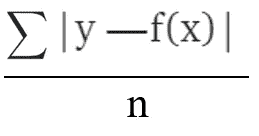
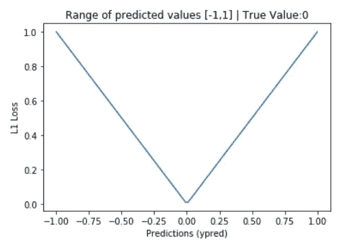
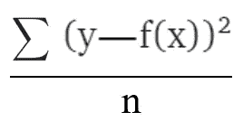
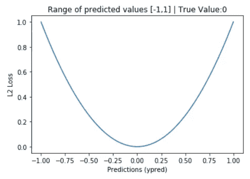
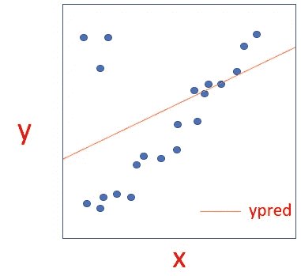
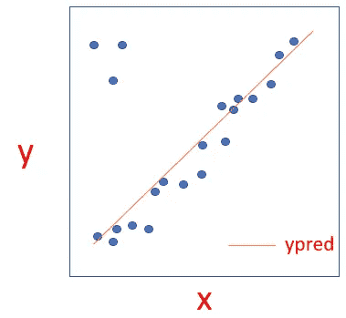
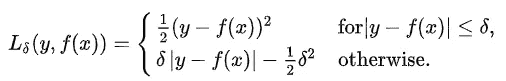
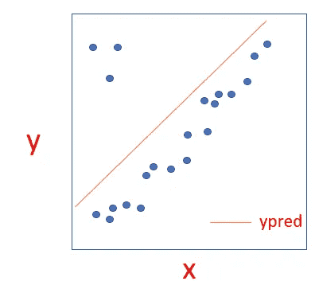
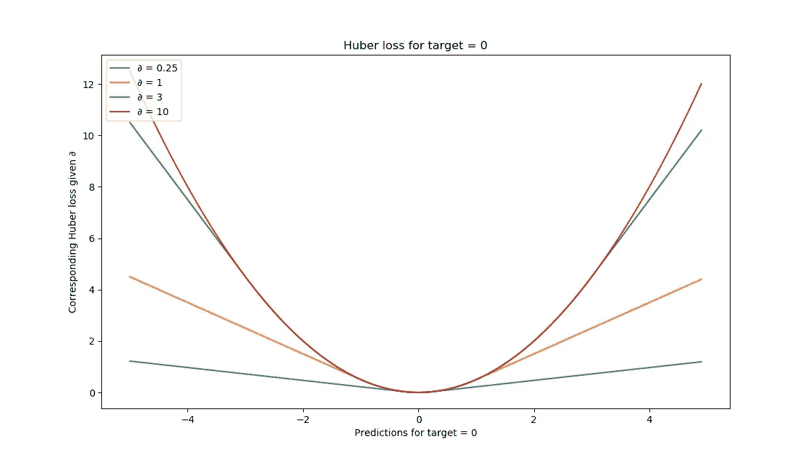

# 神经网络中的损失函数和代价函数

> 原文：<https://medium.com/analytics-vidhya/loss-function-and-cost-function-in-neural-networks-4ade0c9ccb18?source=collection_archive---------7----------------------->

读者们，你们好…欢迎。

神经网络是个时髦词。这是新冠肺炎，我们都称我们的医生为英雄，现在我们知道谁是真正的英雄。但是，有没有人注意到数据科学家是如何试图从 covid 19 数据中获得洞察力的，无论是数据可视化，只要你打开[https://www.covid19india.org/](https://www.covid19india.org/)就可以看到，还是他们是试图通过神经网络找到这个疫情的解决方案的数据科学家。这个领域在普通人中不太受欢迎，但至少我们知道这些神经网络有多强大？为了使它们更加强大，我们需要使用适当的激活函数、优化器和损失函数。在本文中，我们将讨论回归问题的损失函数和成本函数。

> **什么是损失函数？**
> 
> 它只是真实值与预测值的偏差，现在可以是平方差或绝对差等形式。
> 
> **现在，什么是成本函数？**
> 
> 虽然损失函数仅针对一个训练示例，但是成本函数考虑了整个数据集。要了解清楚，等一段时间。以下内容将帮助您更好地了解。

神经网络中会发生什么？

我们将输入分配给神经网络，然后分配权重，输入乘以权重，然后应用激活函数，现在这个输出充当下一层神经元的输入，直到我们没有到达输出神经元。现在，很明显，预测值不会只在一个时期与实际值相同，会有一些偏差。这就是所谓的损失，现在这个损失将被优化器在反向传播过程中通过调整权重来优化，直到我们得到最小的损失。

“作者提供的图像”

**现在我们来研究不同的损失函数。**

> **损失函数的类型**
> 
> *回归损失函数
> 
> *分类损失函数

**回归损失函数**

回归是一个有监督的机器学习问题，其中输出是一个连续值。在本文中，我们将研究的损失函数是:

*   L1 损失(最小绝对偏差/平均绝对误差)
*   L2 损耗(最小平方误差(LS)/均方误差(MSE))
*   胡伯损失

下面就一个一个说吧。

1.  **L1 损失(最小绝对偏差/平均绝对误差)**

现在，很自然地认为我们可以简单地去寻找真实值和预测值之间的差异。

**警惕！—** 假设两个训练输入分别为 100 和 70，但预测值分别为 120 和 50，这不是一个好主意。在这里，如果我们去找出损失，它将是((100–120)+(70–50))/2 = 0。它应该是零吗？不，一定不是，因为它会误导人。这叫做**平均偏差误差。**

**解-** 取绝对差。这就是我们所说的 **L1 损失。**

设 y 为真值，f(x)为预测值

**L1 损失= |y — f(x)|**

**L1 成本函数=**

“作者提供的图像”

让我们看看 L1 损失的图表，如果真值是 0，预测值从-1 到 1。

“作者提供的图像”

> **优点**
> 
> 对异常值稳健
> 
> **缺点**
> 
> 正如我们从图中看到的，它并不平滑，梯度计算在这里并不容易，由于不连续点，所以它不能通过梯度下降来优化，而是通过“子梯度”来优化，这增加了复杂性。

**2。L2 损失(最小平方误差/均方误差)**

正如我们在 L1 损失中看到的，导数是一个问题，我们需要一些函数，导数计算将是平滑的。我有一个主意——让我们用 L2 损失。

**L2 损失= (y — f(x))**

**成本函数=**

“作者提供的图像”

让我们也看看这个图表。

“作者提供的图像”

由于图的二次型，L2 损耗也称为二次损耗，而 L1 损耗可以称为线性损耗。

> **优点**
> 
> *平滑曲线
> 
> *易于推导
> 
> **缺点**
> 
> 假设我们的训练值为 1、2、3、5，预测值分别为 1.1、1.9、3.2、20。现在错误将会是
> 
> = ((1–1.1)² + (2–1.9)² + (3–3.2)² + (5–20)²) / 4
> 
> = (0.01 + 0.01 + 0.04 + 225)/4
> 
> = 56.265
> 
> 正如我们所看到的，对损失的最大贡献是由 20(由于数字的平方)完成的，这是异常值。这导致了问题，因为当优化器试图减少损失时，拟合的线将是这样的(如下所示)，因为它将尽力拟合所有点。我们本可以与异常值妥协，因为它们的存在使我们也对非异常值的准确性妥协。

“作者提供的图像”

在这里，在这种情况下，L1 损失会更好，因为它对异常值是稳健的。适合的线将是

“作者提供的图像”

**3。胡贝尔损失**

现在，正如我们所看到的，L1 和 L2 的损失各有利弊，但如果我们利用它们来弥补彼此的不足呢？是啊，这似乎是个好主意。当误差较小时，由于 L2 损失在那里工作得更好，在这种情况下让我们使用 L2 损失，当误差由于异常值而较高时，让我们使用 L1 损失。听起来很神奇！！如果你认为你发明了一个想法。真的很抱歉亲爱的，这个想法甚至在你知道之前就被发明了。这是 Huber 损失背后的想法。

**𝛿** 是超参数，我们可以通过点击和尝试来设置。如果你认为，回归损失函数解决了这个问题，很抱歉你不能躺下，因为有了这个损失函数，结果仍然是无用的。让我们看一下之前的数据集示例。让我们看看它的图表。

“作者提供的图像”

让我们也看看 **𝛿** 如何影响我们的预测。

来源:[https://www . machine curve . com/index . PHP/2019/10/12/using-Huber-loss-in-keras/](https://www.machinecurve.com/index.php/2019/10/12/using-huber-loss-in-keras/)

对于 **𝛿 = 1，**我们可以看到，它在左右两边是线性的，在中间是二次的。所以，这是 L1 和 L2 损失的结合。随着 **𝛿** 的增加，我们可以看到它变得越来越二次，因为更高的𝛿意味着我们也允许较大的误差，在 L1 和 L2 的这种组合中，L2 损耗的贡献会更大。

**注意:**明智地使用损失函数，因为它们要么能让你的神经网络更强大，要么就是垃圾。