# 熵、损失函数及其背后的数学直觉

> 原文：<https://medium.com/analytics-vidhya/loss-functions-and-the-mathematical-intuition-behind-them-fec4ac95b117?source=collection_archive---------6----------------------->


损失函数是任何深度学习问题中必不可少的一步。首先，什么是损失函数？

> 损失函数只是一种评估方法，它提供了关于模型运行情况的信息。如果使用该模型的预测与真实值完全不同，那么损失函数输出更大的数字。当您进行更改以改进模型时，损失函数将告诉您模型实际上是否在给定数据集上显示出任何改进。

损失函数给出了我们的分类器有多好的想法，它量化了你对现有分类器有多满意

在本次讨论中，我们将主要关注分类损失函数。在探索不同的损失函数之前，我们需要知道概率分布和熵

# 概率分布

> 概率分布是实验中所有结果概率的集合。分布中的每个概率必须介于 0 和 1 之间(0 和 1 包括在内)，并且分布中所有概率的总和必须等于 1。

如果 x，y，z 是实验中 3 个不同结果类别的概率。它必须满足以下条件

> x + y + z = 1 且 0≤ x ≤ 1，0≤ y ≤ 1，0≤ z ≤ 1

[0.5，0.89，0.6] →不是概率分布

[0.05，0.89，0.06] →是一个概率分布

# 熵

> 熵是信息随机性的量度。统计术语中的熵定义了信息概率分布的无序或不确定性的度量。熵越高，就越难从这些信息中得出任何具体的结果。

让我们用一个例子来探讨这个问题。考虑下图。

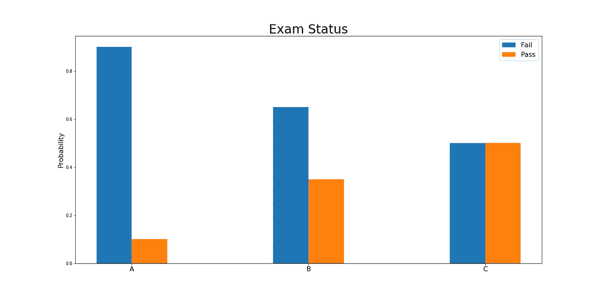

假设有三个学生完成了考试，正在等待结果。

学生 A 知道他有 90%的机会考试不及格，而通过的机会是 10%

学生 B 知道他有 70%的可能考试不及格

但是学生 C 面临着 50%的考试及格或不及格的可能性。

在 3 名学生中，学生 C 面临着更高的不确定性。这意味着学生 C 的熵比其他两个高。让我们用数学方法来证明这一点

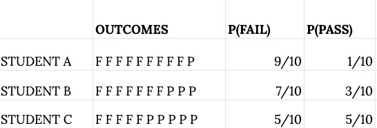

图一

考虑学生 A

通过概率→ 10%，失败概率→ 90%

你可以把它看作一个 10 个结果的实验，其中 9 个是 F，1 个是 P

学生 FFFFFFFFFP

P(F) = 9/10，P(P) = 1/10

A 的结果= [ F，F，F，F，F，F，F，F，F，F，P]

学生 B 和学生 C 采用了类似的方法(图 1)

所有学生所有结果概率的乘积

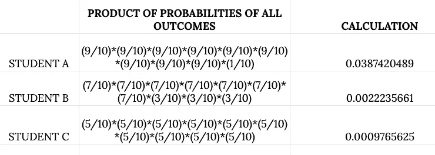

图 2

现在想象一下，如果我们有两个以上的结果，概率的乘积将产生一个非常小的数字。我认为大多数人更喜欢处理总数而不是乘积。将乘积转换为总和的一种方法是使用日志。

**log(ab) = log(a) + log(b)**

所有学生的所有结果的概率乘积的对数

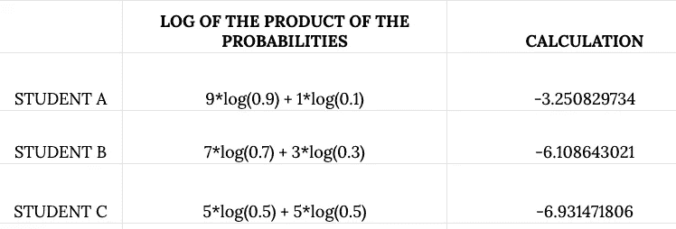

图 3

所有学生的所有结果概率乘积的结果对数的平均值

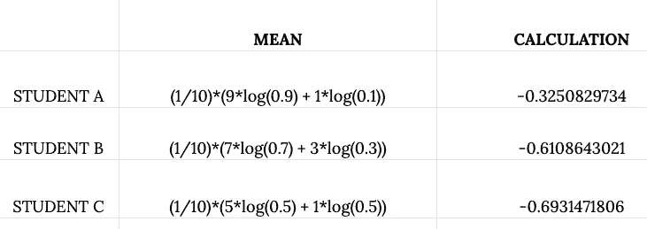

图 4

熵是平均值的负值

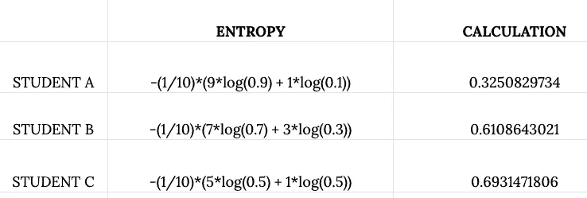

图 5

学生 C 的熵更大，这意味着学生 C 面临着所有学生中最高的不确定性。

利用 python 中的 scipy 模块计算熵

```
from scipy.stats import entropyentropy_st_a = entropy([9/10, 1/10])
#entropy_st_a = 0.3250829733914482entropy_st_b = entropy([7/10, 3/10])
#entropy_st_b = 0.6108643020548935entropy_st_c = entropy([5/10, 5/10])
#entropy_st_c = 0.6931471805599453
```

# 什么是交叉熵？

> 交叉熵在深度学习中被用作损失函数。在熵中，我们只处理一种概率分布。在交叉熵中，我们处理两种不同的概率分布。

第一个分布由真值组成。第二个分布由估计值组成。

交叉熵是两个概率分布之间差异的度量。

让我们通过一个例子来了解交叉熵

考虑包含 4 个不同结果的单个记录

该记录的 4 个结果的真实概率是[0.2，0.3，0.4，0.1]

你在一些分类器或模型的帮助下估计了该记录的 4 个结果的概率。

你估计的概率是[0.4，0.4，0.1，0.1]

真值 t1，t2，t3，t4 = 0.2，0.3，0.4，0.1

估计值 p1，p2，p3，p4 = 0.4，0.4，0.1，0.1

熵(对于真值 t) = -t*log(t) →熵只需要一个分布

交叉熵(对于真概率 t 和估计概率 p) = -t*log(p) →交叉熵需要两个分布来比较自己。

> 交叉熵越高，两个概率分布之间的差异就越大

> 交叉熵损失是机器学习或深度学习中分类问题中最常用的损失函数。

一般来说，在机器学习中，他们使用不同的术语来表示交叉熵，它被称为**对数损失**

在深度学习中，有 3 种不同类型的交叉熵损失

1.  二元交叉熵损失→当类别数或目标类别中的结果数为 2 时交叉熵的名称
2.  分类交叉熵损失→当类别数或目标类别中的结果数大于 2 且结果的真值为 1 时交叉熵的名称。
3.  稀疏分类交叉熵损失→当目标类中的类数或结果数大于 2 并且结果的真值不是一个热点时的交叉熵的名称。

因此，我们将研究所有 3 种不同的损失函数

# **二元交叉熵损失**

假设您正在处理一个只涉及两个类和三个记录的分类问题

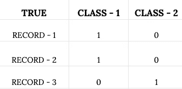

这三个记录的真实类别是[[1。, 0.], [1., 0.], [0., 1.]]

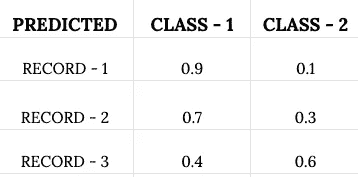

这些记录的预测概率是[[0.9，. 1]，[0.7，. 3]，[0.4，. 6]]

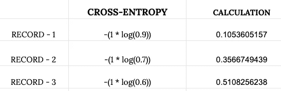

导入 NumPy 以实现高效的数值计算

```
import numpy as nptrue_values = np.array([[1.,0.],[1.,0.],[0.,1.]])predictions = np.array([[.9,.1], [.7,.3], [.4,.6]]true_values[0] = [1.,0.]
predictions[0] = [.9,.1] bce_loss_first = -(1 * np.log(0.9))
#bce_loss_first = 0.10536051565782628true_values[0] = [1.,0.]
predictions[0] = [.7,.3]bce_loss_second = -(1 * np.log(0.7))
#bce_loss_second = 0.35667494393873245true_values[0] = [0.,1.]
predictions[0] = [.4,.6]bce_loss_third = -(1 * np.log(0.6))
#bce_loss_third = 0.5108256237659907
```

我们已经计算了各个记录的所有单个损失

发生的最终损失或由此产生的成本通过取所有单个损失的平均值来计算。

```
loss = (bce_loss_first + bce_loss_second + bce_loss_third)/3
#loss = 0.3242870277875165
```

现在，我们使用相同的记录和相同的预测，并通过使用 Keras 中内置的二元交叉熵损失函数来计算成本

```
import tensorflow as tf
from tensorflow.keras.losses import BinaryCrossentropy#tensorflow is imported to convert records into tensors#importing the Keras Binary Cross-Entropy function
bce_loss = BinaryCrossentropy()m = tf.cast([[1.,0.],[1.,0.],[0.,1.]], tf.float32)n = tf.cast([[.9,.1], [.7,.3], [.4,.6]], tf.float32)loss = bce_loss(m,n).numpy()
#loss = 0.32428685
```

使用和不使用高级功能 API，我们都获得了相同的结果。

现在基于我们获得的直觉，我们将建立我们自己的二元交叉熵损失函数。这是我们到目前为止在函数中讨论的要点。

```
def binary_cross_entropy(true_values,predictions):
    y_true = tf.cast(true_values,dtype=tf.float32)
    y_pred = tf.cast(predictions,dtype=tf.float32)
    X = tf.multiply(y_true,tf.math.log(y_pred))
    return (-tf.reduce_sum(X)/len(y_true)).numpy()true_values = [[1.,0.],[1.,0.],[0.,1.]]
predictions = [[.9,.1], [.7,.3], [.4,.6]]loss = binary_cross_entropy(true_values, predictions)
#loss = 0.32428703
```

# **分类交叉熵损失**

> 二元交叉熵是范畴交叉熵的一个特例

假设您正在处理一个只涉及 3 个类别/结果和 3 个记录的分类问题。

真实的结果是一个热编码

这些记录的真实类别或结果

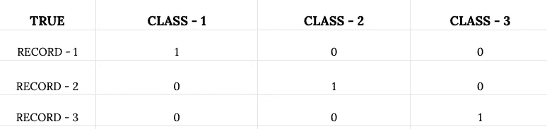

这些记录的预测概率

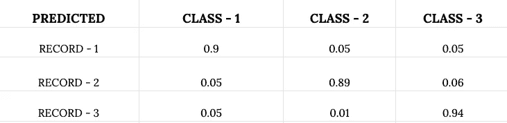

```
import numpy as nptrue_values = [[1., 0., 0.], [0., 1., 0.], [0., 0., 1.]]predictions = [[.9, .05, .05], [.05, .89, .06], [.05, .01, .94]]true_values[0] = [1., 0., 0.]
predictions[0] = [.9, .05, .05]celoss_first = -(1 * np.log(0.9))
#cce_loss_first = 0.10536051565782628true_values[0] = [0., 1., 0.]
predictions[0] = [.05, .89, .06]cce_loss_second = -(1 * np.log(0.89))
#cce_loss_second = 0.11653381625595151true_values[0] = [0., 0., 1.]
predictions[0] = [.05, .01, .94]cce_loss_third = -(1 * np.log(0.94))
#cce_loss_third = 0.06187540371808753
```

发生的最终损失或由此产生的成本通过取所有单个损失的平均值来计算。

```
loss = (cce_loss_first + cce_loss_second + cce_loss_third)/3
#loss = 0.09458991187728844
```

使用相同的记录和相同的预测，通过使用 Keras 中内置的分类交叉熵损失函数来计算成本

```
from tensorflow.keras.losses import CategoricalCrossentropytrue_values = [[1., 0., 0.], [0., 1., 0.], [0., 0., 1.]]
predictions = [[.9, .05, .05], [.05, .89, .06], [.05, .01, .94]]cce = CategoricalCrossentropy()
loss = cce(true_values, predictions).numpy()
#loss = 0.09458993
```

现在，基于我们获得的直觉，我们将建立我们自己的分类交叉熵损失函数。这是我们到目前为止在函数中讨论的要点。

```
def categorical_cross_entropy(true_values,predictions):
    y_true = tf.cast(true_values,dtype=tf.float32)
    y_pred = tf.cast(predictions,dtype=tf.float32)
    X = tf.multiply(y_true,tf.math.log(y_pred))
    return (-tf.reduce_sum(X)/len(y_true)).numpy()true_values = [[1., 0., 0.], [0., 1., 0.], [0., 0., 1.]]
predictions = [[.9, .05, .05], [.05, .89, .06], [.05, .01, .94]]loss = categorical_cross_entropy(true_values,predictions)
#loss = 0.09458993
```

# 稀疏分类交叉熵

真实的结果**不是一个热编码**

类别或结果编号从 0 开始。如果存在 4 个结果或 4 个类别，则类别标签为 0、1、2、3

考虑一个由 6 条记录组成的例子，每条记录有 3 个结果

真实结果

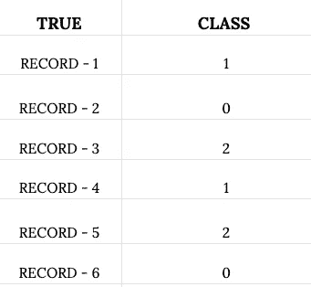

所有记录的结果估计概率

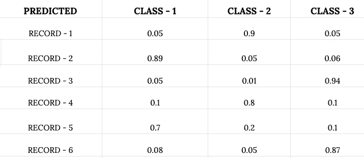

我们可以采用两种方法来计算损失

一种方法是通过将真实标签或真实结果类别转换成一个热标签，并遵循与我们在分类交叉熵损失中遵循的相同过程

我们将通过上面的例子探索第二种方法

```
true_values = [1, 0, 2, 1, 2, 0]predictions = [
    [.05, .9, .05],
    [.89, .05, .06],
    [.05, .01, .94],
    [.1, .8, .1],
    [.7, .2, .1],
    [.08, .05, .87]
]
```

现在我们得到了预测值和真值，预测值和真值的数量是相同的

现在考虑 true_value 中的每个项目和基于各自索引的预测中的每个项目

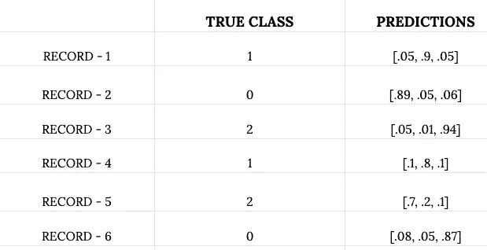

现在从预测中提取真实类别的估计概率

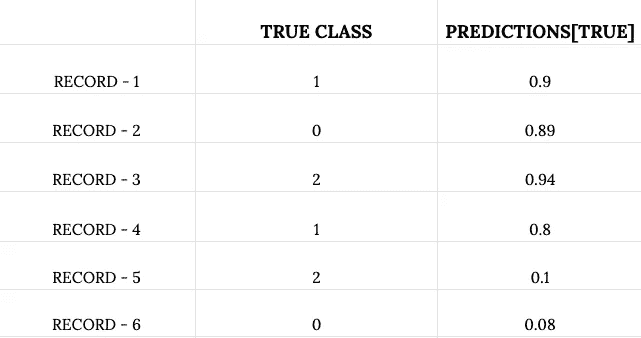

出现所有真实类别的概率，相对于真实类别= 1，以及出现所有估计类别的概率，相对于真实类别=预测[真]

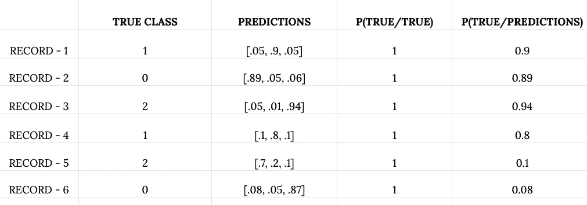

计算每条记录的交叉熵，将每条记录的 P(真/真)和 P(真/预测)中的每个值视为两个分布

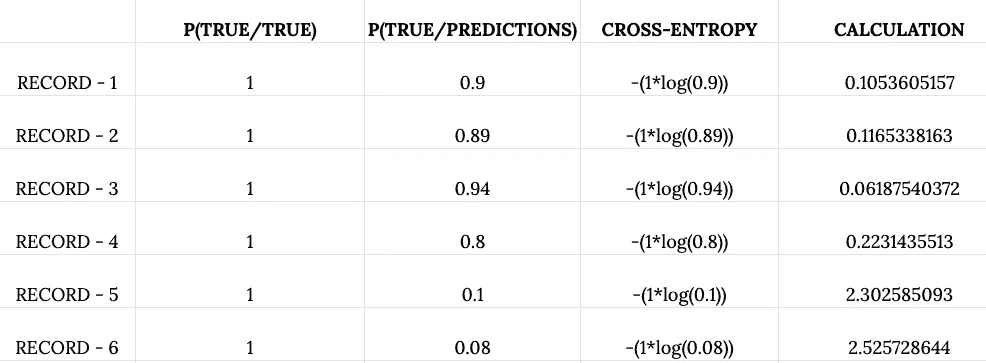

该数据集的交叉熵损失=所有记录的单个交叉熵的平均值，它等于**0.8840413961**

单项损失的计算

```
individual_ce_losses = [-np.log(predictions[i][true_values[i]]) 
for i in range(len(true_values))]
```

通过取单个损失的平均值计算最终损失

```
loss = np.mean(individual_ce_losses)
#loss = 0.8892045040413961
```

使用相同的记录和相同的结果估计，使用 Keras 中的稀疏分类交叉熵函数计算稀疏分类交叉熵

```
cce = tf.keras.losses.SparseCategoricalCrossentropy()
loss = cce(
    tf.cast(true_values,dtype=tf.float32),
    tf.cast(predictions, dtype=tf.float32)
).numpy()#loss = 0.8892045
```

基于我们获得的直觉，我们将构建我们自己的稀疏分类交叉熵损失函数。

```
def sparse_categorical_cross_entropy(true_values, predictions):
    y_t = tf.cast(true_values,dtype=tf.int32)
    y_p = tf.cast(predictions,dtype=tf.float32)
    losses = [-np.log(y_p[i][y_t[i]]) for i in range(len(y_t))]
    return np.mean(losses)loss = sparse_categorical_cross_entropy(true_values, predictions)
#loss = 0.8892045
```

# 结论

这是关于一些分类损失函数如何工作的简短讨论。我们讨论了它们背后的数学原理，从头开始构建，以及如何通过使用 API 来使用它们。

> 您将在 [github](https://github.com/ambatiashok60/Deep-Learning/tree/master/Loss%20Functions%20and%20their%20Mathematical%20intuition%20) 找到与我们的讨论相关的完整代码和数据文件