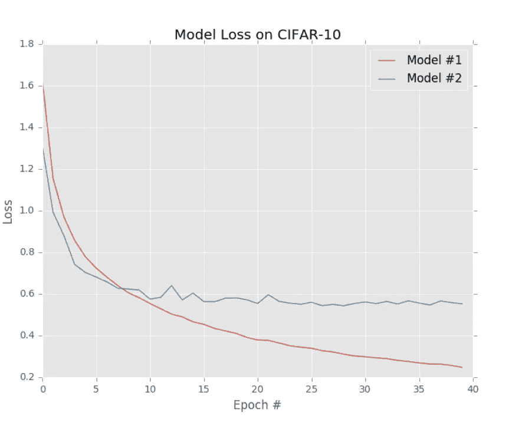
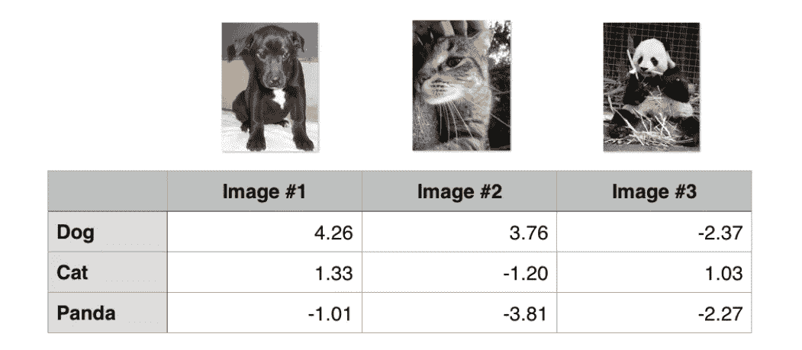
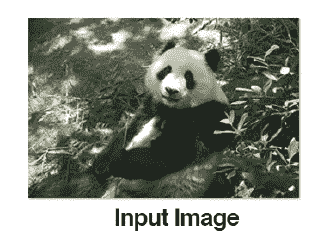
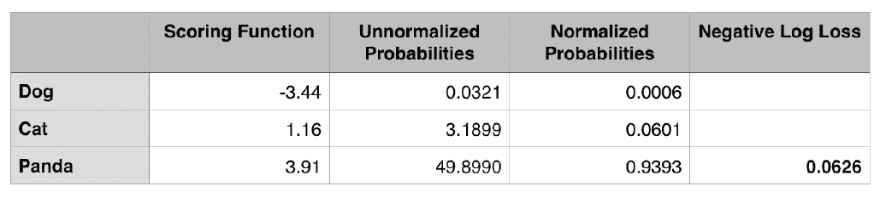

# 损失函数——多类 SVM 损失和交叉熵损失

> 原文：<https://medium.com/analytics-vidhya/loss-functions-multiclass-svm-loss-and-cross-entropy-loss-9190c68f13e0?source=collection_archive---------4----------------------->

为什么损失函数在机器学习应用中更重要？在我的上一篇文章中，我们讨论了[参数化学习](/analytics-vidhya/parameterized-learning-91f701f9cabb)，这种类型的学习将把一些数据作为输入和类别标签。实际上，通过定义一些参数，如权重和偏差，可以学习一个函数来将输入映射到预测的类别标签。

首先，在进入 SVM 和交叉熵损失函数之前，我们将会看到一条损失曲线是怎样的，并有所了解。



损失曲线

上图是在 CIFAR-10 数据集上训练的两个不同模型的损失曲线。从图上的这两条线我们可以观察到什么？

1.  模型 1(红线)——随着模型训练时间的延长，损耗下降
2.  模型 2(蓝线)—损耗最初开始下降，但在 10 个时期后，它停止下降。

更好的分类器模型将具有更低的损失。(但并不总是“过拟合”是另一个概念，我们可以在后面讨论)。

> 我一直在说“损失之上”,有些人可能理解，有些人可能不理解，但对于那些没有经历过这个术语的人来说。损失是根据你的真实类别标签和预测类别标签计算的分数。假设你已经训练了一个模型来对狗和猫的图像进行分类，模型将以 0.97 的概率预测你的输入图像为猫，0.03 的概率为猫，你的真实标签和预测概率之间的差异只不过是一个损失。

基本上，该模型将根据您的损失进行训练，并更新/优化参数(权重和偏差)，以更好地预测数据。

# 多级 SVM 损耗

多类 SVM 损失(顾名思义)受(线性)支持向量机(SVMs)的启发，它使用评分函数 f 将我们的数据点映射到每个类别标签的数值分数。

让我们用一个例子来理解多类 SVM。



在这个例子中，你有三张图片狗，猫和熊猫，每张图片分为三类，每张图片有三个值。

> 公式:损失=最大值(0，预测-原始+1)

对于第一个图像，真实标签是狗，其预测值为狗 4.26，猫 1.33，熊猫-1.01。

```
image_1 = max(0, 1.33–4.26 + 1) + max(0, -1.01–4.26 + 1)
```

类似地，计算所有图像的损失，并将所有输入图像的计算值相加。损耗值的平均值只不过是 SVM 损耗(铰链损耗)

```
image_2 =max(0, 3.76 — (-1.20) + 1) + max(0, -3.81 — (-1.20) + 1)image_3 =max(0, -2.37 — (-2.27) + 1) + max(0, 1.03 — (-2.27) + 1)loss = (image_1 + image_2 + image_3) / 3.0
```

# 交叉熵损失



我们的目标是将输入图像(熊猫)分类为狗、猫或熊猫。这涉及三个步骤。

第 1 步—我们将根据使用的函数获得三个类别中每个类别的得分值，就像我们在多类别 SVM 中获得的一样。

步骤 2-对评分函数的结果求幂，以获得非标准化概率

步骤 3-计算未标准化概率的总和，并将每个值除以总和以获得标准化概率(Softmax 图层)

步骤 4-从步骤 3 中，我们实际上获得了输入图像所属的类，但是为了评估我们的值有多好，我们需要对归一化概率应用负自然对数。

然后，我们可以对训练集中的所有图像重复这一过程，取平均值，并获得训练集的总体交叉熵损失。这个过程允许我们量化一组参数在我们的训练集上表现的好坏。

这将通过一个实际例子阐明如何计算多类和交叉熵损失。我希望这有所帮助。

继续读！！！

# 参考:

Adrian Rosebrock 用 Python 实现计算机视觉的深度学习(入门包)