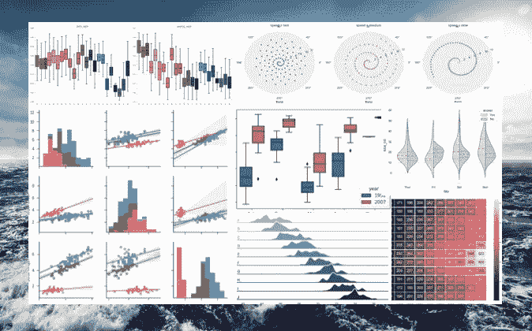

# 使用 Seaborn 和 Squarify 轻松制作美丽的情节！

> 原文：<https://medium.com/analytics-vidhya/love-the-ocean-love-seaborn-2e8737bef728?source=collection_archive---------3----------------------->

**为什么是 Seaborn？**

当您进行数据可视化或解释性数据分析时，您通常会探索所有感兴趣的变量的分布，以及它们的联合分布或获得汇总统计数据(最小值、最大值、中值等。)通过一些分类变量。您可能对自己的库(如 Matplotlib)或包(如 ggplot2)感到满意。那么，为什么 Seaborn…