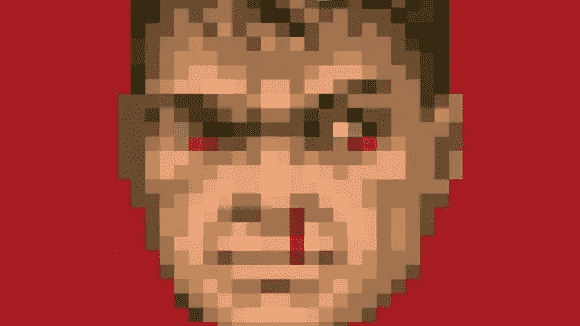
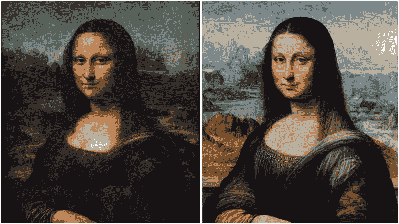
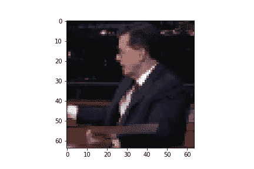
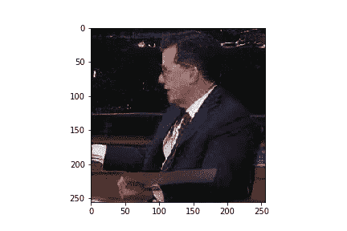

# 低分辨率图像分类挑战

> 原文：<https://medium.com/analytics-vidhya/low-resolution-image-classification-e725a4c31fd2?source=collection_archive---------8----------------------->

这篇文章背后的主要思想是检查低分辨率图像分类的可能性。

在我们看来，许多技术细节被跳过，以保持在更有趣和更有价值的流程上。所有的技术可以通过链接找到在“结果和代码”部分的代码在最后。

如果你对讲故事感兴趣，你可以从这里继续，否则跳到“解决方案”部分。

# I 简介

想象一下，从视频序列中得到一大组低分辨率的名人图像，你几乎无法将其与樱桃派区分开来。

你可能会想，也许有一种方法可以让它变得更简单，那就是使用一个简单的(或不简单的)卷积网络来完成这项工作。一分钟后，你可能会想:“我知道卷积神经网络有可能非常准确地识别人类，但我们仍然在谈论这样的情况，即从统计学角度来看，人们可以首先清楚地识别图像中的内容。”

所以你开始考虑给照片添加更多的数据(特征):在这次黑客马拉松中，它被广泛地给出——图像中人的物理姿势估计，这是准确的。

现在，你会尝试什么？我想到了一种基于 RNN 和卷积的架构的组合:通过使用 CNN 来识别图片并向 RNN 提供建议，后者又被训练来基于给定的标签(因为它是视频序列)预测下一个姿势(移动)。这种 RNN 方法的灵感来自[这里](https://github.com/stuarteiffert/RNN-for-Human-Activity-Recognition-using-2D-Pose-Input)。

例如:如果我们有一部电影中 Chuck Norris 的视频序列，并且我们有他在每一帧中的姿势估计，我们可以让我们的 RNN 模型学习他的下一步动作。因此，CNN 在第一帧给了 RNN 查克的标签，现在它为他在下一帧的下一步行动做出了估计。如果这些动作与下一个(可见的)查克·诺里斯上钩拳有足够好的关联，那么我们就很好(或者不好)。或者类似的东西。

我们没有太多的时间来处理风险，因为这是黑客马拉松挑战的一部分。我们不确定是否可以依赖于将姿势估计与 CNN 相结合，以及一个人的运动与其他人的运动有何不同，所以我们决定在其他地方寻找额外的特征(尽管我们可能会在未来尝试这种方法)。

坦白地说，我对 GANs 略知一二，唯一的问题是他们的负载和他们在这种情况下的可靠性，所以我们去了。

# 解决办法

GANs 的妙处就在于这个创意:制作两个模型——*发生器*和*鉴别器*，让它们竞争，得到 G *发生器*产生的最佳结果。这个想法证明了自己是各种创作，尤其是视觉创作的好仿冒者。

为了了解照片里的人是谁，谁创作了这张照片并不重要。

经过简短的研究，我们发现了一种超分辨率 GAN(SRGAN)架构的可靠来源，这种架构将通过向图像添加预测特征来改变图像的分辨率。你可以在这个 [arxiv](https://arxiv.org/pdf/1609.04802.pdf) 中读到这个拱门。

在图像采取新的形状后，分类过程将以 CNN 的形式到达。

深度卷积神经网络的美妙之处在于它们能够识别特征，而这些特征反过来又能带来更好的预测结果。

卷积神经网络可视化。

原始图像。

SRGAN 的增强图像。

> *因此直觉:*

如果有一组特定的特征有助于找出图像中的人是谁，那么图像是真是假就无关紧要了。

GANs 能生成这组特征吗？我们决定一探究竟。

假设是:

**SRGAN + CNN =更好的低分辨率(现在高)图像分类。**

# 数据和预处理

整个数据集是大约 500，000 个 shape (64，64，3)图像，在 100 个名人视频和序列之间不相等地划分。

由于人与人之间的序列中的帧数以及每人的视频数量的变化，我们从每人的最大帧数中取出最小的帧数。

*从总体名人人群中找出:*

*min(max(序列中的样本数))= > 24。*

*min(max(视频中的序列数))= > 2。*

*min(max(num _ videos))=>2。*

*每人 96 个样本，列车组共 9600 个。*

我们这样做是为了确保无论发生什么，我们总是能够生成随机的均匀分布的数据集，并防止过度拟合。

*测试集包括:*

*每个序列 12 帧，每个视频 2 个序列，2 个视频，*

*每人 48 个样本，总共 4800。*

## 模型

SRGAN 的输入图像为(64，64，3)图像，输出图像为(256，256，3)图像，参见“*解决方案”*部分。

新产生和排序的图像集被馈送到深度 CNN 用于训练、验证和测试。

# 结果和代码

> 所有的代码和细节都可以在[这里](https://github.com/yussiroz/FacelessRecognition)找到

我们已经达到了 80%以上的准确率，测试数据损失不到 0.15%。我们已经成功实现了低分辨率图像分类的目标。这是以增强我们的 CNN 模型的图像所消耗的时间为代价的，但是模型训练并最终产生这样的结果花费了更少的时间。

*这是我与同事* [*因巴尔维斯*](https://medium.com/u/3e5899cbc534?source=post_page-----e725a4c31fd2----------------------) *的一项共同工作，内容是如何处理低分辨率图像进行分类，作为黑客马拉松挑战的一部分。*

我们仍在进行这个项目，我们将非常乐意收到任何对我们工作的宝贵见解。