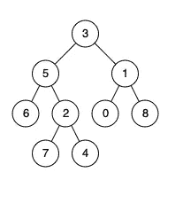
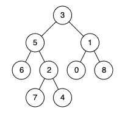

# 二叉树的最低共同祖先—第 10 天(Python)

> 原文：<https://medium.com/analytics-vidhya/lowest-common-ancestor-of-a-binary-tree-day-10-python-be7d09791ba2?source=collection_archive---------9----------------------->


阿达什·库姆穆尔在 [Unsplash](https://unsplash.com?utm_source=medium&utm_medium=referral) 上拍摄的照片

我们今天将研究一个关于树的问题。在进入问题之前，让我们了解二叉树的一些特征。

二叉树是一种数据结构，其中每个节点最多可以有两个子节点。一棵树最顶端的部分称为根节点，末端称为叶子。任何形式的树都不能有循环。二叉树的一个例子如下。



二叉树的例子。

[**236**](https://leetcode.com/problems/lowest-common-ancestor-of-a-binary-tree/) **。二叉树的最低共同祖先**

给定一棵二叉树，找出树中两个给定节点的最低共同祖先(LCA)。

根据维基百科上的[对 LCA 的定义:“最低的共同祖先被定义在两个节点 p 和 q 之间，作为 T 中同时拥有 p 和 q 作为后代的最低节点(这里我们允许**一个节点是其自身的后代**)”](https://en.wikipedia.org/wiki/Lowest_common_ancestor)

给定下面的二叉树:root = [3，5，1，6，2，0，8，null，null，7，4]



**例 1:**

```
**Input:** root = [3,5,1,6,2,0,8,null,null,7,4], p = 5, q = 1
**Output:** 3
**Explanation:** The LCA of nodes 5 and 1 is 3.
```

**例 2:**

```
**Input:** root = [3,5,1,6,2,0,8,null,null,7,4], p = 5, q = 4
**Output:** 5
**Explanation:** The LCA of nodes 5 and 4 is 5, since a node can be a descendant of itself according to the LCA definition.
```

**注:**

*   所有节点的值都是唯一的。
*   p 和 q 是不同的，两个值都存在于二叉树中。

解决方案:

1.维护一个提供子节点及其父节点信息的字典。

a.使用保存要访问的节点的堆栈。

b.使用保存子节点及其父节点信息的字典。用 key 作为根，value 作为 none 初始化它，这意味着根没有任何父节点。

c.运行循环，直到元素出现在堆栈中。

I .从堆栈中弹出节点。

二。检查该节点是否有任何左子节点。如果是，将节点的左子节点推入堆栈，并在字典中提到 key 为左子节点，value 为当前节点。如果当前节点有正确的子节点，执行相同的操作。

d.一旦完全遍历了树，就创建一个集合来保存从 node1 到根节点的祖先。

e.从 node2 遍历到根节点，检查上面的集合中是否存在任何节点。如果我们找到一个公共节点，返回节点值。

该算法将如下所示。

```
class LowestCommonAncestorFinder:
    def lowestCommonAncestor(self, root: 'TreeNode', p: 'TreeNode', q: 'TreeNode') -> 'TreeNode':
        stack = [root]
        parent = {root: None}
        while stack:
            node = stack.pop()
            if node.left:
                parent[node.left] = node
                stack.append(node.left)
            if node.right:
                parent[node.right] = node
                stack.append(node.right)
        ancestors = set()
        while p:
            ancestors.add(p)
            p = parent[p]
        while q not in ancestors:
            q = parent[q]
        return q
```

复杂性分析。

**时间复杂度**

我们遍历整个图来标记父子关系。因此时间复杂度为 O(N)，其中 N 是节点的数量。

**空间复杂度**

我们正在创建一个字典来标记树中的父子关系。因此，空间复杂度是 O(N)，其中 N 是节点的数量。

我们可以用递归来解决上面的问题。

1.  在开始使用递归解决问题之前，我们需要理解基本条件。当我们到达树的末端或者我们遇到任何一个节点时，基本条件就满足了。
2.  直到达到基本条件，向左和向右移动到当前节点，并将值分别存储在左和右变量中。
3.  验证左侧和右侧是否存在。如果是，返回根值，即父值。
4.  否则返回左右变量中不为空的变量。

```
class LowestCommonAncestorFinder:
    def lowestCommonAncestor(self, root: 'TreeNode', p: 'TreeNode', q: 'TreeNode') -> 'TreeNode':

        if  root == None or root == p or root == q :
            return root

        left = self.lowestCommonAncestor(root.left, p, q)
        right = self.lowestCommonAncestor(root.right, p, q)

        if left and right:
            return root
        print(root.val,left, right)
        return left if left  else right
```

复杂性分析。

**时间复杂度**

在最坏的情况下，我们可能需要遍历整个图来找到图中的节点。因此时间复杂度是 O(N)。

**空间复杂度**

我们递归地遍历图来寻找节点。在最坏的情况下，我们可能需要遍历整个图来找到节点，递归在内部存储为一个堆栈。因此空间复杂度为 O(N)。