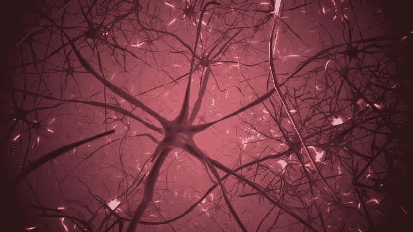

# 深入门控循环神经网络的世界:LSTM 和 GRU

> 原文：<https://medium.com/analytics-vidhya/lstm-and-gru-a-step-further-into-the-world-of-gated-rnns-99d07dac6b91?source=collection_archive---------1----------------------->

在深度学习的世界中，每当问题需要基于序列的学习时，RNN 就被认为是首选模型，这推动了研究社区提出对香草 RNN 的有趣改进。

一个突出的改进是引入了门控 rnn:LSTM 和 GRU