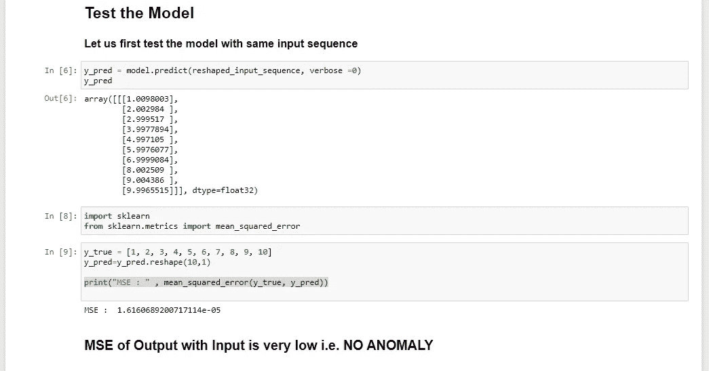
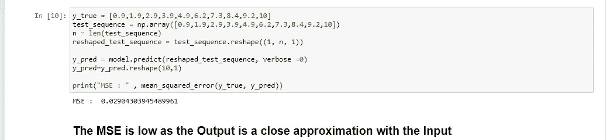
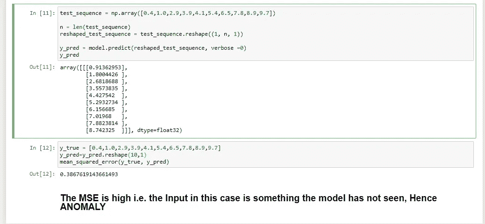

# 用于异常检测的 LSTM 自动编码器

> 原文：<https://medium.com/analytics-vidhya/lstm-autoencoder-for-anamoly-detection-a0d77bb1540e?source=collection_archive---------23----------------------->

Autoencoder 有多种应用，例如:

1.  噪音的消除
2.  特征提取(仅使用编码器部分)
3.  异常检测

我们将在非常简单的时间序列数据中看到第三种应用。自动编码器的概念可以应用于任何神经网络架构，如 DNN、LSTM、RNN 等。由于我们有时间序列数据，我们将设计一个 LSTM 自动编码器。

这个概念很简单，我们将训练一个简单的自动编码器(非异常数据)。通过这样做，自动编码器可以重构出已知的输入序列。然后，当我们有一个具有异常的序列并将其输入到模型中时，模型将尝试重新构建输入，但在这种情况下，误差将会很高，因为数据具有模型无法处理的一些特征(异常)。

> 请参考我之前的博客[这里的](/@adnanmushtaq5/lstm-autoencoder-9094615a019d)来构建输入、模型和输出。

这应该是之前博客的延续。

***为我们能够重建回原来的输入。让我们检查重构输出与输入的均方误差(MSE)。***

***现在让我们输入一个足够接近输入模型的序列，并检查 MSE。***

最后，让我们输入一个带有异常的序列，即带有不希望的东西。

***因此使用自动编码器和错误的概念，我们可以检查数据中的异常。***