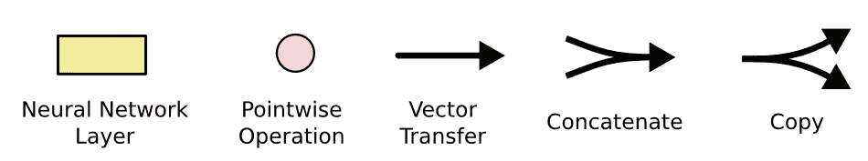

# LSTM-长短期记忆

> 原文：<https://medium.com/analytics-vidhya/lstm-long-short-term-memory-5ac02af47606?source=collection_archive---------7----------------------->

我是蝙蝠侠

长短期记忆网络——通常简称为“lstm”——是一种特殊的 RNN，能够学习长期依赖性。它们是由[hoch Reiter&schmid Huber(1997)](http://www.bioinf.jku.at/publications/older/2604.pdf)介绍的，并在随后的工作中被许多人提炼和推广。它们在各种各样的问题上表现得非常好，现在被广泛使用。

LSTMs 的明确设计是为了避免长期依赖问题。长时间记住信息实际上是他们的默认行为，而不是他们努力学习的东西！

稍后我们将一步一步地浏览 LSTM 图。现在，让我们试着适应我们将要使用的符号。

在上图中，每条线都承载一个完整的向量，从一个节点的输出到其他节点的输入。粉色圆圈代表逐点操作，如向量加法，而黄色方框是学习过的神经网络层。行合并表示连接，而行分叉表示其内容被复制，并且副本被移动到不同的位置。

# LSTM 按部就班地走过

1.  **忘门**(权重对应 W_f):
    首先我们有忘门(W_f)。这个门决定哪些信息应该被丢弃或保留。来自先前隐藏状态(h(t-1))的信息和来自当前输入(x(t))的信息通过 sigmoid 函数传递。值介于 0 和 1 之间。越接近 0 表示忘记，越接近 1 表示保留。

**2。输入门**(权重对应 W_i):
为了更新单元状态，我们有了输入门。首先，我们将之前的隐藏状态(h(t-1))和当前输入(x(t))传递给一个 sigmoid 函数。它通过将值转换为 0 和 1 之间的值来决定哪些值将被更新。0 表示不重要，1 表示重要。您还可以将隐藏状态(h(t-1))和当前输入(x(t))传递到 tanh 函数中，以挤压-1 和 1 之间的值来帮助调节网络。然后将双曲正切输出乘以 sigmoid 输出。sigmoid 输出将决定哪些信息对 tanh 输出很重要。

**3。细胞状态**
现在我们应该有足够的信息来计算细胞状态。首先，单元格状态逐点乘以遗忘向量。如果乘以接近 0 的值，这有可能会丢失单元状态中的值。然后，我们从输入门获取输出，进行逐点加法，将细胞状态更新为神经网络认为相关的新值。这给了我们新的细胞状态(c(t))。

**4。输出门**
最后我们有输出门。输出门决定下一个隐藏状态应该是什么。请记住，隐藏状态包含以前输入的信息。隐藏状态也用于预测。首先，我们将先前的隐藏状态和当前输入传递给一个 sigmoid 函数。然后，我们将新修改的单元格状态传递给 tanh 函数。我们将双曲正切输出乘以 sigmoid 输出来决定隐藏状态应该携带什么信息。输出是隐藏状态。然后，新的单元状态和新的隐藏被带入下一个时间步骤。

回顾一下,“遗忘之门”决定了哪些内容与之前的步骤相关。输入门决定从当前步骤添加哪些相关信息。输出门决定下一个隐藏状态应该是什么。

# 参考资料:

 [## 了解 LSTM 网络

### 2015 年 8 月 27 日发布人类不是每秒钟都从零开始思考。当你读这篇文章时，你…

colah.github.io](https://colah.github.io/posts/2015-08-Understanding-LSTMs/) 

[https://en.wikipedia.org/wiki/Long_short-term_memory](https://en.wikipedia.org/wiki/Long_short-term_memory)