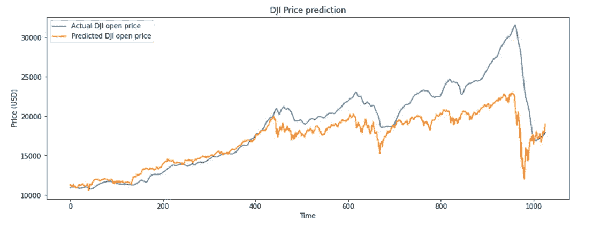

# LSTM 预测道琼斯工业平均指数:一个时间序列预测模型

> 原文：<https://medium.com/analytics-vidhya/lstm-to-predict-dow-jones-industrial-average-time-series-647b0115f28c?source=collection_archive---------9----------------------->

## 利用 LSTM-克拉斯网络进行深度学习

## 金融市场预测的长短期记忆网络

作者图片

[https://sarit-maitra.medium.com/membership](https://sarit-maitra.medium.com/membership)