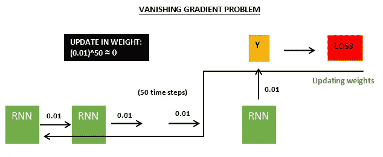
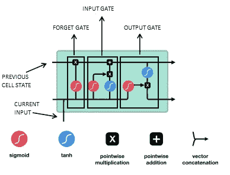

# LSTM:有什么大惊小怪的？

> 原文：<https://medium.com/analytics-vidhya/lstm-whats-the-fuss-about-1ae9d4c3e33e?source=collection_archive---------13----------------------->

## LSTM 学会了。LSTM 记得。像 LSTM 一样。

递归神经网络 **(RNNs)** 擅长学习序列，它们跨越时间步骤将信息从先前的状态带到下一个状态。唉，只有当序列不太长时，它们才能提供好的结果。因此患有短期记忆问题。

此外，在反向传播期间，递归神经网络也可能遭受**消失梯度问题**。在反向传播算法中，基于最终计算的损失来更新权重，在权重的变化是较小值的情况下，这将意味着随着时间步长的更新将变得更小(几乎为零)，并且在这种情况下网络中的层将不会学习！

RNN 的消失梯度条件

RNNs 中的这个问题由长短期记忆( **LSTM** )来解决，这是一种特殊类型的 RNN，它使用门和增加的交互次数来防止这个问题。LSTM 还增加了网络学习更长序列的能力。如果我必须用更简单的话来陈述，它只记住相关的信息，而忘记每个状态下不必要的信息，从而以最小的内存占用增强其知识库。当我们进入 LSTM 的细胞结构时，我们会看得更远。

LSTM 细胞结构

从顶部开始的水平线是**单元状态**，你可以把它想象成网络的**“内存”**。所有相关信息在细胞状态中移动，在每一个时间步，信息通过控制 LSTM 细胞信息流的门被添加或删除。这些门是**遗忘门、输入门、输出门。**

**忘记门:**这个门决定什么是相关信息。它从先前状态和当前时间步长获取信息，并通过一个 **Sigmoid 函数**传递。输出的范围在 0 到 1 之间，如果更接近零，则被忽略，否则保留。

**输入门:**该门计算更新单元状态所需的信息。它分两步工作，第一步与在遗忘门执行的操作相同，其中[来自先前状态和当前输入的信息]从 **Sigmoid 函数**传递，第二步涉及通过 **tanh 函数**传递相同的信息集(取值范围在-1 到 1 之间)。然后将这两个输出相乘。

上述操作的结果与单元状态和遗忘门输出的逐点相乘的输出进行逐点相加，并且该输出是新的单元状态值。

**输出门:**输出门也分两步操作，第一步与遗忘门相同(与输入门的步骤 1 相同)，而在第二步中，从最新更新的单元状态(在输入门中讨论)中获取信息，并通过双曲正切函数传递。

然后将这两个输出相乘以获得新的隐藏状态，并将其结转到下一个单元。因此，这就是 LSTM 将信息从一个细胞传递到另一个细胞的方式。

现在我们对 LSTM 细胞如何工作有了基本的直觉。这将使我们在与他们一起工作时稍微舒服一些。我会试着写一篇带有代码示例的帖子。手指交叉。

**如果你大老远来到这里，我想花点时间感谢你真的花了心思去读它。我希望它能帮助人们了解 lstm:)**