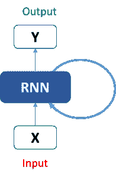
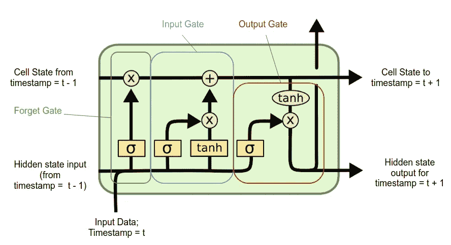
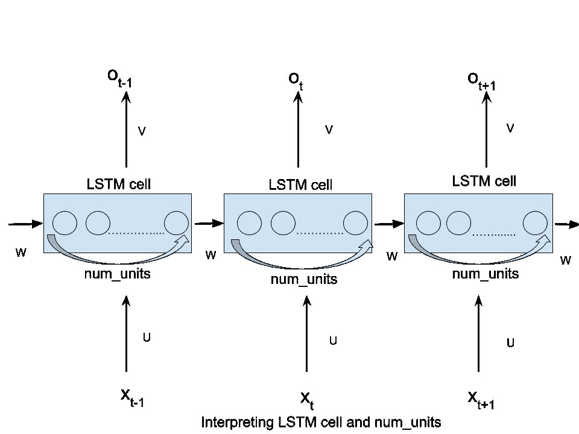
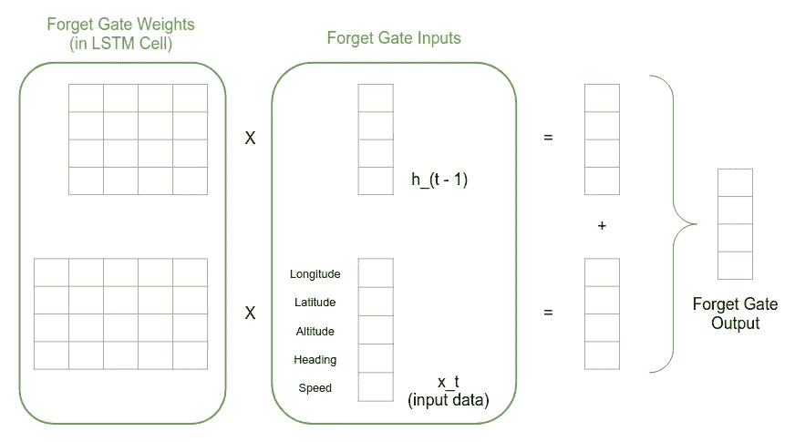
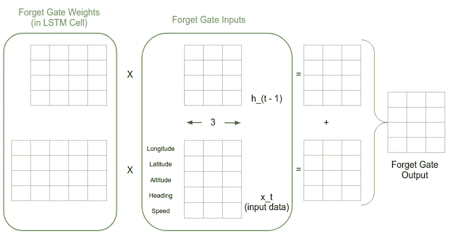

# LSTMs 解释说:一个完整的，技术上准确的，与 Keras 的概念指南

> 原文：<https://medium.com/analytics-vidhya/lstms-explained-a-complete-technically-accurate-conceptual-guide-with-keras-2a650327e8f2?source=collection_archive---------0----------------------->

我知道，我知道——又一个关于 LSTMs / RNNs / Keras /什么的指南。外面有太多的指南——其中一半充满了虚假信息，术语不一致——以至于我感到足够沮丧，以至于写了这个一站式指南+资源目录，即使是为了将来的参考。本指南旨在成为与 Keras 和深度学习文献一致的技术术语和概念的词汇表。本文假设读者对一般的神经网络概念有非常基本的概念上的了解。如果您发现了与您的理解不一致的地方，请随时发表评论/纠正我！

**内容页**

1.  rnn 和 LSTMs
2.  隐藏状态与单元状态
3.  通用门机制
4.  闸门操作尺寸和“隐藏尺寸”
5.  "隐藏层"
6.  模型复杂性
7.  Keras 的怪癖——返回序列？返回状态？

**长短期记忆网络和 RNNs——它们是如何工作的？**

首先，LSTMs 是一种特殊的 RNN(递归神经网络)。事实上，lstm 是(目前)大约两种实际可用的 RNNs 之一——lstm 和门控循环单元(gru)。那么，你可能会问，什么是“普通的”RNN？嗯，我不认为有一个“正常的”RNN；更确切地说，rnn 是一个广义的概念，指的是充满类似这样的小区的网络:

一个 RNN 细胞。图片鸣谢:[https://www . analyticsvidhya . com/blog/2017/12/fundamentals-of-deep-learning-introduction-to-lstm/](https://www.analyticsvidhya.com/blog/2017/12/fundamentals-of-deep-learning-introduction-to-lstm/)

同一个 RNN 细胞，“展开”或“展开”。图片鸣谢:[https://www . analyticsvidhya . com/blog/2017/12/fundamentals-of-deep-learning-introduction-to-lstm/](https://www.analyticsvidhya.com/blog/2017/12/fundamentals-of-deep-learning-introduction-to-lstm/)

X:当前时间步的输入数据
Y:输出
Wxh:将 X 变换为 RNN 隐藏状态的权重(非预测)
为什么:将 RNN 隐藏状态变换为预测的权重
H:隐藏状态
圆圈:RNN 单元格

像上面这样的单细胞 RNN 是非常可能的。在这种情况下，假设我们试图处理非常简单的时间序列数据。每个系列包含 3 个时间步长的数据。RNN 小组将:

1.  处理第一个时间步长(t = 1)，然后将其输出以及下一个时间步长(t = 2)传递给自身
2.  像以前一样用相同的权重处理这些，然后将它的输出以及最后一个时间步长(t = 3)再次传递给它自己
3.  像以前一样处理具有相同权重的那些，然后输出要使用的结果(用于训练或预测)。稍后将详细介绍该输出的格式。

# 什么是 LSTM？

这是 rnn 是什么的大的、真正高水平的图像。如前所述，RNN 细胞仅仅是一个概念。事实上，RNN 牢房几乎总是 LSTM 牢房或 GRU 牢房。在本文中，我们将重点讨论 LSTMs。

为了理解 LSTMs 工作的原因，并直观地了解模型背后的统计复杂性，使其适合各种数据样本，我强烈认为有必要了解细胞背后的数学运算，所以我们开始吧！

一个 LSTM 细胞

非常非常复杂的图表。这整个矩形被称为 LSTM“细胞”。它类似于前面 RNN 图中的圆。这些是组成 LSTM 细胞的部分:

1.  “细胞状态”
2.  “隐藏状态”
3.  门:“忘记”或也称为“记住”、“输入”和“输出”

## **“单元格状态”vs“隐藏状态”**

“单元状态”和“隐藏状态”之间通常有很多混淆。这两者在功能上显然是不同的。单元状态意在对已处理的所有先前时间步的数据的一种集合进行编码，而隐藏状态意在对先前时间步的数据的一种表征进行编码。

**隐藏状态——概念解释**

时间步长数据的*特征*(不是文学中的官方术语)可能意味着不同的事情。让我们假设我们正在处理自然语言处理，例如，正在处理短语“天空是蓝色的，所以小象在哭”。如果我们希望 LSTM 网络能够在句子的上下文中对单词的情感进行分类，t = 3 时的隐藏状态将是“是”的编码版本，然后我们将进一步处理(通过 LSTM 网络外部的机制)以获得预测的情感。如果我们希望 LSTM 网络能够基于当前的一系列单词预测下一个单词，t = 3 时的隐藏状态将是下一个单词预测的编码版本(理想情况下，“蓝色”[编辑])，我们将再次在 LSTM 之外处理它以获得预测的单词。正如所看到的，*特性*基于你想要 LSTM 网络做什么而呈现出不同的含义。就其背后的数学原理而言，**它确实可以如此灵活**，因为最终，我们希望 LSTM 做什么决定了我们如何训练它以及我们使用什么样的数据；权重会相应地调整自己，以最好地逼近我们所寻求的答案。*表征* 是一个抽象术语，仅用于说明**隐藏状态如何与最近的时间步**更相关。

值得注意的是，**隐藏状态不等于输出或预测，**它仅仅是最近时间步长的编码。也就是说，隐藏状态在任何时候都可以被处理以获得更有意义的数据。

**细胞状态——概念解释**

然而，到目前为止，单元状态更关心整个数据。如果您现在正在处理单词“elephant”，单元格状态包含从短语开始的所有**单词的信息。如图所示，每次一个时间步长的数据通过 LSTM 单元时，时间步长数据的一个副本通过一个遗忘门过滤，另一个副本通过输入门过滤；两个门的结果被合并到处理前一时间步的单元状态中，并被传递到下一时间步进行修改。遗忘门和输入门中的权重决定了如何从这些信息中提取特征，以确定哪些时间步长是重要的(高遗忘权重)，哪些是不重要的(低遗忘权重)，以及如何将来自当前时间步长的信息编码到单元状态中(输入权重)。因此，并不是所有的时间步长都被同等地合并到细胞状态中——有些时间步长比其他时间步长更重要，或者更值得记住。这就是 LSTMs 在处理时间序列数据时能够动态决定追溯到历史多远的特性。**

总而言之，单元状态基本上是 LSTM 网络在所有时间步长上的*全局*或*聚合*存储器。

# 通用门机制/方程

在我们进入具体的门和它们背后的数学之前，我需要指出在 LSTM 中使用了两种类型的归一化方程。第一个是 **sigmoid 函数**(用小写 sigma 表示)，第二个是 **tanh 函数**。这是一个深思熟虑的选择，有一个非常直观的解释。

每当你在一个机制中看到一个 **sigmoid** 函数，这意味着该机制正在试图计算一组**标量**，通过这些标量来乘以(放大/缩小)其他东西(当然，除了防止消失/爆炸梯度)。

每当你看到一个 **tanh** 函数，就意味着这个机制正在试图将数据转换成数据的**规范化编码。**

每个“忘记”、“输入”和“输出”门都遵循以下通用格式:

“忘记”门的方程式

在英语中，这些方程的输入是:

1.  h(t-1):前一时间步的隐藏状态的副本
2.  x_t:当前时间步输入数据的副本

在这个特定的门，这些等式输入分别乘以它们各自的权重矩阵，然后加在一起。然后将结果添加到偏差中，并对其应用 sigmoid 函数，以将结果压缩到 0 到 1 之间。因为结果介于 0 和 1 之间，所以它非常适合作为标量来放大或缩小某些东西。你会注意到，所有这些 sigmoid 门后面都有一个逐点乘法运算。这就是操作中的放大/缩小。例如，在遗忘门，如果遗忘门输出一个非常接近 1 的值矩阵，这意味着遗忘门已经得出结论，基于当前输入，时间序列的历史非常重要，因此，当来自前一时间步的单元状态乘以遗忘门的输出时，单元状态继续保留其原始值的大部分，或“记住其过去”。如果遗忘门输出一个接近于 0 的矩阵值，那么细胞状态的值将缩小到一组微小的数字，这意味着遗忘门已经告诉网络忘记它在这之前的大部分过去。

如果你在可视化这些操作方面有困难，可以跳到标题为**门操作尺寸和“隐藏尺寸”(单位数)**的部分，在那里我画出了这些矩阵。

## 输入门

具有不同绘制输入门的 LSTM 单元

所以上面的插图与本文开头的略有不同；不同之处在于，在前面的插图中，我将整个中间部分作为“输入门”装箱。这里的术语多种多样。在技术上非常精确地说，“输入门”仅指中间的 s 形门。该机制与“遗忘门”完全相同，但有一套完全独立的权重。

那么，中间的**门是什么？有时与 **sigmoid** 门一起被称为“输入门”，这个 tanh 门也被称为“候选门”，或者在某些来源中，称为“候选层*”，我认为这是一个可怕的术语，因为首先，它不是我们所期望的神经网络中的层，其次，它非常令人困惑。不管怎样，这是我们第一次看到 tanh 门，所以让我们看看它是做什么的！***

*我们知道，当前时间步长的副本和先前隐藏状态的副本被发送到 sigmoid 门，以计算某种标量矩阵(某种放大器/减法器)。**两条数据的另一个副本现在被发送到 tanh gate 以将** **归一化到-1 和 1** 之间，而不是 0 和 1 之间。在这个双曲正切门中完成的矩阵运算与在 sigmoid 门中完全相同，只是我们不是通过 sigmoid 函数传递结果，而是通过双曲正切函数传递结果。*

*然后，该双曲正切门的输出被发送，与 sigmoid 输出进行逐点或逐元素乘法。您可以认为 tanh 输出是隐藏状态与当前时间步长相结合的编码、规范化版本。我们称这些数据为“编码的”，因为当通过 tanh 门时，隐藏状态和当前时间步长已经乘以了一组权重，这与通过单层密集连接的神经网络是一样的。换句话说，在通过 tanh gate 时，已经对这些数据进行了某种程度的特征提取。乙状结肠门也是如此。*

*从这个角度来看，sigmoid 输出(放大器/缩减器)意味着在添加到单元状态之前，根据数据的外观对编码数据进行缩放。基本原理是，某些特征的存在可以认为当前状态是重要的或不重要的。*

***总结一下 input gate】的功能，它进行一次特征提取，对 LSTM 有意义的数据进行编码，另一次确定隐藏状态和当前时间步长数据的记忆价值。然后，在被添加到单元状态之前，特征提取的矩阵按其记忆价值进行缩放，这再次有效地成为 LSTM 的全局“记忆”。***

## ***输出门***

*输出门使用几乎相同的编码和缩放概念来:*

1.  *融入细胞状态*
2.  *形成一个输出隐藏状态，该状态可用于进行预测或反馈到下一时间步的 LSTM 单元中。*

*此处操作背后的概念是，由于单元状态现在保存了从历史到该时间步的信息，*

# ***闸门操作尺寸和“隐藏尺寸”(单位数)***

*我一直在谈论门的乘法运算中涉及的矩阵，这可能有点难以处理。这些矩阵的维数是多少，我们如何决定它们？在这里，我将开始在 LSTM 单元格中引入另一个参数，称为“隐藏大小”，有人称之为“num_units”。如果你熟悉其他类型的神经网络，如密集神经网络(DNNs)，或卷积神经网络(CNN)，这个“隐藏大小”的概念类似于网络中给定层的“神经元”(又名“感知器”)的数量。*

**

*说明 LSTM 单元格内隐藏单元的图形*

*虽然上图是对 LSTM 单元中隐藏单元的一个相当普通的描述，但我相信直接看到矩阵运算并理解这些单元在概念上是什么要直观得多。*

*为此，现在让我们稍微改变一下，假设我们正在处理来自飞机的时间序列数据，其中每个数据样本都是来自飞机的一系列 pingss，每个 ping 都包含飞机随时间变化的经度、纬度、高度、方向和速度(输入 5 个变量)。进一步假设我们的隐藏大小为 4(LSTM 单元格内有 4 个隐藏单元)。“忘记”(以及“输入”和“输出”)门中的操作看起来是这样的:*

**

*忘记门的操作和尺寸*

*关于权重矩阵的**维度，需要注意一些事情:***

1.  *w_h(隐藏状态的权重矩阵)= `hidden_size * hidden_size`*
2.  *w_x(输入数据的权重矩阵)= `hidden_size * input_variables`*
3.  *产量= `1 * hidden_size`*
4.  *输出进一步通过 sigmoid 函数传递*

*注意，权重矩阵的维数完全由输入变量的隐藏大小和数量决定，这是有意义的。实际上，我们正在用 Keras 处理大量数据，所以你很少会通过 LSTM 模型一次运行一个时间序列数据样本(飞行样本)。相反，您将批量处理它们，因此增加了一个参数`batch_size`。门操作看起来像这样:*

**

*当批量= 3 时，忽略门控操作*

*需要注意一些事情:*

1.  *输入和输出不再是一列向量，而是三列矩阵。*
2.  *砝码尺寸(参数数量)与批量大小**无关***

## ***从矩阵表示到神经元/节点表示***

*我喜欢做的一件有趣的事情是，尝试使用实际神经元的符号来可视化这些数学运算，以确保我真正理解权重和数据之间的联系。它很好地将这些单纯的矩阵变换与其神经起源联系起来。*

*对于这个遗忘之门，它相当简单。对于遗忘门的`w_x * x`部分，考虑下图:*

**

*时间序列数据输入和遗忘门权重之间的联系*

*在这个熟悉的图表格式中，你能弄清楚发生了什么吗？左边的 5 个节点代表输入变量，右边的 4 个节点代表隐藏单元。每个连接(箭头)代表一个特定权重的乘法运算。由于这里总共有 20 个箭头，这意味着总共有 20 个权重，这与我们在前一张图中看到的 4 x 5 权重矩阵一致。隐藏状态也是如此，只是 4 个节点通过 16 个连接连接到 4 个节点。好吧，那只是我们正在做的事情的一个有趣的副产品。*

# ***“隐藏层数”(层数)***

*到目前为止，我们已经介绍了以下内容:*

*   *rnn 和 LSTMs*
*   *门功能*
*   *闸门操作、尺寸和“隐藏尺寸”*

*在超参数方面，只剩下“隐藏层”了。“多层 LSTM”有时也被称为“堆叠 lstm”。看起来是这样的:*

**

*堆叠的 LSTM。图片鸣谢:[https://machine learning mastery . com/stacked-long-short-term-memory-networks/](https://machinelearningmastery.com/stacked-long-short-term-memory-networks/)*

*在 LSTM 网络中增加层数的概念相当简单。所有时间步长都通过第一个 LSTM 层/单元，以生成一整套隐藏状态(每个时间步长一个)。这些隐藏状态然后被用作第二 LSTM 层/单元的输入，以生成另一组隐藏状态，等等。*

# *模型复杂性*

*估计使用什么超参数来拟合数据的复杂性是任何深度学习任务中的主要课程。你可以搜索一些经验法则，但是我想指出我所认为的增加两种复杂性的概念原理(隐藏大小和隐藏层)。*

*一般来说，当你认为时间序列数据中的输入变量有很大的相互依赖性时——我不是指像“速度”、“位移”和“旅行时间”这样的线性依赖性——更大的隐藏大小**将是必要的**以允许模型找出输入变量可以相互交流的更多方式。*

*一般来说，当你认为你的时间序列数据中的模式是非常高级的，这意味着它可以被抽象很多，**更大的模型深度或隐藏层数是必要的。**在语音识别中，这将类似于识别语音中毫秒级的小纹理，然后进一步将多个纹理抽象为不同的片段，然后进一步将这些片段抽象为辅音和元音，然后是单词片段，最后是单词。*

*一般来说，这两种类型的复杂性不会有太大的差别，因为它们是互补的。*

# *Keras 的怪癖*

*到目前为止，我使用的术语与 Keras 一致。如果您无法从本文中找到所有的答案，我已经在本文末尾提供了技术资源。然而，还有一些其他的怪癖我还没有解释。*

*导致混乱的一个主要原因是参数的存在:`return_sequences`和`return_states`。*

*请记住，在 LSTM 中，有两种数据状态需要维护，即“单元格状态”和“隐藏状态”。默认情况下，LSTM 单元返回单个时间步长(最新的时间步长)的隐藏状态。然而，Keras 仍然记录 LSTM 在每个时间步输出的隐藏状态。因此，*

*   *`return_sequences`表示“返回所有隐藏状态”默认:`False`*
*   *`return_states`意为“返回细胞状态”。默认:`False`*

*令人困惑的东西。在大多数情况下，你不必关心`return_states`。但是，如果你正在使用一个多层 LSTM(堆叠的 LSTM)，你将不得不设置`return_sequences = True`，因为你需要整个系列的隐藏状态前馈到每个连续的 LSTM 层/单元。最后一个 LSTM 层/单元是个例外。在最后一层，你可以或不可以将其设置为`True`，这取决于你想要什么样的输出。如果您想要一个与输入相同维度的输出，具有相同时间步数的整个时间序列，那么它是`True`，但是如果您只期望最后一个时间步的表示，那么它是`False`。这里的输出通常经过密集层，将隐藏状态转换成更有用的东西，比如类预测。*

*这篇帖子对此进行了精彩的总结，并附有代码示例:[https://machine learning mastery . com/return-sequences-and-return-States-for-lstms-in-keras/](https://machinelearningmastery.com/return-sequences-and-return-states-for-lstms-in-keras/)。*

# *结论*

*希望我已经用正确的术语帮助你理解了 LSTMs 的细节，其中大部分被大多数基于应用的指南所掩盖，这些指南有时似乎是我们所能找到的全部。本指南是根据我与数据科学家和深度学习工程师一起工作的经验编写的，我希望本指南背后的研究能够反映这一点。 ***它将继续成为我自己和我未来工作的巨大生活资源，我希望它也是你的，所以如果你在这里看到任何错误的信息，请随时指出来！****

# *资源:*

## *概念参考:*

*   *盖茨概念解释+简单文本预测代码示例[https://www . analyticsvidhya . com/blog/2017/12/fundamentals-of-deep-learning-introduction-to-lstm/](https://www.analyticsvidhya.com/blog/2017/12/fundamentals-of-deep-learning-introduction-to-lstm/)*
*   *LSTM 门操作的概念性解释[https://towards data science . com/illustrated-guide-to-lstms-and-gru-s-a-step-by-step-a-step-explain-44e 9 EB 85 BF 21](https://towardsdatascience.com/illustrated-guide-to-lstms-and-gru-s-a-step-by-step-explanation-44e9eb85bf21)*
*   *门方程式[https://medium . com/@ divyanshu 132/lstm-and-its-Equations-5ee 9246d 04 af](/@divyanshu132/lstm-and-its-equations-5ee9246d04af)*

## *技术参考(Keras 和 TensorFlow):*

*   *传统机器学习术语 vs Keras / TF 术语[https://stats . stack exchange . com/questions/241985/understanding-lstm-units-vs-cells](https://stats.stackexchange.com/questions/241985/understanding-lstm-units-vs-cells)*
*   *stacked LSTMs[https://machine learning mastery . com/stacked-long-short-term-memory-networks/](https://machinelearningmastery.com/stacked-long-short-term-memory-networks/)*
*   *return _ sequences vs return _ States[https://machine learning mastery . com/return-sequences-and-return-States-for-lstms-in-keras/](https://machinelearningmastery.com/return-sequences-and-return-states-for-lstms-in-keras/)*