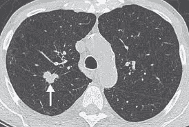

# 肺癌诊断:制造像人类一样思考的机器

> 原文：<https://medium.com/analytics-vidhya/lung-cancer-diagnosis-making-machines-that-think-like-human-beings-6463ca8e33d7?source=collection_archive---------19----------------------->

[](https://github.com/TomiTsuma/Lung-Cancer-Diagnosis/blob/master/Core%26Outline%20Lung%20Cancer%20Diagnosis.ipynb) [## 富津马/肺癌-诊断

### permalink dissolve GitHub 是超过 5000 万开发人员的家园，他们一起工作来托管和审查代码，管理…

github.com](https://github.com/TomiTsuma/Lung-Cancer-Diagnosis/blob/master/Core%26Outline%20Lung%20Cancer%20Diagnosis.ipynb) 

肺癌是美国男性和女性的头号癌症杀手。它夺去的生命比乳腺癌、结肠癌和前列腺癌加起来还多。像所有其他类型的癌症一样，肺部的结节是癌症的征兆。

医生通常使用肺部 CT 扫描来确定肺部是否存在结节。要注意的是，从单个患者中提取几个图像，从而可以形成肺部的 3D 图像。这些图像是矢状、冠状和轴向视图。因此，对于患者扫描的单个实例，我们甚至可以产生 600 个图像。医生的职责是识别这些图像中的结节。结节必须是可触及的。

> 肿瘤可以根据大小分为“良性”或“恶性”。

良性肿瘤更容易治疗，但如果没有及早发现和治疗，也很容易发展成恶性肿瘤(在这种情况下，你被称为癌症)。

本文的重点是展示我如何设计一个神经网络，它可以用来将病人的 CT 扫描分类为有结节或无结节。

## 所需的模块

作为我的习惯，我确保在笔记本的第一个单元格中有我所有的重要陈述。

从顶部开始:

1.  numpy 数组是 keras 分类器可接受的输入类型。
2.  Pandas 用于读取来自 lidc-idri 结核计数(2015 年 6 月 23 日)的数据。xlsx 文件。
3.  Matplotlib 用于绘制相对于组件数量的累积解释方差图。
4.  Os 用于访问 windows 的文件结构和读取文件。
5.  Shutil 用于将文件复制并移动到适当的文件夹中进行分类。
6.  CV2 用于从图像中读取像素数据和向图像中写入像素数据。
7.  Pydicom 用于从。dcm 文件，尤其是像素数据。

keras 分类器的各层将在后面详述。

8.Adam 优化器将用于分类器。

9.后端将用于检查“channel_last”是否被添加到我们输入的输入形状中。

10.ImageDataGenerator 将用于增加图像，以匹配每个类别中的图像数量。

11.PCA 用于仅确定有差异的列，以避免不必要的数据。

## 探索性数据分析

我们必须首先执行一些 EDA，以确保我们的数据是正确的，然后才能为我们的模型提取必要的数据。

我们创建了一个数据帧，并将其命名为 nodCount。然后，我试图消除所有具有空值的列和行。

就 EDA 而言，还有很多事情要做，但我们现在不会详细讨论这些。

## 对病人档案进行分类

以上是一个二元分类问题。因此，我们想创建两个文件夹，“零结节”和“潜在癌变”。这些将容纳。无结节记录患者和至少有一个结节记录患者的 dcm 文件。

## 为分类器创建图像

CT 扫描通常保存为。dcm 文件。这些通常包含所有患者数据，所有数据都方便地存储为单个文件。在这些里面。dcm 文件是我们可以用来创建图像的像素数据。

由于文件已经被分成两个文件夹，我们需要编写两个函数。

> “需要”实际上并不准确，我只是选择以一种任意的方式做事。我们实际上可以只使用一个函数，它的参数是病人的文件夹位置。dcm 文件和存储图像的位置。

我使用了迭代循环，第一次循环对每个类别中病人的所有文件夹都这样做，第二次循环对所有。每个患者文件夹中的 dcm 文件。

我们读了。dcm 文件使用:

`ds = dicom.dcmread((“patient id”),force = False)`

“force”设置为 false，以确保它只读取。dcm 文件。

使用以下方法访问像素数据:

```
pixel_array_numpy = ds.pixel_array
```

然后，使用以下命令将其写入新创建的图像文件:

```
cv2.imwrite(img,pixel_array_numpy)
```

我希望已经很明显了，这两个函数需要调用，否则就没用了。

## 图像增强

与没有结节的患者相比，有结节记录的患者数量存在巨大的不平衡(顺便说一下，这是引起巨大恐慌的原因)。如果我们用这种不平衡来训练我们的模型，它最终每次都会预测“没有结节”。因此，解决方法是扩大较小的一个的图像，以便与数字匹配。增强包括缩放、旋转、翻转等。

## 准备培训数据

这里我们创建了两个数组。x 将包含训练数据，而 y 将包含目标数据。我们将“潜在癌变”编码为 0，将“零结节”编码为 1。然后我们需要将 X 和 Y 都转换成 numpy 数组。

下一步是规范化数据集。这意味着我们将 X 除以 255，以减少 X 列的方差差异。这反过来又确保了没有一个列会因为较高的方差而对结果产生比另一个更大的影响。规范化本质上使所有数据更接近于零。这个术语叫做特征缩放。

最后，我只打印了 X 的一个实例的形状，以便获得神经网络的输入形状。

## 设计神经网络

使用顺序的含义是，我们创建一个分层的神经网络，在每一层对数据进行不同的操作。

第一层(卷积层)用于提取影像数据集的特征。这就是我们详述 X[0]或(512，512，3)数据输入形状的地方。还值得注意的是，该形状添加了通道号，因此技术上输入为(512，512，3，1)。我们使用以下方法检查是否添加了频道:

```
**from** **tensorflow.keras** **import** backend **as** K
print(K.image_data_format()) This will output"channels_last"
```

接下来是添加模型的池层。在这种情况下，我们将使用 MaxPooling，它接受宽度和高度设置中的像素值，然后获得最大值。使用平均池降低了 4%的准确性。

接下来是一个平面化层，它将我们的 4d 输入数组转换成 2d 数组。

最后，我们的输出层是一个密集层，这是一个完全连接的神经网络。

> 对于完全连接的神经网络，一层的每个神经元必须连接到下一层的每个神经元。

output_shape 设置为 1，因为这是一个二元分类问题。乙状结肠激活功能在这里也是必要的。使用整流线性单元不起作用。

summary()函数输出正在使用的模型、图层以及每个图层的输入形状和每个图层的参数数量。

我们用 X 和 y 训练模型，并将 verbose 设置为 1，以提供关于准确性和损失的额外细节。

## 寻求最优

从逻辑上讲，after completion 是为手头的问题找到一个最优解。所以我所做的是从我们拥有的 4d 数据集的每个平面获取数据，并使用解释的累积方差相对于成分数量的图表，以便获得占方差一定百分比的成分。

> 为了客观地思考这个问题，想象一下，如果我们要确定为什么有些女人化妆，而有些女人不化妆，而我们仅有的数据是她们都是女人。当确定数据的变化时，保持一元状态的数据是无益的。

我们可以看到，512 个组件中约有 50 个组件解释了数据集中的任何差异。因此，我们使用主成分分析将 X2 和 X3 减少到 50 个成分。

然后，我们可以使用这些新数据重新训练模型。

## 做预测



为了进行预测，我们需要设置图像所在的目录，并创建一个新的数组，我们称之为 Xpred。然后，我们将 Xpred 规范化，并使用 predict()函数。

Xpred 的任何实例产生值 1，这是潜在癌症的代码，意味着该人有 91%的机会在他们的肺中具有癌症结节。