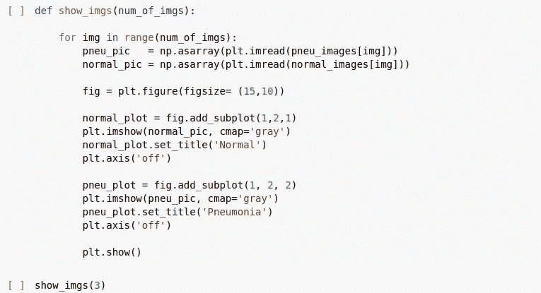

# 利用医学成像预测肺部疾病，实现 VGG、雷斯网和卷积神经网络

> 原文：<https://medium.com/analytics-vidhya/lungs-disease-prediction-using-medical-imaging-with-implementation-of-vgg-resnet-and-183e73b85df9?source=collection_archive---------10----------------------->

# **关于**

## **卷积神经网络**

CNN 是通常用于图像和音频识别和分类的神经网络。它是人脑的复制品，包含多列神经元。与其他神经网络不同，CNN 拥有可调权重和偏差的神经元。卷积图层有助于从输入数据中查找和提取要素。卷积层使用过滤器，也称为内核，用于这一特征提取过程。

**卷积神经网络的架构。**

## **VGG-16**

VGG-16 神经网络是由牛津大学视觉几何组(VGG)开发和训练的卷积神经网络。它被提交到 2014 年大规模视觉识别挑战赛(ILSVRC2014)，该模型在 2014 年的 Imagenet 挑战赛中取得了 92.7%的前 5 名测试准确率，此后它一直在各种框架中可用。数字是体系结构包含的层数。它有 1400 万张手工标注的图片。

## **ResNet50**

Resnet 代表残余网络。resnet 的基本概念是剩余学习。在残差学习中，我们不是试图学习一些特征，而是试图学习一些残差。残差是从该层输入中学习到的特征的减法。ResNet50 是一个 50 层的剩余网络。

**VGG 层和 ResNet 层(Vgg19 和 ResNet152)**

## **医学影像**

医学成像是指为了诊断、医疗条件或监测某一部位而观察人体的各种技术。不同类型的医学成像有 CT 扫描、X 射线、MRI 等

## **ImageNet**

ImageNet 是一个图像数据库或数据集，由超过 1400 万张图像组成，用于计算机视觉研究(视觉对象识别)。它包含 20，000 个类别，如“气球”、“草莓”等。自 2010 年以来，ImageNet 项目举办了一年一度的软件竞赛 ImageNet 大规模视觉识别挑战赛( [ILSVRC](https://en.wikipedia.org/wiki/ImageNet#ImageNet_Challenge) )。VGG 和雷斯内特在这次挑战赛中获奖，这使得他们大受欢迎。

## **肺部疾病预测**

我们将使用位于三个文件夹 train、test 和 Val 中的 5856 幅图像来预测给定的患者 x 光片是否患有肺炎。肺炎是一种影响肺部的传染性炎症疾病，通常由病毒或细菌感染引起。肺炎可以通过胸部 x 光检查来诊断。我们收集了正常和肺炎诊断的 x 光片。这些图像的输入形状为 64x64x3: 64 宽，64 高，有 3 个颜色通道。我们将使用三种不同类型的层对图像进行分类:VGG-16、ResNet50 和卷积神经网络层。

## **让代码**

**导入库**

**建立培训和测试文件夹**

## **让我们来看看其中的一些图片**

**使用图像数据生成器从数据集导入图像。**

**ImageDataGenerator 有助于图像增强。IMAGE_SIZE 将在 VGG、ResNet 实现中使用，以调整图像的大小**

# **使用 CNN 模型**

## **让我们建立 CNN 模型**

**让我们告诉模型使用什么成本和优化方法，并使模型适合我们的训练数据集**

# 使用 VGG

**导入 Vgg16 库后，在 Vgg 前添加预处理层**

我们使用 imagenet 的权重

**确保现有的 VGG 层没有被训练并且权重没有被改变。**

**获取输出类的数量**

**制作一个压平图层，添加最后一个图层**

len(folder)表示我的输出层中有多少类别

**创建模型并观察模型**

**告诉模型使用什么成本和优化方法**

**拟合模型**

# 使用 ResNet50

## Resnet50 实现的代码与 VGG-16 的代码完全相同。您必须做的唯一更改是用 ResNet50 替换 vgg16

## 符合模型

## 链接到 Github 并完成代码:

## [https://github . com/beingnitisho 7/lungsdiaeprediction CNN _ VGG _ ResNet](https://github.com/beingnitisho7/LungsDiseasePredictionCNN_VGG_ResNet)