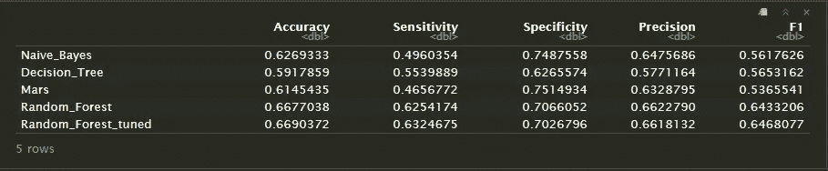

# 歌词语气标识符

> 原文：<https://medium.com/analytics-vidhya/lyric-mood-identifier-c8e94a49c73?source=collection_archive---------20----------------------->

一个 NLP 分类案例，关于使用 R 语言根据歌词(英语)识别歌曲的积极或消极情绪。

音乐不仅能够影响你的心情。据格罗宁根大学的研究人员称，听特别快乐或悲伤的音乐甚至可以改变我们感知世界的方式。在这个现代世界，我们有能力轻松选择我们想听的音乐。一些音乐播放器平台，如 Spotify，因其音乐推荐系统而闻名。其中他们基于他们的客户历史或流派偏好单独推荐音乐。这将是一个新的想法，如果音乐可以通过它的歌词来欣赏，并将根据歌词的情绪获得推荐。


调高音量

# 背景

这个项目是基于这个 [Kaggle 数据集](https://www.kaggle.com/edenbd/150k-lyrics-labeled-with-spotify-valence)。该数据集包含使用 Spotify API 收集的 150k 歌词及其价值。配价是一个从 0.0 到 1.0 的量度，用来描述音轨所传达的音乐积极性。高价曲目听起来更积极(例如，快乐、愉快、欣快)，而低价曲目听起来更消极(例如，悲伤、沮丧、愤怒)。我们在这篇文章中的任务是**执行受监督的自然语言处理情感分析来衡量一首歌曲的积极程度。**这种分析可以用于 Spotify 公司自身改进其基于歌词(词)的音乐推荐系统。

局限性:语言既广泛又复杂。NLP 也因其高计算值而闻名。所以在这个分析中，我将只使用英文歌词，并且只对 45k 首歌曲进行数据采样。

**注:**所有库和代码都是用 Rstudio 软件作为 R 编程语言 IDE 处理的。

使用的库:

```
# You can load the package into your workspace using the `library()` function
library(dplyr)
library(tidytext)
library(textclean)
library(tm)
library(SnowballC)
library(stringr)
library(rsample)
library(cld2)
library(caret)
library(e1071)
library(tidymodels)
```

正如我之前所说，数据集包含 150k 的歌词和一些变量。这是关于数据集的一瞥

```
Observations: 158,353
Variables: 5
$ X      <int> 0, 1, 2, 3, 4, 5, 6, 7, 8, 9, 10, 11, 12, 13, 14, 15, 16, 17, 18, 19, 20, 21, 22, 23, 2...
$ artist <fct> Elijah Blake, Elijah Blake, Elijah Blake, Elijah Blake, Elijah Blake, Elijah Blake, Eli...
$ seq    <fct> "No, no\nI ain't ever trapped out the bando\nBut oh Lord, don't get me wrong\nI know a ...
$ song   <fct> Everyday, Live Till We Die, The Otherside, Pinot, Shadows & Diamonds, Uno, Girlfriend (...
$ label  <dbl> 0.6260, 0.6300, 0.2400, 0.5360, 0.3710, 0.3210, 0.6010, 0.3330, 0.5060, 0.1790, 0.2090,...
```

# 数据争论

这里我给你看一个歌词的例子。

```
head(dat$seq,1)> [1] No, no\nI ain't ever trapped out the bando\nBut oh Lord, don't get me wrong\nI know a couple niggas that do\nI'm from a place where everybody knows your name\nThey say I gotta watch my attitude\nWhen they see money, man they all start actin' strange\nSo fuck with the ones that fuck with you\nThey can never say I'm brand new\n\nIt's everyday, everyday\nEveryday, everyday, everyday\nEveryday, everyday\nEveryday, everyday\nI've been talkin' my shit, nigga that's regular\nI've been lovin' 'em thick, life is spectacular\nI spend like I'ma die rich, nigga I'm flexin', yeah\nEveryday, that's everyday\nThat's everyday\nThat's everyday\nThat's everyday, everyday\n\nI see all of these wanna-be hot R&B singers\nI swear you all sound the same\nThey start from the bottom, so far from the motto\nYou niggas'll never be Drake\nShout out to OVO\nMost of them prolly don't know me though\nI stay in the cut, I don't fuck with no\nBody but I D, that's a pun on No I.D\nWhen nobody know my name\nRunnin' for my dream wasn't hard to do\nYou break bread, I swear they all pull out a plate\nEat with the ones who starved with you\nIf I'm winnin' then my crew can't lose\n\nIt's everyday, everyday\nEveryday, everyday, everyday\nEveryday, everyday\nEveryday, everyday\nI've been talkin' my shit, nigga that's regular\nI've been lovin' 'em thick, life is spectacular\nI spend like I'ma die rich, nigga I'm flexin', yeah\nEveryday, that's everyday\nThat's everyday\nThat's everyday\nThat's everyday, everyday\n\nI heard since you got money\nYou changed, you're actin' funny\nThat's why I gets on my lonely\nYou be lovin' when change is a hobby\nWho do you dress when you ain't got nobody?\n\nIt's everyday, everyday\nEveryday, everyday, everyday\nEveryday, everyday\nEveryday, everyday\nI've been talkin' my shit, nigga that's regular\nI've been lovin' 'em thick, life is spectacular\nI spend like I'ma die rich, nigga I'm flexin', yeah\nEveryday, that's everyday\nThat's everyday\nThat's everyday\nThat's everyday, everyday
135645 Levels: ''Do you want... to have... a tasty... mushroom?' ...
```

歌词存储在 seq 列中。正如你所看到的，在建模之前需要做很多处理。我们首先可以做的最简单的事情是删除“\n”作为它的新换行符。目标列(标签)仍为数字格式。正如我之前所说，较高的价值(标签)意味着歌曲被认为是积极的情绪，而较低的价值意味着消极的情绪。我将把化合价转换成二进制值，标记为“正”和“负”，中间值为 0.5。我还想过滤英语歌词，以执行自然语言处理更容易。我将使用“cld2”包中的函数来检测歌词语言。

```
dat$seq <- str_replace_all(as.character(dat$seq), "\n"," ")
# valence with > 0.5 will labelled as potiive, < 0.5 negative
dat$mood <- ifelse(dat$label > 0.5, "positive","negative")
dat$lang <- cld2::detect_language(dat$seq)
# filter the data to english lyric only
dat <- dat[dat$lang == "en",]
```

让我们看看我们的数据是如何变化的

```
head(dat$seq,1)> [1] "Who keeps on trusting you When you been cheating Spending your nights on the town? Who keeps on saying That she still wants you When you're through runnin' around? Who keeps on lovin' you When you been lyin' Sayin' things that ain't what they seem?  Well, God does But I don't  God will But I won't And that's the difference Between God and me  God does, but I don't God will, but I won't And that's the difference Between God and me   So, who says she'll forgive you Says that she'll miss you And dream of your sweet memory? Well God does But I don't God will  But I won't And that's the difference Between God and me  God does, but I don't God will, but I won't And that's the difference  Between God and me  God does, but I don't God will, but I won't And that's the difference Between God and me"
```

这只是我们将为文本清理做的许多步骤之一。由于我的机器限制，我只用 45k 的歌曲进行分析。这些歌曲是从随机抽样中选出的。

在文本清理过程中，我更熟悉的是 *tm* 和 *stringr* 包但我也想学习 *textclean* (来自 *tidytext* )魔法。在建模之前，我将使用这两个包来清理我的文本数据。下面是我们在文本清理过程中要做的事情的代码，解释写在代码内的 hash (#)中:

```
dat <- dat %>%
  mutate(text_clean = seq %>%  # select seq column
           str_to_lower() %>%  # convert all the string to low alphabet
           replace_contraction() %>% # replace contraction to their multi-word forms
           replace_internet_slang() %>% # replace internet slang to normal words
           replace_word_elongation() %>% # reolace informal writing with known semantic replacements
           replace_number(remove = T) %>% # remove number
           replace_date(replacement = "") %>% # remove date
           str_remove_all(pattern = "[[:punct:]]") %>% # remove punctuation
           str_squish() %>% # reduces repeated whitespace inside a string.
           str_trim() # removes whitespace from start and end of string
         )
```

上面的代码中发生了很多事情，但是我们只需要一段代码就可以做到。我还会将文本数据转换成语料库，并使用 *tm* 包进行标记化。之后，我将只选择出现在 850 首歌曲中的词。这个限制是概括我们模型中使用的单词所必需的。

```
corp <- VCorpus(VectorSource(dat$text_clean))corp_dtm <- corp %>% 
  # use pre-build english stopwords
  tm_map(removeWords, stopwords("en")) %>%
  tm_map(stemDocument) %>%
  # convert corpus to document term matrix
  DocumentTermMatrix() # Find term frequency that appear in at least 850 lyrics
freq_term <- findFreqTerms(corp_dtm, 850)
# 815 words are selected
dat.dtm <- corp_dtm[,freq_term]
```

# 建模

## 朴素贝叶斯

使用 NB 建模需要在训练数据中进行特殊处理。列代表单词，每行代表一首歌曲。NB 不需要每个词的确切数量，只需要知道这些词是否出现在歌曲中。因此，我们将每个单元格中的值转换为包含 1 或 0。1 表示该特定单词出现在歌曲中，0 表示不存在。

```
# split the data. 75% for train data, and 25% for test data
set.seed(1502)
index <- sample(1:nrow(dat.dtm), 0.75*nrow(dat.dtm))train_x <- dat.dtm[index,]
test_x <- dat.dtm[-index,]
# subset label/target variable
train_label <- dat[index,"mood"]
test_label <- dat[-index,"mood"]
```

使用伯努利转换器将 0 以上的任何值转换为 1，0 保持为 0。我们将构建一个自定义函数来实现这一点，然后将该函数应用于训练和测试数据。

```
# build bernoulli converter function
bernoulli_conv <- function(x){
  x <- as.factor(as.numeric(x>0))
}# apply bernoulli_conv funtion to train and test data
train_x <- apply(train_x,2,bernoulli_conv)
test_x <- apply(test_x,2,bernoulli_conv)
```

单元格中的 0 表示歌曲没有特定的单词。这也意味着相应的类别-特征组合出现的概率为 0。它将破坏 NB 算法，该算法使用贝叶斯规则计算给定独立预测变量的分类类变量的条件 a-后验概率。我们可以指定拉普拉斯=1 来启用加一平滑。

最后，我们将构建朴素贝叶斯模型，进行预测(测试数据)，并为以后的评估创建混淆矩阵

```
# train the model
mod.nb <- naiveBayes(train_x, as.factor(train_label), laplace = 1)
# predict to test data
pred.nb <- predict(mod.nb, test_x,
                   type = "class")# build dataframe for prediction result
pred.nb.x <- cbind(data.frame(pred.nb),test_label)%>%
  setNames(c("pred","actual"))# create confusion matrix 
cf.nb <- confusionMatrix(data = pred.nb.x$pred,
                         reference = pred.nb.x$actual,
                         positive = "positive")
```

结果如下:

```
cf.nb> Confusion Matrix and StatisticsReference
Prediction negative positive
  negative     4363     2733
  positive     1464     2690

               Accuracy : 0.6269               
                 95% CI : (0.6179, 0.6359)     
    No Information Rate : 0.518                
    P-Value [Acc > NIR] : < 0.00000000000000022

                  Kappa : 0.2468               

 Mcnemar's Test P-Value : < 0.00000000000000022

            Sensitivity : 0.4960               
            Specificity : 0.7488               
         Pos Pred Value : 0.6476               
         Neg Pred Value : 0.6149               
             Prevalence : 0.4820               
         Detection Rate : 0.2391               
   Detection Prevalence : 0.3692               
      Balanced Accuracy : 0.6224               

       'Positive' Class : positive
```

## 决策图表

接下来，我们将使用不同的算法构建另一个模型。我们将使用决策树、MARS 和随机森林。所有建模过程(除了朴素贝叶斯)都在使用 *parsnip* 包(嵌入在 *tidymodel* 包中)。但在此之前，我们需要用清理后的数据制作一个数据框。令牌值不会像朴素贝叶斯那样转换为 1 或 0。它会保持原样。和之前一样，我们也将数据分成 75%和 25%的比例进行训练和测试。

```
dat.clean <- as.data.frame(as.matrix(dat.dtm), stringsAsFactors = F)
# we have 800+ variable in words form. i change the label name from `mood` to labelY to avoid overwriting column names
new.dat <- cbind(dat.clean, data.frame(labelY = dat$mood))# splitting dataset
set.seed(1502)
splitter <- initial_split(new.dat, prop = 0.75, strata = "labelY")
train <- training(splitter)
test <- testing(splitter)
```

最后，我们来建立决策树模型，做预测(对数据进行测试)，创建一个混淆矩阵，供后期评估。

```
# Train the model
mod.dt <- decision_tree(mode = "classification") %>%
  set_engine("rpart") %>% fit(labelY~., data = train)pred.dt <- predict(mod.dt, test, 
                   type = "class")# build dataframe for prediction result
pred.dt.x <- as.data.frame(cbind(pred.dt, test$labelY)) %>%
  setNames(c("pred","actual"))# create confusion matrix
cf.dt <- confusionMatrix(data = pred.dt.x$pred,
                         reference = pred.dt.x$actual,
                         positive = "positive")
```

这是决策树模型的结果:

```
cf.dt> Confusion Matrix and StatisticsReference
Prediction negative positive
  negative     3671     2404
  positive     2188     2986

               Accuracy : 0.5918              
                 95% CI : (0.5826, 0.6009)    
    No Information Rate : 0.5208              
    P-Value [Acc > NIR] : < 0.0000000000000002

                  Kappa : 0.1808              

 Mcnemar's Test P-Value : 0.00151             

            Sensitivity : 0.5540              
            Specificity : 0.6266              
         Pos Pred Value : 0.5771              
         Neg Pred Value : 0.6043              
             Prevalence : 0.4792              
         Detection Rate : 0.2654              
   Detection Prevalence : 0.4600              
      Balanced Accuracy : 0.5903              

       'Positive' Class : positive
```

## 火星

接下来，我们使用 MARS 算法建立第三个模型

```
# train mars model
mod.mars <- mars(mode = "classification") %>%
  set_engine("earth") %>% fit(labelY~., data = train)pred.mars <- predict(mod.mars, test, 
                   type = "class")# build dataframe for prediction result
pred.mars.x <- as.data.frame(cbind(pred.mars, test$labelY)) %>%
  setNames(c("pred","actual"))# create confusion matrix
cf.mars <- confusionMatrix(data = pred.mars.x$pred,
                         reference = pred.mars.x$actual,
                         positive = "positive")
```

这是火星模型的结果:

```
cf.mars> Confusion Matrix and StatisticsReference
Prediction negative positive
  negative     4403     2880
  positive     1456     2510

               Accuracy : 0.6145               
                 95% CI : (0.6055, 0.6236)     
    No Information Rate : 0.5208               
    P-Value [Acc > NIR] : < 0.00000000000000022

                  Kappa : 0.2195               

 Mcnemar's Test P-Value : < 0.00000000000000022

            Sensitivity : 0.4657               
            Specificity : 0.7515               
         Pos Pred Value : 0.6329               
         Neg Pred Value : 0.6046               
             Prevalence : 0.4792               
         Detection Rate : 0.2231               
   Detection Prevalence : 0.3526               
      Balanced Accuracy : 0.6086               

       'Positive' Class : positive
```

## 随机森林

我最喜欢的算法之一，也是最讨厌的(RAM killer af)。这个又爱又恨的模型需要对列名进行特殊处理。像*这样的列名 break，for，next，if* 被认为是特殊字符，因此在构建随机森林和模型调优时会出现错误。

```
## i store the train and test data to new variabel so the old one remain reproducible
train_tune <- train
test_tune <- testcolnames(train_tune) <- make.names(colnames(train_tune))
colnames(test_tune) <- make.names(colnames(test_tune))# build 5 folds cross validation for tuning evaluationn
set.seed(1502)
folds <- vfold_cv(train_tune, 3)
```

在我们更改了列名(改为:更改特殊字符)之后，我们将像以前一样构建模型。

```
# Train Random Forest model
mod.rf <- rand_forest(trees = 500, mtry = 5, mode = "classification") %>%
  set_engine("ranger") %>% fit(labelY~., data = train_tune)pred.rf <- predict(mod.rf, test_tune, 
                   type = "class")# build dataframe for prediction result
pred.rf.x <- as.data.frame(cbind(pred.rf, test_tune$labelY)) %>%
  setNames(c("pred","actual"))# create confusion matrix
cf.rf <- confusionMatrix(data = pred.rf.x$pred,
                         reference = pred.rf.x$actual,
                         positive = "positive")
```

这是随机森林模型的结果:

```
cf.rf> Confusion Matrix and StatisticsReference
Prediction negative positive
  negative     4140     2019
  positive     1719     3371

               Accuracy : 0.6677               
                 95% CI : (0.6589, 0.6764)     
    No Information Rate : 0.5208               
    P-Value [Acc > NIR] : < 0.00000000000000022

                  Kappa : 0.3328               

 Mcnemar's Test P-Value : 0.000001006          

            Sensitivity : 0.6254               
            Specificity : 0.7066               
         Pos Pred Value : 0.6623               
         Neg Pred Value : 0.6722               
             Prevalence : 0.4792               
         Detection Rate : 0.2997               
   Detection Prevalence : 0.4525               
      Balanced Accuracy : 0.6660               

       'Positive' Class : positive
```

从上面所有的混淆矩阵可以看出，随机森林模型的准确率最高。遗憾的是，我对结果不满意。最高准确率只有 66.75%。我将尝试为随机森林模型做模型调整，希望我们能得到一个更好的结果。

# 随机森林的模型调整

在随机森林中，我们可以做一些参数调整，如*树*和*树参数*。这一次，我们将对树的数量进行网格调整，并根据给定的数量进行排序。我们将用 3 k 倍交叉验证进行 4 次网格搜索。

```
# specify the grid for both parameter
rf.grid <- expand.grid(trees = c(450,500,550,600), mtry = 3:6)rf.setup <- rand_forest(trees = tune(), mtry = tune()) %>%
  set_engine("ranger") %>%
  set_mode("classification")# this tuning takes a very lot of time. if you do this in your PC, please be patient and make sure your machine have at least 8gb of RAM 
rf.tune <- tune_grid(labelY~., model = rf.setup, resamples = folds, grid = rf.grid, metrics = metric_set(accuracy, sens, spec))
```

调谐需要很多时间。调优后，我知道最佳结果的参数是*树* = 6 和*树* = 550。然后，我们将使用这些参数重建模型，进行预测(测试数据)，并为以后的评估创建混淆矩阵。

```
# specify best parameter
best.rfX <- rf.tune %>% select_best("accuracy", maximize = F)#rebuild the model
mod.rf.2X <- rf.setup %>% finalize_model(parameters = best.rfX)
mod.rf.2.new <- mod.rf.2X %>% fit(labelY~., data = train_tune)# predict new model to test data
pred.rf.2 <- predict(mod.rf.2.x, test_tune, 
                   type = "class")# build dataframe for prediction result
pred.rf.2.x <- as.data.frame(cbind(pred.rf.2, test_tune$labelY)) %>%
  setNames(c("pred","actual"))# create confusion matrix
cf.rf.2 <- confusionMatrix(data = pred.rf.2.x$pred,
                         reference = pred.rf.2.x$actual,
                         positive = "positive")
```

从精确度 66.7 到 66.9，我们的改进很小

我想还不错

# 模型评估和结论

让我们结合所有的混淆矩阵，使评估更容易

```
df.nb <- data.frame(t(as.matrix(cf.nb, what = "classes")))
df.nb <- cbind(df.nb, data.frame(t(as.matrix(cf.nb,what = "overall"))))df.dt <- data.frame(t(as.matrix(cf.dt, what = "classes")))
df.dt <- cbind(df.dt, data.frame(t(as.matrix(cf.dt,what = "overall"))))df.mars <- data.frame(t(as.matrix(cf.mars, what = "classes")))
df.mars <- cbind(df.mars, data.frame(t(as.matrix(cf.mars,what = "overall"))))df.rf <- data.frame(t(as.matrix(cf.rf, what = "classes")))
df.rf <- cbind(df.rf, data.frame(t(as.matrix(cf.rf,what = "overall"))))df.rf.2 <- data.frame(t(as.matrix(cf.rf.2, what = "classes")))
df.rf.2 <- cbind(df.rf.2, data.frame(t(as.matrix(cf.rf.2,what = "overall"))))all.eval <- rbind(Naive_Bayes = df.nb, 
                  Decision_Tree = df.dt,
                  Mars = df.mars,
                  Random_Forest = df.rf,
                  Random_Forest_tuned = df.rf.2) %>%
  select("Accuracy","Sensitivity","Specificity","Precision","F1") %>% data.frame()
```

下面是结果截图:



图 1:所有模型的度量结果

由于在这种情况下没有紧迫性，我们将选择准确性作为解决这种情况的高优先级指标。如果用户不喜欢推荐的歌曲，他们可以很容易地删除或跳过，这不会影响我们的运营成本。悲伤歌曲播放列表中的积极歌曲不会伤害任何人，但如果我们试图避免它，它会更好。

从上表可以看出，*随机森林调优的*模型精度最高。如果我们尝试另一种分类模型，总是有可能获得更高的准确性(或其他指标)。我们以后会这么做的。因此，总之，**我们将使用*随机森林*模型根据歌词来预测歌曲的情绪。**

# 预测新的给定歌词

> 如果我有一句歌词不在数据集中，我可以用这个算法来预测它的情绪吗？

## 是的，你可以

我们只涵盖大约 45k 首歌曲。全世界有成千上万的歌曲，如果我们不能预测歌词的情绪，那真是太遗憾了。因此，在这里，我们将尝试构建一个函数来将一个普通的新歌词文本放入我们的模型中。在我们预测他们的情绪之前，数据会被自动清理。

在这里，我将使用《海贼王》OST 开场 3 中一首名为“hikari e”(to the light)的歌曲作为样本。这首歌原本是日本的，但我翻译它来配合我们现有的模式。

```
# new text lyric
text <- "I've just now begun to search, over the splashing waves
For the everlasting world
With this overflowing passion in my chest, I will go anywhere
Seeking the light yet unseen.When  the summer sun shakes my heart's sail
That's the signal to open the door to a new world
Swaying on the waves, supassing my despair
Aiming for the other side of the horizon.I've just now begun to search, over the splashing waves,
For the everlasting world
With this overflowing passion in my chest, I will go anywhere,
Seeking the light yet unseen.A current of repetitious days and mundane clouds
I see reflected in you a future you can't possibly know
Even if I avoid pain by not changing
That leaves me without dreams or even hope -- so let's go!.Why am I searching?  What is it I want?
The answer is surely somewhere ahead
My heart will go on to the moving world
Hiding my yet unseen strength.Why am I searching?  What is it I want?
Where is the yet unseen treasure?
With this overflowing passion in my chest, how far can I go?
I don't know, butI've just now begun to search, over the splashing waves,
For the everlasting world
With this overflowing passion in my chest, I will go anywhere,
Seeking the light yet unseenTo the other side"
```

首先，我们需要把歌词转换成数据帧，就像我们以前的算法一样。我将使用*随机森林*模型来预测这首歌词，因为这是我们最好的模型。接下来，我们将构建自动清理歌词并将其转换为所需形状的函数。它只是将所有的清理步骤合并到一个函数中，并构建新的数据帧作为输出。它还将单词作为预测变量与训练数据中所需的列名(本例中为单词)进行匹配。

```
textcleaner <- function(x){
  x <- as.character(x)

  x <- x %>%
    str_to_lower() %>%
    replace_contraction() %>%
    replace_internet_slang() %>%
    replace_word_elongation() %>%
    replace_number(remove = T) %>%
    replace_date(replacement = "") %>%
    str_remove_all(pattern = "[[:punct:]]") %>%
    str_squish() %>%
    str_trim()

  xdtm <- VCorpus(VectorSource(x)) %>%
    tm_map(removeWords, stopwords("en")) %>%
    tm_map(stemDocument) %>% 
    DocumentTermMatrix(control = list(
      dictionary = names(train_tune)
    ))

  dfx <- as.data.frame(as.matrix(xdtm), stringAsFactors=F)

}
```

之后，我们将应用该函数对歌词进行采样，并使用*随机森林*模型预测歌曲的情绪。

```
# apply textcleaner function to sample text
samptext <- textcleaner(text)predict(mod.rf.2.x,samptext)> 
.pred_class
<fctr>
negative
```

*随机森林*模型预测歌词是一首消极情绪的歌曲。如果你听到真正的歌曲，它实际上是一首充满精神、活力和积极情绪的音乐，但我从来不知道歌词到底在说什么。

## 谢谢大家！

想讨论请留言评论。我也接受所有的批评，这样我就能不断学习。

# 参考

*   [该项目的 Github 库](https://github.com/western11/Lyric-Mood-Identifier)
*   [Rpubs 文档](https://rpubs.com/jojoecp/612656)
*   [Kaggle 数据集和内核](https://www.kaggle.com/joecristian/brief-lyric-s-mood-identifier)
*   [Algoritma](https://algorit.ma/) :我工作和学习数据科学的地方