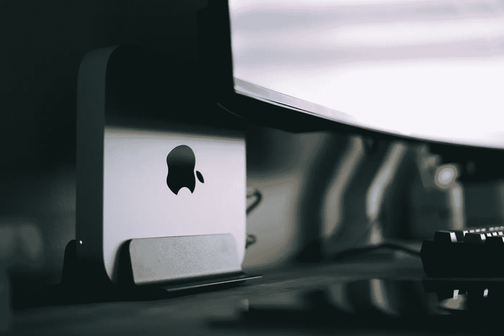
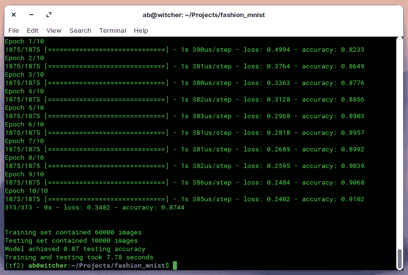
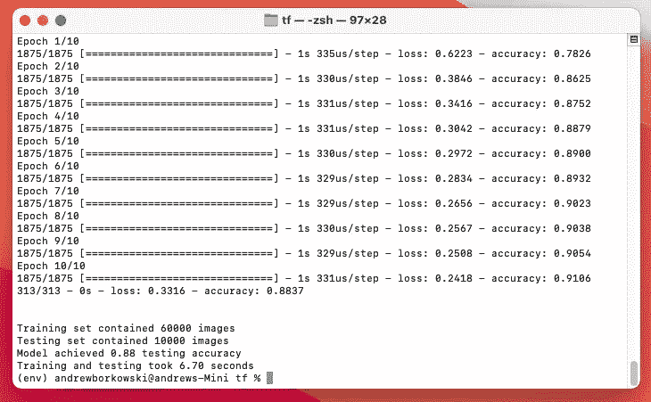
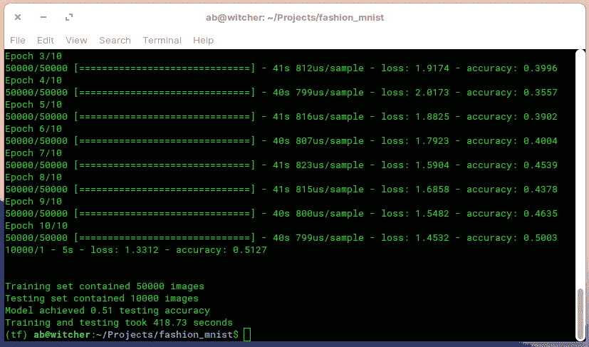
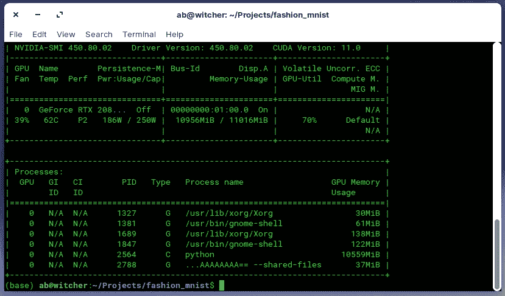
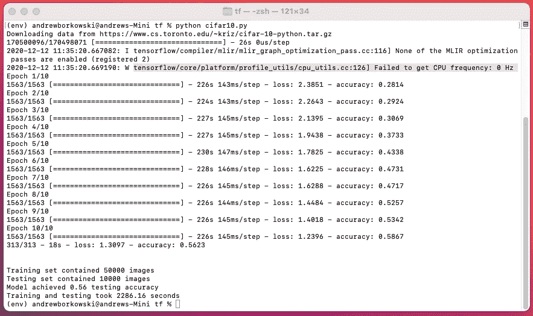
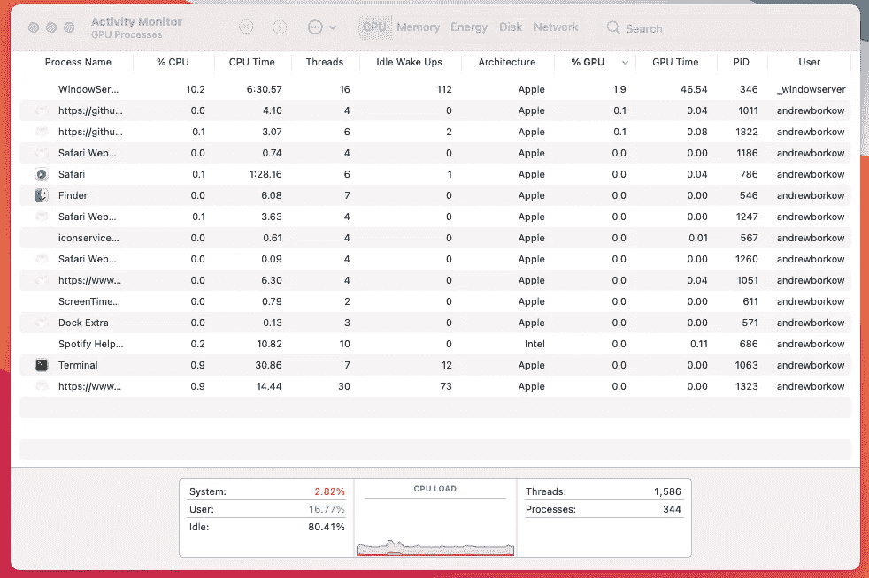

# M1 Mac Mini 在 TensorFlow 速度测试中的得分高于我的 RTX 2080Ti。

> 原文：<https://medium.com/analytics-vidhya/m1-mac-mini-scores-higher-than-my-nvidia-rtx-2080ti-in-tensorflow-speed-test-9f3db2b02d74?source=collection_archive---------1----------------------->

更新(12/12/20):对于更大的数据集和模型，RTX 2080Ti 仍然更快！

乔伊·班克斯在 [Unsplash](https://unsplash.com/s/photos/mac-mini?utm_source=unsplash&utm_medium=referral&utm_content=creditCopyText) 上的照片

两个最受欢迎的深度学习框架是 TensorFlow 和 PyTorch。它们都通过 CUDA 工具包支持 NVIDIA GPU 加速。由于苹果不支持 NVIDIA GPUs，直到现在，苹果用户只能在 CPU 上进行机器学习(ML)，这明显限制了训练 ML 模型的速度。

随着 MAC 电脑采用新的 M1 芯片，以及 macOS Big Sur 中可用的 ML 计算框架，神经网络现在可以在 MAC 电脑上进行训练，性能大幅提高。

根据[最近的苹果博客](https://machinelearning.apple.com/updates/ml-compute-training-on-mac):

“TensorFlow 2.4 的新 tensorflow_macos 分支利用 ML Compute 使机器学习库不仅可以充分利用 CPU，还可以充分利用 M1 和英特尔支持的 MAC 中的 GPU，从而大幅提高训练性能。这从应用更高级别的优化开始，如融合层、选择适当的设备类型以及将图形编译和执行为图元，这些图元由 CPU 上的 bnn 和 GPU 上的金属性能着色器加速。”

自从我上周拿到了新的 M1 Mac Mini，我决定使用新的苹果框架来尝试我的 TensorFlow 脚本之一。我根据[苹果 GitHub](https://github.com/apple/tensorflow_macos) 网站说明在 Mac Mini 上安装了 tensorflow_macos，并使用以下代码对来自[时尚-MNIST 数据集](https://github.com/zalandoresearch/fashion-mnist)的商品进行分类。

首先，我在配有英特尔酷睿 i7–9700k 处理器、32GB 内存、1TB 快速 SSD 存储和英伟达 RTX 2080Ti 显卡的 Linux 机器上运行脚本。

训练和测试花费了 7.78 秒。

然后我在我的新 Mac Mini 上运行了这个脚本，它配有 M1 芯片、8GB 的统一内存和 512GB 的快速 SSD 存储。新的苹果 M1 芯片包含 8 个 CPU 核心，8 个 GPU 核心和 16 个神经引擎核心。

训练和测试用时 6.70 秒，比我的 RTX 2080Ti GPU 快 14%！我很惊讶。

苹果 M1 芯片与苹果 ML 计算框架和 TensorFlow 2.4 的 tensorflow_macos 分支(TensorFlow r2.4rc0)一起使用，性能非常显著。目前，以下软件包不适用于 M1 MAC 电脑:SciPy 和相关软件包，以及服务器/客户端 TensorBoard 软件包。希望不久会有更多的软件包推出。添加 PyTorch 支持将是我的首要任务。

最后，Mac 正在成为机器学习从业者的可行替代方案。虽然未来是充满希望的，但我还没有摆脱我的 Linux 机器。

更新(12/12/20):对于更大的数据集和模型，RTX2080Ti 仍然更快！

非常感谢所有阅读我的文章并提供宝贵反馈的人。特别感谢 Damien Dalla-Rosa 建议使用 CIFAR10 数据集和 ResNet50 模型，并感谢 Joshua Koh 建议使用 perf_counter 进行更精确的时间流逝测量。以下是我在 M1 和 RTX 2080Ti 上运行的新代码，它包含更大的数据集和更大的模型:

首先，我在我的 Linux RTX 2080Ti 机器上运行新代码。

训练和测试用时 418.73 秒。我只训练了 10 个纪元，所以准确性不是很大。GPU 利用率从 65%到 75%不等。

接下来，我在 M1 Mac Mini 上运行了新代码。

在具有更大数据集的更大型号上，M1 Mac Mini 花费了 2286.16 秒。比采用英伟达 RTX 2080Ti GPU 的 Linux 机器长 5 倍以上！根据 Mac 的活动监视器，有最低限度的 CPU 使用率，没有任何 GPU 使用率。

由于 M1 TensorFlow 只在 alpha 版本中，我希望未来的版本能够利用芯片的 GPU 和神经引擎核心来加快 ML 训练。只有时间能证明一切。

我期待着其他人使用苹果的 M1 MAC 进行 ML 编码和培训的体验。

感谢你花时间阅读这篇文章。

安德鲁

@tampapath