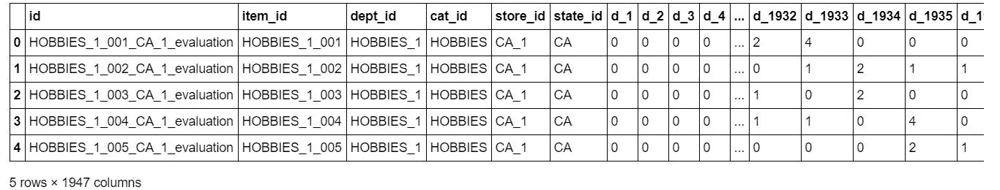
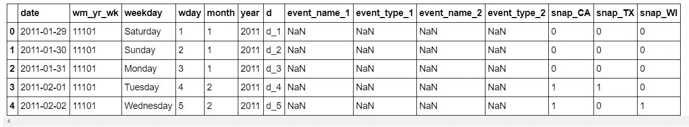
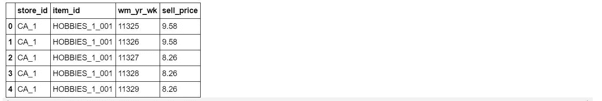
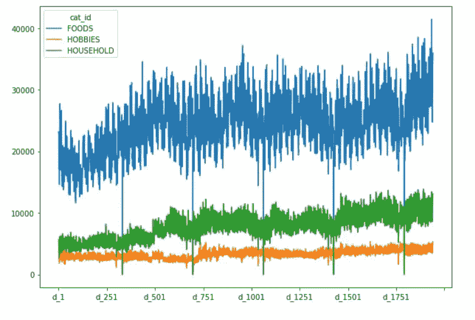
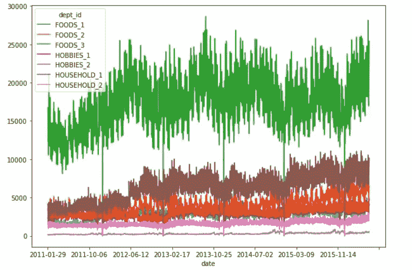
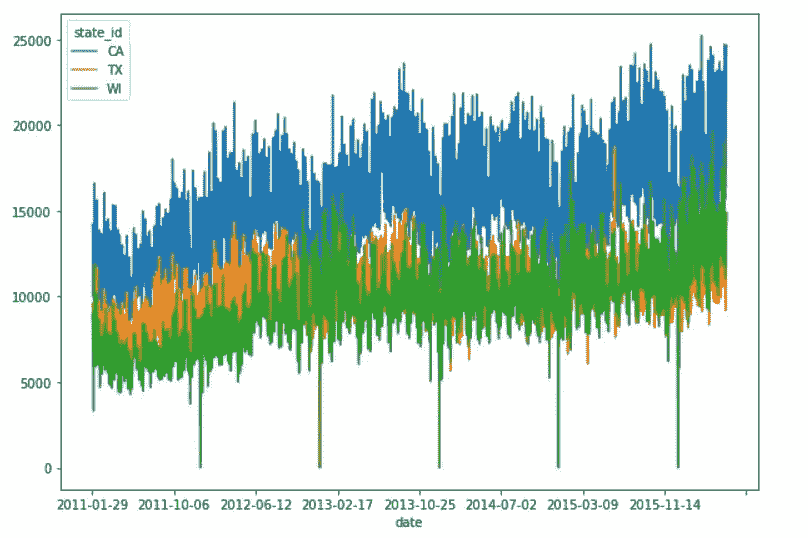
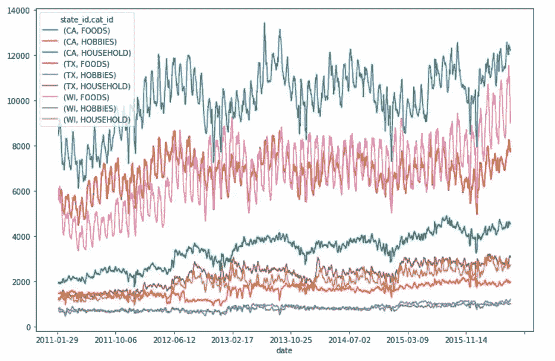

# M5 预测-准确性:使用沃尔玛销售数据的时间序列预测

> 原文：<https://medium.com/analytics-vidhya/m5-forecasting-accuracy-time-series-forecasting-using-walmart-sales-data-374765d3f1f7?source=collection_archive---------8----------------------->


[Hanson Lu](https://unsplash.com/@hansonluu?utm_source=medium&utm_medium=referral) 在 [Unsplash](https://unsplash.com?utm_source=medium&utm_medium=referral) 上的照片

# 竞争概述:

本次比赛提供了沃尔玛的分层销售数据 [M5 预测-准确性](https://www.kaggle.com/c/m5-forecasting-accuracy)。该竞赛的目标是预测加利福尼亚、得克萨斯和威斯康星三个州的 10 家不同商店未来 28 天的每种产品的销售额。

> 这个博客的全部代码和我的 python 解决方案笔记本可以在这个 [github 链接](https://github.com/aakashveera/M5-Accuracy/blob/master/Notebook%20M5%20Accuracy.ipynb)中找到。

# **数据描述:**

该数据集包括美国三个州 3 个不同类别的 3049 种独特产品的销售历史，以及每种产品的价格和每天举行的活动的详细信息。它被分成三个 CSV 文件

1.  Calendar.csv:它包含关于产品销售日期以及当天举行的活动和项目的信息。
2.  Sales_train_evaluation:它包含从第 1 天到第 1941 天每个商店中每个产品的历史每日单位销售额。
3.  Sell_prices:它包含每个商店每周的产品价格信息。

# 探索性数据分析:

> E DA，理解数据和创建健壮特征的最关键步骤。所以我们来探究一下数据。

```
#read and check the head of the dataframe
data = pd.read_csv("sales_train_evaluation.csv")
sell_prices = pd.read_csv("sell_prices.csv")
calendar = pd.read_csv("calendar.csv")
data.head()
calendar.head()
sell_prices.head()
```



> 有 3049 种独特的产品，分布在 3 个类别、10 个部门(子类别)和 10 个商店，分别来自 3 个州，即加利福尼亚、德克萨斯和威斯康星。

如数据描述中所述，给出了每个商店每种产品的每日销售详情。当地和全球事件的每一天都提供了详细的一天被提供。

***SNAP*** 是我们进行的一项营养援助计划，通过该计划，低收入家庭可以在特定日期购买食物。这是一个二进制特征，表示快照在每个状态的特定日期是否保持。

产品的价格不是恒定的，每周提供产品的价格。现在让我们使用 *matplotlib 和 seaborn 可视化销售趋势。*

**产品类别销售**



**部门产品销售**



**陈述明智的产品销售**



**7 天滚动平均的各州品类销售趋势**



1.产品主要在 CA 上销售，尤其是在商店 CA_3 上。
2。食品 _4 部门的产品比其他食品和其他类别的产品卖得多。
3。销售增长呈上升趋势，这促进了公司的收入。

> 在最后一张图中，滚动平均值为 7，可以在每个州观察到每个类别独特的季节性上升趋势。所以为每一对做不同的模型会得到更好的分数

# 特征工程:滞后特征

创建时滞特征是将时间序列预测问题转化为监督学习问题的经典方法。

时滞特性是在第 t-1 天创建目标值，作为第 t 天的特性(即前一天的销售作为新特性)。因为目标是预测未来 28 天的销售，所以创建了 28、29 和 30 天的滞后特征。

```
data['lag_t28'] = data.groupby(['id'])['demand'].transform(lambda x: x.shift(28))
data['lag_t29'] = data.groupby(['id'])['demand'].transform(lambda x: x.shift(29))
data['lag_t30'] = data.groupby(['id'])['demand'].transform(lambda x: x.shift(30))
```

其他统计特征，如平均值、标准差、kurt、偏斜度也是根据不同滚动日的滞后数据计算的。

```
data['rolling_mean_t7']   = data.groupby(['id'])['demand'].transform(lambda x: x.shift(28).rolling(7).mean())
data['rolling_std_t7']    = data.groupby(['id'])['demand'].transform(lambda x: x.shift(28).rolling(7).std())
data['rolling_mean_t30']  = data.groupby(['id'])['demand'].transform(lambda x: x.shift(28).rolling(30).mean())
data['rolling_mean_t90']  = data.groupby(['id'])['demand'].transform(lambda x: x.shift(28).rolling(90).mean())
data['rolling_mean_t180'] = data.groupby(['id'])['demand'].transform(lambda x: x.shift(28).rolling(180).mean())
data['rolling_std_t30']   = data.groupby(['id'])['demand'].transform(lambda x: x.shift(28).rolling(30).std())
data['rolling_skew_t30']  = data.groupby(['id'])['demand'].transform(lambda x: x.shift(28).rolling(30).skew())
data['rolling_kurt_t30']  = data.groupby(['id'])['demand'].transform(lambda x: x.shift(28).rolling(30).kurt())
```

作为另一个重要的特征，还创建了过去一天的销售价格的变化

```
data['lag_price_t1'] = data.groupby(['id'])['sell_price'].transform(lambda x: x.shift(1))data['price_change_t1'] = (data['lag_price_t1'] - data['sell_price']) / (data['lag_price_t1'])data['price_change_t365'] = (data['rolling_price_max_t365'] - data['sell_price']) / (data['rolling_price_max_t365'])data.drop(['rolling_price_max_t365', 'lag_price_t1'], inplace = True, axis = 1)
```

**对分类列进行编码:**

```
#missing values on events are filled as noevent and encoded using label Encoderfrom sklearn.preprocessing import LabelEncodernan_features = ['event_name_1', 'event_type_1', 'event_name_2', 'event_type_2']
for feature in nan_features:
    data[feature].fillna('noevent', inplace = True)cat = ['item_id', 'dept_id', 'cat_id', 'store_id', 'state_id', 'event_name_1', 'event_type_1', 'event_name_2', 'event_type_2']
for feature in cat:
    encoder = LabelEncoder()
    data[feature] = encoder.fit_transform(data[feature])
```

# 使用 LightGBM 建模:

一旦 EDA 和特征工程结束， **LightGBM** 这是一种比 xgboost 快得多的流行梯度增强算法，用于预测未来 28 天的销售。

如 EDA 中所述，每个商店的每个部门都有独特的趋势，因此需要单独进行预测。

**评估指标和结果:**

加权均方根误差用作比赛的评估指标，使用 LightGBM 在 kaggle 的私人排行榜上获得的 wrmse 为 **0.62128** 。

# 链接:

解决方案链接:博客和解决方案的完整代码可以在这个 [github 链接](https://github.com/aakashveera/M5-Accuracy/blob/master/Notebook%20M5%20Accuracy.ipynb)中找到，它是本次比赛的 ***银牌解决方案*** 。

希望你喜欢这个博客，欢迎任何评论，谢谢！