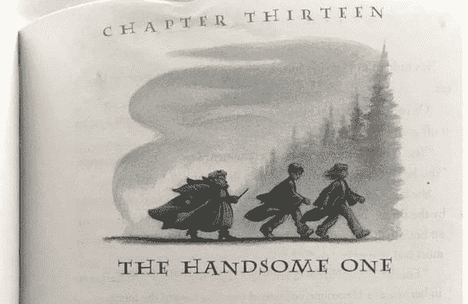

# 机器艺术

> 原文：<https://medium.com/analytics-vidhya/machine-art-a51eba2105a2?source=collection_archive---------1----------------------->

“人工智能艺术”最近以 432，500 美元的价格售出了一幅由一个生殖对抗网络创作的“绘画”。只是为了好玩，我收集了一些额外的人工智能的“艺术”应用。

**写作**

博特尼克使用哈利波特系列的文本训练了一个神经网络，然后从[T5 生成了一章“哈利波特和看起来像一大堆灰烬的肖像”](http://botnik.org/content/harry-potter.html) J.K .罗琳会感到骄傲的。