# 机器故障预测。

> 原文：<https://medium.com/analytics-vidhya/machine-failure-prediction-3cbaf31a7862?source=collection_archive---------3----------------------->

在故障发生之前了解你的机器故障。

# 目录:

1.  引言。
2.  动机。
3.  问题定义。
4.  数据信息。
5.  探索性数据分析。
6.  填充空值。
7.  绩效指标。
8.  特征工程方法 1
9.  特征工程方法 2
10.  最终结果分析
11.  结果表
12.  结论和未来工作
13.  参考

# 1.简介:


发生什么事了？

你可以在照片中看到一个人，他的名字叫乔。由于电脑系统故障，他刚刚丢失了非常重要的演示文稿，他也可能会丢掉工作。他非常生气，并认为，如果他被警告这台计算机出现故障，那么他可以安排另一台计算机或找到其他方法来做这个演示。这是我编造的一个例子，但我们可能见过这样一种情况，我们使用的任何机器的突然故障都会给我们带来大问题。

想象一个行业，其中多台机器在一个循环中一起工作，生产最终产品。他们每分钟生产数千种产品，他们承受不起机器故障。即使机器发生故障并在一分钟内恢复，仍然会给行业造成巨大损失。

因此，预测机器的未来故障是一项非常重要的任务，但问题是如何做到这一点？答案是通过使用机器学习。如果从安装在机器上的各种传感器获得适当的数据，给定 ML 模型，那么我们可以预测该机器的未来故障。

这个问题的简单解释如下。我们从机器中获取实时数据，如温度、各点的电流、信号峰值等。把它交给 ML 模型，它会告诉我们，比如说在接下来的 10 分钟内，机器是会出故障还是正常工作。

# 2.动机:

在深入探讨这个问题之前，我们需要理解为什么解决这个问题很重要，它用在哪里，或者可以用在哪里。

*   **行业-** 正如我们所讨论的，在行业中，预测机器故障非常重要。他们有一个名为 SCADA 的系统，可以监控信号并帮助预测机器的故障。但是当有大量数据或数据中的异常模式很难检测时，SCADA 就无法工作。然后 m1 采取步骤，有效且高效地给出故障预测。一旦检测到未来的故障，他们就为机器提供维护，这降低了维护成本，因为只有在未来出现故障时才提供维护，并且还增加了机器的寿命。
*   **电力局-** 我们可以监控来自各个配电点的信号，并预测故障。这将有助于避免在工业、医院等领域因断电而导致的所有问题。
*   **硬盘故障预测-** 现代硬盘是可靠的设备，但故障可能会让用户付出高昂的代价，许多人将受益于潜在问题的警告，这将让他们有足够的时间备份数据。有各种各样的研究人员正在研究这个问题，在[的这篇](https://jmlr.csail.mit.edu/papers/volume6/murray05a/murray05a.pdf)论文中，他们为这个问题提供了一个解决方案，还有更多解决方案可供使用。

# 3.问题定义:

我正在解决一个预测水泵故障导致供水中断的问题。有一个供水系统向一个远离城镇的大城镇供水。我观察了 5 个月，其中水泵出现了 7 次故障。这些失败给许多人带来了巨大的问题，也给一些家庭带来了严重的生活问题。

一些人正在处理那个水泵，他们试图分析安装在水泵上的传感器的所有读数，但是他们没有能够预测下一次故障。因此他们提出用机器学习来解决这个问题。我们必须根据给定的数据训练一个模型，并尽快向负责水泵的人发出故障警告，以便他能够采取必要的措施。

这是一个**二元分类问题**，我们必须预测水泵的状态，是正常工作还是坏了。

# **4。数据信息:**

这个问题发布在 Kaggle 上，ka ggle 是世界上最大的数据科学社区，作者不详。你可以从 [**这里**](https://www.kaggle.com/nphantawee/pump-sensor-data) 下载数据。

我所掌握的数据，实际上是一个时间序列数据。你可能会问什么是时间序列数据？时间序列是在等间隔的时间点取得的序列。这是时间序列数据的一个非常简单的定义。

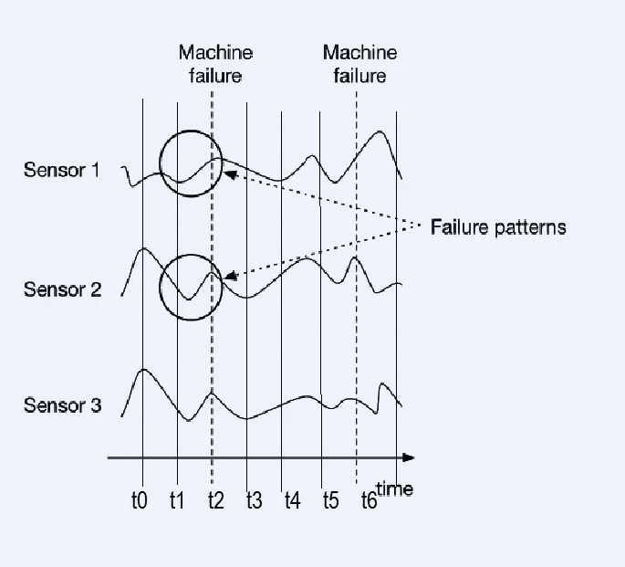

正如我们在图中看到的，我们有从 t0 到 t6 的时间，对于每个时间 t，我们从 3 个传感器获取读数。每个传感器读数随时间不同而变化。在 t2 和 t6，我们记录的模式不同于正常模式，因此检测到故障。如果我们手动尝试，我们不能捕捉这样的模式，但 ML 可以。

在我们的数据集中，我们有 52 个这样的传感器读数以及水泵的相应状态，所有读数都是以 1 分钟的间隔获取的。水泵停留在“正常”、“损坏”或“恢复”中的任何一种状态。“正常”状态意味着水泵正常工作，“损坏”意味着水泵出现故障并停止工作，“恢复”意味着水泵不工作且处于欠恢复状态。只有 7 分属于“破碎”类，因此数据存在巨大的不平衡。

# 5.探索性数据分析:

EDA 是一种可视化、总结和解释隐藏在数据的行和列格式中的信息的方法。在我们的情况下，我们应该了解这样的事情，我们的数据实际上看起来如何，传感器读数在机器的每个状态下如何不同，当有故障时出现哪种模式，等等。

## ***一、空值数据检查:***

大多数情况下，数据包含一些空值。是因为数据填写错误，数据记录错误，或者有时候数值其实是不存在的。原因可以是任何东西，但我们应该记住，我们的模型不能处理空值数据。因此，作为 EDA 的第一步，我更喜欢检查空值。

我绘制并打印了每个特征包含的空值的百分比，从中我观察到了一些重要的东西。


图 1 空值表示

从图 1 中，每个特征包含一定百分比的空值，正如我们可以看到 sensor_15 包含 100%的空值，因此最好将其从数据集中移除。有时，空值可能包含一些特殊的含义，可能有助于对数据进行分类。对于任何特征，如果所有的空值只属于一个类，而所有的非空值属于另一个类，那么我们可以很容易地对数据进行分类。我检查了一下，发现没有这样的特征，所有的空值只属于一个类，这意味着空值无助于数据分类。

## ***二世。检查类别标签平均值的差异:***

我想检查一下，从每个传感器获得的值是否与类别标签不同。为了大致了解这一点，我们根据类别标签在每个要素中创建了组，计算了每个组的平均值并绘制了图表。

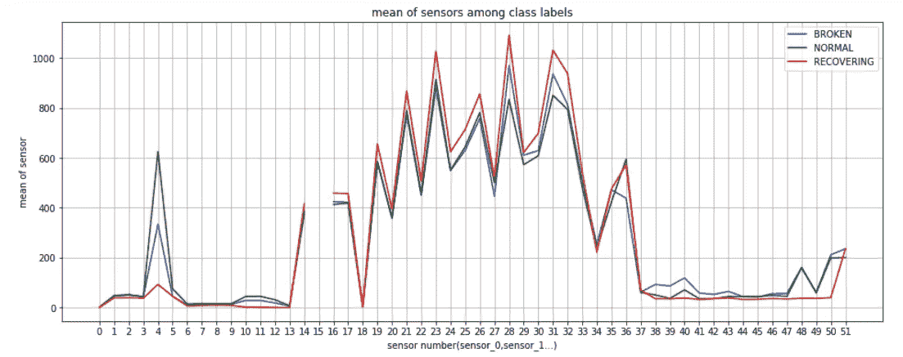

图 2 类别标签之间的平均值

我已经删除了列“传感器 _15 ”,因为它是空列，因此我们可以在图 2 中看到不连续性。我们可以看到，有些传感器的平均值差异很大，例如传感器 _04、传感器 _28、传感器 _31 等。还有像 sensor_01，sensor_06 等传感器。我们无法区分它的意思。

从上面图 2 中，很难对类别标签之间的特征均值差异做出任何结论。如果差异很大，则意味着该特性更重要，如果差异很小，则该特性不太重要。为了清楚地了解特征的重要性，我在图 3 中画出了分类标签“破损”和“正常”的平均值差异。

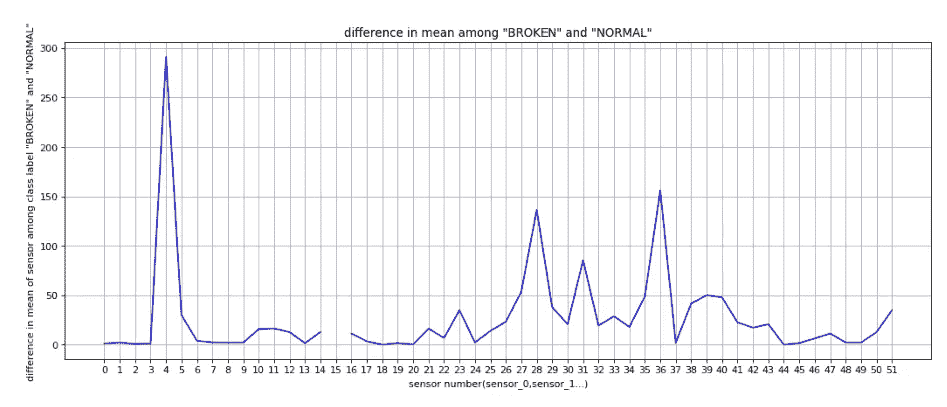

图 3 平均值差异

## ***三世。检查类别标签的标准差差异:***

上面我已经取了类别标签之间特征的平均值，我想，我也应该检查标准偏差。在这里，我根据每个要素的分类标签创建了组，计算了每个组的标准偏差并绘制了它。

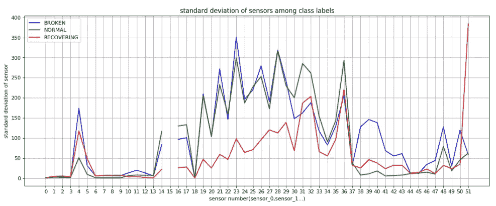

图 4 标准。戴夫。在类别标签中

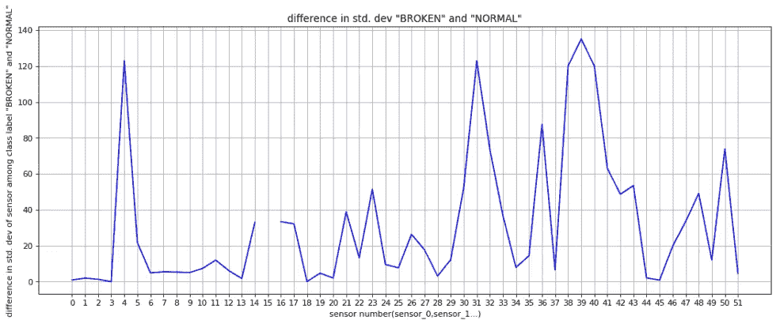

图 5 标准差的差异。偏差

我们可以观察到，如此多的特征在分类标签“损坏的”和“正常的”之间具有很好的标准偏差差异。由此，我们可以很容易地说那些具有高差异的特征是重要的，但是我们应该记住，我们只有 7 个“破碎”类的样本，因此这种差异可能由于这个原因而出现，所以我们不能从这些图中得出关于重要特征的结论。

## ***四世。*剧情为一些重要特征:**

我们从图 2 和图 4 中观察到，对于某些特征，我们可以看到分类标签“破损”和“正常”之间的平均值和标准偏差的良好差异。我们说这些功能很重要，但是，我们发现重要的功能实际上是否重要，可以肯定的是，我已经通过绘制散点图和 PDF 分析了其中一些功能。


图 6“传感器 _04”散点图

在图 6 的散点图中，有很多点重叠，因此我们无法想象“破碎”类的点，因为它们非常少，因此我们无法从中得出任何结论。让我们看看这些特性的 pdf。

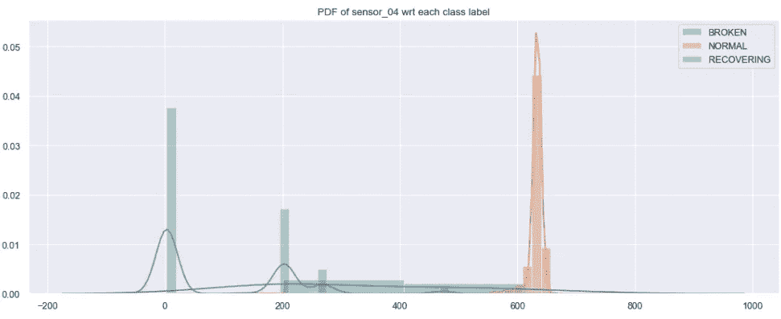

图 7“传感器 _ 04”PDF

我们可以在上面的图中看到,“损坏”和“正常”类别的 pdf 没有完全分开。“破损”类别的 PDF 的扩散比其他类别更大，如果我们观察“破损”类别的直方图，它与“正常”类别的直方图是分开的，这是好的。

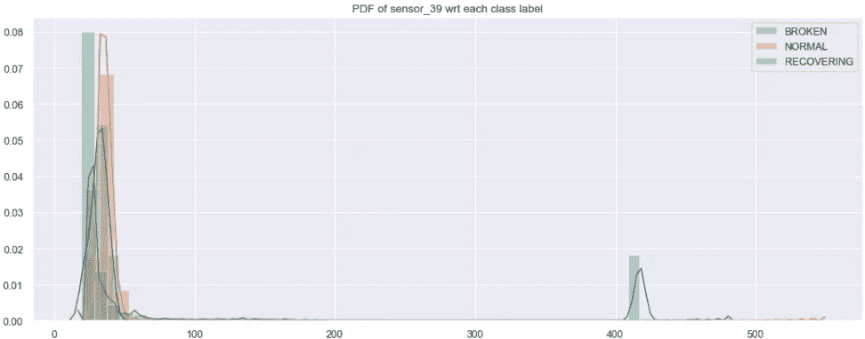

图 8“传感器 _ 39”PDF

图 8，sensor_39 的所有类别的 pdf 重叠。“损坏”类的一些值与其他值分离，但大多数值与其他类的值混合在一起。“破损”类别的 PDF 稍微向左偏移，因此一些部分被分离，但我们仍无法对 sensor_39 做出任何有力的结论。


图 9“传感器 _ 31”PDF

我们可以在图 9 中看到，属于“正常”类的值具有较大的范围，因为分布较大。“正常”和“恢复”等级之间的重叠很高。“正常”和“破损”类别之间也有重叠，但是“破损”类别的 PDF 峰值高于“正常”,并且扩散也很小。因此，sensor_31 可能有助于分类这些数据集。

## ***伏机状态随时间:***

我们有日期从 2018 年 4 月 1 日 00:00:00 到 2018 年 8 月 31 日 23:59:00 的数据。我们有一个分类标签，即机器状态“损坏”、“正常”和“正在恢复”。正常情况下水泵工作在“正常”状态。对于失败，状态是“破”。一旦发生故障，泵在恢复所需的时间内处于“恢复”状态。我们知道这些事情，但实际上这是如何发生的，为了看到这一点，我绘制了下图。

为了得到这个图，我将分类标签转换成数字，即“损坏”= 1，“正常”= 0，“恢复”= -1

```
df_temp=data[['timestamp','machine_status']] #created temporary datarame to store only time and class label 
df_temp['machine_status'][df_temp['machine_status']=='BROKEN']= 1
df_temp['machine_status'][df_temp['machine_status']=='NORMAL']= 0
df_temp['machine_status'][df_temp['machine_status']=='RECOVERING']= -1 #replaced label as mentioned abovefig=plt.figure(num=None, figsize=(18, 6), dpi=80, facecolor='w', edgecolor='k')
plt.plot(df_temp['machine_status']) #plotted
plt.xlabel('time in minutes')
plt.ylabel('class label')
plt.title('machine status plot')#this is used to print recovering time of each failure
f=1 # is is use to print failure number like 1,2,3....7
for i in df_temp[df_temp['machine_status']==1].index: #over each falure
    j=i+1
    temp=0
    while df_temp['machine_status'][j] == -1: #count recovering        point after each broken point
        temp=temp+1
        j=j+1
    print('for failure {0} at {2}, recovering time is {1} hours'.format(f,temp/60,df_temp['timestamp'][i]))
    f=f+1 
```

上面的代码包含两部分，一部分用于绘制图表，另一部分用于计算每次故障后的恢复时间(以小时为单位)。我们创建了一个临时数据帧，它只存储来自原始数据帧的时间戳和类标签。我们已经将类别标签转换成数字，并绘制了图表。为了获得每次失败后的恢复时间，我们在每次失败的索引上运行 for 循环，然后我们计算该失败索引后具有“恢复中”类别标签的样本数。为了得到这个时间，我们用 60 除这个小时的单位。

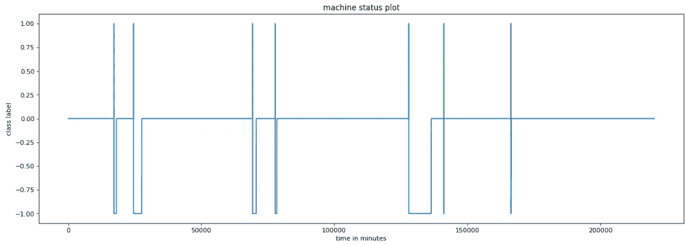

每次故障之间的时间段不同，每次故障后的恢复时间也不同。我们已经打印出故障的准确时间以及故障后水泵恢复正常所用的时间。水泵恢复的最长时间是 139 小时，大约 6 天，最短时间是 41 分钟。我们可以说，从水泵在每次故障中的不同恢复时间来看，每次故障的原因可能各不相同，因此我们不应该删除任何功能，即使我们并不认为它很重要。

## 不及物动词随着时间的推移绘制一些要素和分类标签:

在这里，我们将看到这些特性是如何随着水泵状态的变化而变化的。为了实现这一观点，我们将在同一个图中绘制与时间相关的特征和“机器状态”。我们必须使我们的特征标准化，因为“机器状态”的范围是-1 到 1，我们不知道特征的范围。如果范围很大，那么就不能正确地看到图形。

首先，我们必须绘制一个图表，其中 y 轴表示“机器状态”, x 轴表示时间。之后，我们将绘制任何特征，例如“传感器 _04”。

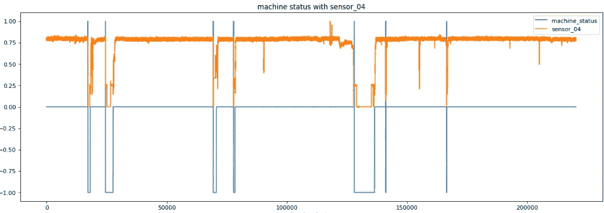

我们可以看到，只要“machine_status”变为 1，就意味着存在故障，sensor_04 值会突然降至最小值，并在整个恢复时间内保持最小值。这意味着 sensor_04 特性随着水泵的状态而变化。


此处，传感器 _05 的值在故障发生时下降，在故障恢复期间保持在最大恒定值。出现一些故障，但该功能受水泵状态的影响。

有些特性不会随着水泵状态的改变而改变。他们的行为完全是随机的。其中一些如下所示。

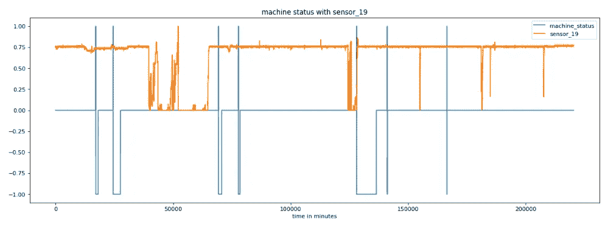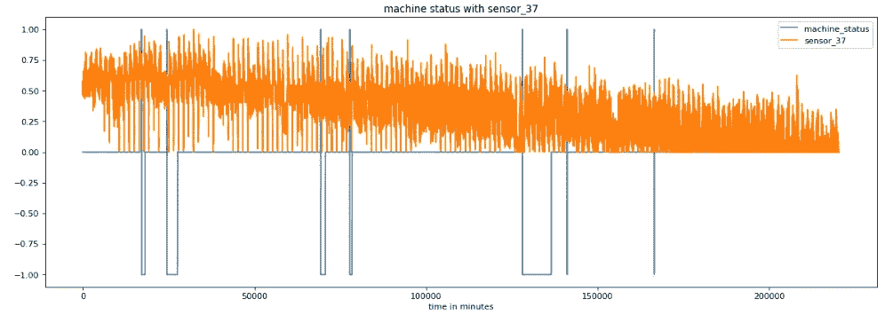

我为每个特性绘制了这个图表，并列出不随水泵状态变化而变化的特性。

# 6.填充空值:

正如我们在 EDA 中看到的，我们在每个特性中都有空值。我们可以简单地删除那些包含空值的行，但是删除这些行可能会造成信息的丢失。我们必须取代这些价值观，但问题是我们应该用什么来取代它？如果我们用 0 来代替它，但是我们不知道 0 对于这个特性的意义，因此这不是一个好的选择。我们可以用该特征的平均值替换这些空值。我已经计算了每个特性的平均值，并用该特性的平均值替换了该特性中的空值。

# 7.绩效指标:

性能度量是我们用来评估 ML 算法的术语。实现机器学习算法后的下一步是找出基于指标和数据集的模型有多有效。不同的性能指标用于评估不同的机器学习算法。例如，使用分类器来区分不同对象的图像；我们可以使用分类性能指标，如对数损失、平均准确度、AUC 等。

我们必须根据我们的问题和我们拥有的数据集来选择性能指标。我们的数据集高度不平衡，因此我们无法使用准确性。我们有一个名为 F1 分数的性能矩阵，它是通过名为 precision 和 recall 的两个性能矩阵计算出来的。我们没有使用 F1 分数，因为在我们的案例中，回忆比精确更重要。

我们想要预测所有的失败，这意味着我们想要一个高的真实阳性率。我们可以容忍假阳性意味着预测的点是“坏的”,但实际上，它们不是“坏的”点。我们不能容忍假阴性，这意味着预测的点是“正常的”，但它们实际上是“坏的”。因此，我们选择召回作为我们的问题的性能指标。

# **8。特征工程方法 1:**

我们有时间序列数据，这意味着信息存在于样本的连续序列中，因此我们在这里使用滚动窗口方法进行特征工程。非常重要的一点你应该注意到，我们正在使用当前和过去的数据来预测未来的机器状态。在当前时间 t，我们使用时间 t，t-1，t-2，..为了预测时间 t+1，t+2，…

问题应该是二元分类问题，即是否存在故障，但我们在原始数据中有 3 个类别。我们可以在图 2 和图 4 中看到，“恢复”类不同于“损坏”和“正常”类，因此我们不能将其添加到任何其他类中。我认为最好删除带有“恢复”类标签的数据。

下图显示了在我们的案例中，我是如何使用滚动窗口方法来获取特征的。s0，s1，s2…..这些是样品，表示传感器的读数，相应的颜色表示该样品的机器状态。蓝色、黄色、红色分别表示“正常”、“正在恢复”、“损坏”。我使用大小为 3 的窗口，我将预测 3 分钟后水泵的状态。

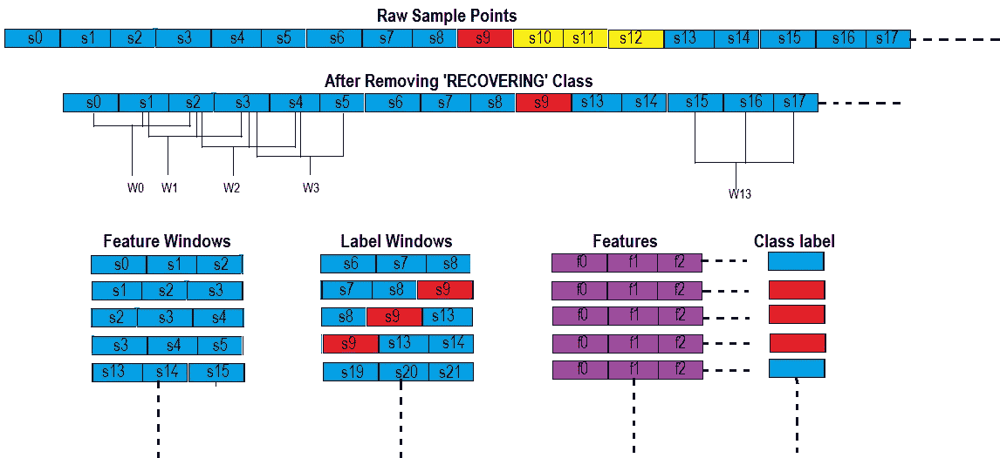

在我们的数据集中，传感器读数和相应的机器状态都是在同一时间获取的，比如时间 t。我们应该使用当前时间 t 的传感器读数来预测时间 t+4 的机器状态，因为我说过我们在 3 分钟前预测故障。为了理解整个概念，让我们举一个例子，考虑第二特征窗口，即图中的 s1、s2、s3。s3 应该是当前时间 t 的传感器读数，s2、s1 应该分别是时间 t-1、t-2 的传感器读数。一旦我们在时间 t 从特征窗口中提取了特征，我们就找到了我们将在时间 t+4 得到的样本。因为我们在时间 t 有样本 s3，所以 s7 应该是时间 t+4 的样本。为了更好的预测，我没有考虑单个样本，而是考虑了窗口，即 s7、s8、s9，并获取对应于这些样本的机器状态。即使标签窗口中有一个单一故障点，我也会将机器状态分配为“已损坏”给提取的特征。

在这种方法中还有一点需要注意，你可以看到，一旦包含故障的窗口在标签窗口集中结束，我就在故障样本的下一个样本处移动特征窗口，在 s3、s4、s5 之后，下一个窗口我取为 s13、s14、s15。这是因为我已经删除了'恢复'类，因此在时间上出现了不连续性。s9 之后我们有 s13，有 s10，s11 和 s12 不存在。

## ***特征集 1:60 分钟前的故障预测。***

以上是我用来创建特性集的方法的简单说明。越早预测失败越好。在这里，我试图在 60 分钟前预测失败。我使用的窗口大小为 60。对于每个窗口，我将采用 5 个特征，即最小值、最大值、标准偏差、中值和平均值。

故障类别的数据点非常少，因此我使用窗口间距 1 表示“损坏”,窗口间距 2 表示“正常”类别。如果样本像 s1、s2、s3……那么“中断”类的第一个窗口是 S1-s60，第二个窗口应该是 s2-s61，依此类推。对于“正常”类，第一个窗口是 s1-s60，然后下一个窗口是 s3-s62，依此类推。我正在删除“恢复”类，并将“正常”类设为 0，将“损坏”类设为 1。

```
data=data[data['machine_status']!='RECOVERING']
data['machine_status'][data['machine_status']=='BROKEN']= 1
data['machine_status'][data['machine_status']=='NORMAL']= 0if not os.path.isfile('final_data_1.csv'):
    # here we are making column's name for our dataframe. 
    columns=[]
    columns.append(data.columns[0]) 
    for col in data.columns[1:-1]:
        columns.append('s{0}_mean'.format(col[7:])) #to select sensor number
        columns.append('s{0}_std'.format(col[7:]))
        columns.append('s{0}_mid'.format(col[7:]))
        columns.append('s{0}_min'.format(col[7:]))
        columns.append('s{0}_max'.format(col[7:]))
    columns.append('machine_status')
    index=0
    final_data=pd.DataFrame(columns=columns)
    while index < data.shape[0]-120:
        print(index)
        window=data[data.columns[1:-1]].iloc[index:index+60]
        l=[] # this list store single row
        l.append(data['timestamp'].iloc[index+60]) #taking timestamp
        for col in window.columns:
            l.append(window[col].mean())#calculating features
            l.append(window[col].std())
            l.append(window[col].median())
            l.append(window[col].min())
            l.append(window[col].max())
        ms=data['machine_status'].iloc[index+120:index+180].max() #taking max class label from window so that if there is----
        #failure, we can detect it.
        l.append(ms)
        if (ms==1) and (data['machine_status'].iloc[index+120+1:index+180+1].max()==0): #if failure window is over then---
            #we should move index to next point after failutr point because we are not uing that failure window for prediction.
            index=index+121
        else:
            if ms==1:
                index=index+1 #1 spacing
            else:
                index=index+2 #2 spacing
        final_data=final_data.append(pd.Series(l, index=columns), ignore_index=True)
    final_data.to_csv('final_data_1.csv')
```

代码可能看起来很长，但是如果你已经理解了我上面解释的方法，它是非常简单的。我已经删除了' RECOVERING '类，并将前三行中的' breaked '转换为 1，将' NORMAL '转换为 0。我正在检查文件是否已经存在，这段代码只在文件不存在时运行。在第一个“for 循环”中，我正在创建功能名称。我将每个传感器，即传感器 _00、传感器 _01，命名为 s00 _ 平均值、s00 _ 最大值等。我们可以看到，在传感器 7 的名称中，字符串的索引包含传感器编号，例如 sensor_ **39** ，因此我将该编号放在第一个“for loop”下，并创建特征名称。原始数据中有 51 个传感器，我为每个传感器取 5 个特征，因此特征变成 255 个。我已经创建了名为‘final _ data’的数据帧，并添加了特性名作为列名。我在开始的时候把索引赋值为 0，它将保存每个窗口的初始值。

我对数据中的每个点运行“While loop ”,直到剩下最后 120 个点，因为对于最后 120 个点，我没有窗口来获取类标签。我将一个大小为 60 的窗口存储在一个变量“window”中。我创建了一个列表“l ”,它按顺序存储数据，在填充每个值后，我将这个列表添加到最终的数据帧中。首先，我将窗口的最后一个样本的时间戳添加到‘l’中。然后，我对窗口中的每一列运行“for loop ”,并逐个获取特征并将其存储在“l”中。请注意，您用来创建特征名称的序列在这里应该使用相同的序列。例如，我们的特征窗口像 s1-s60，那么标签窗口应该是 s120- s180，因为在时间 t，我们从时间 t+61 取标签窗口。如果 t 是 s60，那么标签窗口应该从 s120 开始，正如我在上面的代码中所做的那样。在获取机器状态时，我会获取标签窗口的最大值，因为即使存在单一故障点，机器状态也会为 1，即“损坏”。我正在检查当前机器状态是否为 1，下一个机器状态是否为 0，这意味着我已经获取了标签窗口中所有的故障点，故障窗口已经结束，现在我必须像我一样将索引移动到故障点的下一个点。

最后，我得到一个数据帧，其中每个单一故障点有 60 个故障点，因为我考虑了整个窗口来获得机器状态，而不是单个点。因此，对于所有 7 次失败，我得到 420 个失败点。

***一、列车试分裂:***

正如我们所知，我们有时间数据，它可能会随着时间的推移，然后结果也将有所不同。因此，最好根据时间分割我们的数据，比如为训练生成旧数据，为测试生成新数据。只有 7 个故障数据点，我在 FE 部分中为每个故障数据点创建了 60 个数据点。我决定使用 4 个故障数据点用于训练，2 个用于 CV，1 个用于测试。我将使用 50%的数据用于训练，25%用于每个 CV 和测试。

我已经读取了 CSV 文件并取出了所有属于 1 类的点，然后将数据拆分为 train、cv 和 test。之后我在火车里加了 4 个故障点，cv 加了 2 个，测试加了 1 个。你可能会问为什么我在拆分后还要添加失败点？这是因为我使用时间分割，我也尝试过直接分割，然后所有 6 个故障点都在训练集中，只有 1 个点留在 cv 集中。这就是为什么我遵循这种方法，这里我也在训练中添加了旧的故障点，在测试中添加了新的故障点。

我已将“机器状态”列作为 y_train、y_cv 和 y_test，并将其从 X_train、X_cv 和 X_test 中移除。

***II 随机森林模式:***

数据是高度不平衡的，我们只有阳性类的 7 个数据点。我们知道，基于决策树的模型对于不平衡数据表现良好，并且随机森林本身减少了方差。这就是为什么我决定试验随机森林。

我用默认参数训练了一个随机森林模型，得到了下面的结果。

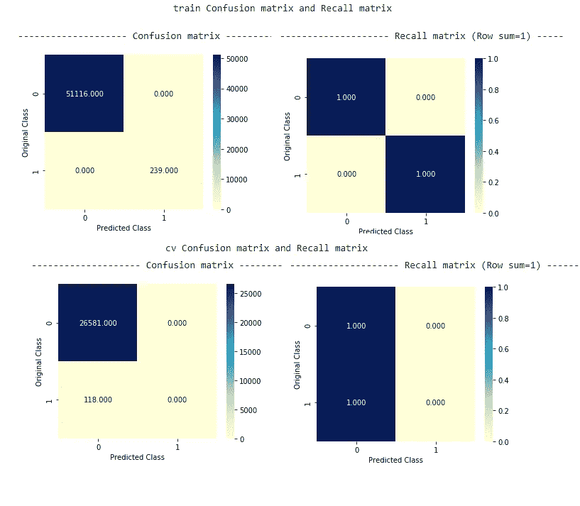

我绘制了训练和 cv 数据的混淆矩阵和回忆矩阵。我们可以看到，训练数据的召回率为 1，cv 数据的召回率为 0%。在 cv 中，属于类别 1(即故障类别)的所有点被预测为正常。很明显，我们的模型是过度拟合的。

**三世*。为减少过拟合所做的实验:***

1.  尝试降低概率阈值:

我想让我们检查一下我在 0 类和 1 类的 cv 数据中得到的概率值。如我们所知，如果概率值小于 0.5，我们将类别标签指定为 0，如果概率值大于或等于 0.5，我们将类别指定为 1。通过将这个 0.5 阈值设置为 0.3 这样的小值，我想检查我们的结果是否会改善。

我已经打印了 cv 数据中第 1 类的概率，发现第 1 类的所有点的概率值大约为 0。因此，即使我保持一个较小的阈值，结果也不会改善。

2.检查训练、cv 和测试数据集的分布:

如果训练数据来自不同的分布和 cv，那么测试数据来自不同的分布，这可能导致模型的过度拟合。我在一张图中绘制了训练、cv 和测试数据的每个特征的 PDF。对于特征 x，如果训练、cv 和测试分布相同，则 PDF 应该重叠。


对于所有特性，我得到了如图所示的结果。我发现所有特性的训练、CV 和测试的分布是不同的。

我没有找到任何解决方案来减少绘制 PDF 时的过度拟合。因此，我为训练数据中的所有点分配了类别标签 0，为 cv 数据中的所有点分配了类别标签 1，为测试数据中的所有点分配了类别标签 3。根据这些数据训练决策树模型，并尝试对训练、cv 和测试进行分类。我得到的结果是令人惊讶的，DT 模型以 100%的准确率对训练、cv 和测试进行了分类。然后我去掉了一些对分类很重要的特征，准确率仍然是 99%。

最后，我得出结论，即使我删除了一些特性，分布的差异仍然保持不变。我应该承认，在培训、简历和测试的分布上存在差异。我必须找到一种方法来减少过度拟合，即使分布存在差异。

3.一类分类器:隔离森林

隔离森林是一种异常检测方法，用于检测数据集中的稀有点。在训练数据集中，只有 240 个点属于类别 1，大约 50000 个点属于类别 0，因此我认为这种方法可以在我们的情况下工作。但是这个结果也不好。

4.用 Hack 建模:将二元分类转换为多类分类。

正如我们所知，在训练数据集中有 240 个 1 类点和大约 50000 个 0 类点。我们的数据是高度不平衡的，这就是为什么模型越来越偏向统治阶级。这是过度拟合的原因之一。在这个方法中，我要解决这个数据不平衡的问题。

我已经使用称为 SMOTE 的技术增加了属于 1 类的数据点。SMOTE 是一种过采样技术，用于创建主导类的合成样本。使用 SMOTE 我得到了 1 级 2044 分。我随机抽样了属于类 0 的点，并制作了大小为 2044 的集合，这等于我对于类 1 所拥有的点数。0 班的总分是 51116，所以我得到了 25 套。我将数字 2 到 26 作为每组的类别标签。现在我有了多类数据，其中类 1 是故障点，所有其他类是正常点，并且每个类的大小相等。

在 cv 和 test 中，我只是把属于 0 类的点的类标签改成了 2 到 26 之间的任意类，比方说 2。我根据这些数据训练了一个随机森林模型。

```
clf=RandomForestClassifier(n_estimators=100,max_depth=11,min_samples_split=15,max_features='sqrt',n_jobs=-1,random_state=1)
clf.fit(X_train,y_train)
y=y_train.copy()
y[y>1]=0 # all point belonging to class more then 1, these all points are actully class 0 point
print('train Confusion matrix and Recall matrix')
pred=clf.predict(X_train)
pred[pred>1]=0
plot_confusion_matrix(y, pred,(5,4))
y=y_cv.copy()
y[y>1]=0
print('cv Confusion matrix and Recall matrix')
pred=clf.predict(X_cv[X_cv.columns[1:]])
pred[pred>1]=0
plot_confusion_matrix(y, pred,(5,4))
y=y_test.copy()
y[y>1]=0
print('cv Confusion matrix and Recall matrix')
pred=clf.predict(X_test[X_cv.columns[1:]])
pred[pred>1]=0
plot_confusion_matrix(y, pred,(5,4))
```

在上面的代码中，我简单地在训练数据上定义并拟合了随机森林模型。正如我们所知，这个问题现在变成了一个多类分类问题，但是我们想要 2x2 格式的混淆和召回矩阵。因此我在变量 y 中取真标签，所有大于 1 的标签我都设为 0。同样，我也对预测类标签做了同样的处理。通过这样做，我将多类标签转换回二进制类。

我做了一些超参数调整，结果如下。

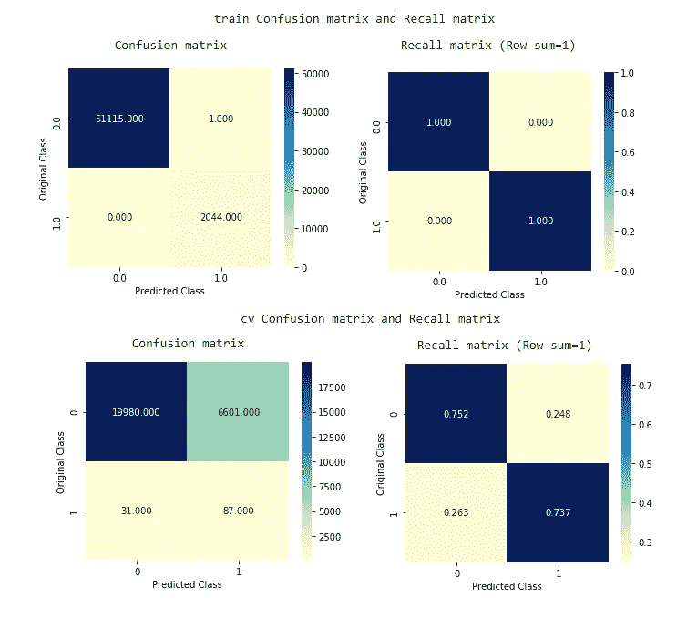

在 7 个实际故障点中，我有 2 个在 cv 中，对于每个故障，我有 60 个样本，所以总数是 120。我们可以看到，我已经正确预测了 87 个故障点，这意味着两个故障都被预测到了，这非常好。这种方法有一个问题，你可以看到我得到了 24 %的假阳性，这意味着 24%属于“正常”类的点被预测为“损坏”。我说过我们可以容忍假阳性，但是 24%是非常高的。我的系统会实时给出错误的失败警告，没有人会相信我的系统。

## 特征集 2:30 分钟前的故障预测。

上面，我试着在 60 分钟前预测失败，结果并不令人满意。在这里，我试图在 30 分钟前预测失败。我使用了我们上面讨论过的相同的方法。我使用的窗口大小为 30,“正常”类的窗口间距为 3,“破碎”类的窗口间距为 1。这是因为在这里我每次失败得到 30 分，因此为了减少属于 0 级的点数，我使用了 3 的窗口间距。在这种情况下，我尝试了随机森林。结果与我之前得到的结果非常相似。我尝试了多类转换，结果比我用 60 窗口大小的数据集得到的结果差。在这里，我也面临过拟合。此数据集的结果比上一个数据集差。因此，我退出了这种特征工程方法，然后第二种方法来了。

# 9.特征工程方法 2:

在前面的有限元方法中，我删除了属于“恢复”类的数据点。在这种方法中，我将“恢复”类转换为“损坏”类。正如我们所知，水泵不在“恢复”状态下工作，也不在“损坏”状态下工作，因此这两种状态的传感器读数可能相似。这种方法可以帮助我们减少过度拟合，因为通过将“恢复”类转换为“损坏”类，我增加了“损坏”类的样本。

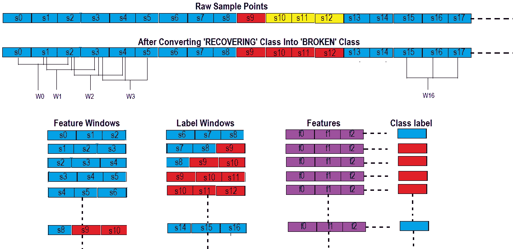

我在这里使用的方法与我们之前获取特性和机器状态的方法相同。这种方法的一个不同部分是，我没有时间的不连续性，因为我没有删除“恢复”类，因此我没有将我们的窗口移动到任何地方。您可以看到特征窗口 s8、s9、s10，其中 2 个点属于“故障”类，3 分钟后机器状态为“正常”。这是由于连续时间滚动窗口造成的。我也在我们的数据集中保存了这样的案例。

这种方法还有一个不同之处。在“VI”部分的探索性数据分析中。随着时间的推移绘制一些功能和类别标签“我发现一些传感器读数不会随着机器状态的变化而变化。我列出了大约 50%这样的传感器。在这种方法中，我已经从我们的数据集中删除了这些传感器读数。

## 特征集 1:60 & 40 分钟前的故障预测

使用这种方法，我试图提前 60 分钟和 40 分钟预测失败。两个数据集的结果看起来都很好，假阳性和假阴性也很低。由于数据集中只有 7 个故障，而所有其他故障点实际上都是“恢复”点，所以我需要非常仔细地分析这个预测。我检查了我们的模型是否预测了 40 分钟前的所有 7 次故障。我发现模型没有预测到两个数据集都有 2 个失败。

## 特征集 2:5 分钟前的故障预测

有了这个数据集，我得到了目前为止最好的结果。我已经在 5 分钟前预测了所有的失败，使用的窗口大小是 10。在时间 t，我预测故障将发生在时间 t+6，为了预测这一点，我使用了时间 t-10，t-9 的传感器数据……..t.

```
if not os.path.isfile('final.csv'):
    columns=[]
    for col in data.columns[1:-1]:
        columns.append('s{0}_median'.format(col[7:])) #to select sensor number
        columns.append('s{0}_mean'.format(col[7:]))
        columns.append('s{0}_std'.format(col[7:]))
        columns.append('s{0}_min'.format(col[7:]))
        columns.append('s{0}_max'.format(col[7:]))
    columns.append('machine_status')
    w=10

    X = []
    for i in data.columns[1:]:
        X1,X2,X3,X4,X5,X6=[],[],[],[],[],[]
        if not i =='machine_status':
            X1.append(data[i].rolling(w).median())
            X2.append(data[i].rolling(w).mean())
            X3.append(data[i].rolling(w).std())
            X4.append(data[i].rolling(w).min())
            X5.append(data[i].rolling(w).max())
            fea_data = np.hstack([np.array(X1).reshape(-1,1),np.array(X2).reshape(-1,1),\
                       np.array(X3).reshape(-1,1),np.array(X4).reshape(-1,1),\
                       np.array(X5).reshape(-1,1)])
        else:    
            X6.append(data[i].rolling(w).max())
            fea_data=np.array(X6).reshape(-1,1)
        X.append(fea_data)
    temp_data = X[0]
    for i in range(1,len(X)):
        temp_data = np.hstack([temp_data, X[i]]) data_df = pd.DataFrame(temp_data, columns=columns)
    data_df=data_df.loc[w-1:]
    temp1=data_df['machine_status'].iloc[w+w:].values
    temp2=data['timestamp'].iloc[w:-(w+w-1)].values
    data_df=data_df.iloc[:-(w+w)].copy()
    data_df['machine_status']=temp1
    data_df['timestamp']=temp2
    data_df.to_csv('final.csv')
```

首先，我检查文件是否已经存在。您已经熟悉了第一个“for 循环”，我在前面的方法中也使用了它来获取特性名称。我设置了“w=10”，即窗口大小。我正在对数据集中的每一列运行“for 循环”,包括“machine_status ”,但不包括“timestamp”。我已经创建了 6 个列表，即 X1，X2，X，X4，X5，X6。X1 至 X5 商店特征和 X6 商店标签。我正在使用熊猫提供的函数，即 df.rolling()来创建窗口。我提取的特征是最大值、最小值、平均值、中值、标准差。当列为“机器状态”时，我取窗口的最大值来获取类别标签。每次迭代后，我都将所有列表堆叠在“fea_data”中。在下一个“for 循环”中，我只是简单地将每一列堆叠起来，形成一个数据帧。

在这一行中，我从一开始就删除了 w-1 行，因为它们都是 NAN，这是因为在开窗口后，我得到的数据帧的大小与原始数据帧的大小相同，但应该比原始数据帧小 w-1。

您可以在代码中看到，我只是简单地获取列，制作窗口，并从这些窗口中提取特性和类标签。这意味着我使用了同一个窗口来提取特征和标签。看看我用来解释 FE 方法的图，如果特征窗口是 s0，s1，s2，那么标签窗口应该是 s6，s7，s8，这意味着特征窗口和标签窗口之间的距离是 2w。为了以所需的方式获得类标签，我们必须将“machine_status”列向上移动 2w。我就是这么做的。我已将移位的“机器状态”存储在“时间 1”中，将原始数据帧的“时间戳”存储在“时间 2”中。删除最后“2w”行后，我在 dataframe 中添加了 temp1 和 temp2。

**造型:**

我将数据分为 50%的训练、25%的 cv 和 25%的测试。我保留旧的数据来训练，新的数据来测试。通过进行简单的基于时间的分割，我在一次训练中得到 4 个故障点，在 cv 中得到 2 个故障点，在一次测试中得到 1 个故障点。

我对数据进行了归一化处理，并在训练数据集上训练了随机森林模型，测试了 cv 和测试数据集。


你可以看到我为这个模型得到的混淆矩阵和回忆矩阵。对于火车召回是 1，对于 cv 是 0.99，对于测试是 0.83。如果我们观察假阳性，它也是低的，但是在 cv 和测试中有一些假阴性。因为我使用的窗口大小为 10，所以每次失败我都得了 10 分。在 10 分制中，即使每一次失败都有一分预测正确，我们仍然可以说，所有的失败都预测正确。

**重要特性:**

如果一个负责水泵的人从 model 那里得到了一个故障警告，那么他应该首先检查水泵的哪一部分来避免这种故障？

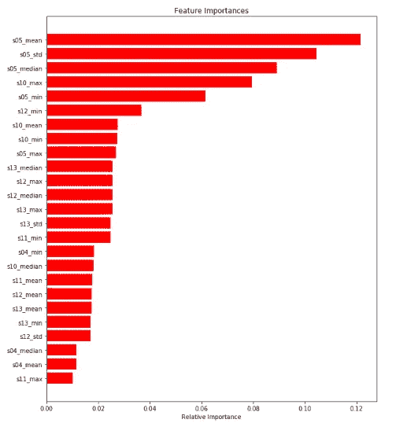

我从模型中得到了重要的特征，我们可以从中得到重要的传感器。可以看到，传感器 _05、传感器 _10 和传感器 _12 是重要的传感器。我会把一个重要传感器的名字给那个负责这个水泵的人。一旦一个人收到故障警告，为了避免故障，他将首先检查泵的那个部分，该部分由一个重要的传感器监控。

# 10.最终结果分析:

我想检查一下，我们的模型是否在 5 分钟前预测了所有实际故障。我还想检查为什么这些假阳性和假阴性会存在，因此我做了以下分析。

## **一、cv 数据假阳性分析:**

```
d=pd.DataFrame() #temp dataframe
d['time']=X_cv['timestamp']
d['true']=y_cv
d['pred']=clf.predict(X_cv[X_train.columns[0:-1]])
a=d[d['true']==0]
x=a[a['pred']==1]
x['time']=pd.to_datetime(x['time'])
g=x.groupby(by=x['time'].dt.date)
print('date of failure:',list(g.groups.keys()))
```

我正在制作一个临时的数据帧，存储 cv 数据中每个点的时间戳、真实标签和预测标签。我取出真正的类标签为 0 的点，并将其存储到变量“a”中。在变量' x '中，我存储了来自' a '的那些点，它们已经预测了类标签 1。这意味着我去掉了那些预测为 1，但实际上是 0 的点。我已按日期将这些要点分组。有 4 个日期，我们得到一个错误的失败警告。


我已经在 EDA 部分“v .机器状态随时间变化:”中打印了所有故障的日期及其恢复时间。请把它记下来，这样无论我要进一步讨论什么，你都会觉得很熟悉。

1.  ***假阳性日期:2018–06–28***

日期 2018 年 6 月 28 日 22:00:00 出现故障，因此应在 21:55:00 预测到故障。但是我们可以看到我们的模型从 16:12:00 开始发出故障警告，这意味着大约 6 个小时之前。在所有故障中，此故障需要的恢复时间最长，因此此故障的原因可能与其他故障不同，因此，我们在 6 小时前收到警告。

2. ***假阳性日期:2018–07–04***

2018 年 6 月 28 日发生的故障需要 6 天才能恢复，这意味着它在 2018 年 7 月 4 日恢复。让我们看看窗口 W4547，该窗口中的机器状态为“恢复中”。在下一个窗口 W4549 旁边，我们的机器已恢复，现在状态为“正常”。我们使用 W4547 来预测窗口 W4549 中的机器状态，我们如何从恢复机器的数据中预测下一个正常状态。这里，当机器处于故障状态时，它无法预测下一个正常状态，这很好，因为当机器处于故障状态时，我们不关心机器下一个状态的预测。这些假阳性点是我们模型的一个不错的预测。

**3。*假阳性日期:2018–07–08***

这里的条件也与上述相同。2018 年 7 月 8 日 00:11:00 出现故障，40 分钟后恢复。这里也是在恢复状态下，我们的模型无法预测下一个正常的状态。

**4。*假阳性日期:2018–07–17***

我没有任何理由为这些误报点辩解。这些点实际上都是假阳性点。

## **二。测试数据中的假阳性分析:**


1. ***假阳性日期:2018–07–25***

这也是我们在 cv 数据中看到的假阳性的相同情况。故障发生在 2018 年 7 月 25 日 14:00:00，大约需要 1 个小时才能恢复。当机器处于故障状态时，我们的模型无法预测下一个正常状态。

2. ***假阳性日期:2018–08–14 和 2018–08–21***

这些点实际上是假阳性，我们没有理由来证明这些。

## **三。cv 数据中的假阴性分析:**


1.  ***假阴性日期:2018–07–07***

2018–07–08 00:11:00 出现故障，应在 2018–07–08 00:06:00 之前预测到。我们的机器状态正常，直到 2018 年 7 月 7 日 23:59:00，我不期望从模型预测这次故障。因此，这些假阴性并没有降低我的模型的性能分数。

2. ***假阴性日期:2018–07–08***

在 2018–07–08 00:11:00 有一个故障，我在 5 分钟前预测到这个故障，因此这第一个 5 个假阴性无关紧要。机器在这次故障后一直处于恢复状态，直到 00:52:00，在恢复状态中，无论预测到哪种状态，我们都不关心。

## **四。测试数据中的假阴性分析:**

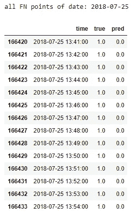

1.  ***假阴性日期:2018–07–08***

我们在 2018–07–25 14:00:00 出现故障，应在 13:55:00 之前得到预测。在 13:54:00 之前，模型预测此故障正常，这意味着我们预测此故障发生在 13:55:00。

# **11。结果列表:**

无论我做了什么实验，都在这张表中提到了。我尝试了两种特征工程方法，你可以看到“特征集方法”一栏。“之前预测”列给出了我尝试预测失败之前多少分钟的信息。一些模型预测了所有 7 个故障，但是假阳性很高。这里提到了所有的案例。

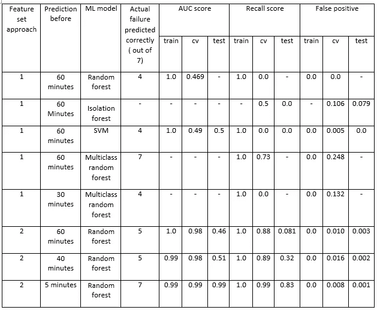

# 12.结论和未来工作

如果你已经到达这里，非常感谢。这是我第一次尝试写博客，所以我希望读者能慷慨一点，忽略我可能犯的小错误。

请参考我的 GitHub 链接 [**这里**](https://github.com/ravu-16/Machine-Failure-Prediction) 访问 Jupyter 笔记本上写的完整代码。

我已经预测了 5 分钟前的所有失败，在 3 次约会中有假阳性点。1 个在 cv 数据集中，2 个在测试数据集中。对于其他假阳性，我已经给出了适当的理由。

在这里，我做了许多实验，您可以做更多的实验来改进这个解决方案，例如:

*   从窗口中提取一些不同的特征。
*   深度学习网络 **LSTM** 。
*   深度学习网 **CNN** 。

# 13.参考资料:

*   [https://www.kaggle.com/artgor/simple-eda-and-models](https://www.kaggle.com/artgor/simple-eda-and-models)
*   [https://neuro space . io/blog/2019/05/predicting-machinery-break-on-a-water-pump/](https://neurospace.io/blog/2019/05/predicting-machinery-breakdown-on-a-water-pump/)
*   [https://www . research gate . net/publication/332938712 _ Predicting _ failures _ in _ hard _ drivers _ based _ on _ isolation _ forest _ algorithm _ using _ sliding _ window](https://www.researchgate.net/publication/332938712_Predicting_failures_in_hard_drivers_based_on_isolation_forest_algorithm_using_sliding_window)
*   **应用人工智能课程**:[https://www . Applied AI course . com/course/11/Applied-Machine-learning-course](https://www.appliedaicourse.com/course/11/Applied-Machine-learning-course)

PS: 如果你没有理解任何一部分可能的特征工程方法，那么请再次继续，拿起纸和笔，玩我给出的例子。希望你能理解。

PS: 因为我是博客新手，如果我做错了什么，你的改进建议是衷心欢迎的。可以在这里评论或者直接 ping 我通过 LinkedIn [**这里**](http://www.linkedin.com/in/ravina-dable-0b0401172) 。