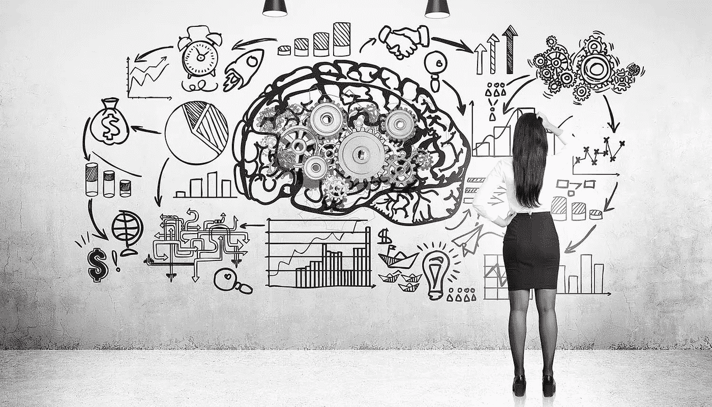
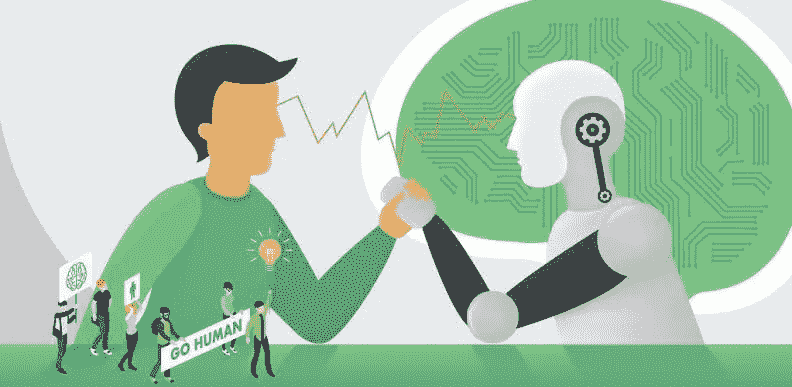
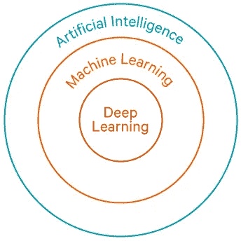

# 通过机器学习实现机器智能。

> 原文：<https://medium.com/analytics-vidhya/machine-intelligence-through-machine-learning-8a8eb7d101f9?source=collection_archive---------14----------------------->

在我们去之前，让我们看看情报。智力是运用良好的知识和技能进行思考并做出正确决定的能力。我们人类有这方面的天赋和专家。

当我们拿一台机器，一台计算机，它只是遵循人类的指令，产生一个想要的结果。它只是遵循一个严格的逻辑和零常识。

> 人类智能和机器智能的区别之一——我们人类从过去的经验中学习，而机器不能。

因此，为了避免这种情况，我们引入了人工智能机器。主要目的是让机器在没有人工干预或帮助的情况下自动学习，并相应地调整动作。

这里的机器学习、深度学习、计算机视觉是人工智能中的一些积木元素，这些元素使得机器比人类思考更聪明。

*机器学习+深度学习+计算机视觉=人工智能*

这里我们可以看到关于机器学习的一个例子:

一般定义:

机器学习是人工智能的一种应用，它为系统提供了自动学习和根据经验改进的能力，而无需显式编程。

让我们考虑一个例子:

假设你第一次打篮球，你的主要注意力将是把球投进篮筐，并使其朝着你的目标。你尝试了许多次，每次尝试你都意识到为什么投篮失败。假设在第一次尝试中，你意识到专注于篮筐上方的黑色盒子，在第二次尝试中，你意识到你的手的正确位置和方向等等。这里发生的是 基本上每次投掷后，我们都在学习一些东西并提高最终结果。我们被编程为从我们的经验中学习。

我们也可以用机器做类似的事情。我们可以给机器编程，让它从每次尝试/经历中学习，并改善结果以达到目标。

让我们看看上面的非机器学习和机器学习方法的例子。

一种非机器学习编程:

在上面的例子中，一个通用程序将告诉机器，一台计算机来测量目标区域的距离和投掷的角度，以使球射入篮筐。它编写了一个通用公式和程序来实现这个任务。假设一个人在它附近反对这个目标，那么它就失败了。为了获得正确的结果并实现目标，你需要重新编程，在你的公式和程序中加入个人认可。

一种机器学习编程:

现在，对于同一个例子，机器学习程序将从通用程序和公式开始，在每次尝试/体验之后重构它的公式和程序。随着配方的不断改进，使用的经验越来越多，结果也越来越好。