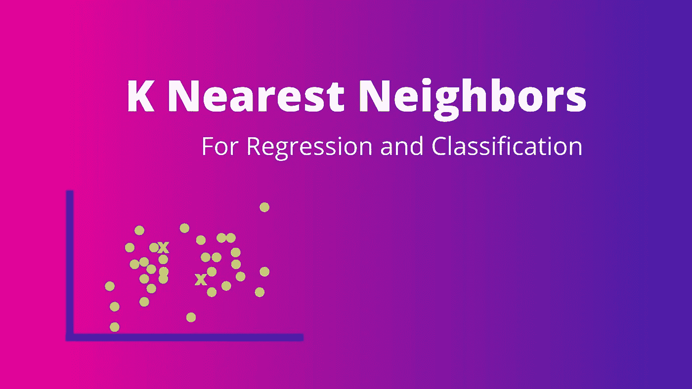
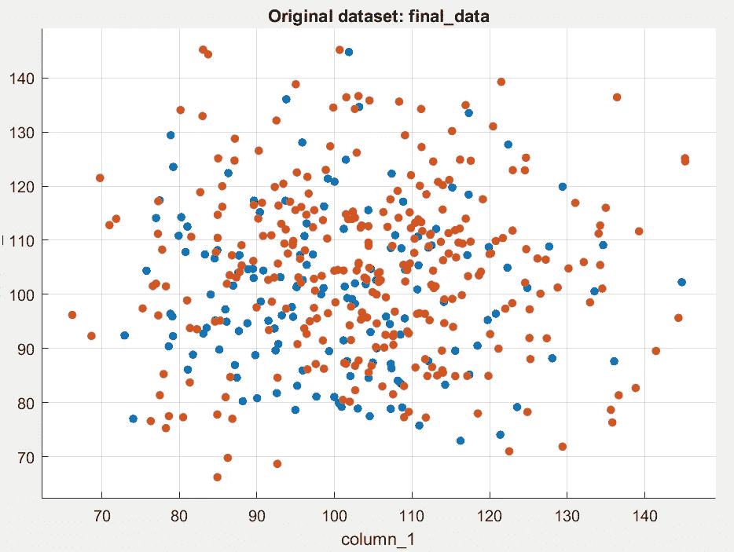
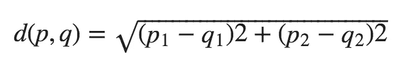
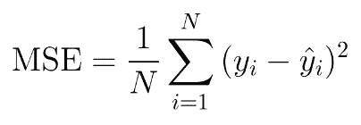

# 机器学习:K-最近邻(理论解释)

> 原文：<https://medium.com/analytics-vidhya/machine-learing-k-nearest-neighbors-theory-explained-3dfe2fdcdc5d?source=collection_archive---------13----------------------->

# 什么是 K-最近邻？

KNN 是一种受监督的机器学习算法，可用于回归和分类问题。稍后将解释为什么使用 KNN 而不是其他算法

# K 近邻是如何工作的？(分类问题)

对我们来说，毫无疑问，机器学习算法需要数据来进行训练。KNN 也不例外。
为了解释 KNN 是如何工作的，我们来看一个例子:

让我们考虑这样一个问题，给定一个人的身高和体重，我们必须对这个人是否适合参军进行分类(抱歉，找不到更好的例子)，并假设图 1.1 代表了许多人的数据。其中，红色代表健康，蓝色代表不健康。

因此，假设一个新的人必须接受这个测试，才能被归类到这些类别之一(健康/不健康)。

图 1.2

现在，设新人的身高为 H，体重为 w，图 1.2 中的
和**红星**代表这个新人。因此，星星的坐标将是(H，W)

在 KNN，我们必须手动选择变量名 k 的值，这将在后面显示。

在这种情况下，让我们尝试 k=3 和 k=6:
如果 K = 3，我们将在我们的训练集上找到与我们的**红星(新人)最近的 3 个现有数据点。**

**如何找到距离新数据点最近的 3 个点？**

1.  找到**新数据点(H，W)** 和训练集中所有其他数据点之间的欧几里德距离，并将它们放入一个数组中

两个坐标之间的欧几里德距离公式

2.按升序对数组进行排序
3。获取数组的前 3 个元素(*因为 k=3* )

**如何给新人分类？**

现在我们得到了最接近**红星(新人)坐标的 3 个数据点，**剩下要做的就是找到这 3 个数据点所属的类。
如果其中两个属于适合类，另一个属于不适合类，那么我们把新人(红星)归类为适合。如果不是这样，我们就把新人归类为不适合。

*这就是 KNN 的工作方式。我们实际上是根据相邻数据的主要类别(欧几里德距离)对数据进行分类，因此命名为 K 最近邻。*

# K 近邻是如何工作的？(回归问题)

回归和分类的所有步骤都是一样的，直到得到数组**(如上图)**的
‘K’个元素

在找到最接近新数据点的 K 个元素之后。我们取列表中“K”个元素的因变量 Y 的平均值，该值被指定为新数据点的 Y 值。

***注意:与分类不同，回归输出是回归的连续值，因此我们取数组前“k”个元素的平均值，并将该值指定为新数据的预测值。***

# 为什么 K 值很重要？

K 会影响我们模型的准确性，而从中对新数据进行分类的最近邻的数量非常重要
K 值非常小会导致过度拟合，K 值非常小会导致欠拟合。因此，选择正确的 K 值非常重要

# **K 值如何选择？**

没有完美的方法来选择 k 的值。但是，它在很大程度上取决于数据集。

但是，仍然有一些评估指标使事情变得更容易。
使用测试集和损失函数。
因此，损失函数是告诉我们预测值偏离实际值多少的一种度量

对于回归问题，我们可以使用**均方误差损失**，对于分类问题，我们可以根据分类类型使用**二元交叉熵或分类交叉熵损失**。

均方误差

解释这些损失函数超出了这篇博文的范围。但是，基本要点是，我们可以使用不同的 K 值，并使用每个值的损失函数来计算损失。
我们最终选择损失最低的 K 值。

# 结论

因此，KNN 是一个简单而有效的算法，因为它非常依赖于其相邻值的坐标，这就是它的工作原理。

**感谢阅读**