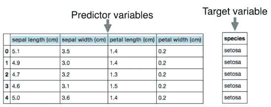
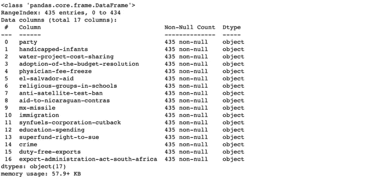
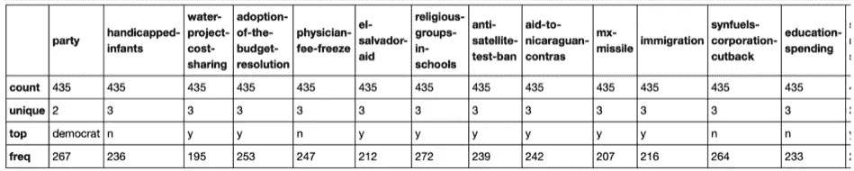
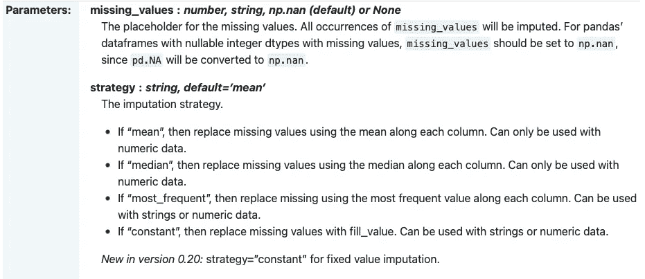
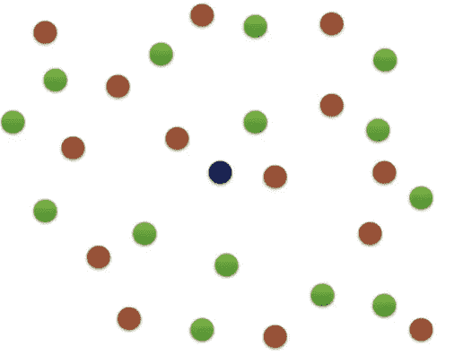
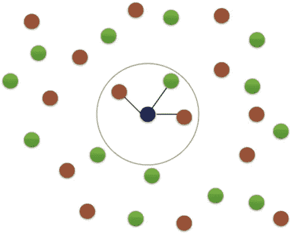
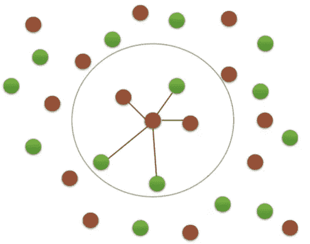
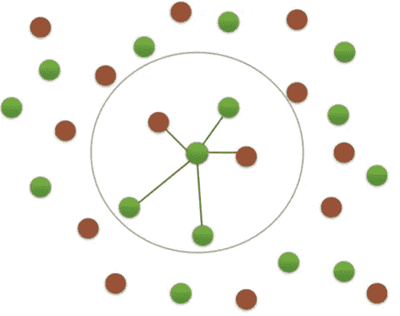
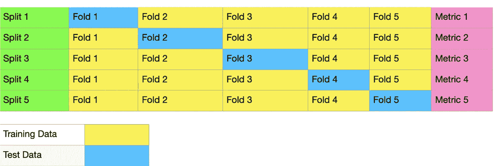

# 机器学习#1 —监督学习、EDA、交叉验证

> 原文：<https://medium.com/analytics-vidhya/machine-learning-1-432f458ddc51?source=collection_archive---------14----------------------->

这篇文章是我写的机器学习系列文章的第一篇，分享/巩固我所学到的东西。我假设您熟悉 Python 编程语言和 Jupyter-notebook 环境。您可以通过在终端上键入“pip install libraryname”格式来安装我们将在项目中使用的库。我的 GitHub 资源库中的笔记本目前只有土耳其语，但是如果你按照笔记本中的这篇文章做，我想你不会有问题。

如果你不是土耳其人，跳过这一段。

*Bu yaz，ocrendiklerimi paylamak/peki TIR MEK amac yla kale me ALD am 机器学习 yazdizisin ilkidir。笔记本电脑。proje ler I erisinde kullanaca kütüphane leri terminizden " pip install kutuphaneadi " formanda yaz arak yükleyebilirsiniz。*

[链接](https://gokerguner.medium.com/machine-learning-1-7d4581caa291)


美国国会会议。来源:[https://time.com/5788176/congress-partisan-good/](https://time.com/5788176/congress-partisan-good/)

**什么是机器学习？**

我们可以简单的定义为，赋予计算机通过推断数据做出决策的能力。在这样做的同时，我们以适当的方式格式化数据，并将其作为输入提供给将执行学习过程的模型/算法。这样，如果我们有足够的数据，我们就可以解决一些复杂的问题，而不必一步一步地编写代码。

例如:

***** 如何发现邮件是否为垃圾邮件
***** 按主题对维基百科内容进行分类

它们是机器学习问题的一个例子。机器学习基本分为三种:

**监督学习:**学习从标记数据中进行推断。

**无监督学习:**学习从无标签数据中进行推断。

**强化学习:**这是一种受行为主义启发的机器学习方法，关注的是受试者必须采取什么行动才能在环境中获得最高的回报。它源于这样一种想法，即通过在每个动作结束时给予奖励或惩罚，可以使主体适应特定的动作或动作序列。

让我们继续监督学习，这是本文的主题。

## **监督学习**

它基于预测目标属性的逻辑，该目标属性不是通过从许多输入属性进行推断而给出的。它有分类和回归两种亚型。

**分类:**目标变量由类别组成。

**回归:**目标变量是连续数据类型，无法分类。例如，当您开发一个估计房价的回归模型时，目标变量会根据您作为输入提供的要素动态变化，因此无法对其进行分类。

有可能在不同的来源中看到迄今为止名称不同的术语。如果我们给你一些简单的信息让你熟悉，

属性=预测变量=独立变量

目标变量=因变量=响应变量



这个表属于 Iris 数据集，是机器学习新手时常用的。

在这里，您可以看到模型通过学习这些变量预测的四个预测变量和一个目标变量。您可以制作一个应用程序，根据数据集中的花瓣和萼片的长度和宽度数据，对照片属于哪种花进行分类。这个数据集内置于 scikit-learn 库中，这是一个非常高效的 Python 库，我们也将使用它。要呼叫，只需运行命令

```
**from** **sklearn** **import** datasets
iris = datasets.load_iris()
```

在 Jupyter 笔记本环境中。作为临时说明，我发现 scikit-learn 库的文档非常好。如果你想检查其他内置数据集，你可以检查[的 scikit-learn 数据集](https://scikit-learn.org/stable/datasets/index.html)。

在本文中，我们不会使用内置数据集，我们将继续使用另一个数据集，它是我们从外部来源获得的，但仍然部分准备好解决一些关于**数据预处理**的问题。

让我们从包含清理、处理和可视化数据所需的库开始。

```
**import** **numpy** **as** **np**
**import** **pandas** **as** **pd**
**import** **matplotlib.pyplot** **as** **plt**
**import** **seaborn** **as** **sns**
```

**Numpy:** NumPy(数值 Python)是一个数学库，可以让我们快速进行科学计算。

Matplotlib: 这是我们将用于数据可视化的基本 Python 库。

这是一个基于 Matplotlib 的统计数据可视化库，我们将在下一个主题中看到数据可视化的好处。

我们将在不同的文章系列中更详细地讨论这些库能做些什么。现在让我们将数据集包含在工作环境中。

```
df = pd.read_csv('house-votes-84.data')
```

我从[这里](https://archive.ics.uci.edu/ml/datasets/Congressional+Voting+Records)得到数据集。这个集群包含 1984 年美国国会会议的投票记录。我们正试图根据党员投票赞成或反对、民主党或共和党来猜测他们属于哪个政党。

在这个链接中，数据集中没有同名的标题，但是在定义中提到了每一列的定义，我将这些定义添加到文本编辑器的第一行，您可以从我在文章末尾共享的 GitHub 存储库中访问该文件的编辑版本。

我们包括了缩写为 **pd** 的**熊猫**库。您不必这样做，您可以不使用任何缩写，或包含不同的缩写，但遵守全球使用模式是有用的(除了这些类型的标准，还有一些标准您在编写代码时应该小心)。这些规则被称为 **PEP-8** 标准，如果你正在使用 **IDE** ，你的 **IDE** 将帮助你按照这些标准编写代码。我会写一篇更详细的文章。让我们继续。)

# EDA —探索性数据分析

这是一种通过使用视觉或数字方法的总结来解释数据的方法。它使我们能够对许多问题有一个想法，从预处理数据时要采取的步骤，到用于进行推理的方法和模型。

# 数字 EDA

这是一种用数字汇总数据的方法。我们用几种**熊猫**的方法来做这个。

```
df.info()
```



df.info()的输出

***df.info()*** 就是其中之一，它让我们可以得到数据的概况。在这里，我们可以看到功能的名称，在一个数据集中有多少行和列。我们有一个 435 行 17 列的数据集。我们将使用该集合中的 16 个变量作为预测变量，1 个变量(“party”)作为目标变量。我们看到所有 435x17 数据都是非空的，这很重要，因为像 numpy、pandas、scikit-learn 这样的库需要非空并且是相同类型的，这样 numpy、pandas、scikit-learn 这样的库才能正常工作。

```
df.describe()
```



df.describe()的输出

***df . describe()***提供了我们用 info 得到的一般信息的另一个总结。例如保留了多少个变量或这些变量的多少个值。这里引起我们注意的一点是，虽然“政党”有两个独特的值(民主党，共和党)，但在其他标题中有三个值。

*这意味着即使属性值中的类型不是“null”或“NaN ”,也有需要预处理的数据。让我们仔细看看数据。*

在原著中向右滚动可以看到所有投票的书名。再次，作为一个中间信息说明，我觉得 GitHub 的一个服务 gist 非常有用。有关如何将 Jupyter 笔记本添加到中型文章的信息，您可以[阅读](/cits-tech/medium-yazılarına-jupyter-notebook-nasıl-gömülür-e5fcf020f3d5)Ersin y ldz 的文章“如何在中型文章中嵌入 Jupyter 笔记本？”(仅土耳其文)

用 ***df.head()*** 命令，我们可以默认看到前 5 行的数据。如果我们在这些数据中找不到我们想要的答案，并且需要更多的数据，我们可以通过在命令中键入我们想要的数字来查看更多的数据。比如说；

这就是我们看到的前 10 行。应该引起我们注意的一点是，有些值是作为“？”给出的。下一步，在直观的做了这个分析之后，我们再来关注这个问题。

# 可视化 EDA

让我们直观地看一下我们的数据集，它是我们在上一步中看到的数值。例如，让我们看看“移民”的票数分布。

对于那些不熟悉 Jupyter 笔记本环境的人，请注意:您不必在每一步都重复导入和读取 csv 过程。正如您在原始工作笔记本中看到的，在文件开头的单元格中完成这些操作就足够了。我在一个单元格中运行了所有数据，只是为了能够画出这个表。

确认我们在上一步中获得的信息，我们看到除了“是”或“否”之外的第三种投票模式。这是“？”形式的数据我们需要解决的问题。为了解决这个问题，我们使用了 scikit-learn 库的***simple imputr***方法。

```
from sklearn.impute import SimpleImputer
imputer = SimpleImputer(missing_values='?', strategy='most_frequent')
```

我们从 SimpleImputer 对象创建了一个名为 import 的变量。我们为 missing_values 参数提供了字符串值“？”我们接受为缺失的价值并想要改变。此参数的默认值是“NaN”(不是数字)。我们将策略参数设置为“最频繁”。因此，用“？”表示的值将等于该列中的最大值(即如果“否”票数最多，“n”或“是”票数为“y”，则根据频率)。

**注:**在你自己的研究中，你可以看到在网上的一些资料中，为这个过程做了一个来自 sk learn . preprocessing import import 的调用*。不过这个方法在新版本中已经被去掉了，取而代之的是我们使用的*sk learn . impute . simple imputr*方法。*



从 Scikit-learn 文档中截取的屏幕截图。在这里，您可以看到 missing_values 和策略参数可以采用什么值，以及这些值的含义。该方法的其他参数；您可以阅读[sci kit-learn 文档](https://scikit-learn.org/stable/modules/generated/sklearn.impute.SimpleImputer.html)并检查示例。

接下来是确定和训练我们的模型。由于这是一个分类问题，我们可以使用 k-NN(k-Nearest Neighbors/k-Nearest Neighborhood)算法来解决这个问题。如果说这个算法的工作原理；

**查看最近的 k 个点的类，**

**无论这 k 个点中的大多数属于哪一类，算法都将其检查的点的类确定为该类。**



第一步

假设我们有一个红绿点的数据集。我们现在还不知道它属于哪一类。如果我们将 k 参数的值设置为 3，



第二步

我们的算法查看这 3 个最接近的点，看到大多数是红色，并将红色分配给未分配的点。如果我们选择 k 值为 5，



第三步

这一次，由于大多数是绿色的，我们的算法将决定我们要寻找的类是绿色的。



第四步

kNN 算法检查训练集，在整个数据集中寻找最近的邻居来进行预测。现在让我们将我们的算法包含在我们的工作环境中。

```
from sklearn.neighbors import KNeighborsClassifier
knn_model = KNeighborsClassifier(n_neighbors=2)
```

同样，使用 **scikit-learn** 库，我们调用我们的 kNN 算法，并通过设置 ***n_neighbors*** 参数来定义我们称为 knn_model 的变量，该参数指示在做出决策时要使用的邻域值为 2。接下来是创建我们的步骤。

```
steps = [(‘imputation’, imputer),(‘knn’, knn_model)]
```

这样，我们已经将我们的**步骤**聚集到一个 Python 元组列表中。我们将使用我们定义的 steps 变量来创建一个**管道**，而不是一步一步地对猜测过程进行编码。

```
**from** **sklearn.pipeline** **import** Pipeline
pipeline = Pipeline(steps)
```

通过使用***sk learn . pipeline***方法，可以将你的算法、参数、数据预处理步骤分组到单个变量中(我们称之为 ***步骤*** )，编写出更紧凑的代码。

让我们讨论一下如何从我们拥有的数据集创建训练集和测试集。为此，我们将使用***train _ test _ split***方法。此外，我们将确定“党”的特点作为目标和其他特点作为预测。

```
**from** **sklearn.model_selection** **import** train_test_split
y=df['party'].values
X=df.drop('party', axis=1).values
X_train, X_test, y_train, y_test = train_test_split(X, y, test_size=0.3, random_state=42)
```

我们将数据集中每个数据的“party”值赋给变量 y。然后，我们从数据集中减去这些值，并将剩余值赋给变量 x。这样，我们就创建了预测变量和目标变量。

然后我们使用 ***train_test_split*** 方法将我们的数据分为训练和测试。在分离时，我们用 ***test_size*** 参数将测试集的大小设置为所有数据的 30%。我们把剩下的分离出来作为训练数据。

***random_state*** 简单来说就是一个整型参数，我们用来在拆分数据之前对数据进行洗牌。在您正在检查的培训和文档等材料中，您通常会看到该参数等于 42。

最后，我们需要知道的另一个关键点是，我们的模型/算法不能处理**字符串类型的**数据。正如我们在 kNN 算法的可视化表示中所看到的，整个操作基于向量空间中的距离计算(欧几里德距离)。为了对数据集中的每个点进行数学建模，我们将“n”和“y”的值改为 0 和 1。因为我想涉及一些更流行的 Python 库和应用程序，所以我不会在这一系列文章中包含太多的数学解释。接下来，算法学习数据并做出推论。

```
**from** **sklearn.metrics** import accuracy_score
knn_pipeline = pipeline.fit(X_train, y_train)
y_pred = pipeline.predict(X_test)
accuracy_score(y_test, y_pred)
```

我们创建了一个 ***流水线*** ，带有数据预处理和学习阶段。此时，如果想在不使用 ***管道*** 的情况下工作，也可以用***KNN _ model . fit()***方法直接让模型从数据中推断出来。注意，在这种情况下，您必须一步一步地编写前面的步骤。

然后，我们将为测试保留的输入集交给 ***预测*** 方法进行预测。最后，通过使用 scikit-learn 库中包含的***accuracy _ score***方法，我们可以看到我们的成功率大约为 **%92.37** 。

那么，我们能做些什么来进一步提高这一比率呢？是什么导致我们的成功低于预期？

我们需要注意的第一点是 ***n_neighbors*** 参数选择为 2。该参数的较高参数可能会使我们获得较高的分数。

第二点是作为训练/测试分开的数据。我们分配了 30%的数据作为测试数据，但是请记住，分配的数据是随机选择的。如果我们设置不同的 30%作为测试数据，也就是说，如果我们用不同的 70%来训练我们的算法，结果可能会不同。**我们如何解决这两个问题？**



这是我们用来提高性能的交叉验证方法的一个示例方案。

我们的第一个解决方案是**交叉验证**。该技术基于在每个步骤进行不同的训练/测试区分，并选择最佳学习。作为一个例子，我做了一个演示，其中训练/测试数据被分成 80/20。我们通过在每次分割中选择不同的训练/测试集来进行度量。无论这些区别中哪一个得分最高，我们都选择我们的区别。

我们将结合这项技术的主要技术是**网格搜索交叉验证**。通过将我们的数据集分成网格，我们不仅在每一步中不同地选择训练/测试集，而且还用不同的 ***n_neighbor*** 参数来尝试它。我们用 ***sklearn.model_selection。GridSearchCV*** 为该技术的 Python 实现。

```
**from** **sklearn.model_selection** **import** GridSearchCV
parameters = {'knn__n_neighbors': np.arange(1, 50)}
cv = GridSearchCV(pipeline, param_grid=parameters, cv=5)
```

我们将在 ***numpy*** 库的帮助下，将 **knn** 算法的 ***n_neighbors*** 参数取值为 1 到 50。如果你想使用不同算法的不同参数，你应该写 **'modelname__parameter'** 。我们首先将我们的管道分配给 ***GridSearchCV*** 方法，然后将我们在 Python 字典类型中创建的 ***参数*** 变量作为 ***param_grid*** 参数的值。通过在 ***cv*** 参数中输入我们想要使我们的训练/测试分离的多少种不同方式，我们回到拟合阶段。

```
cv.fit(X_train, y_train)
print("Tuned KNN Parameters: {}".format(cv.best_params_))
print("Best score is {}".format(cv.best_score_))
```

这里，我们的算法通过对每个 ***n_neighbor*** 值以 5 种不同方式处理数据来工作，确定最佳参数和分数。用***cv . best _ params _***方法，我们看到最佳 ***n_neighbor*** 值为 **6** ，用***cv . best _ score _***我们的最佳得分约为 **93.76%** 。

在**机器学习**文章系列的下一个主题中，我们将研究不同问题的不同 **ML** 方法，以及可用于衡量性能的不同方法。但愿有用。

## 资源

[1][https://archive.ics.uci.edu/ml/datasets/](https://archive.ics.uci.edu/ml/datasets/)

[](https://scikit-learn.org/stable/index.html) [## sci kit-学习

### “我们使用 scikit-learn 来支持前沿基础研究[...]" "我认为这是我设计过的最棒的 ML 套装…

scikit-learn.org](https://scikit-learn.org/stable/index.html) [](https://github.com/gokerguner/notebooks/tree/main/ml01) [## gokerguner/笔记本

### 此时您不能执行该操作。您已使用另一个标签页或窗口登录。您已在另一个选项卡中注销，或者…

github.com](https://github.com/gokerguner/notebooks/tree/main/ml01)