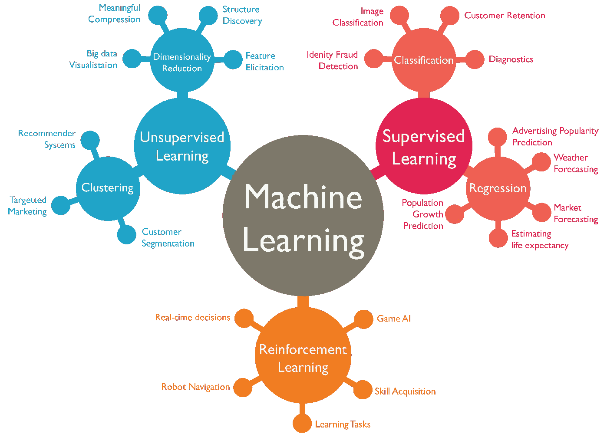

# 机器学习 101 —简介

> 原文：<https://medium.com/analytics-vidhya/machine-learning-101-an-intro-54dd3ba77f3b?source=collection_archive---------25----------------------->

***什么是机器学习？*** 机器学习是人工智能的一个子集，本质上是计算机科学的一个分支，它赋予计算机，即机器学习的能力，就像人类能够做的那样。机器学习技术用于发现潜在的趋势和模式，否则很难获得。

> “计算机能够看、听和学习。欢迎来到未来。”戴夫·沃特斯

由[托马什·弗兰科斯基](https://unsplash.com/@sunlifter?utm_source=medium&utm_medium=referral)在 [Unsplash](https://unsplash.com?utm_source=medium&utm_medium=referral) 上拍摄的照片

# 应用程序

在过去的几十年里，机器学习已经应用于各个学科。这里有一些我们在日常生活中看到的机器学习应用的例子:

*   **虚拟助手** — Siri、Alexa、Google Home 分别是苹果、亚马逊、谷歌开发的虚拟助手。它们在现代设备中非常普遍，并且非常好地实现了语音到文本的功能。此外，所有这些助手现在都能够理解各种语言和命令，这使得它们对我们更有吸引力。
*   **推荐系统** —网飞、Prime Video、YouTube 和 Spotify 等流媒体网站通常采用非常强大的推荐引擎，为用户提供新的建议，通常基于他们的搜索历史和/或偏好。
*   **欺诈检测** —银行和金融服务机构通常会建立有助于检测和防范欺诈的系统。这种系统以前利用包含人为规则的基于规则的技术。现在，公司正在转向机器学习模型，这种模型可以自主学习，并随着更多的时间和数据而改进。
*   **自动驾驶汽车—** 这种车辆在过去几年里取得了巨大的进步，它们利用计算机视觉进行导航，最大限度地减少了人工干预。看看特斯拉的自动驾驶功能就知道了！
*   **医疗保健** —医院、医疗实践和研究人员是第一批拥抱人工智能浪潮并将其引入主流的人。医学界现在广泛使用机器学习技术来开发药物和疫苗(甚至新冠肺炎！)，以及预测某些疾病的发作。
*   **零售**——许多公司经常使用历史数据，关注趋势，为他们的客户提供最优惠的价格和交易，实施特殊计划，管理库存。Amazon Go 是零售商店和技术的完美结合。

# **重要术语**

在我们深入研究机器学习技术的细微差别和特性之前，让我们先熟悉一些常用和有用的术语:

*   **数据集—** 我们希望分析的数据，以便提取有意义的信息并发现潜在的趋势和模式。它分为训练集和测试集。
*   **特征—** 数据集中存在的可测量属性，可提供洞察力并用于分析。
*   **独立变量—** 受控输入的变量/属性，其值决定输出。
*   **因变量—** 也称为目标变量，代表通过改变自变量的值获得的输出。
*   **模型—** 我们应用于数据的算法，以理解数据并得出推论。
*   **训练集—** 它是我们训练机器学习模型进行预测的数据部分。
*   **测试集—** 它是数据的剩余部分，不存在于训练集中，用于确定我们已经训练的机器学习模型的正确性。

# **潜入机器学习**

图片来自[阿卜杜勒·瓦希德](https://www.slideshare.net/awahid/big-data-and-machine-learning-for-businesses)

机器学习可以大致分为 3 类:

1.  **监督学习:**当我们的数据被标记时，即当输出具有我们已知的整数值(**回归**)或一组类别(**分类**)时，我们使用这种技术。在标记数据的帮助下，我们的模型能够学习自变量和因变量之间的关系。因此，我们的模型能够对前所未见的数据做出准确的预测。例如，如果我们希望确定一封电子邮件是否是垃圾邮件，那么我们可以使用分类算法来训练一个模型。同样，如果我们希望根据各种因素确定某个地区的房价，那么我们可以对数据应用回归算法。
2.  **无监督学习:**这里，学习算法被给定一个数据集，并被要求提取它认为有用和重要的信息。因为我们事先不知道我们的输出，我们的数据被称为未标记的。这种技术的一个主要挑战是确定获得的输出是否正确，因为我们不知道会发生什么。**降维、关联规则挖掘**和**聚类算法**就是这种技术的例子。
    例如，如果我们得到包含新闻文章的文本数据，那么我们可以使用聚类算法来确定提到的主题和关键词。
3.  **强化学习:**用于解决交互问题，其中到时间 *t* 观察到的数据用于确定在时间 *t+1* 要采取的行动。每一个正确的行为都会得到奖励，而不正确的行为会导致惩罚。因此，主要目的是在给定的情况下采取适当的行动，以获得尽可能大的回报。
    例如，如果我们正在训练一个机器人穿过一个迷宫，并且我们的机器人做出了正确的移动，那么它就会得到奖励。另一方面，如果机器人做了一个不正确的动作并被卡住，那么就会受到惩罚。经过多次尝试后，机器人应该学会通过迷宫的理想路径，从而获得最大的回报。

通过[机器人学](http://arcbotics.com/lessons/maze-solving-home-lessons/)制作动画

在我的下一篇博文中，我将介绍一些我们在旅途中会用到的基本库和工具。
***再次感谢大家的坚持，敬请期待更多！***