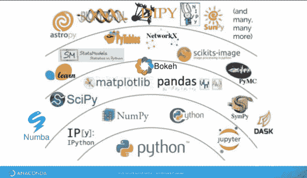
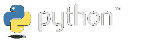
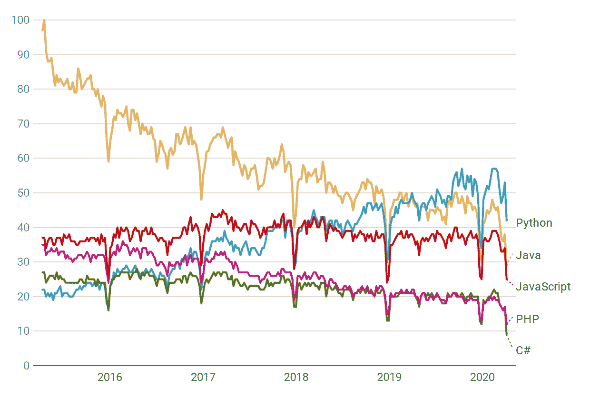
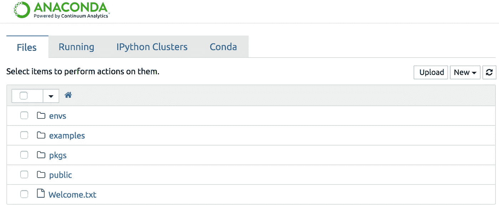
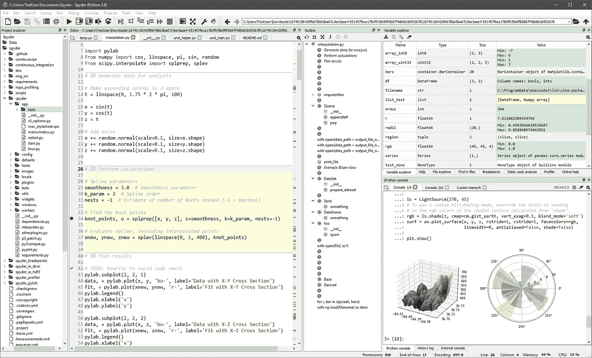

# 机器学习 101 —基本库和工具

> 原文：<https://medium.com/analytics-vidhya/machine-learning-101-essential-libraries-and-tools-4ae4b3454586?source=collection_archive---------26----------------------->

在过去的几年里，机器学习已经成为人们关注的焦点，它的受欢迎程度呈指数级增长。随着我们在机器学习之旅中前进，了解和熟悉我们可用的库和工具对我们来说很重要。

来源:[https://py DSC . files . WordPress . com/2017/11/python environment . png？w=663](https://pydsc.files.wordpress.com/2017/11/pythonenvironment.png?w=663)

# 为什么是 Python？

Python 是由 Guido Van Rossum 在 1991 年创建的。它是一种关注代码可读性的高级通用编程语言。由于其设计理念，Python 非常容易学习和理解，即使对于初学者也是如此。因此，与其他编程语言相比，它的学习曲线更短。

图片来自 https://www.python.org/

由于 Python 是开源的，它已经看到了许多新库的出现，这些库增强了它的功能，并允许它广泛用于数据分析、统计分析、Web 开发、文本处理等。此外，由于 Python 已经存在了这么长时间，它拥有一个庞大的用户社区。如果你发现自己陷入了某种困境，你可以很容易地找到一个解决方案或变通办法，因为有人会面临与你相同的问题。人们可以简单地进行谷歌搜索，或者在 StackOverflow 和 Reddit 等平台上与专家联系，以获得任何帮助和查询。

编程语言流行指数( [PYPL](http://pypl.github.io/PYPL.html) )根据一种语言的教程在谷歌上被搜索的频率来衡量该语言的流行程度，也就是说，一个语言教程被搜索的次数越多，该语言被认为就越流行。根据这一指数，Python 的受欢迎程度在过去 5 年中至少增长了 19.4%。另一个关于 Python 和其他编程语言受欢迎程度的比较可以通过 [Google Trends](https://trends.google.com/trends/explore?date=today%205-y&q=%2Fm%2F05z1_,%2Fm%2F02p97,%2Fm%2F07sbkfb,%2Fm%2F07657k,%2Fm%2F060kv) 找到。下图描绘了自 2015 年以来 Python、Java、Javascript、PHP 和 C#的受欢迎程度，根据 PYPL 的数据，这也是去年最受欢迎的 5 种语言。

数据来源:谷歌趋势([https://www.google.com/trends](https://www.google.com/trends))。

# 有用的库和工具

**Jupyter Notebook —** 这是一个基于网络的开源应用程序，允许我们创建和共享包含代码、公式、可视化和文本的文档。其用途包括数据清洗和转换、统计建模、数据可视化、机器学习等。

Jupyter 笔记本运行在 [Anaconda](https://docs.anaconda.com/ae-notebooks/user-guide/basic-tasks/apps/jupyter/)

**Spyder(科学 Python 开发环境)——**这是一个为 Python 开发的交互式环境，使用 Python 语言，提供高级编辑、分析、调试和剖析功能，以及数据探索和可视化工具。

一瞥 [Spyder IDE](https://docs.spyder-ide.org/)

要下载和使用 Jupyter Notebook 和/或 Spyder，在 Anaconda 发行版下，点击[这里](https://www.anaconda.com/distribution/)。

**Numpy(数值 Python)——**它是一个 Python 包，广泛用于科学计算。它增加了对大型多维数组和矩阵的支持，以及大量的数学函数，如线性代数、傅立叶变换和随机数功能。

 [## 努皮-努皮

### NumPy 是使用 Python 进行科学计算的基础包。它包含了其他的东西:一个强大的…

numpy.org](https://numpy.org/) 

**Pandas —** 这是一个用于数据操作和分析的高级库。它建立在 Numpy 包之上，它的主要数据结构称为 DataFrame。Pandas 提供了许多功能，允许我们存储和操作表格数据。我们的表格由观察行和特征/属性列组成。

 [## 熊猫

### pandas 是一个快速、强大、灵活且易于使用的开源数据分析和操作工具，构建于…

pandas.pydata.org](https://pandas.pydata.org/) 

**SciPy —** 它是一个用于科学计算和技术计算的 Python 库。它包含优化、线性代数、积分、信号处理等模块。

 [## SciPy.org-SciPy.org

### SciPy(读作“叹息派”)是一个基于 Python 的开源软件生态系统，用于数学、科学和…

www.scipy.org](https://www.scipy.org/) 

**Scikit-Learn —** 它是机器学习最重要的库之一，因为它提供了许多简单高效的数据分析工具。它提供了分类、回归、聚类算法、降维、模型选择和数据预处理的功能。

 [## sci kit-学习

### “我们使用 scikit-learn 来支持前沿基础研究[...]" "我认为这是我设计过的最棒的 ML 套装…

scikit-learn.org](https://scikit-learn.org/stable/) 

**TensorFlow —** 这个库是由从事机器学习和神经网络研究的谷歌大脑团队的工程师和研究人员开发的。它允许研究人员在发现最先进的(SOTA)结果方面拓展边界，也允许开发人员创建 ML 驱动的应用程序。

 [## 张量流/张量流

### 文档 TensorFlow 是机器学习的端到端开源平台。它具有全面、灵活的…

github.com](https://github.com/tensorflow/tensorflow) 

**Theano —** 这是一个允许用户高效地定义、优化和评估涉及多维数组的数学表达式的库。它能够在 CPU 或 GPU 架构上运行。

 [## Theano/Theano

### 要安装该软件包，请参见本页:http://deeplearning.net/software/theano/install.html 有关文档，请参见…

github.com](https://github.com/Theano/Theano) 

**Keras —** 它是一个高级神经网络 API，可以在 TensorFlow 或 Theano 之上实现，用于构建和训练深度学习模型。它允许简单快速的原型制作，并支持卷积神经网络和递归网络。

 [## Home - Keras 文档

### Keras 是一个高级神经网络 API，用 Python 编写，能够运行在 TensorFlow、CNTK 或……

keras.io](https://keras.io/) 

PyTorch — 它是一个基于 Torch 库的开源库，由脸书人工智能研究实验室开发。它的主要应用包括计算机视觉和自然语言处理。

 [## 皮托赫/皮托赫

### PyTorch 是一个 Python 包，它提供了两个高级特性:张量计算(像 NumPy)和强大的 GPU…

github.com](https://github.com/pytorch/pytorch) 

**自然语言工具包(NLTK)——**它是最广泛的自然语言处理(NLP)库，包括用于标记化、词干化、词汇化、解析、标记和语义推理的工具。

 [## 自然语言工具包- NLTK 3.5b1 文档

### NLTK 是构建 Python 程序来处理人类语言数据的领先平台。它提供了易于使用的…

www.nltk.org](https://www.nltk.org/) 

**Gensim —** 这是一个无人监管的自然语言处理库，用于主题建模、文本处理以及使用 Word2Vec 和 FastText 等词向量模型。它的主要优点是允许用户处理大型文本文件，而不必将整个文件加载到内存中。

 [## gensim:面向人类的主题建模

### Python 中高效的主题建模

radimrehurek.com](https://radimrehurek.com/gensim/) 

**Matplotlib —** 这是一个数据可视化库，用于创建静态、动画和交互式可视化。它可以用来创建详细的散点图，直方图，条形图，饼图等。

 [## Matplotlib: Python 绘图- Matplotlib 3.2.1 文档

### Matplotlib 是一个全面的库，用于在 Python 中创建静态、动画和交互式可视化…

matplotlib.org](https://matplotlib.org/) 

**Seaborn —** 这是一个基于 matplotlib 的统计可视化库，集成了 pandas 数据结构。它为信息和统计图形提供了一个高级界面。因为它是建立在 matplotlib 之上的，所以它提供了额外的绘图并可以产生更复杂的可视化效果。

 [## seaborn:统计数据可视化- seaborn 0.10.0 文档

### Seaborn 是一个基于 matplotlib 的 Python 数据可视化库。它为绘图提供了一个高级接口…

seaborn.pydata.org](https://seaborn.pydata.org/) 

# 摘要

在这篇博文中，我们回顾了为什么 Python 是数据科学领域最流行的编程语言，并了解了它的主要库和工具。

在我的下一篇博文中，我们将经历机器学习过程的 *7 个步骤*。

***感谢关注，敬请期待更多！***