# 机器学习 101 —使用 OLS 方法的线性回归

> 原文：<https://medium.com/analytics-vidhya/machine-learning-101-linear-regression-using-the-ols-method-299808eab233?source=collection_archive---------3----------------------->

线性回归是最基本的机器学习算法之一，用于预测真实值。它涉及到使用一个或多个*自变量*来预测一个*因变量*。虽然它是我们将遇到的最简单的算法之一，但它在本质上非常强大和健壮，使它成为有抱负的数据专业人员的必要工具。

在这篇博文中，我们将介绍线性回归的类型，使用普通最小二乘法(OLS)的实现，以及线性回归模型做出的某些基本假设。在这篇文章中，我们还将引用一个例子，根据员工的*经验*来预测他们的*薪水*。

[Sharon McCutcheon](https://unsplash.com/@sharonmccutcheon?utm_source=unsplash&utm_medium=referral&utm_content=creditCopyText) 在 [Unsplash](https://unsplash.com/s/photos/money?utm_source=unsplash&utm_medium=referral&utm_content=creditCopyText) 上拍摄的照片

# 线性回归的类型

## 简单线性回归

在简单的线性回归模型中，只有一个决定因变量的自变量。因此，对于我们的工资-经验的例子，自变量是员工的经验，而工资是因变量。

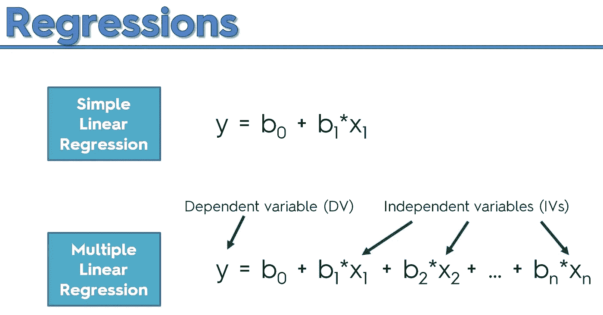

图片来源:[https://medium . com/@ manjabogicevic/multiple-linear-regression-using-python-b 99754591 AC 0](/@manjabogicevic/multiple-linear-regression-using-python-b99754591ac0)

在我们简单的线性回归方程中:

*   **y** 是因变量
*   **b₀** 是我们的偏向项，而
*   **x₁** 为自变量，其权重为 **b₁**

## 多元线性回归

这种类型的回归只是简单线性回归的扩展。这里，我们的因变量 **y** 是使用两个或更多自变量作为输入特征集的一部分来预测的。简单来说，如果我们添加更多的输入特征，如每日工作时间、年龄、职位等。对于我们的工资-经验的例子，然后我们得到一个多元线性回归模型。

# 复习基础知识

因此，让我们假设我们最终收集了一些数据，其中包含了许多雇员的经验和工资。为了更好地理解我们的数据，我们将其绘制成下图:

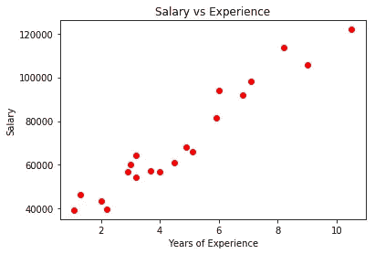

线性回归背后的基本思想是用一条直线来拟合我们的数据。我们可以通过使用****普通最小二乘法(OLS** )来实现。在这个方法中，我们通过数据画一条线，测量每个点到这条线的距离，平方每个距离，然后将它们全部加起来。经过多次反复试验，我们能够找到最合适的线路。本质上，最佳拟合线覆盖了我们所有的数据点，使得每个数据点到该线的距离最小化。这反过来最小化了所获得的误差。我们可以在下图中看到数据的最佳拟合线:**

**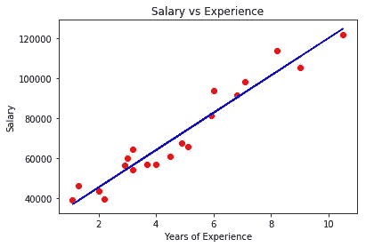**

**我们过程的下一步是通过计算它的 **R** 值来确定我们的回归模型实际上有多好或者有用。要做到这一点，我们首先要找到经验的平均值，计算每个数据点的平均值与值之间的差异，将其平方，然后将所有这些值相加。我们称此为 **SS(均值)**，即均值周围的平方和。在数学上，我们可以将这种计算表示如下(其中 n 是我们的样本大小):**

**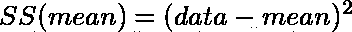****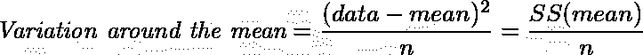**

**让我们回到最初的*工资与经验*图，该图描绘了我们数据的最佳拟合线。正如我们之前所做的，我们计算 **SS(fit)** ，即围绕最佳拟合线的平方和:**

**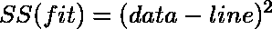****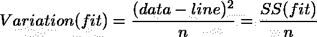**

**一般来说，我们可以以更抽象的形式查看一些数据的方差，如下所示:**

**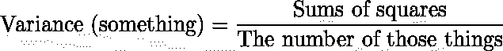**

**在所有这些公式中，事实上有一个*模式*值得注意。如果我们仔细观察，就会发现 SS(均值)的值总是大于 SS(拟合)的值。考虑到 SS(拟合)描绘了最佳拟合线的事实，即它使平方和最小化，这并不奇怪。因此，可以恰当地说，R 值可以告诉我们，考虑到员工的经历，工资的变化有多大。在数学上，我们得到以下结果:**

****

**因此，通过去除 *n* (样本大小)，该公式也可以写成如下形式:**

**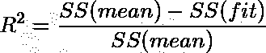**

**模型的 R 值介于负无穷大和 1 之间。我们可以说，我们的值越接近 1，我们的自变量在解释因变量的方差方面就越好。**

**例如，假设我们的数据的 R 值为 0.75。这意味着当我们考虑员工的经历时，差异减少了 75%。或者，我们可以说员工的经历可以解释 75%的工资差异。**

> ****注意:**在分析回归模型的 R 值时，需要考虑的一个重要事实是，如果您继续向模型中添加更多的特征，R 值会一直增加。因此，如果你发现自己在没有任何修补的情况下获得了 0.95 或更高的 R 值，那么你应该对你的结果持保留态度。**

**还有许多其他指标来评估我们的回归模型，如*平均绝对误差*、*均方误差*，以及*调整后的 R 值*。我们将在另一篇博文中详细讨论这些。**

**现在，我们得到了一个对我们来说似乎很大的 R 值，但是我们怎么知道这个值是否正确呢？为了确定我们的 R 值是否具有统计显著性，我们需要计算 p 值。使用称为 F 的东西来计算 *p* 值，如下所示:**

**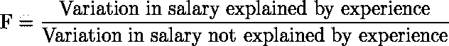**

**虽然这个等式乍一看似乎令人困惑，但分子仅仅表示我们考虑经验后方差的减少，分母表示下图中残差的变化(用虚线表示):**

****

**数学上，F 通过以下公式计算:**

**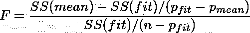**

**在哪里**

*   **分母 **(p_fit-p_mean)** 和 **(n-p_fit)** 代表自由度**
*   ****p_fit** 是拟合线中的参数个数**
*   ****p_mean** 是平均线中的参数个数**

**本质上，分子变成了由任何额外参数解释的方差，分母是找到最佳拟合线后残差的平方和。因此，如果拟合度很好，那么 F 就是一个很大的数字。现在，为了将 F 的值转换成 p 的值，我们采取以下步骤:**

1.  **生成一组随机数据**
2.  **计算平均值和 SS(平均值)**
3.  **计算拟合和 SS(拟合)**
4.  **将所有这些值代入方程，求出 F**
5.  **将该值绘制在直方图中**
6.  **重复很多很多次**

**一旦我们重复这个过程数千次(甚至数百万次)，我们就可以计算出最佳拟合线的 F 值。然后，通过更多极值的计数除以值的总数，获得 *p* 值。**

**例如，如果我们的最佳拟合线的 F 值是 5，并且我们在 100 个实例中有 6 个实例大于或等于 5，那么我们的*p*-值将是 6/100 = 0.06**

**实际上，我们并不经常遵循这个过程来生成 p 值，因为这非常耗时。相反，我们通过使用 f 分布用一条线来近似直方图。**

# **OLS 方法的假设**

**既然我们已经知道了 OLS 方法是如何工作的，我们也应该知道在这个方法中有哪些潜在的假设。线性回归有七个经典的 OLS 假设。在这些假设中，前六个是产生一个好的模型所必需的，而最后一个假设主要用于分析。**

1.  ****回归模型是线性的—** 这意味着模型中的项要么是常数，要么是一个参数乘以一个独立变量，我们的模型仅限于我们之前讨论过的通用方程。**
2.  ****误差项的总体为零—** 误差项描述了自变量无法解释的因变量的变化。我们只想把随机误差留给我们的误差项，即误差项应该是不可预测的。**
3.  ****所有自变量都与误差项不相关—** 如果自变量与误差项相关，那么我们可以用自变量来预测误差项。这对于我们的回归模型来说不应该是真的，因为它违背了误差项在本质上是不可预测的这一概念。这种假设通常被称为*。***
4.  *****误差项的观测值是不相关的—** 我们的误差项应该具有随机性，因此误差项的一个观测值不能预测下一个观测值。***
5.  *****误差项具有恒定的方差—** 误差的方差对于所有观测值应该是一致的。如果方差对于每个观察值或一系列观察值不变，则称为 ***同方差*** ，这是我们的回归模型所需要的。另一方面，*异方差*降低了我们在 OLS 线性回归中估计的精度。***
6.  *****没有一个自变量是另一个自变量的完美线性函数——**当两个变量的*皮尔逊相关系数*为+1 或-1 时，完美相关存在。这意味着，如果我们增加一个变量，那么另一个变量也会增加(当相关性为+1 时)，如果我们增加一个变量，那么另一个变量会减少(当相关性为-1 时)。如果两个变量完全相关，普通的最小二乘法不能区分它们，这将在我们的模型中引起误差。这种假设被称为 ***多重共线性*** 。***
7.  *****误差项呈正态分布—** 虽然这不是必要条件，但如果满足，这可以帮助我们生成可靠的置信区间和预测区间。如果我们需要计算系数估计的 *p* 值，这个假设也非常有用。***

# ***正在总结…***

***在这篇博文中，我们学习了不同类型的线性回归，以及如何使用普通最小二乘法(OLS)来实现。除此之外，我们还讨论了在实现 OLS 线性回归时回归模型所做的假设。***

******感谢阅读，敬请期待更多！******

******资源:******

*   ***[*与 Josh Starmer 的 stat quest*](https://www.youtube.com/watch?v=nk2CQITm_eo&t=268s)***
*   ***[*机器学习 A-Z:数据科学中的动手 Python&R*](https://www.udemy.com/course/machinelearning/)***
*   ***[*吉姆统计*](https://statisticsbyjim.com/regression/ols-linear-regression-assumptions/)***