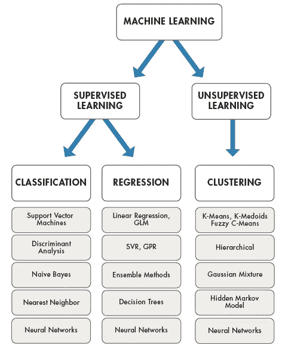
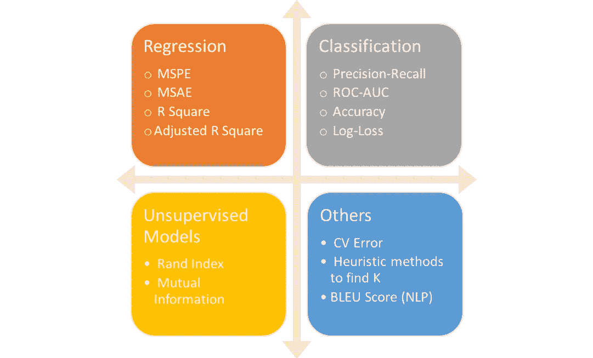

# 机器学习 101–机器学习过程的 7 个步骤

> 原文：<https://medium.com/analytics-vidhya/machine-learning-101-the-7-steps-of-a-machine-learning-process-9439f3ef97eb?source=collection_archive---------12----------------------->

D ata 随处可见。如果你停下来环顾四周，你会发现大量的数据。真正的挑战在于确定数据试图告诉我们什么，并找到一种方法来提取肉眼看不到的错综复杂和模式。

由[弗兰基·查马基](https://unsplash.com/@franki?utm_source=medium&utm_medium=referral)在 [Unsplash](https://unsplash.com?utm_source=medium&utm_medium=referral) 上拍摄的照片

在这篇博客文章中，我们将经历一个机器学习过程的 7 个步骤，如[Yufeng](https://medium.com/u/2a2ae028a675?source=post_page-----9439f3ef97eb--------------------------------)所解释的，在这个精彩的视频中，它是 Google Cloud 在 YouTube 上发布的人工智能冒险视频的一部分。

如果你刚刚开始你的机器学习之旅，那么我鼓励你在继续前进之前看看我以前的文章。*下面来看看吧！*

 [## 机器学习 101 —简介

### 什么是机器学习？机器学习是人工智能的一个子集，本质上是计算机的分支…

medium.com](/@dhruvk1000/machine-learning-101-an-intro-54dd3ba77f3b) 

# 机器学习的 7 个步骤

为了更清楚地理解这些步骤，让我们假设我们必须建立一个机器学习模型，并教会它区分苹果和橙子。

## **收集数据**

我们流程的第一步是从我们的数据源中提取数据，从而创建一个数据集。我们的目标是创建一个模型，它既可以用于进行预测(分类/回归)，也可以从我们的数据集中提取重要信息(聚类)。当我们提取数据时，我们必须确保我们选择的特征准确地代表我们的数据。换句话说，如果我们向门外汉展示我们数据集的特征，他们应该能够识别这些特征旨在描述什么。此外，我们数据的质量和数量必须是高标准的，因为这可能会影响我们未来的模型。

为了简单起见，我们将只考虑两个特征，即每个水果的颜色和其外表面的纹理，即它是粗糙的还是光滑的。我们也可以利用在线知识库，如 [Kaggle](https://www.kaggle.com/) 、 [UCI](http://archive.ics.uci.edu/ml/index.php) 等。其中包含预处理的数据集。

## **数据准备**

到目前为止，这是我们流程中最重要的一步，它要求我们确保数据的格式正确，以便我们的模型能够解释和理解它。通过缩放特征、纠正错误、填充缺失值、归一化等来清理数据是很重要的。我们还可以对数据集执行探索性数据分析(EDA ),以便更清楚地了解它的特性。这将允许我们确定可能与我们的目标变量更相关或者甚至相互关联的特征。我们的数据集最终被分成训练集和测试集(有时也是验证集)。本质上，它是以一种我们的机器学习模型可以正确理解的方式组织我们的数据。

## 选择模型

在这一步中，我们必须为手头的任务选择一个训练模型。为我们的过程选择正确的模型非常重要，因为有一些模型特别适合于图像、顺序数据、文本数据、基于数字的数据等。我们区分苹果和橙子的任务是一个二元分类问题，即两个输出类是可能的。

图片来自 MathWorks

## 培养

训练的目标是为我们的模型提供越来越多的数据，以提高它准确预测目标变量的能力。这一步被认为是大多数机器学习过程的主体，因为它通常需要大量的时间来让模型发现隐藏在大型、详细和复杂的数据集中的模式和特征。在我们的例子中，这个模型是相当简单的，因为它只需要被训练来学习苹果和橘子之间的区别。

## 估价

一旦我们训练了我们的模型，我们必须确定它是否做出正确的预测。如前所述，我们已经将数据集分成了训练集和测试集。现在，我们使用包含看不见的数据点的测试集来评估我们的模型。我们应该清楚地定义评估模型的标准。如果我们要使用几个不同的模型，那么这个预定义的指标将允许我们选择一个模型。
分割数据集时，一个很好的经验法则是确保分别 80/20 或 70/30 分割成训练集和测试集。

由于我们的问题是一个二元分类问题，我们可以选择根据其准确性来评估我们的模型，即它做出了多少正确的预测。

图片来源:[https://medium . com/usf-MSDS/chopping-the-right-metric-for-evaluation-machine-learning-models-part-2-86d 5649 a 5428](/usf-msds/choosing-the-right-metric-for-evaluating-machine-learning-models-part-2-86d5649a5428)

## **参数调谐**

一旦我们评估了我们的模型，我们就可以观察到通过调整我们的模型被训练的参数来改进它是可能的。根据所实现的算法，有几个参数可以改变和调整，这些参数被称为“*超参数”。确定价值的正确组合，并对它们进行修补，以了解它们如何影响我们的模型，这本身就是一种艺术形式。这通常是一项乏味而令人生畏的任务，并且高度依赖于各种因素，如数据集的质量、培训、所需的输出等。*

事实上，什么是一个好的模型通常是一个开放式的问题，并且可能因人而异，即使是对于相同的数据集。因此，有必要定义您的模型可以被接受的标准。

## 预言；预测；预告

随着我们最终训练了我们的机器学习模型，并找到了超参数的最佳组合，是时候进入最后一步了。在这里，我们试图在现实生活中实现我们的模型，并确定它是否是一个可行的选择。重要的是要记住，我们模型的结果经常用于更大的决策过程。因此，我们必须确定我们已经获得的结果的效用，然后通过分析这些结果来决定如何改进我们的系统。

由[威廉·艾文](https://unsplash.com/@firmbee?utm_source=medium&utm_medium=referral)在 [Unsplash](https://unsplash.com?utm_source=medium&utm_medium=referral) 上拍摄

# 摘要

机器学习在我们日常生活中的大规模实施和集成允许我们创建一个可以在许多场景中使用的通用框架。我们框架的基本原则如下:

*   收集数据
*   数据准备
*   选择模型
*   培养
*   估价
*   参数调谐
*   预言；预测；预告

***感谢关注，敬请期待更多！***