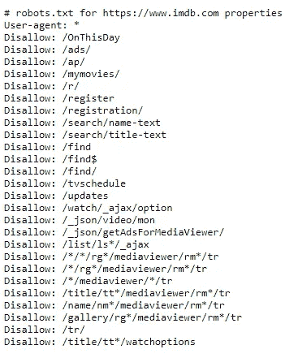
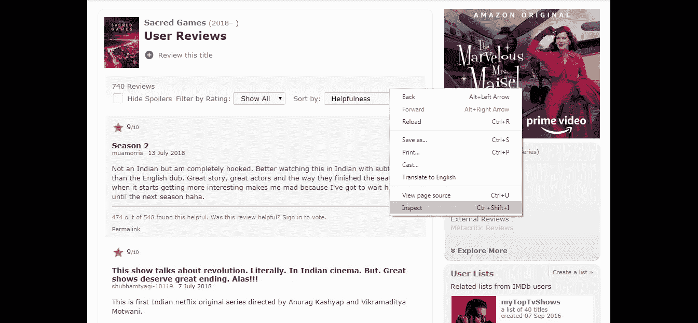
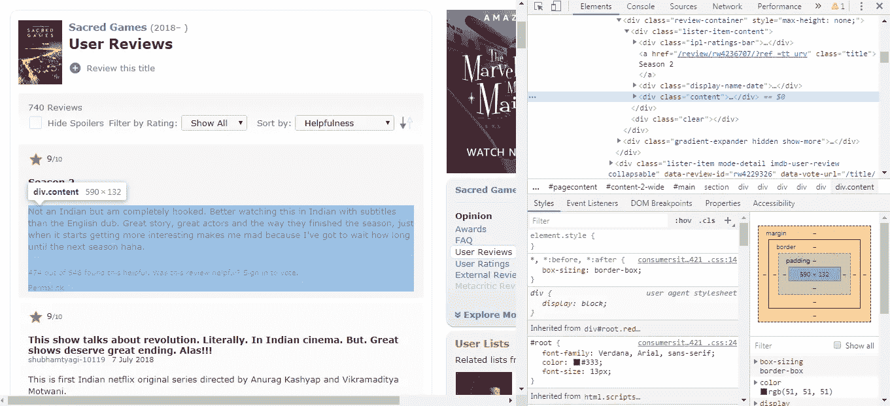
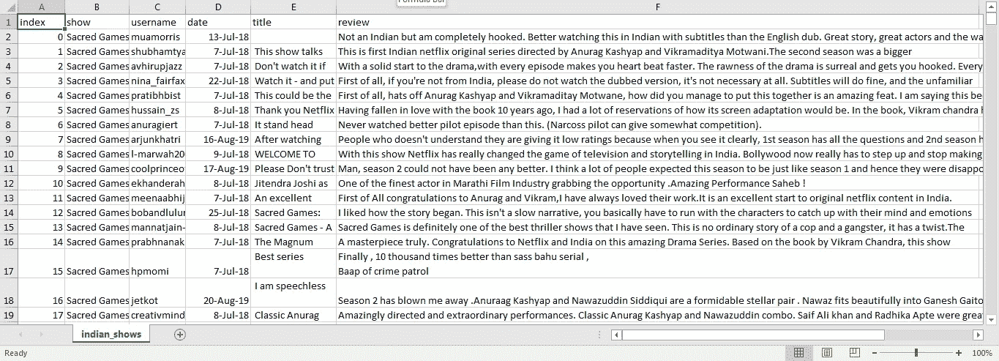

# 机器学习 101 —使用 BeautifulSoup 进行网页抓取

> 原文：<https://medium.com/analytics-vidhya/machine-learning-101-web-scraping-using-beautifulsoup-b81504ed4d65?source=collection_archive---------21----------------------->

Web 抓取是一种用于从网站中访问和提取大量数据的基本技术。虽然该过程可以手动完成，但它通常指的是使用 bot 或网络爬虫从特定网页中自动提取我们所需数据的过程。这最终为用户节省了大量的时间和精力。今天我们来看一个小例子，我们从 [IMDb](https://www.imdb.com/) 那里收集评论。


[潘卡杰·帕特尔](https://unsplash.com/@pankajpatel?utm_source=medium&utm_medium=referral)在 [Unsplash](https://unsplash.com?utm_source=medium&utm_medium=referral) 上的照片

## Python 中的 Web 抓取

Python 包含一些可用于 web 抓取的框架:

*   这个库是一个完整的包，它自动化了所有的任务，包括以 HTML 格式下载我们的页面，并以我们想要的格式存储它们。由于它是一个成熟的框架，学习曲线非常陡峭，对于简单的任务来说可能过于复杂。
*   BeautifulSoup: 一个非常适合初学者的库，学习曲线很短。它本质上是一个解析库，创建一个解析树，帮助我们轻松地在网页上找到我们的数据。
*   **Selenium:** 自动化库访问浏览器并从通过 JavaScript 呈现的 HTML 中提取数据。它通过执行点击、选择和滚动来模仿人类的动作。
*   **Urllib:** 一个包含几个模块的包，用于处理统一资源定位器(URL)。它预装在 Python 库中，定义了执行 URL 操作的简单函数和类。
*   请求:它类似于 urllib 库，除了它提供了一个更简单的接口，对于简单的任务非常有用。

出于我们的目的，我们将使用 *BeautifulSoup* 和 *Requests* 从 IMDb 提取评论。我们的重点是网飞和亚马逊 Prime Video 上的印度节目。我们的节目列表包括:

网飞:

1.  神圣的游戏
2.  小事情
3.  贾姆塔拉:萨布卡号
4.  血吟游诗人
5.  利拉

[](https://www.gqindia.com/binge-watch/collection/list-of-all-the-best-web-series-original-shows-to-watch-on-netflix-india-amazon-prime-video-tvf-play-youtube/)

过多的印度电视节目在 OTT 平台上留下了印记

**亚马逊 Prime 视频:**

1.  米尔扎布尔
2.  天堂制造
3.  内部边缘
4.  五人长老会
5.  《居家男人》

***一句提醒的话***

大多数网站可能不允许网络抓取，因为它们包含敏感信息。要检查是否允许 web scraper，首先访问该网站的 */robots.txt* 页面。IMDb */robots.txt* 页面显示如下:



【https://www.imdb.com/robots.txt 

此外，重要的是要记住不要在短时间内执行大量的请求，从而过度使用 web scraper。这可能会导致您的 IP 地址被标记，并随后被阻止，所以一定要小心。大多数网站，如雅虎！如今，金融和 Twitter 提供了非常成熟的 API 来提取数据，所以你可以使用它们。

## 开始抓取网页吧！

第一项任务是打开我们的 web 页面，通过右键单击我们希望从中提取信息的元素来检查它。我们目前正在为 2018 年风靡网飞的印度节目《神圣的游戏》提取评论。



[https://www.imdb.com/title/tt6077448/reviews?ref_=tt_urv](https://www.imdb.com/title/tt6077448/reviews?ref_=tt_urv)

一旦我们点击 inspect，DevTools 选项卡就会在我们页面的右侧打开(因为我用的是 Google Chrome)。在这之后，我们必须找到包含我们要寻找的信息的各种 div。

```
from bs4 import BeautifulSoup as bs
from requests import get
url = '[https://www.imdb.com/title/tt6077448/reviews?ref_=tt_urv](https://www.imdb.com/title/tt6077448/reviews?ref_=tt_urv)'
response = get(url)
bs4object = bs(response.text, features='html.parser')
```

上面的代码单元打开我们指定的 URL，并使用 BeautifulSoup HTML 解析器将我们的数据存储为 BS4 对象。我们将提取评论、评论标题、用户名以及评论发布的日期。



一旦我们检查了我们的页面，DevTools 选项卡就会打开

从上面的截图中我们可以看到，我们所有的评论都存储在一个 *div* 中，它的*类*组件被称为*内容。*经过进一步检查，我们发现我们需要的数据存放在如下不同的容器中:

```
# container which has all usernames
user = bs4object.find_all('span', attrs={'class':'display-name-link'})# container which has all review dates
review_dates = bs4object.find_all('span', attrs={'class':'review-date'})# container which has all review titles
review_titles = bs4object.find_all('a', attrs={'class':'title'})# container which has all reviews
review_tags = bs4object.find_all('div', attrs={'class':'text show-more__control'})# name of TV show
name = bs4object.find('meta', property='og:title')
```

上面的代码提取了我们前面提到的所有信息，并将它们存储在容器中。目前，我们只能设法提取神圣游戏的评论。要获得其他节目的评论，我们需要做的就是替换网址。因此，我们可以定义一个函数如下:

```
def get_review(url):
    response = get(url)
    bs4object = bs(response.text, features='html.parser')# container which has all usernames
    user = bs4object.find_all('span', attrs={'class':'display-name-link'})# container which has all review dates
    review_dates = bs4object.find_all('span', attrs={'class':'review-date'})

    # container which has all review titles
    review_titles = bs4object.find_all('a', attrs={'class':'title'})

    # container which has all reviews
    review_tags = bs4object.find_all('div', attrs={'class':'text show-more__control'})# name of TV show
    name = bs4object.find('meta', property='og:title')for i in range(0,len(user)):
        username.append(user[i].text)
        review_date.append(review_dates[i].text)
        review_title.append(review_titles[i].text)
        review.append(review_tags[i].text)
        show_name.append(name['content'])
```

因为我们将所有数据放入列表中，所以我们可以将所有数据放入 pandas 数据框架中:

```
df = pd.DataFrame({'show':show_name, 'username':username,
'date':review_date, 'title':review_title, 'review':review})
```

现在让我们将数据保存到一个 CSV 文件中，以便我们可以随时访问它。因为我更喜欢使用 Google Colab 环境，所以代码看起来像这样:

```
from google.colab import files
df.to_csv('indian_shows.csv')
files.download('indian_shows.csv')
```

我们的 CSV 文件现在包含我们的所有信息，如下所示:



网络抓取后的 CSV 文件

恭喜你终于创建了你的第一个网页抓取工具！感谢阅读，敬请期待更多内容！

*注意:本文中提到的代码仅从我们的 IMDb 页面中提取有限的评论。现在你知道从哪里开始，试着从这个页面提取所有的评论。(提示:查看硒！)*

*资源:*

1.  【https://www.scrapehero.com/python-web-scraping-frameworks/】T5[T6](https://www.scrapehero.com/python-web-scraping-frameworks/)
2.  [*https://www.dataquest.io/blog/web-scraping-beautifulsoup/*](https://www.dataquest.io/blog/web-scraping-beautifulsoup/)
3.  [*https://www.imdb.com/title/tt6077448/reviews?ref_=tt_urv*](https://www.imdb.com/title/tt6077448/reviews?ref_=tt_urv)