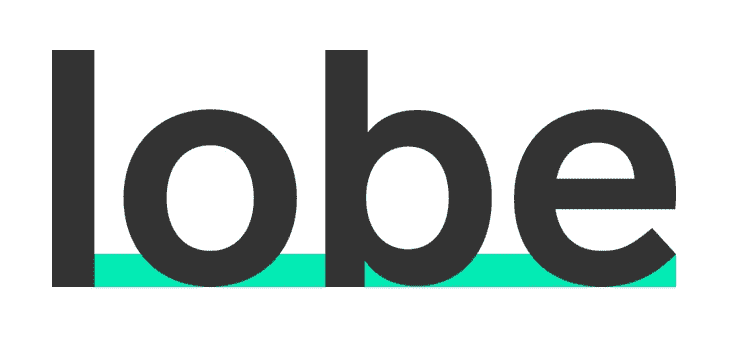
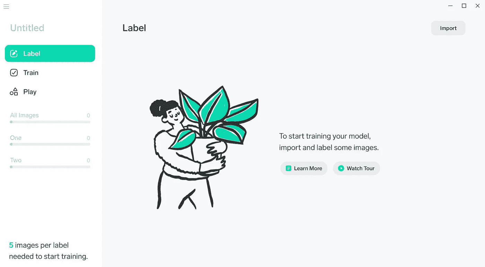
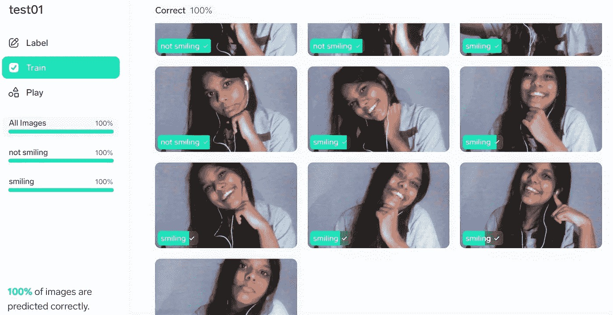

# 微软 Lobe 的机器学习 2.0！

> 原文：<https://medium.com/analytics-vidhya/machine-learning-2-0-with-microsoft-lobe-d2a32596a1c5?source=collection_archive---------5----------------------->

您的组织或企业需要机器学习，但却没有程序员来帮您？

别担心，微软会支持你的！

# 什么是微软 Lobe？

微软 Lobe 是一个桌面应用程序，允许用户在不编写任何代码的情况下训练自己的机器学习和人工智能模型。你猜怎么着？完全免费！Lobe 可用于 Windows 和 Mac 电脑，并允许其用户将几乎任何机器学习想法带入生活。它不仅可以免费使用，而且是私有的和安全的，这意味着你可以在自己的电脑上训练你的模型，而不用把你的数据上传到云端。

Lobe 提供图像分类、目标检测和数据分类的项目模板，其中图像分类已经面向公众。

用户只需将他们的图像导入 Lobe 并进行标记，即可创建机器学习数据集。Lobe 自动选择最佳的机器学习模型，立即开始训练，无需任何复杂的配置或设置。用户还可以评估模型并提供反馈，以提高性能。经过训练的模型可以很容易地导出到任何平台上运行，并且可以在任何应用程序、网站或设备上运行。

> *“作为微软的一部分，Lobe 将能够利用世界级的人工智能研究、全球基础设施以及数十年来构建开发人员工具的经验。我们共同致力于让深度学习变得简单、可理解，并让每个人都可以使用。”****——微软***

情绪反应:Lobe 示例

# 它是如何工作的？

由于对 Lobe 极度着迷，我决定尝试一下 beta 版！

界面超级简单，几乎任何人都可以使用。

波瓣接口

你所要做的就是导入图片并给它们贴上标签。Lobe 自动训练你的模型，给你模型的精度。最初，我只为分类器提供了 5 张我微笑的图像和另外 5 张我做不同表情的图像，准确性水平不是很高，但是，在向数据集提供更多图像后，我获得了 100%的准确性水平(这很明显，因为机器学习严重依赖于它的数据)。

用 Lobe 训练模型

Lobe 最伟大的地方在于，我只用了不到一分钟的时间，就训练出了 100%准确率的模型！就在导出之前，Lobe 还可以让您优化您的模型，这也是自动完成的。多棒啊。

我对 Lobe 有什么看法？这真是太神奇了！它非常高效，并且绝对不需要任何机器学习的知识，就能在短时间内得到一个训练有素的模型。

# 如何开始学习 Lobe？

只需访问 [lobe.ai](https://www.lobe.ai/) 就能得到很好的照顾！这里有一个教程，你可以按照它开始学习:

在 10 分钟视频中介绍 Lobe

现在你的机会来了！试一试，享受机器学习的新常态！