# 机器学习# 2 —相关矩阵、特征选择、类别不平衡、决策树、精确度/召回率/ F1 分数

> 原文：<https://medium.com/analytics-vidhya/machine-learning-2-correlation-matrix-feature-selection-class-imbalance-decision-trees-9a447fdb825?source=collection_archive---------2----------------------->

这篇文章是我的机器学习系列的第二篇文章，旨在巩固和分享我所学到的知识。对于本系列的第一篇文章:[链接](/analytics-vidhya/machine-learning-1-432f458ddc51)

如果你对这篇文章的土耳其语不感兴趣，你可以跳过这一段。

*Bu yaz，orendklerimi peki TIR MEK ve paylamak I in kale me ALD m 机器学习 yaz dizimin ikin ci yaz SDR . serin in ilk yaz si in:*[*链接*](https://gokerguner.medium.com/machine-learning-1-7d4581caa291)

bu yaz n n türke versiyonu I in:[链接](https://gokerguner.medium.com/machine-learning-2-korelasyon-matrisi-özellik-seçimi-sınıfların-dengesizliği-karar-ağaçları-af993bd8ea66)


来源:[https://www.medicalnewstoday.com/articles/322300](https://www.medicalnewstoday.com/articles/322300)

你好，在我的机器学习系列的第二篇文章中

*   将使用新的分类模型
*   将检查预测变量和目标变量之间的关系。
*   将会看到数据预处理的新方法
*   将讨论我们可以用来衡量模型性能的新方法。

这也将是一篇我们将讨论阶级不平衡，我们在评估模型性能时可能犯的错误，以及可以做些什么来修复它们的文章。

我们从导入核心库开始。

```
import numpy as np
import pandas as pd
import matplotlib.pyplot as plt
import seaborn as sns
df = pd.read_csv(‘winequality-red.csv’)
```

在本文中，我们将开发一个品酒模型，试图根据葡萄酒样品的化学价值来预测它们的质量。我从我们在第一篇文章中使用的来源获得了数据集。你可以在这里找到[。](https://archive.ics.uci.edu/ml/datasets/wine+quality)

我们将不详细阐述我们在本系列的第一篇文章中提到的方法。首先，我们从探索性数据分析部分开始。你可以通过查看[这篇文章](/analytics-vidhya/machine-learning-1-432f458ddc51)来获得关于这一节的信息。

## 数字 EDA

```
df.info()
```

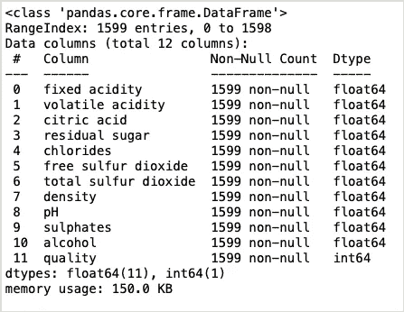

我们的数据集由 1599 行和 12 列组成。我们将通过学习前 11 个属性来尝试预测质量属性。

```
df.describe()
```

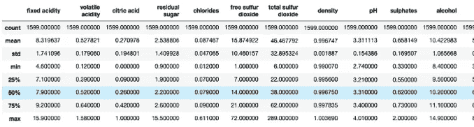

您可以在我的 GitHub 资源库中找到该表的原始版本，我将在文章末尾分享其链接，或者您可以在本地 Jupyter-notebook 中运行代码并查看输出。由于截屏和左栏中的术语不在同一个方块中，我没有在截屏中包括质量值。

在这里，我们看到我们的财产价值的一些总结。除了每列的平均值、最大值、标准值和最小值，我们还有像 25%、50%和 75%这样的表达式。

*   Min 和 max，该列中的最小和最大数值，
*   平均值是列值、std 标准偏差值，
*   25%、50%和 75%的值还显示了该列中的值等于或低于该值的百分比。

当我们检查表中的 quality 列时，我们看到值在 3 和 8 之间变化(最小值是 3，最大值是 8)。并且，该列中四分之一的数据是 5 及以下(3，4，5)，而四分之三的数据是 6 及以下(3，4，5，6)。我们的平均值是 5.63。

这些值向我们表明，我们的数据集中的大多数质量值都有平均值(比如 5 和 6)，并且分布是不平衡的。

问题:这种不平衡将导致我们的模型能够区分中等质量的葡萄酒，但不能区分低质量或高质量的葡萄酒。我们将尝试开发一个解决这个问题的方法，在相关的标题中叫做阶级不平衡。

```
df.head(10)
```

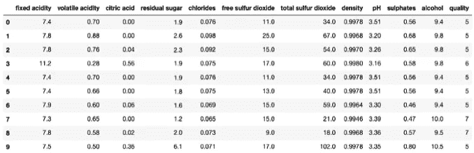

数据集前 10 行的列值

我们看到*挥发酸*、*柠檬酸*等数值都相当接近 0，而*游离二氧化硫*和*总二氧化硫*数值一般都远高于 0。

记住像 kNN 这样的分类器，我们在[第一篇文章](/analytics-vidhya/machine-learning-1-432f458ddc51)中提到过，是通过计算距离来工作的。在这种情况下，数值较大的值将位于分析平面的外角，由于距离计算中的较大值，我们的模型可能会做出不正确的预测。我们将提到这种情况的解决方案。

# 特征选择和相关矩阵

我们将考察的另一种情况是预测变量之间的增减关系。在解决任何机器学习问题时，特征选择是第一步也是最重要的一步。数据集中的每个要素都简单地用一列表示。每个列(属性)对目标变量的影响可能不一样。

将与目标变量关系较弱的预测变量添加到模型中会对性能产生一些负面影响。更多的预测变量导致更长的训练时间、增加的计算复杂性和一些潜在的重要特征的减少的影响。

这种情况产生了对特征选择的需求。

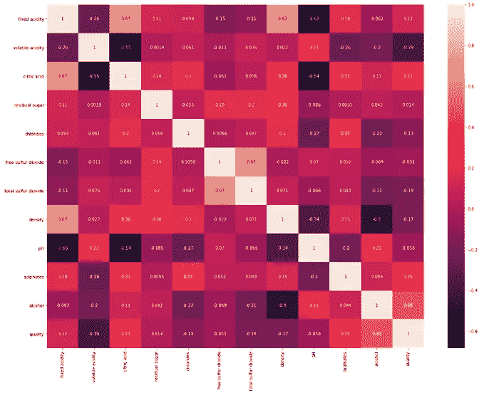

我们已经使用 seaborn 库创建了一个关联矩阵。这个矩阵向我们展示了调色板中所有属性之间的关系。

在相关矩阵中，值位于-1 和+1 之间。接近-1 的值被解释为负相关，接近+1 的值被解释为正相关。

正相关的两个变量的值一起增加或减少。

当负相关的两个变量中的一个的值增加时，另一个的值减少。

如果值接近 0，说明这两个变量之间没有联系。我们的目标是找到与*质量*属性相关值接近 0 的属性，并消除它们。

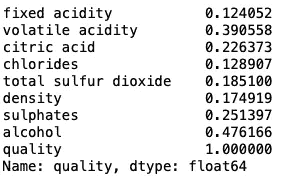

我们将相关值在-0.1 和+0.1 之间的属性分配给我们创建的名为 *relevant_features* 的变量。其中一个变量是我们的*质量*变量，它通常有一个相关值 1。我们将使用剩余的 8 个变量作为预测值。

```
to_drop = cor_target[cor_target<0.1]
```

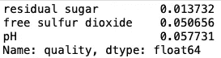

*残糖*、*游离二氧化硫*和 *pH* 变量也是我们检测低相关性的特征，不会使用。我们还将它们收集在 *to_drop* 变量中。

当我们检查 *to_drop* 变量时，又有两个名为 *Name* 和 *dtype* 的信息返回给我们。所以这个变量不是我们现在知道的 Python 列表。然而，为了将它从我们的训练集中删除，我们必须将其列出。让我们用 *type()* 命令来学习数据类型。

```
type(to_drop)
```

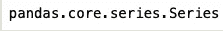

我们首先将数据类型转换为 frame，这是另一种 pandas 数据类型。

```
to_drop_frame = to_drop.to_frame()
```

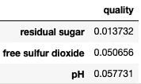

最后，我们将这些变量转换成一个列表，并通过添加变量 *quality* 最终确定我们将删除的变量列表。

# 阶级不平衡

在确定了我们的估计量和目标变量并把它们赋给 X 和 y 变量之后，在这一部分还有一个操作要做。正如 df.describe() 向我们展示的那样，我们的质量属性取值为 3、4、5、6、7 和 8。对于测试集，我们预计它会将大约 320 个样本分成 6 个不同的类，考虑到我们将从总集中的 1599 个数据中分离出大约 1 个。这可能会降低我们模型的性能。

正如我们在 *df.describe()* 一节中提到的，我们拥有的例子一般都是中等质量的。

因此，为了识别高和低质量的葡萄酒，我们考虑 3 和 4 点的葡萄酒是低质量的，5 和 6 点的葡萄酒是中等质量的，7 和 8 点的葡萄酒是高质量的。让我们开始吧。

如果我们拥有的数据集更大，就有可能开发出更有效的算法解决方案，并在文献中占有一席之地。

作为这些解决方案的高级读物:[https://medium . com/quantyca/how-to-handle-class-unbalancy-problem-9ee 3062 f 2499](/quantyca/how-to-handle-class-imbalance-problem-9ee3062f2499)

# 决策树

决策树是一种结构，用于通过应用一组决策规则将数据集划分为更小的集合。

决策树是统计学、数据挖掘和机器学习中使用的预测建模方法之一。它使用决策树(预测模型)从对项目的观察(分支中表示的预测变量)导航到关于项目目标值的结论(叶中表示的目标变量)。目标变量可以取一组独立值的树模型称为分类树；在这些树形结构中，树叶代表类标签，树枝代表导致这些类标签的特征的组合。

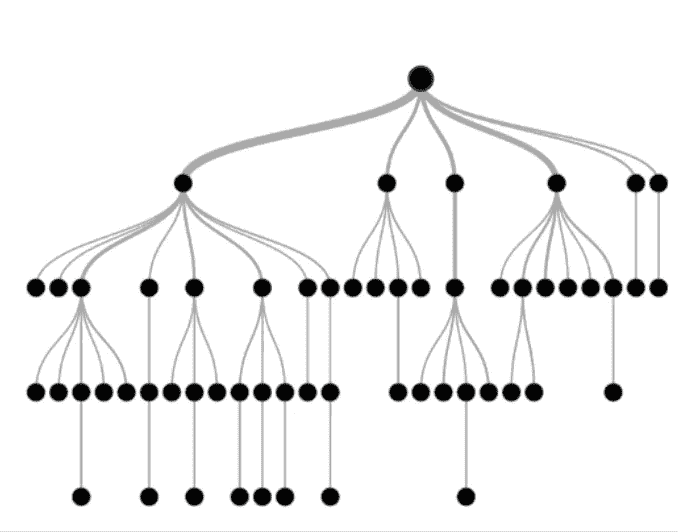

决策树的表示

决策树中的顶点称为根。每个观察值都根据根的情况进行分类。

干细胞下有节点。使用节点对每个观察值进行分类。随着节点数量的增加，模型的复杂性也会增加。

决策树的底部是叶子。树叶给了我们结果。

在创建管道时，我们将使用两个参数进行网格搜索，scikit-learn 的*决策树分类器*的*标准*和*最大深度*参数。基本上，我们将寻找问题的答案，当分支数据时，我们的模型将使用哪些信息标准，以及最多有多少步骤将优化信息。

有关此参数和所有其他决策树参数的详细信息；您可以检查 [scikit-learn 文档](https://scikit-learn.org/stable/modules/generated/sklearn.tree.DecisionTreeClassifier.html)并尝试使用不同的参数和不同的值。

在我们开始编写决策树之前，我们还需要为我们的模型做一件事。

# 标准化(居中或缩放)

在文章的引言部分，我们提到了一些预测变量的值非常接近于 0，而一些则比 0 大得多。这导致具有较大值的变量对模型的影响更大(负面)。我们希望用相似的尺度来表示我们所有的预测变量。

为此，我们将使用 scikit-learn 的 *StandardScaler* 方法。

接下来，我们必须对我们描述的所有预处理过程进行编码。

在这一步，如果我们简单讲一下基尼和熵的概念，

基尼系数:数据集中随机选择的项目被错误分类的概率。

熵:一个变量的熵是该变量的可能结果中固有的“信息”、“惊喜”或“不确定性”的平均水平。在决策树的根部分，分类从熵值最小的特征开始。

如果用一个例子来解释熵的概念，那么无论是晴天还是雨天的信息的熵都低于电影院放映的电影的信息的熵。这意味着在决定如何度过一天时，你更有可能从天气入手。如果下雨，你宁愿坐在家里也不去看电影，这样就不用去想电影院在放什么电影了。

关于熵和信息论概念的进一步阅读:[https://en . Wikipedia . org/wiki/Entropy _(information _ theory)](https://en.wikipedia.org/wiki/Entropy_(information_theory))

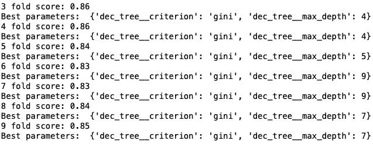

使用我们在第一篇文章中提到的网格搜索技术，我们得出结论，我们的最佳标准是 g *ini* ，我们的最佳深度是 4。当我们使用这些标准时，我们看到我们的模型取得了 86%的成功。那么我们的模型真的有那么好吗？

# 精确度/召回率/ F1 分数

仅仅模型的准确性是不够的，尤其是对于不均匀的数据集。为了全面衡量我们模型的性能，需要一些不同的指标。

对于这一点，我们先来参考一下混淆矩阵的概念。

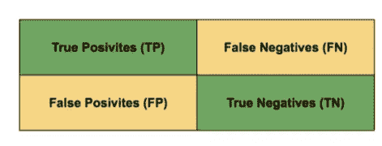

混淆矩阵

真阳性和真阴性是包含我们正确预测的字段，假阳性和假阴性是包含我们错误预测的字段。举个例子，假设我们的工作是在一组邮件中识别垃圾邮件。

*   绝对肯定:我们的模型预测该电子邮件是垃圾邮件，这是正确的。
*   否定答案:我们的模型预测该电子邮件不是垃圾邮件，这是正确的。
*   误报:我们的模型预测该邮件是垃圾邮件，这是错误的。
*   假阴性:我们的模型预测电子邮件不是垃圾邮件，这是错误的。

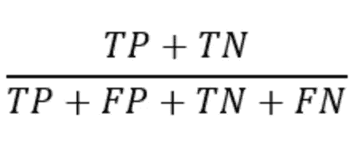

准确(性)

模型的准确性是通过将真实预测值除以总数得到的。假设 100 个人口中有 10 个癌症患者，90 个健康人。如果我们的模型预测这整个群体是健康的，它将实现 90%的成功。然而，由于它也预测这 10 个患者是健康的，所以它成为一个成功的致命模型。

因此，我们需要不同的指标来衡量模型的性能。

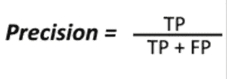

精度给出了我们估计为正的值中有多少实际上是正的比率。

在假阳性预测的成本很高的情况下，精确度非常重要。例如，如果您需要发送到收件箱的电子邮件由于对您的模型的错误估计而落入垃圾邮件箱，那么您将无法看到您需要看到的重要电子邮件，您将处于亏损状态。在这种情况下，高精度值是评估模型性能的重要标准。

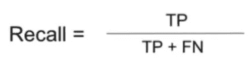

另一方面，回忆显示了我们应该猜测多少样本是肯定的。

关于邮件示例，我们需要作为垃圾邮件捕获的一些电子邮件落入收件箱可能看起来无害，但是具有高召回分数可能是至关重要的，特别是在关于健康和银行的数据集中。

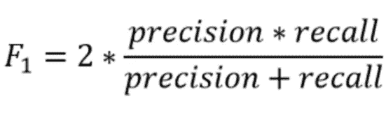

F1 分数值向我们展示了精确值和召回值的调和平均值。使用 F1 分数是为了不在不一致的数据集中做出不正确的模型选择，并且具有包括所有错误成本的测量度量。

现在，使用我们已经获得的最佳参数，让我们通过将我们的决策树分配给名为 *best_tree* 的变量来重新运行训练/预测过程，并基于我们学习的性能度量来检查模型性能。

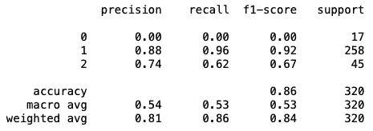

我们看到我们的模型不能识别任何质量差的葡萄酒(17 个样品)。所以可能更准确的是有一个模型，识别精度少几个点，但也是低品质的葡萄酒。

这些例子不能被区分的原因之一可能是它们没有被训练足够的前缀。因此，在下一步中，让我们通过缩小 test_size 来重新开始训练过程。

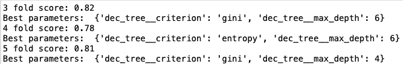

让我们将新模型分配给具有最佳参数的 best_tree 变量，并再次检查我们的成功指标。

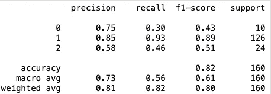

这一次，我们看到他标记为低品质的葡萄酒中有 75%(精度)确实是低品质，他正确预测了 30%(召回)的低品质葡萄酒。

在之前的实验中，我们无法准确预测 17 个样本中的任何一个，但这次我们看到低质量葡萄酒类的性能有所提高，尽管有 10 个样本。

由于在我们的训练集中有更多标记为 0 的样本，我们能够增加测试集中剩余的劣质葡萄酒的预测得分。

您还可以研究随机采样技术来解决像该数据集中的不平衡问题(但可以应用于更大的数据集来查看其效果)。基本上有两种方法来应用这种技术:

*   过采样，通过增加少数类的例子
*   欠采样，减少大多数类的实例

你可以得到更平衡的班级。

有一个 Python 语言的库就是为这个问题开发的。您可以在[链接](https://imbalanced-learn.readthedocs.io/en/stable/auto_examples/index.html#examples-based-on-real-world-datasets)中查看这个库的例子，

关于这种方法的详细阅读，你可以查看[这篇文章](https://towardsdatascience.com/oversampling-and-undersampling-5e2bbaf56dcf)。

最后，我们用 scikit-learn 库的树方法画出决策树的形状来结束我们的文章。下一篇文章再见。

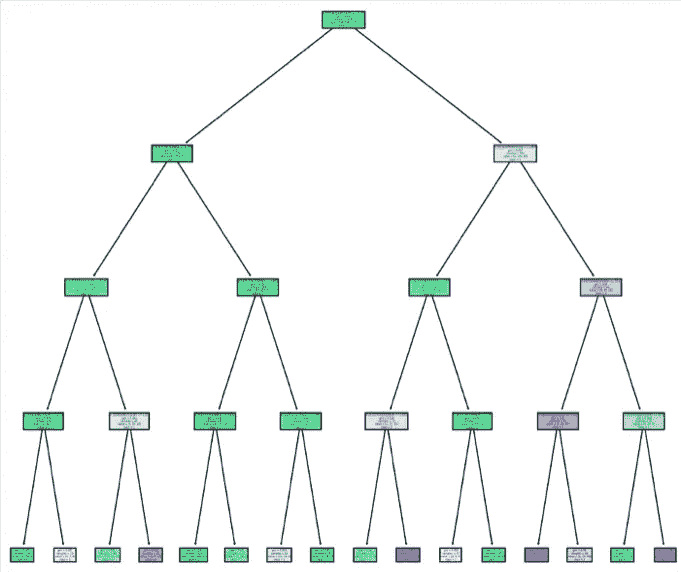

**源代码**

[](https://github.com/gokerguner/notebooks/tree/main/ml02) [## gokerguner/笔记本

### 恩]:媒体的文章和我写的笔记本的主题是我对机器的了解和疑惑…

github.com](https://github.com/gokerguner/notebooks/tree/main/ml02)