# 机器学习:导论

> 原文：<https://medium.com/analytics-vidhya/machine-learning-7e4aeae293eb?source=collection_archive---------21----------------------->

> 一个充满可能性的全新世界

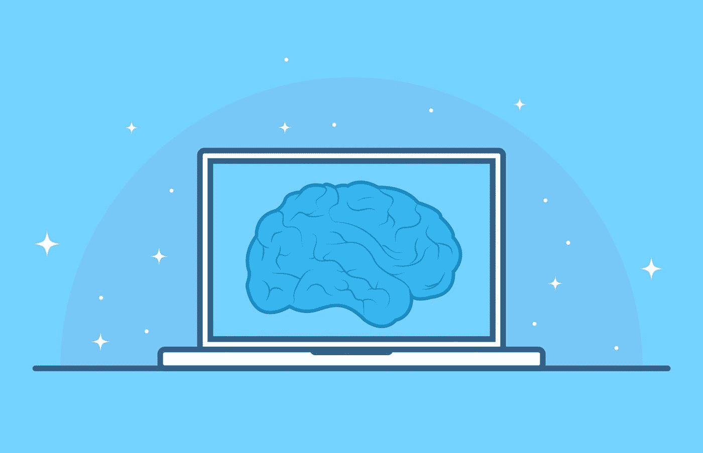

扮演上帝？

# 介绍

机器学习已经成为 21 世纪为数不多的流行语之一。令人惊讶的是，机器学习在理论上存在的时间比我们想象的要长。

但是什么是机器学习呢？它是一种计算机从数据中学习并提高其预测、分析或创建更多数据的能力，而无需显式编程。

要想清楚地理解 ML，有一种内在的需要，那就是理解什么是人工智能。虽然在门外汉术语中经常互换使用，但它们在许多层面上彼此不同。

# 人工智能

人工智能(AI)是使机器能够模仿人类智能，从而改变行业的技术的总称。这些技术包括但不限于计算机视觉、语言处理和机器学习。

# 人工智能和人工智能的区别

人工智能的几乎全部经济价值都是通过机器学习算法产生的。

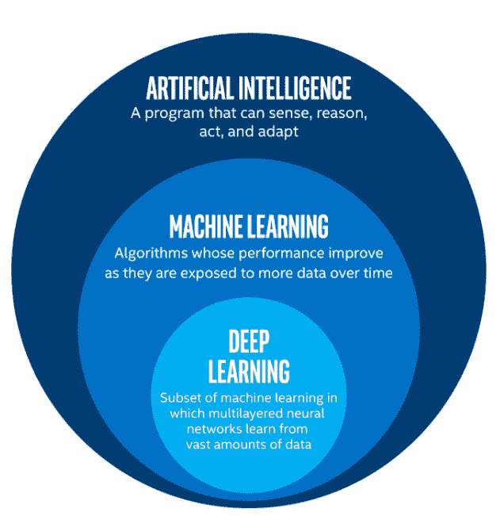

作为人工智能的一个子集，机器学习采用从数据中学习的算法来进行预测或决策，随着时间的推移，当暴露于更多数据时，其性能会提高。机器学习的主要目标是让计算机在没有人类干预或帮助的情况下自动学习，并相应地调整行动。

**机器学习如何工作**

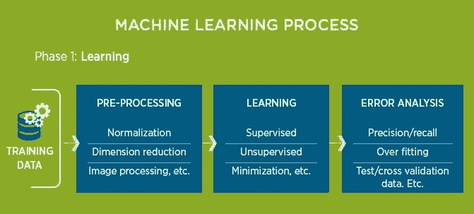

> 学习阶段包括任何机器学习模型的主干:数据**！**

**然后，根据我们的方便，对这些数据进行清理和标准化，然后输入到我们想要使用的模型中。数据可以是分类数据(名义的、顺序的)或数值数据(离散的、连续的、间隔的、比率的)。**

****训练集**用于训练我们的数据，而**测试集**用于分析模型中的错误/需要改进的地方。**

**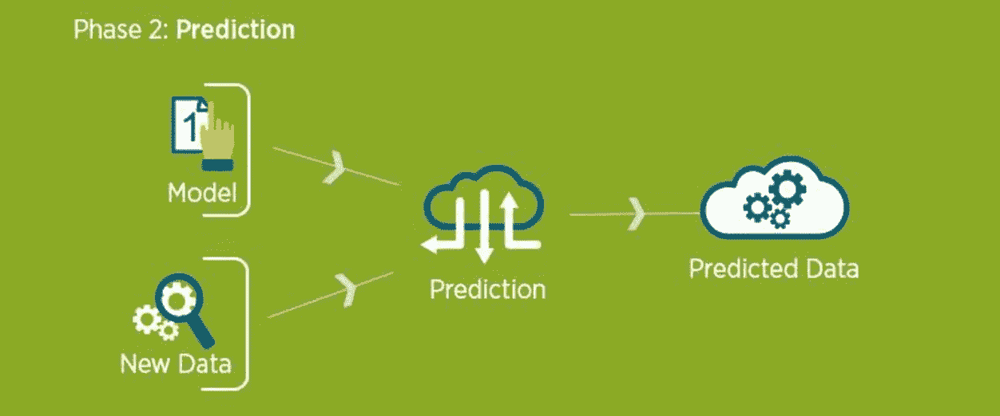**

**随着模型在测试后的建立和运行，新的数据被输入其中以预测/回答我们的问题。**

> **反过来，清理数据并将其应用于模型的迭代过程有助于模型学习！由此得名，**机器学习**！**

****为什么要机器学习？****

**自 2005 年以来，世界各地不断增加的数据流入导致了最大似然算法的使用和应用的激增。随着智能设备的指数级增长，每秒钟都会产生大量的数据。如果充分利用，这些数据可能会被证明是一座金矿。**

**统计学一直存在，机器学习就是对大量数据使用统计学。**

**正如摩尔定律所述，我们现在有计算能力用这些统计模型处理这种数据。这些包括回归和分类技术，这将在本文的后续部分中理解。**

**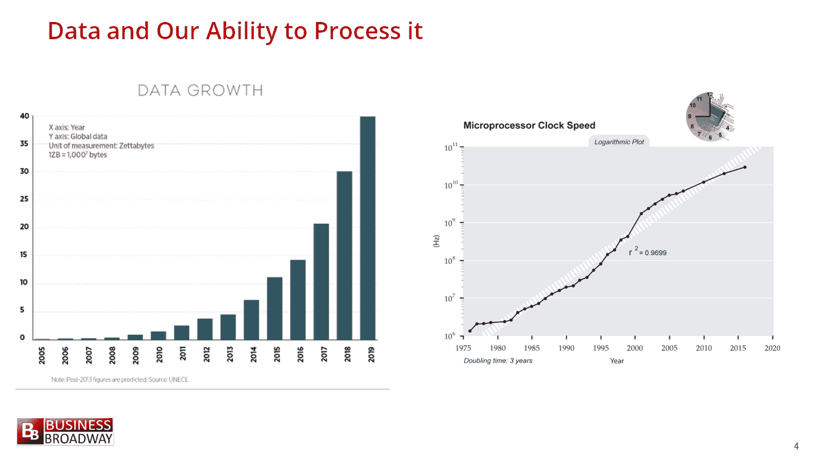**

# ****机器学习的类型****

## **监督学习**

**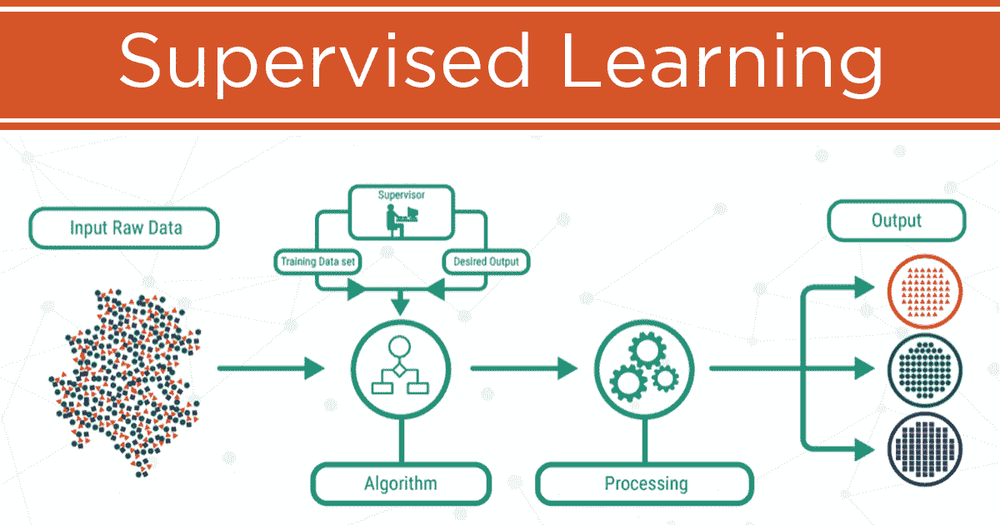**

**在**监督**或**预测学习**中，目标是学习从输入 x 到输出 y 的映射，给定一组标记的输入-输出对:**

**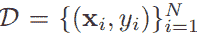**

**其中 D 是训练集，N 是样本数。每个训练输入 *x* i 是一个 D 维数字向量，Yi 是某个有限集 yi ∈ {1，…，C}中的分类或名义变量**

**基于 *Y* i 的性质，问题可以定义为以下几种类型:**

1.  **当易是分类的时候，这个问题被称为**分类**或**模式识别****
2.  **当 yi 是实值时，这个问题被称为**回归****

**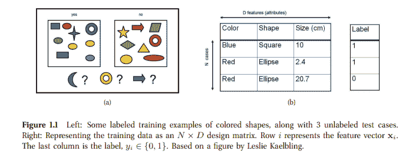**

## **无监督学习**

**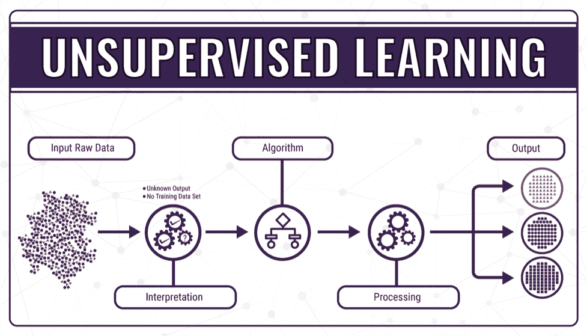**

**在无监督或描述性学习中，仅给出输入:**

**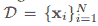**

**描述性学习**

**目标是找到可以进一步用于创建新模型的模式。这是一个很难定义的问题，因为我们不知道要预先找到的模式，并且错误的范围也没有定义。**

# **强化学习**

**这是基于奖励和惩罚的原则，在学习如何表现或行动时特别有用。虽然不太常用，但它仍然是一种非常有用的技术。**

**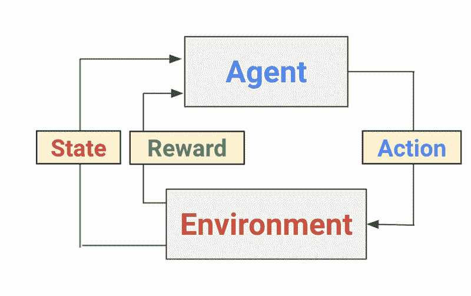**

# **机器学习的用途**

**机器学习目前正被用于以下方面:**

*   **图像识别**
*   **垃圾邮件和恶意软件检测**
*   **基于大数据的预测**
*   **声音识别**
*   **社交媒体分析**
*   **视频监控**
*   **自动驾驶汽车**

**…开始计数！**

****机器学习的未来****

**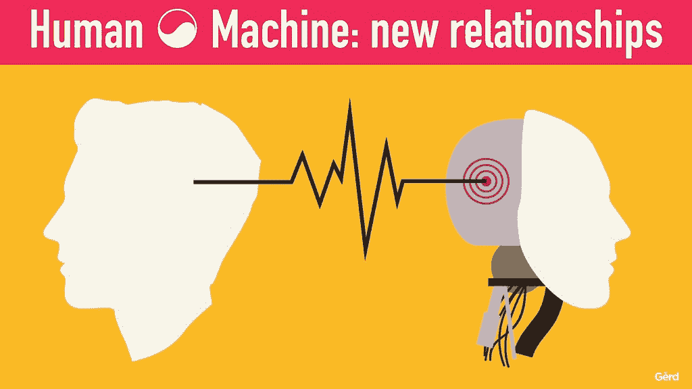**

**虽然机器学习算法的未来看起来非常光明，但事实上，它是它的子集之一:**深度学习**已经占据了前排座位。随着深度学习的多种用途通过人工神经网络的应用而出现，很明显，ML 将显著改善人类生活，并将帮助我们在发现和发明方面迈出更大的步伐。**